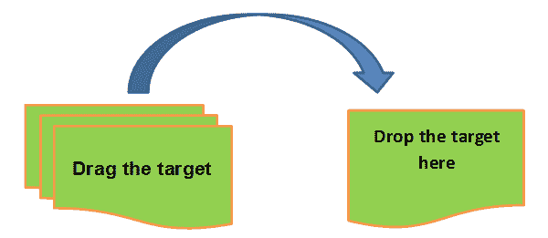
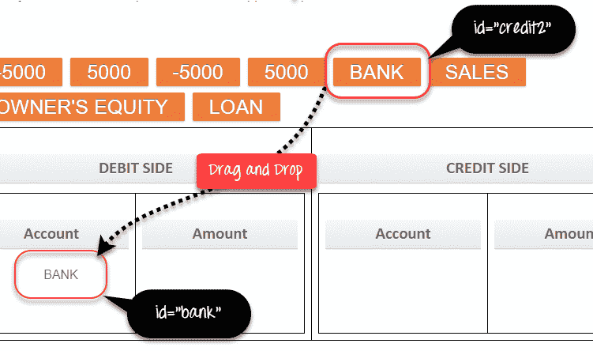
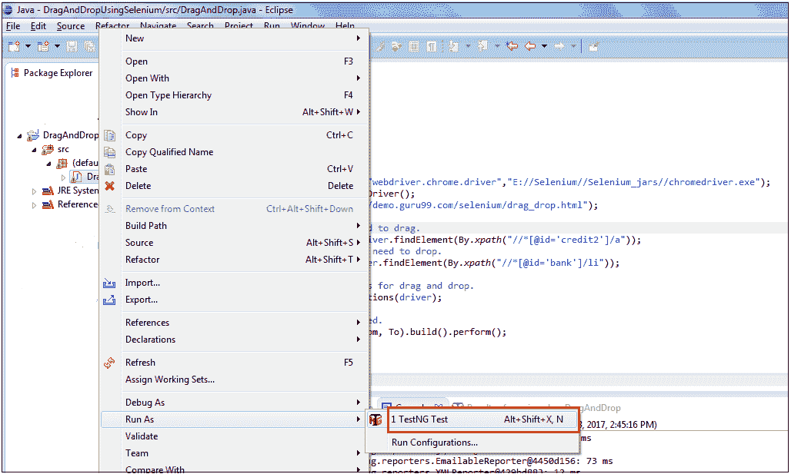
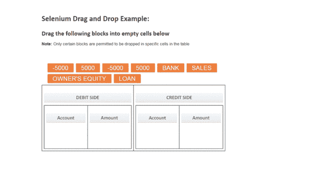
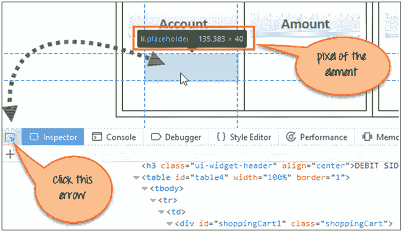

# 如何在 Selenium WebDriver 中拖放（示例）

> 原文： [https://www.guru99.com/drag-drop-selenium.html](https://www.guru99.com/drag-drop-selenium.html)

某些 Web 应用程序具有将 Web 元素拖放到定义的区域或元素上的功能。 我们可以使用 Selenium Webdriver 自动执行此类元素的拖放操作。

### 拖放的语法。

Actions 类有两个支持拖放的方法。 让我们研究一下-

```
Actions.dragAndDrop(Sourcelocator, Destinationlocator)
```

在 dragAndDrop 方法中，我们传递两个参数-

1.  第一个参数“ Sourcelocator”是我们需要拖动的元素
2.  第二个参数“ Destinationlocator”是需要在其上放置第一个元素的元素

```
Actions.dragAndDropBy(Sourcelocator, x-axis pixel of Destinationlocator, y-axis pixel of Destinationlocator)
```

dragAndDropBy 方法，我们传递 3 个参数-

1.  第一个参数“ Sourcelocator”是我们需要拖动的元素
2.  第二个参数是第 2 个<sup>元素和</sup>元素的 x 轴像素值，我们需要在其中放置第一个元素。
3.  The third parameter is y-axis pixel value of the 2nd element on which we need to drop the first element.

    [ ](/images/1/102717_0423_DragandDrop1.png) 

让我们在以下 3 种情况下使用 selenium webdriver 实际上向您展示元素的拖放

*   [场景 1：通过 DragAndDrop 方法将 BANK 元素拖放到特定元素上。](#1)
*   [场景 2：通过 DragAndDrop 方法将 BANK 元素拖放到特定元素上。](#2)
*   [方案 3：拖放几个元素，然后验证是否显示消息。](#3)

### 场景 1：通过 DragAndDrop 方法将 BANK 元素拖放到特定单元格上。

在下面的代码中，我们在 Firefox 浏览器中启动给定的 URL，然后通过 dragAndDrop 方法将 BANK 元素拖放到 DEBIT SIDE 块上。



```
import org.openqa.selenium.By;		
import org.openqa.selenium.WebDriver;		
import org.openqa.selenium.WebElement;		
import org.openqa.selenium.chrome.ChromeDriver;		
import org.openqa.selenium.interactions.Actions;		
import org.testng.annotations.Test;		

public class DragAndDrop {				

    WebDriver driver;			

    @Test		
    public void DragnDrop()					
    {		
         System.setProperty("webdriver.chrome.driver"," E://Selenium//Selenium_Jars//chromedriver.exe ");					
         driver= new ChromeDriver();					
         driver.get("http://demo.guru99.com/test/drag_drop.html");					

		//Element which needs to drag.    		
        	WebElement From=driver.findElement(By.xpath("//*[@id='credit2']/a"));	

         //Element on which need to drop.		
         WebElement To=driver.findElement(By.xpath("//*[@id='bank']/li"));					

         //Using Action class for drag and drop.		
         Actions act=new Actions(driver);					

	//Dragged and dropped.		
         act.dragAndDrop(From, To).build().perform();		
	}		
}

```

**代码说明：**在上面的代码中，我们在 Firefox 浏览器中启动给定的 URL，然后拖动 BANK 元素并通过 dragAndDrop 方法拖放到 DEBIT SIDE 块上。 下面简要说明：

首先，我们捕获 1 <sup>st</sup> 元素，我们需要将其拖入变量“ From”。

```
WebElement From=driver.findElement(By.xpath("//*[@id='credit2']/a"));		
```

其次，我们捕获需要在变量“ To”中放置第一个元素的第二个元素。

```
WebElement To=driver.findElement(By.xpath("//*[@id='bank']/li"));		
```

第三，我们使用 Actions 类的方法创建 Actions 类的对象。

```
Actions act=new Actions(driver);		
```

对于拖放元素，我们使用 Actions 类的 dragAndDrop 方法并将参数作为第一个元素（Sourcelocator）“发自”和第二个元素（Destinationlocator）“传递给”。 在下面的行中，将拖动第一个<sup>元素</sup>并将其放在第 2 个<sup>元素</sup>上。

act.dragAndDrop（从，到）.build（）。perform（）;

**脚本的执行。**

现在，您可以从 eclipse 一步一步地执行上述脚本，如以下屏幕截图所示。



这是运行脚本时的输出



### 场景 2：通过 DragAndDrop 方法将 BANK 元素拖放到特定单元格上。

在这种情况下，我们在浏览器中启动给定的 URL，然后通过 dragAndDropBy 方法将 BANK 元素拖放到 DEBIT SIDE 块上。 要拖动并拖放，我们需要找到元素的像素。

**如何找到像素？**

在 Chrome 或 FireFox 中打开 URL，然后单击蓝色箭头。

接下来，单击要了解其像素的任何元素。

您将在元素上方找到像素，如下面的屏幕快照所示。



```
import org.openqa.selenium.By;		
import org.openqa.selenium.WebDriver;		
import org.openqa.selenium.WebElement;		
import org.openqa.selenium.chrome.ChromeDriver;		
import org.openqa.selenium.interactions.Actions;		
import org.testng.annotations.Test;		

public class DragAndDrop {				

    WebDriver driver;			
    @Test		
    public void DragnDrop()					
    {		
         System.setProperty("webdriver.chrome.driver","E://Selenium//Selenium_Jars//chromedriver.exe");					
         driver= new ChromeDriver();					
         driver.get("http://demo.guru99.com/test/drag_drop.html");					

	//Element(BANK) which need to drag.		
        WebElement From=driver.findElement(By.xpath("//*[@id='credit2']/a"));					

        //Using Action class for drag and drop.		
        Actions act=new Actions(driver);					

        //Drag and Drop by Pixel.		
        act.dragAndDropBy(From,135, 40).build().perform();		
 }		
}

```

**注：**像素值随屏幕分辨率和浏览器大小而变化。 因此，该方法不可靠并且未被广泛使用。

### 方案 3：拖放几个元素，然后验证是否显示消息。

在下面的代码中，我们在浏览器中启动给定的 URL，然后将诸如 BANK，SALES，500 之类的元素拖放到相应的块上。 完成后，我们验证输出消息。

```
import org.openqa.selenium.By;		
import org.openqa.selenium.WebDriver;		
import org.openqa.selenium.WebElement;		
import org.openqa.selenium.chrome.ChromeDriver;		
import org.openqa.selenium.interactions.Actions;		
import org.testng.annotations.Test;		

public class DragAndDrop {				

    WebDriver driver;			
    @Test		
    public void DragnDrop()					
    {		
    	 System.setProperty("webdriver.chrome.driver"," E://Selenium//Selenium_Jars//chromedriver.exe");					
         driver= new ChromeDriver();					
         driver.get("http://demo.guru99.com/test/drag_drop.html");					

	//Element(BANK) which need to drag.		
     	 WebElement From1=driver.findElement(By.xpath("//*[@id='credit2']/a"));	

     	//Element(DEBIT SIDE) on which need to drop.		
     	WebElement To1=driver.findElement(By.xpath("//*[@id='bank']/li"));					

	//Element(SALES) which need to drag.		
     	WebElement From2=driver.findElement(By.xpath("//*[@id='credit1']/a"));

	//Element(CREDIT SIDE) on which need to drop.  		
     	WebElement To2=driver.findElement(By.xpath("//*[@id='loan']/li"));					

     	//Element(500) which need to drag.		
        WebElement From3=driver.findElement(By.xpath("//*[@id='fourth']/a"));					

        //Element(DEBIT SIDE) on which need to drop.		
     	WebElement To3=driver.findElement(By.xpath("//*[@id='amt7']/li"));					

	//Element(500) which need to drag.		
        WebElement From4=driver.findElement(By.xpath("//*[@id='fourth']/a"));					

        //Element(CREDIT SIDE) on which need to drop.		
     	WebElement To4=driver.findElement(By.xpath("//*[@id='amt8']/li"));					

	//Using Action class for drag and drop.		
     	Actions act=new Actions(driver);					

	//BANK drag and drop.		
     	act.dragAndDrop(From1, To1).build().perform();

	//SALES drag and drop.		
     	act.dragAndDrop(From2, To2).build().perform();

	//500 drag and drop debit side.		
     	act.dragAndDrop(From3, To3).build().perform();	

	//500 drag and drop credit side. 		
     	act.dragAndDrop(From4, To4).build().perform();		

	//Verifying the Perfect! message.		
	if(driver.findElement(By.xpath("//a[contains(text(),'Perfect')]")).isDisplayed())							
     	{		
         	System.out.println("Perfect Displayed !!!");					
     	}
		else
     	{
        	System.out.println("Perfect not Displayed !!!");					
     	}		
}

```

**输出分析**

在“输出”中，您可以看到该元素已拖放到定义的元素上。 您可以检查输出的 GIF。

<video controls="" height="300" width="450"><source src="/images/1/102717_0423_DragandDrop6.mp4" type="video/mp4"> <source src="/images/1/102717_0423_DragandDrop6.ogg" type="video/ogg">您的浏览器不支持视频标签。</video>

### 摘要

*   在以上教程中，我们通过 Webdriver 中的 Action 方法说明了 Web 应用程序的拖放功能：
*   dragAndDrop（Sourcelocator，Destinationlocator）
*   dragAndDropBy（Sourcelocator，Destinationlocator 的 x 轴像素，Destinationlocator 的 y 轴像素）
*   首先要拖放元素，我们使用了 Actions 类中的 DragAndDrop 方法，在其中传递了 2 个参数，其中 1 个 <sup>st</sup> 参数是我们需要拖动的元素，而 2 个 <sup>nd</sup> 参数是需要在其上放置 1 <sup>st</sup> 元素的元素。
*   其次，我们使用了 Actions 类中的 dragAndDropBy 方法，在其中传递了 3 个参数，第一个参数是我们需要拖动的元素，2 <sup>nd</sup> 参数是 2 个像素的 x 轴像素值 <sup>nd</sup> 元素，[3 <sup>rd</sup> ]参数是第二 <sup>nd</sup> 元素的 y 轴像素值。