# Selenium C＃Webdriver 教程：NUnit 示例

> 原文： [https://www.guru99.com/selenium-csharp-tutorial.html](https://www.guru99.com/selenium-csharp-tutorial.html)

## 硒概述：

Selenium 是一种开源 Web [自动化测试](/automation-testing.html)工具，它支持多个浏览器和多个操作系统。 它允许测试人员使用多种编程语言（例如 Java，C＃，Python，.Net，Ruby，PHP 和 Perl）来编码自动化测试。

## C＃概述：

C＃是从 C ++和 Java 派生的一种面向对象的编程语言。 C＃允许开发人员在.Net 平台上使用 Visual Studio 构建应用程序。 以下是 C＃的主要功能。

1.  它是一种面向对象的编程语言
2.  它支持控制台，Windows 和基于 Web 的应用程序的开发
3.  它提供了诸如封装，继承和多态性的功能。

<center>**What You Will Learn:** []</center>

*   [C＃的基本语法：](#1)
*   [使用 Selenium WebDriver 设置 Visual Studio：](#2)
*   [在 Visual Studio 中创建一个新项目：](#3)
*   [使用 Selenium WebDriver 设置 Visual Studio：](#4)
*   [NUnit Framework：概述](#5)
*   [安装 NUnit Framework 的步骤：](#6)
*   [下载 NUnit 测试适配器](#7)的步骤
*   [Selenium 和 NUnit 框架：](#8)
*   [在 Selenium 中创建 NUnit 测试类的步骤：](#9)
*   C＃中的 [WebDriver 命令：](#10)
*   [浏览器命令：](#11)
*   [Webelement 命令：](#12)
*   C＃中的[下拉命令：](#13)
*   [代码示例](#14)
*   [示例 1：使用 XPATH 定位器单击链接：](#15)
*   [示例 2：将数据输入到 TextBox 中，然后使用 XPATH 定位器单击一个按钮：](#16)
*   [示例 3：将数据输入到 TextBox 中，然后使用 CSS 定位器单击一个按钮：](#17)
*   [示例 4：在下拉列表中选择一个值：](#18)

## C＃的基本语法：

C＃中的程序需要包含以下部分

1.  命名空间声明
2.  班级
3.  类的属性和方法
4.  主要方法
5.  计划陈述

**示例-**

下面是一个示例 C＃程序，用于在系统控制台上打印文本“ Guru99”。

```
using System;
namespace FirstProgram {
class DemoPrint {
static void main(){
    Console.WriteLine("Guru99");
	}
  }
}

```

说明：

*   C＃中的名称空间是多个类的集合。 必须使用关键字“ using”声明每个名称空间。
*   代码的第一条语句在我们的程序中包含名称空间“ System”。 系统名称空间定义了 C＃中使用的基本类和事件。 要使用的名称空间取决于程序要求。
*   第二条语句是为类“ DemoPrint”声明一个名称空间“ FirstProgram”。 一个 C＃文件可以在同一个命名空间中包含多个类。
*   第三条语句包括类声明。 一个类可以包含多个属性和多个方法。
*   第四个语句包括 Main 方法的声明。 主要方法是每个类的执行入口。
*   最后一条语句是用于将语句打印到控制台的 C＃语法。 WriteLine 是“控制台”类的方法。

## 使用 Selenium WebDriver 设置 Visual Studio：

Visual Studio 是一个集成开发环境（IDE），开发人员可使用它来跨多个平台（例如 Windows，Android，iOS 和基于云的应用程序）构建应用程序。

**步骤 1）**导航至 URL [https://www.visualstudio.com/downloads/](https://www.visualstudio.com/downloads/) ，然后单击 Visual Studio Community 2017 选项卡上显示的“免费下载”按钮

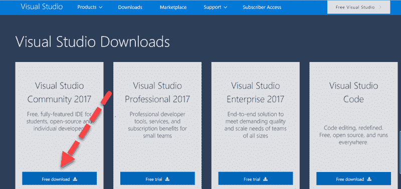

**步骤 2）**打开下载的 exe。 如果询问管理员权限，请单击“是”。


**步骤 3）**将会出现以下弹出窗口。 点击“继续”按钮。

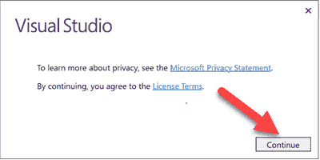

文件将被下载，如下面的弹出窗口所示。

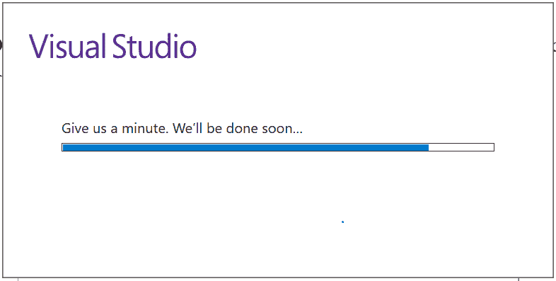

**步骤 4）**在下一个屏幕中，

选中以下复选框

*   通用 Windows 平台开发
*   网络桌面开发

点击“安装”。

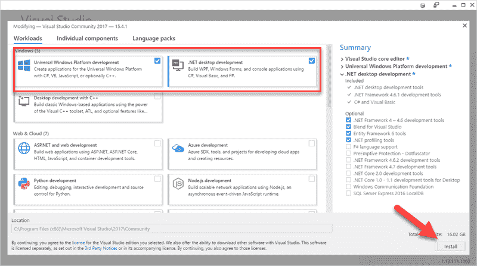

等待每个组件的安装完成。 文件大小为 16GB，将需要一些时间。

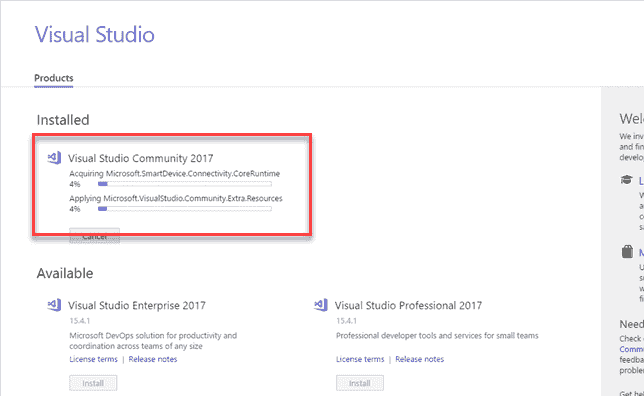

**步骤 5）**将显示以下弹出窗口。 点击“重启”按钮。

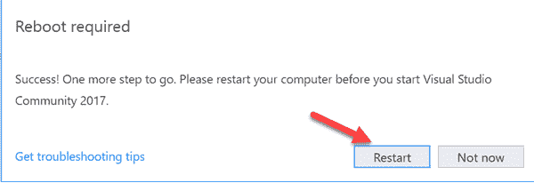

**步骤 6）**重新启动计算机后，在开始菜单上搜索“ Visual Studio 2017”，然后单击搜索结果。 将出现以下弹出窗口。 如果您没有现有帐户，请单击“不立即，也许以后”链接。

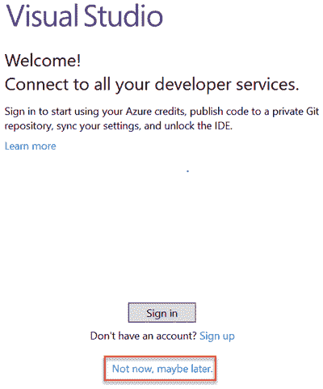

**步骤 7）**在下一个屏幕中，

*   选择您喜欢的颜色主题
*   单击按钮“启动 Visual Studio”

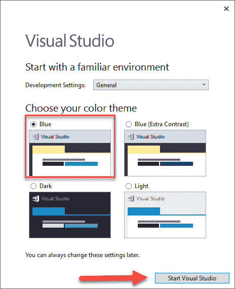

**步骤 8）**将出现 Visual Studio“入门”屏幕。

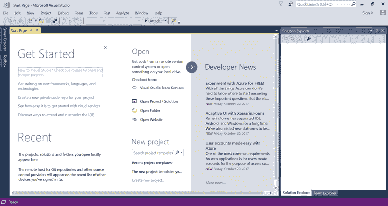

### 在 Visual Studio 中创建一个新项目：

**步骤 1）**在文件菜单中，单击新建>项目

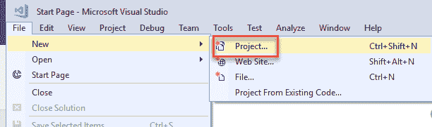

**步骤 2）**在下一个屏幕中，

1.  选择选项“ Visual C＃”
2.  单击控制台应用程序（.Net Framework）
3.  输入名称为“ Guru99”
4.  点击确定

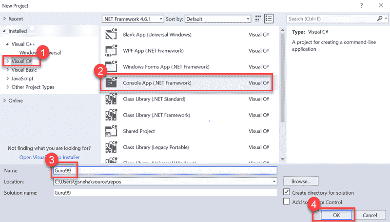

**步骤 3）**成功创建项目后，将显示以下屏幕。

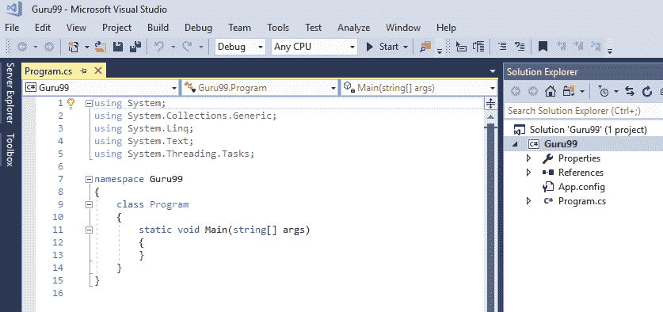

### 使用 Selenium WebDriver 设置 Visual Studio：

**步骤 1）**导航到工具-> NuGet 软件包管理器->管理 NuGet 软件包以获取解决方案

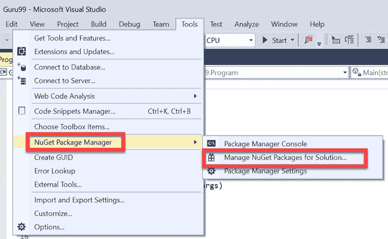

**步骤 2）**在下一个屏幕中

1.  在结果屏幕上搜索 Selenium
2.  选择第一个搜索结果
3.  选中项目复选框
4.  点击“安装”

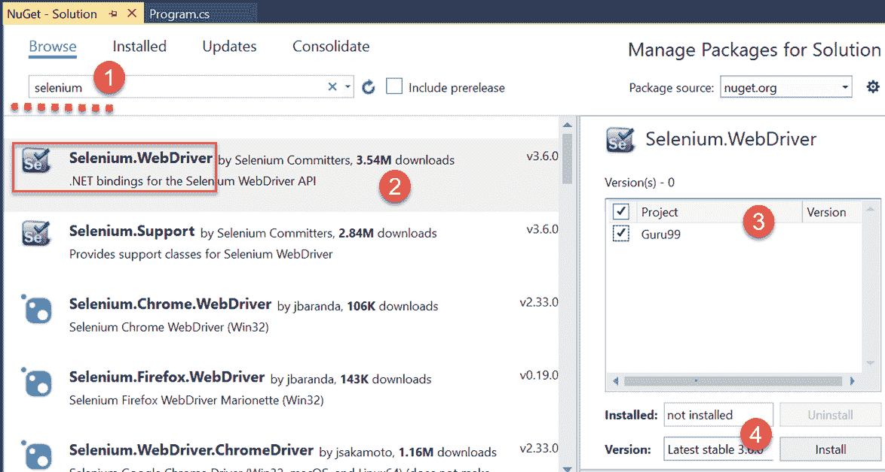

**步骤 3）**在弹出屏幕中单击“确定”按钮

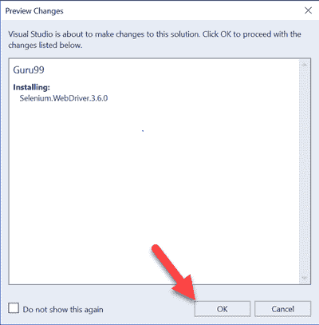

**步骤 4）**成功安装软件包后，将显示以下消息。

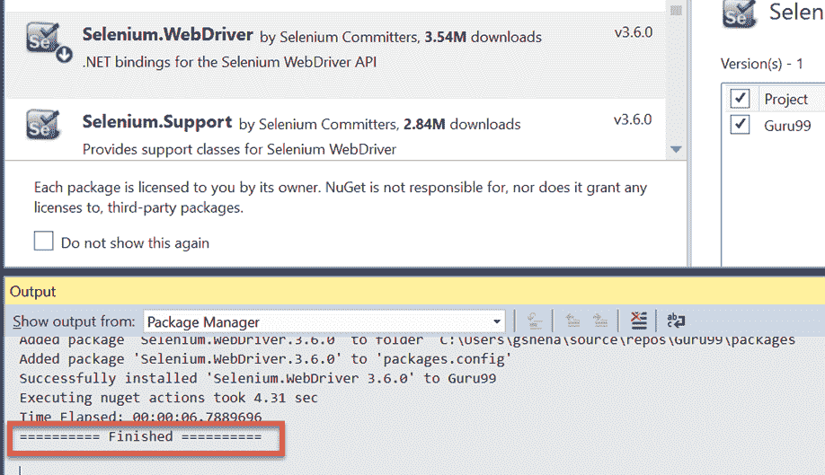

## NUnit 框架：概述

NUnit 是 Visual Studio 和 Selenium WebDriver 支持的[单元测试](/unit-testing-guide.html)框架。 NUnit 是.Net 应用程序中使用最广泛的单元测试框架。 NUnit 以可读的格式显示测试结果，并允许测试人员调试自动测试。

为了使用它，我们需要在 Visual Studio 上安装 NUnit Framework 和 NUnit 测试适配器。

### 安装 NUnit Framework 的步骤：

1.导航到工具-> NuGet 软件包管理器->管理解决方案的 NuGet 软件包


**步骤 2）**在下一个窗口中

1.  搜索 NUnit
2.  选择搜索结果
3.  选择项目
4.  点击安装

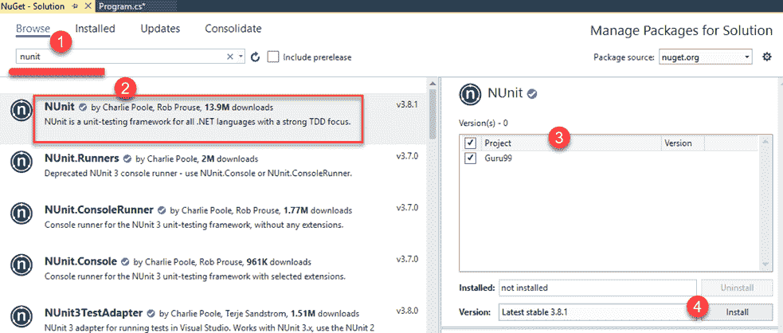

**步骤 3）**将会出现以下弹出窗口。 点击“确定”按钮。

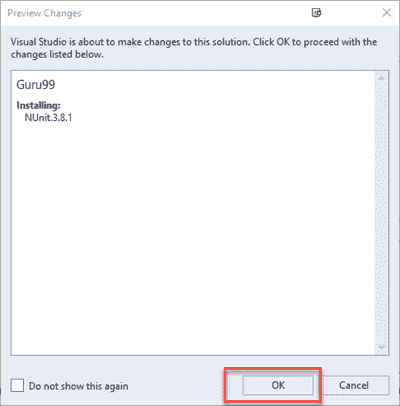

**步骤 4）**安装完成后，将出现以下消息。

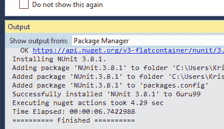

### 下载 NUnit 测试适配器的步骤

请注意，以下步骤仅适用于 32 位计算机。 对于 64 位计算机，您需要按照以下相同的步骤下载“ NUnit3 测试适配器”。

**步骤 1）**导航到工具-> NuGet 软件包管理器->管理解决方案的 NuGet 软件包。 在那个屏幕上

1.  搜索 NUnitTestAdapter
2.  点击搜索结果
3.  选择项目
4.  点击安装

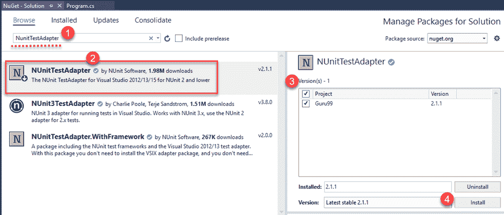

**步骤 2）**在确认弹出窗口上单击“确定”。 安装完成后，您将看到以下消息：

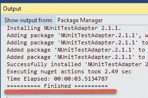

## Selenium 和 NUnit 框架：

硒与 NUnit 框架的集成使测试人员可以区分各种测试类别。 NUnit 还允许测试人员在运行测试之前和之后使用诸如 SetUp，Test 和 TearDown 之类的注释执行操作。

通过创建 NUnit 测试类并使用 NUnit 框架运行测试类，可以将 NUnit 框架与 Selenium 集成。

以下是使用 NUnit 框架创建和运行测试类所需的步骤。

### 在 Selenium 中创建 NUnit 测试类的步骤：

**步骤 1）**在解决方案资源管理器中，右键单击项目>添加>类

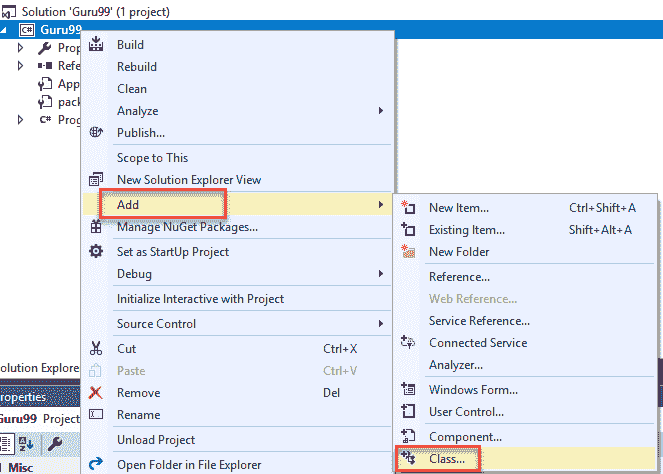

**步骤 2）将出现**类创建窗口。

1.  给班级起个名字
2.  点击添加按钮

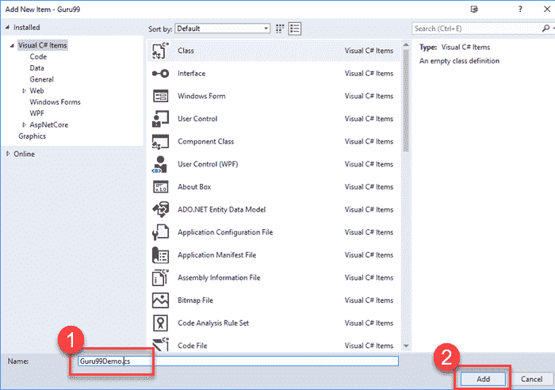

**步骤 3）**将会出现以下屏幕。

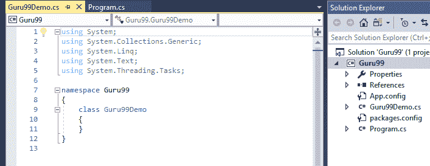

**步骤 4）**将以下代码添加到创建的类中。 请注意，您需要在 chrome 驱动程序初始化期间指定“ chromdriver.exe”文件的位置。

```
using NUnit.Framework;
using OpenQA.Selenium;
using OpenQA.Selenium.Chrome;
using OpenQA.Selenium.Firefox;
using System;
using System.Collections.Generic;
using System.Linq;
using System.Text;
using System.Threading.Tasks;

namespace Guru99Demo
{
	class Guru99Demo						
    {
        IWebDriver driver;

        [SetUp]
		public void startBrowser()
        {
            driver = new ChromeDriver("D:\\3rdparty\\chrome");
        }

        [Test]
		public void test()
        {
            driver.Url = "http://www.google.co.in";
        }

        [TearDown]
		public void closeBrowser()
        {
            driver.Close();
        }

    }
}

```

**步骤 4）**单击“构建”->“构建解决方案”

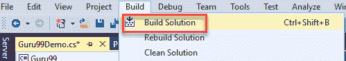

**注意：**构建时，您可能会收到类似“不包含适用于入口点的静态'main'方法”之类的错误。

[ ](/images/1/103017_0412_SeleniumCWe28.png) 

要解决此问题，请转到项目>属性，然后将“输出类型”更改为“类库”。 默认值为“控制台应用程序”。

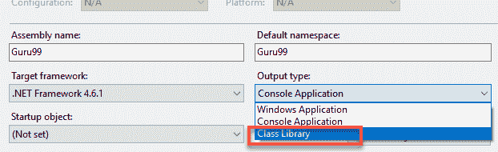

**步骤 5）**构建成功后，我们需要打开“测试资源管理器”窗口。 单击测试-> Windows->测试浏览器

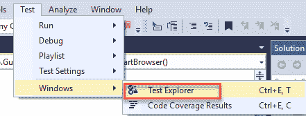

**步骤 6）**将打开“测试资源管理器”窗口，其中包含可用测试的列表。 右键单击“测试资源管理器”，然后选择“运行选定的测试”

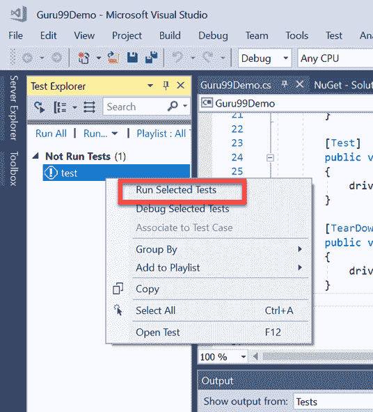

**步骤 7）** Selenium 必须使用指定的 URL 打开浏览器并关闭浏览器。 测试用例的状态将在“测试资源管理器”窗口中更改为“通过”。

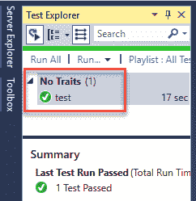

## C＃中的 Selenium WebDriver 命令：

C＃使用接口“ IWebDriver”进行浏览器交互。 以下是 C＃中可用的命令类别。

1.  浏览器命令
2.  Web 元素命令
3.  下拉命令

让我们一一研究

### 浏览器命令：

以下是 C＃中可用的浏览器命令的列表。

| **命令名称** | **说明** | **语法** |
| **网址命令** | 此命令用于在浏览器中打开指定的 URL。 | 

```
driver.Url = "https://www.guru99.com"
```

 |
| **标题命令** | 此命令用于检索当前打开的网页的页面标题 | 

```
String title = driver.Title
```

 |
| **PageSource 命令** | 该命令用于获取当前打开的网页的源代码。 | 

```
String pageSource = driver.PageSource
```

 |
| **关闭命令** | 此命令用于关闭最近打开的浏览器实例。 | 

```
driver.Close();
```

 |
| **退出命令** | 此命令用于关闭所有打开的浏览器实例 | 

```
driver.Quit();
```

 |
| **后退命令** | 此命令用于导航到浏览器历史记录的上一页。 | 

```
driver.Navigate().Back();
```

 |
| **转发命令** | 此命令用于导航到浏览器历史记录的下一页。 | 

```
driver.Navigate().Forward()
```

 |
| **刷新命令** | 此命令用于执行浏览器刷新。 | 

```
driver.Navigate().Refresh()
```

 |

### Webelement 命令：

Webelement 代表网页上的所有元素。 它们由 HTML 标记表示。 每个按钮，文本框，链接，图像，表格和框架都属于 Webelements。 可以使用 IWebelement 界面触发对 Web 元素的操作。 要与 Webelement 进行交互，我们需要在网页上找到元素，然后对其进行操作。 诸如 Firebug 和 Firepath 之类的工具可用于识别 Webelement 的 Xpath。

以下是 C＃中可用的 Webelement 命令的列表。

| **Command Name** | **Description** | **Syntax** |
| **点击命令** | 此命令用于单击 Webelement。 为了使元素可单击，该元素必须在网页上可见。 此命令也用于复选框和单选按钮操作。 | 

```
IWebelement element = driver.FindElement(By.xpath("xpath of Webelement"));  element.Click();
```

 |
| **清除命令** | 该命令专门用于清除文本框的现有内容。 | 

```
IWebelement element = driver.FindElement(By.xpath("xpath of Webelement")); 
element.Clear();
```

 |
| **SendKeys 命令** | 此命令用于在文本框中输入值。 输入的值必须作为参数传递给 | 

```
IWebelement element = driver.FindElement(By.xpath("xpath of Webelement")); 
element.SendKeys("guru99");
```

 |
| **显示的命令** | 此命令用于标识网页上是否显示特定元素。 该命令返回一个布尔值； 是 true 还是 false 取决于 Web 元素的可见性。 | 

```
IWebelement element = driver.FindElement(By.xpath("xpath of Webelement")); 
Boolean status = element.Displayed;
```

 |
| **启用的命令** | 此命令用于标识是否在网页上启用了特定的 Web 元素。 该命令返回一个布尔值； 结果是对还是错。 | 

```
IWebelement element = driver.FindElement(By.xpath("xpath of Webelement")); 
Boolean status = element.Enabled;
```

 |
| **选定的命令** | 此命令用于标识是否选择了特定的 Web 元素。 此命令用于复选框，单选按钮和选择操作。 | 

```
IWebelement element = driver.FindElement(By.xpath("xpath of Webelement")); 
Boolean status = element.Selected;
```

 |
| **提交命令：** | 该命令与 click 命令类似，区别在于 HTML 表单是否具有类型为 Submit 的按钮。 当 click 命令单击任何按钮时，submit 命令仅单击类型为 commit 的按钮。 | 

```
IWebelement element = driver.FindElement(By.xpath("xpath of Webelement"));  element.submit();
```

 |
| **文本命令** | 此命令返回 Webelement 的内部文本。 此命令返回一个字符串值作为结果。 | 

```
IWebelement element = driver.FindElement(By.xpath("xpath of Webelement")); 
String text=element.Text;
```

 |
| **TagName 命令** | 此命令返回 Web 元素的 HTML 标签。 它返回一个字符串值作为结果。 | 

```
IWebelement element = driver.FindElement(By.xpath("xpath of Webelement"));  String tagName = element.TagName;
```

 |
| **GetCSSValue 命令：** | 此方法用于以 rgba 字符串（红色，绿色，蓝色和 Alpha）的形式返回 Web 元素的颜色。 | 

```
IWebelement element = driver.FindElement(By.xpath("xpath of Webelement")); 
String color = element.getCSSValue;
```

**输出**-如果元素的颜色为红色，则输出为 rgba（255,0,0,1） |

### 下拉命令：

可以使用 SelectElement 类实现 C＃中的下拉操作。

以下是 C＃中可用的各种下拉操作。

| **Command Name** | **Description** | **Syntax** |
| **SelectByText 命令** | 该命令根据选项的文本选择下拉菜单的选项。 | 

```
IWebelement element = driver.FindElement(By.xpath("xpath of Webelement")); 
SelectElement select = new SelectElement(element);
select.SelectByText("Guru99");
```

 |
| **SelectByIndex 命令** | 此命令用于根据其索引选择一个选项。 下拉索引从 0 开始。 | 

```
IWebelement element = driver.FindElement(By.xpath("xpath of Webelement")); 
SelectElement select = new SelectElement(element);
select.SelectByIndex("4");
```

 |
| **SelectByValue 命令** | 此命令用于根据选项值选择选项。 | 

```
IWebelement element = driver.FindElement(By.xpath("xpath of Webelement")); 
SelectElement select = new SelectElement(element);
select.SelectByValue("Guru99");
```

 |
| **选项命令** | 此命令用于检索下拉菜单中显示的选项列表。 | 

```
IWebelement element = driver.FindElement(By.xpath("xpath of Webelement")); 
SelectElement select = new SelectElement(element);
List<IWebelement> options = select. Options;
int size = options.Count;
for(int i=0;i<options.size();i++)
{
String value = size.elementAt(i).Text;
Console.writeLine(value);
}
```

上面的代码在一个下拉列表中将所有选项打印到控制台上。 |
| **IsMultiple 命令** | 此命令用于识别下拉列表是否为多选下拉列表； 多选下拉菜单使用户可以一次选择一个下拉菜单中的多个选项。 此命令返回一个布尔值。 | 

```
IWebelement element = driver.FindElement(By.xpath("xpath of Webelement")); 
SelectElement select = new SelectElement(element);
Boolean status = select.IsMultiple();
```

 |
| **DeSelectAll 命令** | 此命令用于多选下拉列表中。 清除已选择的选项。 | 

```
IWebelement element = driver.FindElement(By.xpath("xpath of Webelement")); 
SelectElement select = new SelectElement(element);
select.DeSelectAll();
```

 |
| **DeSelectByIndex 命令** | 此命令使用其索引取消选择已选择的值。 | 

```
IWebelement element = driver.FindElement(By.xpath("xpath of Webelement")); 
SelectElement select = new SelectElement(element);
select.DeSelectByIndex("4");
```

 |
| **DeSelectByValue 命令** | 此命令使用其值取消选择已选择的值。 | 

```
IWebelement element = driver.FindElement(By.xpath("xpath of Webelement")); 
SelectElement select = new SelectElement(element);
select.DeSelectByValue("Guru99");
```

 |
| **DeSelectByText 命令** | 此命令使用其文本取消选择已选择的值。 | 

```
IWebelement element = driver.FindElement(By.xpath("xpath of Webelement")); 
SelectElement select = new SelectElement(element);
select.DeSelectByText("Guru99");
```

 |

## 代码示例

### 示例 1：使用 XPATH 定位器单击链接：

**测试方案：**

1.  导航至 Demo Guru99 网页- [http://demo.guru99.com/test/guru99home/](http://demo.guru99.com/test/guru99home/)
2.  最大化窗口
3.  点击“测试”菜单
4.  关闭浏览器

```
using NUnit.Framework;
using OpenQA.Selenium;
using OpenQA.Selenium.Chrome;
using System;
using System.Collections.Generic;
using System.Linq;
using System.Text;
using System.Threading.Tasks;

namespace Guru99Demo
{
	class CSS						
    {
        IWebDriver m_driver;

        [Test]
		public void cssDemo()
        {
            m_driver = new ChromeDriver("D:\\3rdparty\\chrome");
            m_driver.Url = "http://demo.guru99.com/test/guru99home/";
            m_driver.Manage().Window.Maximize();
            IWebelement link = m_driver.FindElement(By.XPath(".//*[@id='rt-header']//div[2]/div/ul/li[2]/a"));
            link.Click();
            m_driver.Close();
        }
    }
}

```

### 示例 2：将数据输入到 TextBox 中，然后使用 XPATH 定位器单击一个按钮：

**Test Scenario:**

1.  导航到 Guru 99 演示页面- [http://demo.guru99.com/test/guru99home/](http://demo.guru99.com/test/guru99home/)
2.  在电子邮件文本框中输入数据
3.  点击注册按钮

```
using NUnit.Framework;
using OpenQA.Selenium;
using OpenQA.Selenium.Chrome;
using System;
using System.Collections.Generic;
using System.Linq;
using System.Text;
using System.Threading.Tasks;

namespace Guru99Demo
{
	class CSS						
    {
        IWebDriver m_driver;

        [Test]
		public void cssDemo()
        {
            m_driver = new ChromeDriver("G:\\");
            m_driver.Url = "http://demo.guru99.com/test/guru99home/";
            m_driver.Manage().Window.Maximize();

			// Store locator values of email text box and sign up button				
            IWebElement emailTextBox = m_driver.FindElement(By.XPath(".//*[@id='philadelphia-field-email']"));
            IWebElement signUpButton = m_driver.FindElement(By.XPath(".//*[@id='philadelphia-field-submit']"));

            emailTextBox.SendKeys("This email address is being protected from spambots. You need JavaScript enabled to view it.
	");
            signUpButton.Click();

        }
    }
}			

```

### 示例 3：在 TextBox 中输入数据并使用 CSS 定位器单击一个按钮：

**Test Scenario:**

1.  导航到 Guru 99 演示页面- [http://demo.guru99.com/test/guru99home/](http://demo.guru99.com/test/guru99home/)
2.  在电子邮件文本框中输入数据
3.  点击注册按钮

```
using NUnit.Framework;
using OpenQA.Selenium;
using OpenQA.Selenium.Chrome;
using System;
using System.Collections.Generic;
using System.Linq;
using System.Text;
using System.Threading.Tasks;

namespace Guru99Demo
{
	class CSS						
    {
        IWebDriver m_driver;

        [Test]
		public void cssDemo()
        {
            m_driver = new ChromeDriver("G:\\");
            m_driver.Url = "http://demo.guru99.com/test/guru99home/";
            m_driver.Manage().Window.Maximize();

			// Store locator values of email text box and sign up button				
            IWebElement emailTextBox = m_driver.FindElement(By.CssSelector("input[id=philadelphia-field-email]"));
            IWebElement signUpButton = m_driver.FindElement(By.CssSelector("input[id=philadelphia-field-submit]"));

            emailTextBox.SendKeys("This email address is being protected from spambots. You need JavaScript enabled to view it.");
            signUpButton.Click();

        }
    }
}

```

### 示例 4：在下拉列表中选择一个值：

**Test Scenario:**

1.  导航到 Guru 99 演示页面- [http://demo.guru99.com/test/guru99home/](http://demo.guru99.com/test/guru99home/)
2.  点击 SAP 链接
3.  在名称和电子邮件文本框中输入数据
4.  从课程下拉菜单中选择一个值
5.  关闭浏览器

```
using NUnit.Framework;
using OpenQA.Selenium;
using OpenQA.Selenium.Chrome;
using OpenQA.Selenium.Support.UI;

namespace Guru99Demo
{
	class TestSelect						
    {
        IWebDriver m_driver;

        [Test]
		public void selectDemo()
        {
            m_driver = new ChromeDriver("G:\\");
            m_driver.Url = "http://demo.guru99.com/test/guru99home/";
            m_driver.Manage().Window.Maximize();

            IWebElement course = m_driver.FindElement(By.XPath(".//*[@id='awf_field-91977689']"));

			var selectTest = new SelectElement(course);
			// Select a value from the dropdown				
            selectTest.SelectByValue("sap-abap");

        }
    }
}

```

## 摘要：

*   为了将 Selenium 与 C＃一起使用，您需要安装 Visual Studio。
*   NUnit 是 Visual Studio 和 Selenium WebDriver 支持的单元测试框架
*   为了使用它，我们需要在 Visual Studio 上安装 NUnit Framework 和 NUnit 测试适配器。
*   通过创建 NUnit 测试类并使用 NUnit 框架运行测试类，可以将 NUnit 框架与 Selenium 集成。
*   NUnit 还允许测试人员在运行测试之前和之后使用诸如 SetUp，Test 和 TearDown 之类的注释执行操作。
*   Selenium WebDriver 命令可以分为浏览器命令，Webelement 命令和下拉命令。

本文由 Sneha Gudapati 提供