# 在 Selenium WebDriver 中创建对象存储库：XML &属性文件

> 原文： [https://www.guru99.com/object-repository-selenium.html](https://www.guru99.com/object-repository-selenium.html)

## 什么是对象存储库？

对象存储库是所有对象的通用存储位置。 在 Selenium WebDriver 上下文中，对象通常是用于唯一标识 Web 元素的定位器。

使用对象存储库的主要优点是将对象与测试用例分离。 如果一个 Web 元素的定位符值发生更改，则仅需要更改对象存储库，而不需要在使用该定位符的所有测试用例中进行更改。 维护对象存储库可提高框架实现的模块化程度。

在本教程中，您将学习-

*   [什么是对象存储库？](#1)
*   Selenium Web 驱动程序中的[对象存储库类型](#2)
*   [使用属性文件](#3)的 Selenium Web 驱动程序对象存储库
*   [使用 XML 文件](#4)的 Selenium WebDriver 对象存储库

## Selenium Web 驱动程序中的对象存储库类型

Selenium WebDriver 默认情况下不提供内置对象存储库。 但是，可以使用键值对方法构建对象存储库，其中键是指赋予对象的名称，值是指用于唯一标识网页中对象的属性。

以下是可以在 Selenium WebDriver 中创建的对象存储库的类型。

1.  使用属性文件的对象存储库
2.  使用 XML 文件的对象存储库

## 使用属性文件的 Selenium Web Driver 对象存储库

在这种方法中，属性文件是一个文本文件，其中数据以键值对的形式存储。 下面的教程将解决以下主题。

*   [在 Eclipse 中创建属性文件](#11)
*   [将数据存储到属性文件](#12)
*   [从属性文件](#13)读取数据
*   [在测试脚本](#14)中使用属性文件

### 步骤 1）在 Eclipse 中创建属性文件

1.  首先，需要在 eclipse 中创建以下 java 项目结构。 项目名称和程序包名称可以是任何有效名称。

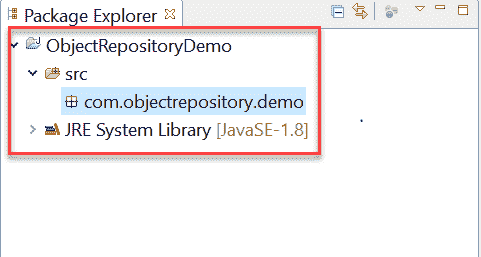

2.  右键单击主项目文件夹，然后选择新建->其他

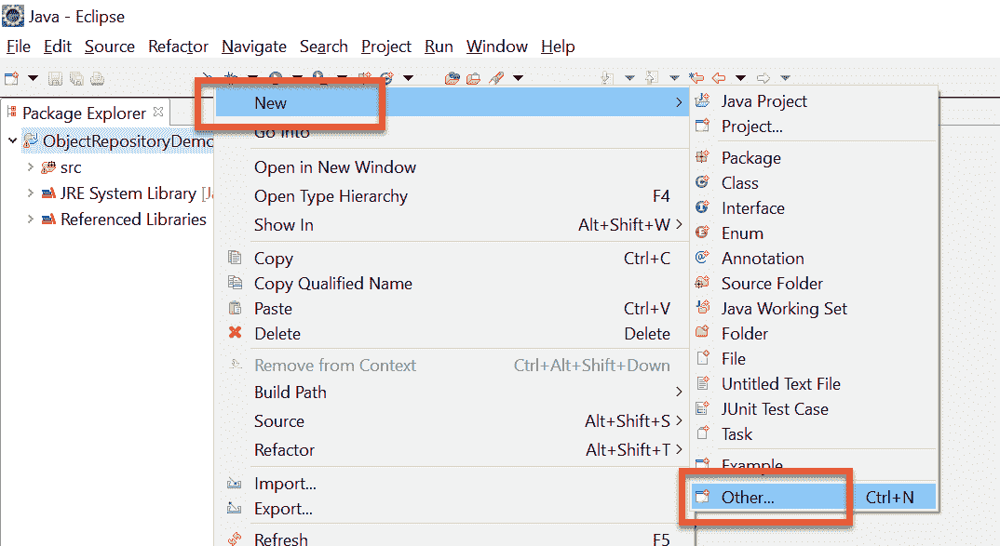

3.  在下一个窗口中，选择常规->文件，然后单击“下一步”按钮

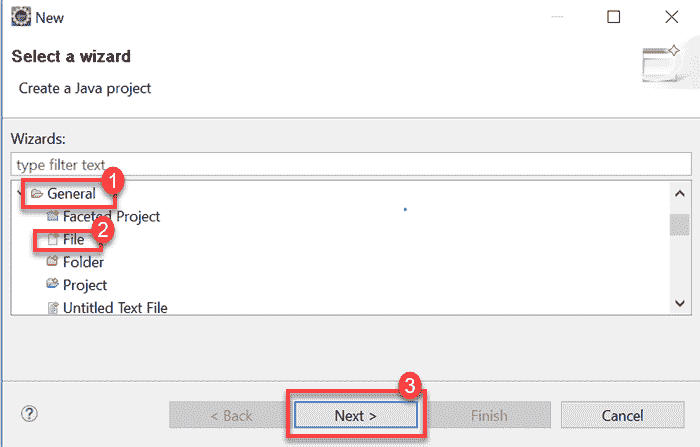

4.  在新的文件资源窗口上提供带有扩展名“ .properties”的有效文件名，然后单击“完成”按钮

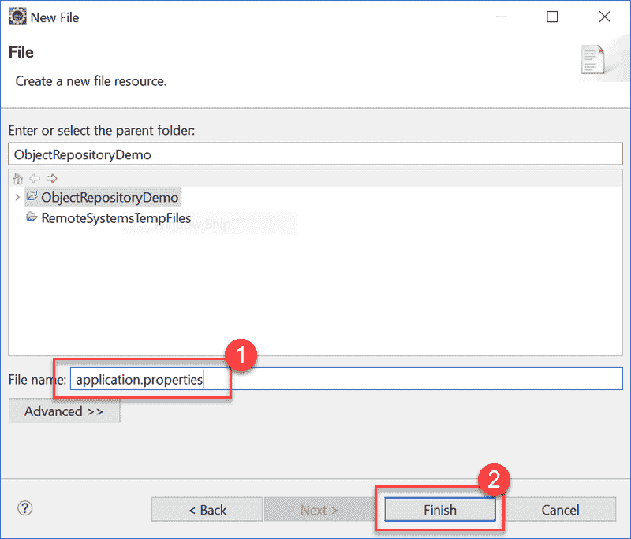

5.  必须在项目结构上显示名为“ application.properties”的文件

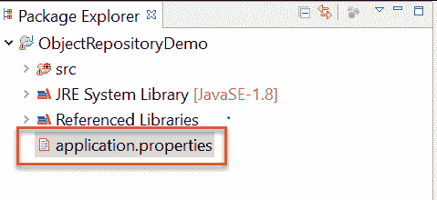

### 步骤 2）将数据存储到属性文件中

1.  数据以键值对的形式存储在属性文件中，键在整个文件中是唯一的。
2.  我们将尝试使用属性文件通过定位符值来识别网络元素。
3.  在 Eclipse 中打开 application.properties 文件并存储以下数据

```
MobileTesting=//a[text()='MOBILE TESTING']
EmailTextBox = philadelphia-field-email
SignUpButton = philadelphia-field-submit
```

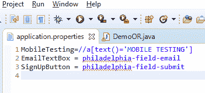

4）对于本教程，正在使用以下演示网站： [http://demo.guru99.com/test/guru99home/](http://demo.guru99.com/test/guru99home/) 。 这是测试方案：

*   单击使用 XPATH 的“移动测试”链接
*   向后导航
*   使用 ID 将数据输入电子邮件文本框
*   单击使用 ID 的“注册”按钮

### 步骤 3）从属性文件读取数据

1.  可以使用 java.util 包中提供的内置 Properties 类从属性文件中读取数据。
2.  最初，需要按以下方式创建 Properties 类的对象

```
  Properties obj = new Properties(); 
```

3.  我们需要创建一个 FileInputStream 类的对象，并带有属性文件的路径

```
FileInputStream objfile = new FileInputStream(System.getProperty("user.dir")+"\\application.properties");
```

4.  可以使用 Java 中 Properties 类提供的 load 方法从属性文件中读取数据。 下面的代码演示了 load 方法的用法。

```
Properties obj = new Properties();
FileInputStream objfile = new FileInputStream(System.getProperty("user.dir")+"\\application.properties");
obj.load(objfile);
String mobileTesting = obj.getProperty("MobileTesting");

```

字符串“ mobileTesting”将包含 XPATH，以标识网页内的“移动测试”链接。

### 步骤 4）在测试脚本中使用属性文件

通过从属性文件读取数据并将数据作为参数传递给 findElement 方法，可以在测试脚本中使用属性文件。 以下代码演示了在测试脚本中从属性文件读取的数据的用法。

```
driver.findElement(By.xpath(obj.getProperty("MobileTesting"))).click();
driver.findElement(By.id(obj.getProperty("EmailTextBox"))).sendKeys("This email address is being protected from spambots. You need JavaScript enabled to view it.
	");								
driver.findElement(By.id(obj.getProperty("SignUpButton"))).click();	
```

以下是用于上述测试方案的完整代码。

```
package com.objectrepository.demo;		

import java.io.FileInputStream;		
import java.io.FileNotFoundException;		
import java.io.IOException;		
import java.util.Properties;		

import org.openqa.selenium.By;		
import org.openqa.selenium.WebDriver;		
import org.openqa.selenium.chrome.ChromeDriver;		

public class DemoOR {				

public static void main(String[] args) throws IOException {										

// Create WebDriver Instance		
    WebDriver driver;			
    System.setProperty("webdriver.chrome.driver","G:\\chromedriver.exe");					
    driver = new ChromeDriver();					
    driver.get("http://demo.guru99.com/test/guru99home/");					
    driver.manage().window().maximize();			
// Load the properties File		
    Properties obj = new Properties();					
    FileInputStream objfile = new FileInputStream(System.getProperty("user.dir")+"\\application.properties");									
    obj.load(objfile);					
// Nagigate to link Mobile Testing and Back		
    driver.findElement(By.xpath(obj.getProperty("MobileTesting"))).click();							
    driver.navigate().back();			
// Enter Data into Form		
    driver.findElement(By.id(obj.getProperty("EmailTextBox"))).sendKeys("This email address is being protected from spambots. You need JavaScript enabled to view it.");									
    driver.findElement(By.id(obj.getProperty("SignUpButton"))).click();							
  }		

}		

```

## 使用 XML 文件的 Selenium WebDriver 对象存储库

XML 代表可扩展标记语言。 XML 文件使用文档对象模型（DOM）作为基本结构。 XML 文件格式将复制用于构建网页的 HTML 格式。 以下是将涉及的主题列表。

*   [在 Eclipse 中创建 XML 文件](#21)
*   [将数据存储到 XML 文件](#22)
*   [从 XML 文件](#23)读取数据
*   [在测试脚本](#24)中使用 XML 文件

### 步骤 1）在 Eclipse 中创建 XML 文件

1.  需要在 Eclipse 中创建以下 Java 项目结构。

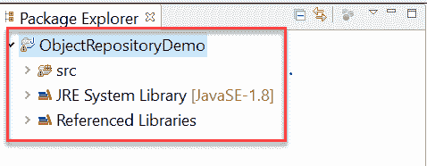

2.  右键单击项目文件夹，选择新建->其他

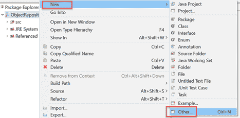

3.  在 XML 文件夹中选择 XML 文件，然后单击“下一步”按钮

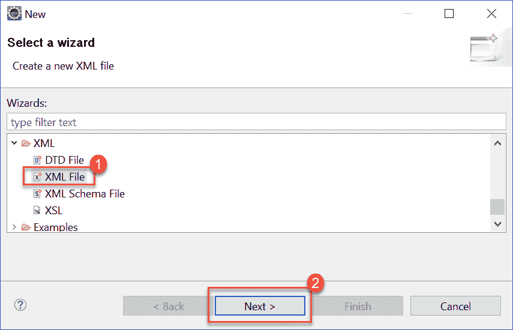

4.  输入有效的 XML 文件名，然后单击“完成”按钮

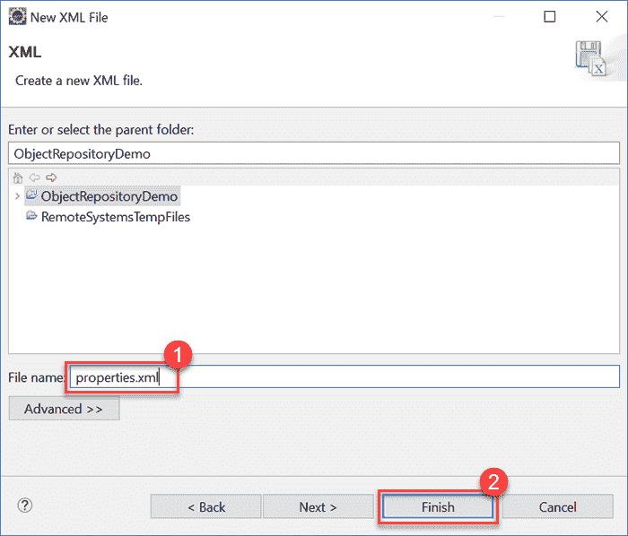

5.  XML 文件将添加到项目文件夹，如下所示

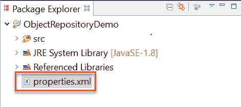

### 步骤 2）将数据存储到 XML 文件中

数据可以以文档对象模型（DOM）的形式存储在 XML 文件中。 为了简单起见，我们可以使用以下测试场景作为示例。

*   单击使用 XPATH 的“移动测试”链接
*   导航回到主页
*   使用 ID 将数据输入电子邮件文本框
*   单击使用 ID 的“注册”按钮

以下是要使用的 XML 文件的格式。

```
<menu>     
      <mobiletesting>//a[text()='MOBILE TESTING']</mobiletesting>  
      <email> philadelphia-field-email</email> 
      <signup> philadelphia-field-submit </signup>     
 </menu>

```

将以上 XML 代码存储在 properties.xml 中

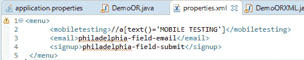

在设计标签中，您将看到

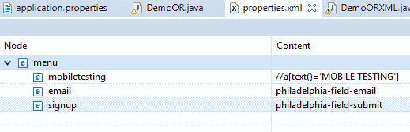

### 步骤 3）从 XML 文件读取数据

1.可以使用 Java 中的内置“ dom4j”类完成从 XML 文件读取数据的操作。 请注意，在继续执行代码之前，需要将以下 JAR 文件添加到项目的 buildpath 中。

*   jaxen.jar
*   dom4j-1.6.jar

2.下面是从 XML 文件读取数据的代码。

```
		File inputFile = new File(System.getProperty("user.dir") +"\\properties.xml");
        SAXReader saxReader = new SAXReader();
        Document document = saxReader.read(inputFile);
        String mobileTesting = document.selectSingleNode("//menu/mobiletesting").getText();
        String emailTextBox = document.selectSingleNode("//menu/email").getText();
        String signUpButton = document.selectSingleNode("//menu/signup").getText();

```

3.最初，我们需要创建一个 File 对象，并将其作为参数传递给 SAXReader 类的“ read”方法。 成功读取 XML 文件数据后，我们可以使用“ selectSingleNode”方法访问 XML 文档的各个节点。

### 步骤 4）在测试脚本中使用 XML 文件

通过从 XML 文件读取数据并将数据作为参数传递给 findElement 方法，可以在测试脚本中使用 XML 文件。 以下代码演示了在测试脚本中从 XML 文件读取的数据的用法。

```
driver.findElement(By.xpath(mobileTesting)).click();
driver.findElement(By.id(emailTextBox)).sendKeys("This email address is being protected from spambots. You need JavaScript enabled to view it.");
driver.findElement(By.id(signUpButton)).click();

```

以下代码演示了 Selenium WebDriver 中 XML 文件的使用

```
package com.objectrepository.demo;		
import java.io.*;		
import java.util.*;		
import org.dom4j.*;		
import org.dom4j.io.SAXReader;		
import org.openqa.selenium.By;		
import org.openqa.selenium.WebDriver;		
import org.openqa.selenium.chrome.ChromeDriver;		

public class DemoORXML {				

public static void main(String[] args) throws DocumentException {										
// Creating WebDriver Instance		
    WebDriver driver;			
    System.setProperty("webdriver.chrome.driver","G:\\chromedriver.exe");					
    driver = new ChromeDriver();					
    driver.get("http://demo.guru99.com/test/guru99home/");					
    driver.manage().window().maximize();			
// Reading XML File    		
    File inputFile = new File(System.getProperty("user.dir") +"\\properties.xml");									
    SAXReader saxReader = new SAXReader();					
    Document document = saxReader.read(inputFile);							
    String mobileTesting = document.selectSingleNode("//menu/mobiletesting").getText();							
    String emailTextBox = document.selectSingleNode("//menu/email").getText();							
    String signUpButton = document.selectSingleNode("//menu/signup").getText();							

//Navigating to Mobile Testing and back		
    driver.findElement(By.xpath(mobileTesting)).click();					
    driver.navigate().back();			
//Entering Form Data		
driver.findElement(By.id(emailTextBox)).sendKeys("This email address is being protected from spambots. You need JavaScript enabled to view it.");						
driver.findElement(By.id(signUpButton)).click();				

	}		
}		

```

[下载 WebDriver Eclipse 项目](https://drive.google.com/uc?export=download&id=1IweUfq7atfRYYGSVoR6N6o1bO0GtT46w)

## 摘要：

*   对象存储库是所有对象的通用存储位置
*   Selenium WebDriver 默认情况下不提供内置对象存储库
*   您可以在 Selenium 中创建 2 种类型的对象库
    1.  使用属性文件的对象存储库
    2.  使用 XML 文件的对象存储库
*   属性文件是一个文本文件，其中数据以键值对的形式存储
*   XML 文件格式将复制用于构建网页的 HTML 格式。