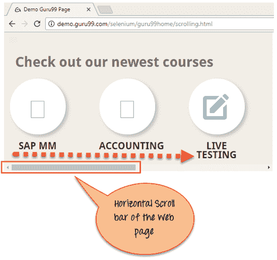
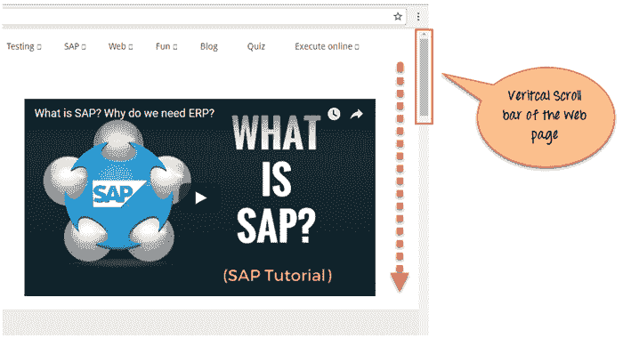
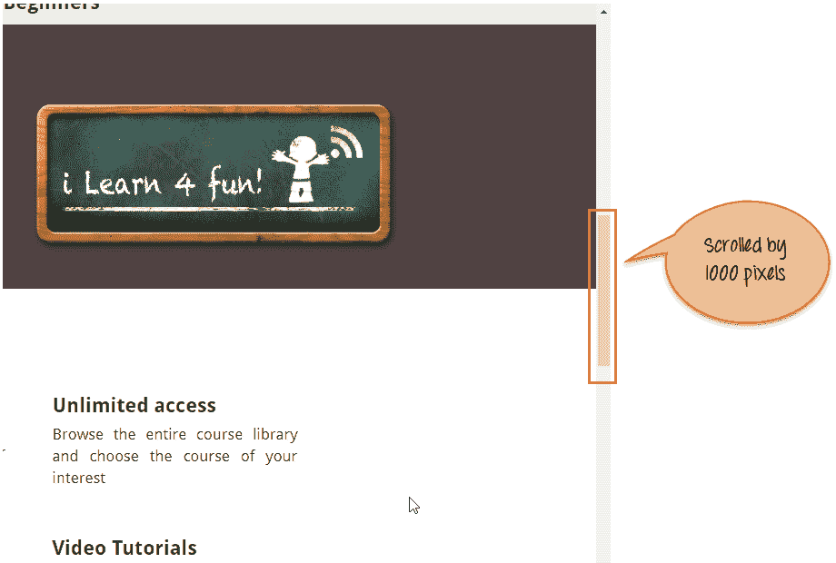
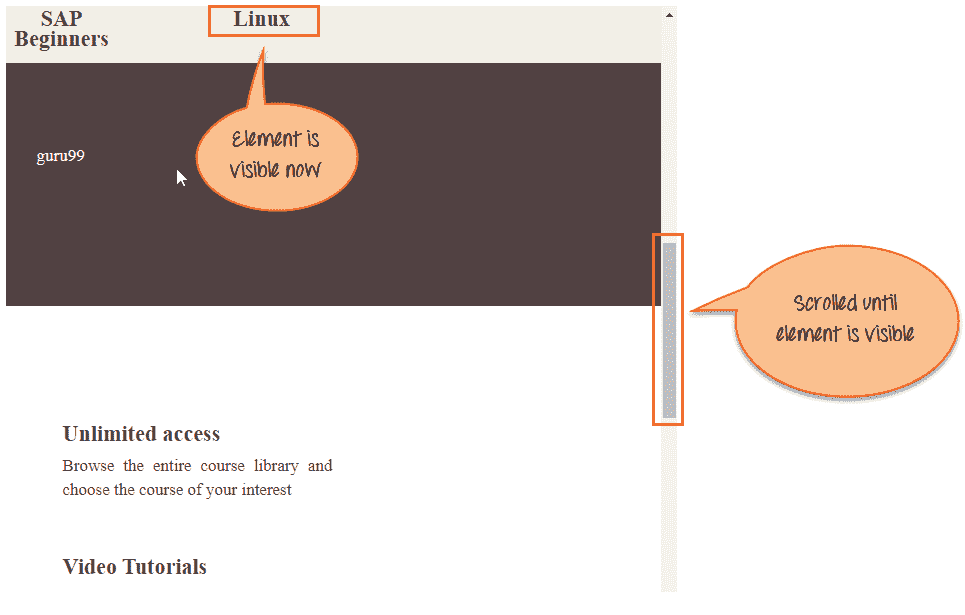
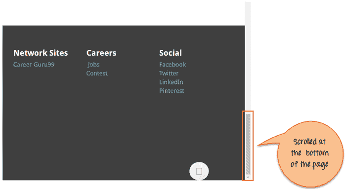
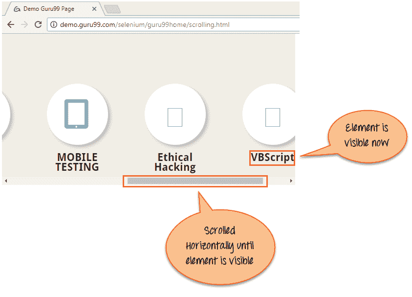

# 如何在 Selenium Webdriver 中向下滚动或向上滚动页面

> 原文： [https://www.guru99.com/scroll-up-down-selenium-webdriver.html](https://www.guru99.com/scroll-up-down-selenium-webdriver.html)

## 什么是滚动条？

如果当前页面滚动不适合屏幕的可见区域，则滚动条可以让您沿水平或垂直方向在屏幕上移动。 它用于上下移动窗口。

Selenium Webdriver 在操纵 DOM 时不需要滚动即可执行操作。 但是在某些网页中，元素只有在用户滚动到它们之后才可见。 在这种情况下，可能需要滚动。

滚动条有两种类型：**水平**和**垂直**滚动条，如下面的屏幕快照所示。





## 滚动硒

要使用 Selenium 滚动，可以使用 JavaScriptExecutor 界面，该界面可帮助通过 Selenium Webdriver 执行 JavaScript 方法

进一步了解 [JavaScriptExecutor](/execute-javascript-selenium-webdriver.html)

句法 ：

```
JavascriptExecutor js = (JavascriptExecutor) driver;  
   js.executeScript(Script,Arguments);
```

*   脚本–这是需要执行的 JavaScript。
*   参数–它是脚本的参数。 它是可选的。

**Selenium Script 向下滚动页面**

让我们在以下 3 种情况下使用 selenium webdriver 向下滚动网页：

*   [场景 1：按像素向下滚动网页。](#1)
*   [场景 2：根据元素的可见性向下滚动网页。](#2)
*   [场景 3：向下滚动页面底部的网页。](#3)
*   [场景 4：在网页上水平滚动。](#4)

**方案 1：按像素向下滚动网页。**

**硒脚本**

```
import org.openqa.selenium.JavascriptExecutor;
import org.openqa.selenium.WebDriver;
import org.openqa.selenium.chrome.ChromeDriver;
import org.testng.annotations.Test;

public class ScrollByPixel {

    WebDriver driver;
    @Test
    public void ByPixel() {
        System.setProperty("webdriver.chrome.driver", "E://Selenium//Selenium_Jars//chromedriver.exe");
        driver = new ChromeDriver();

        JavascriptExecutor js = (JavascriptExecutor) driver;

        // Launch the application		
        driver.get("http://demo.guru99.com/test/guru99home/");

        //To maximize the window. This code may not work with Selenium 3 jars. If script fails you can remove the line below		
        driver.manage().window().maximize();

        // This  will scroll down the page by  1000 pixel vertical		
        js.executeScript("window.scrollBy(0,1000)");
    }
}

```

**脚本描述**：在上面的代码中，我们首先在 Chrome 浏览器中启动给定的 URL。 接下来，通过 executeScript 将页面滚动 1000 像素。 Javascript 方法 ScrollBy（）将网页滚动到特定的像素数。

ScrollBy（）方法的语法为：

```
executeScript("window.scrollBy(x-pixels,y-pixels)");
```

x-pixels 是 x 轴上的数字，如果 number 为正数则向左移动，如果 number 为负数则向右移动.y-pixels 是 y-axis 的数字，如果 number 为 y 则向下移动。 正数，如果数字为负数，则向上移动。

例：

```
js.executeScript("window.scrollBy(0,1000)"); //Scroll vertically down by 1000 pixels		
```

**输出分析：**这是执行上述脚本时的输出。



**方案 2：通过元素的可见性向下滚动网页。**

**Selenium Script**

```
import org.openqa.selenium.By;
import org.openqa.selenium.JavascriptExecutor;
import org.openqa.selenium.WebDriver;
import org.openqa.selenium.WebElement;
import org.openqa.selenium.chrome.ChromeDriver;
import org.testng.annotations.Test;

public class ScrollByVisibleElement {

    WebDriver driver;
    @Test
    public void ByVisibleElement() {
        System.setProperty("webdriver.chrome.driver", "G://chromedriver.exe");
        driver = new ChromeDriver();
        JavascriptExecutor js = (JavascriptExecutor) driver;

        //Launch the application		
        driver.get("http://demo.guru99.com/test/guru99home/");

        //Find element by link text and store in variable "Element"        		
        WebElement Element = driver.findElement(By.linkText("Linux"));

        //This will scroll the page till the element is found		
        js.executeScript("arguments[0].scrollIntoView();", Element);
    }
}

```

**脚本描述：**在上面的代码中，我们首先在 Chrome 浏览器中启动给定的 url。 接下来，滚动页面，直到提到的元素在当前页面上可见。 Javascript 方法 scrollIntoView（）滚动页面，直到提到的元素处于完整视图：

```
js.executeScript("arguments[0].scrollIntoView();",Element );	
```

“ arguments [0]”表示页面的第一个索引，从 0 开始。

其中“ Element”是网页上的定位符。

**Output analysis :** Here is the output when you execute the above script .



**方案 3：向下滚动页面底部的网页。**

**Selenium Script**

```
import org.openqa.selenium.JavascriptExecutor;
import org.openqa.selenium.WebDriver;
import org.openqa.selenium.chrome.ChromeDriver;
import org.testng.annotations.Test;

public class ScrollByPage {

    WebDriver driver;
    @Test
    public void ByPage() {
        System.setProperty("webdriver.chrome.driver", "E://Selenium//Selenium_Jars//chromedriver.exe");
        driver = new ChromeDriver();

        JavascriptExecutor js = (JavascriptExecutor) driver;

        // Launch the application		
        driver.get("http://demo.guru99.com/test/guru99home/");

        //This will scroll the web page till end.		
        js.executeScript("window.scrollTo(0, document.body.scrollHeight)");
    }
}

```

**脚本描述：**在上面的代码中，我们首先在 Chrome 浏览器中启动给定的 url。 接下来，滚动到页面底部。 Javascript 方法 scrollTo（）滚动到页面末尾。

```
js.executeScript("window.scrollTo(0, document.body.scrollHeight)");		
```

“ document.body.scrollHeight”返回正文（即网页）的完整高度。

**输出分析：**这是执行上述脚本时的输出。

[ ](/images/1/120817_0811_ScrollUPorD5.png) 

**方案 4：在网页上水平滚动。**

**Selenium Script**

```
import org.openqa.selenium.By;
import org.openqa.selenium.JavascriptExecutor;
import org.openqa.selenium.WebDriver;
import org.openqa.selenium.WebElement;
import org.openqa.selenium.chrome.ChromeDriver;
import org.testng.annotations.Test;

public class HorizontalScroll {

    WebDriver driver;
    @Test
    public void ScrollHorizontally() {
        System.setProperty("webdriver.chrome.driver", "E://Selenium//Selenium_Jars//chromedriver.exe");
        driver = new ChromeDriver();

        JavascriptExecutor js = (JavascriptExecutor) driver;

        // Launch the application		
        driver.get("http://demo.guru99.com/test/guru99home/scrolling.html");

        WebElement Element = driver.findElement(By.linkText("VBScript"));

        //This will scroll the page Horizontally till the element is found		
        js.executeScript("arguments[0].scrollIntoView();", Element);
    }
}

```

**脚本描述：**在上面的代码中，我们首先在 Chrome 浏览器中启动给定的 url。 接下来，水平滚动页面，直到提到的元素在当前页面上可见。 Javascript 方法 scrollIntoView（）滚动页面，直到提到的元素处于完整视图：

```
js.executeScript("arguments[0].scrollIntoView();",Element );
```

**Output analysis:** Here is the output when you execute the above script.



## 摘要

*   在上面的教程中，我们说明了在不同情况下网页的滚动。
*   在第一种情况下，我们逐像素显示了向下滚动。
*   在第二种情况下，我们显示了页面的向下滚动，直到元素可见为止。
*   在第三种情况下，我们在页面底部显示了页面的向下滚动。
*   在第四种情况下，说明了网页上的水平滚动。