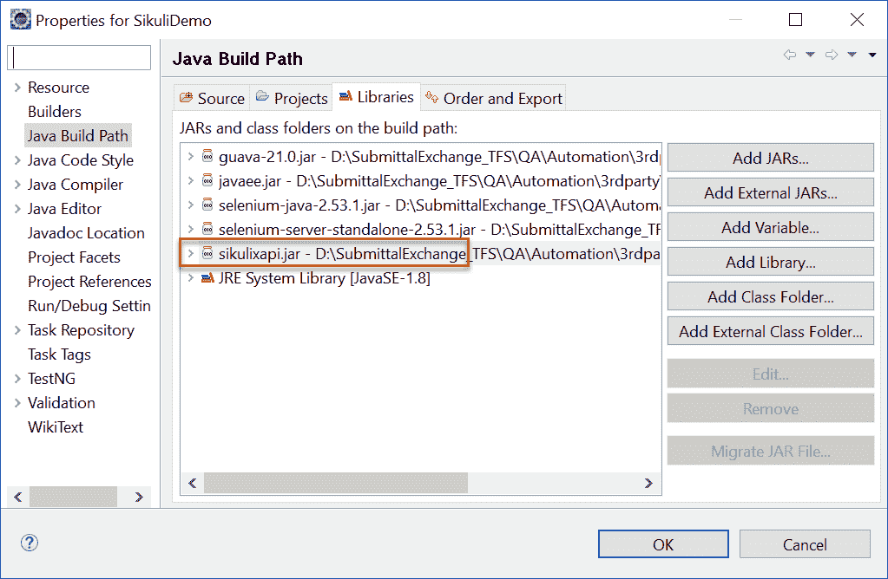
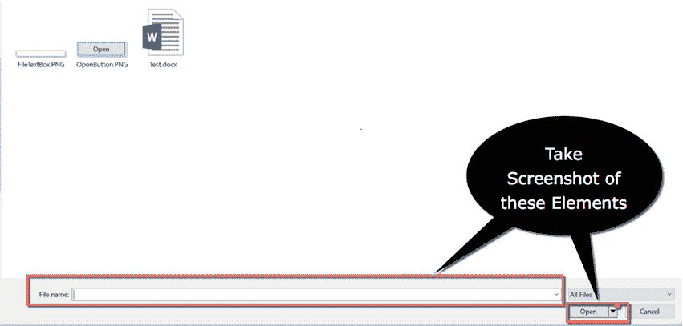
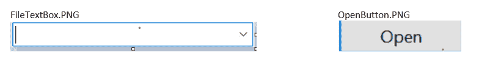
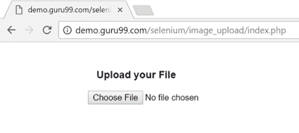
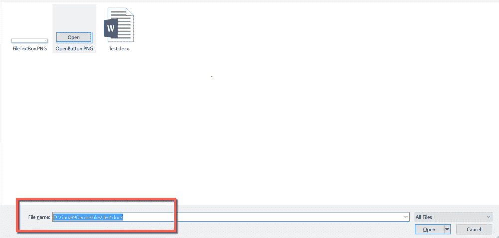

# Sikuli 教程：如何将 Sikuli 与硒一起使用（示例）

> 原文： [https://www.guru99.com/sikuli-tutorial.html](https://www.guru99.com/sikuli-tutorial.html)

## 什么是 Sikuli？

Sikuli 是基于开源 GUI 的自动化工具。 它用于与网页元素进行交互并处理基于窗口的弹出窗口。 它使用“图像识别”技术与网页和窗口弹出窗口的元素进行交互。 Sikuli 将网页的所有元素视为图像，并根据其图像识别这些元素。 当 UI 元素稳定且不会不断变化时，首选 Sikuli。

在本教程中，我们将学习

*   [Sikuli 是什么？](#1)
*   [Sikuli 与硒 webdriver](#2) 集成
*   Sikuli 中的[模式类](#3)
*   [使用 Sikuli](#4) 上传文件的代码示例

## Sikuli 与 Selenium Webdriver 集成

可以使用 Sikuli JAR 文件将 Sikuli 与 Selenium Webdriver 集成。

以下序列是使用 Selenium Webdriver 配置 Sikuli 的步骤列表。

**步骤 1）从下面的 URL 下载** Sikuli JAR 文件。

[https://mvnrepository.com/artifact/com.sikulix/sikulixapi/1.1.0](https://mvnrepository.com/artifact/com.sikulix/sikulixapi/1.1.0)

将 ZIP 文件的内容提取到一个文件夹中。

**步骤 2）**在 Eclipse 中创建一个新的 JAVA 项目，并使用右键单击该项目，连同 JAR 文件一起添加 JAR 文件以构建路径->构建路径->配置构建路径



将 JAR 文件添加到项目构建路径后，即可使用 Sikuli 提供的类。

## 西库里的屏幕课程

屏幕类是 Sikuli 提供的所有方法的基类。 Screen 类包含针对屏幕元素上所有常用操作的预定义方法，例如单击，双击，向文本框提供输入，悬停等。以下是 Screen 类提供的常用方法的列表。

| 方法 | 描述 | 句法 |
| --- | --- | --- |
| 请点击 | 该方法用于使用图像名称作为参数单击屏幕上的元素。 | Screen s = new Screen（）;s.click（“ QA.png”）; |
| 双击 | 此方法用于双击元素。 它接受图像名称作为参数。 | Screen s = new Screen();s.doubleClick（“ QA.png”）; |
| 类型 | 此方法用于向元素提供输入值。 它接受要发送的图像名称和文本作为参数。 | s.type（“ QA.png”，“ TEXT”）; |
| 徘徊 | 此方法用于将鼠标悬停在元素上。 它接受图像名称作为参数。 | s.hover（“ QA.png”）; |
| 找 | 此方法用于在屏幕上查找特定元素。 它接受图像名称作为参数。 | s.find（“ QA.png”）; |

## Sikuli 中的模式类

模式类用于将图像文件与其他属性相关联，以唯一地标识元素。 它以图像的路径为参数。

模式 p =新模式（“图像路径”）；

以下是 Pattern 类的最常用方法。

| 

方法

 | 

描述

 | 

句法

 |
| --- | --- | --- |
| getFileName | 返回 Pattern 对象中包含的文件名。 | 模式 p =新模式（“ D：\ Demo \ QA.png”）;字符串文件名= p.getFileName（）; |
| 类似 | 此方法返回一个相似性设置为指定值的新 Pattern 对象。 它接受 0 到 1 之间的相似度值作为参数。 Sikuli 查找所有在指定相似范围内的元素，并返回一个新的模式对象。 | 模式 p1 = p.similar（0.7f）; |
| 精确 | 此方法返回相似性设置为 1 的新模式对象。它仅查找指定元素的精确匹配。 | 模式 p1 = p.exact（）; |

### 使用 Sikuli 上传文件的代码示例

下面的代码说明了 Sikuli 在 Firefox 中用于文件上传的用法。

```
package com.sikuli.demo;
import org.openqa.selenium.By;
import org.openqa.selenium.WebDriver;
import org.sikuli.script.FindFailed;
import org.sikuli.script.Pattern;
import org.sikuli.script.Screen;
import org.openqa.selenium.chrome.ChromeDriver;

public class SikuliDemo {

    public static void main(String[] args) throws FindFailed {

        System.setProperty("webdriver.chrome.driver", "D:\\chromedriver.exe");
        String filepath = "D:\\Guru99Demo\\Files\\";
        String inputFilePath = "D:\\Guru99Demo\\Files\\";
        Screen s = new Screen();
        Pattern fileInputTextBox = new Pattern(filepath + "FileTextBox.PNG");
        Pattern openButton = new Pattern(filepath + "OpenButton.PNG");
        WebDriver driver;

        // Open Chrome browser    
        driver = new ChromeDriver();
        driver.get("http://demo.guru99.com/test/image_upload/index.php");

        // Click on Browse button and handle windows pop up using Sikuli
        driver.findElement(By.xpath(".//*[@id='photoimg']")).click();
        s.wait(fileInputTextBox, 20);
        s.type(fileInputTextBox, inputFilePath + "Test.docx");
        s.click(openButton);

        // Close the browser
        driver.close();

    }

}

```

**代码说明：**

**步骤 1）**第一条语句涉及为 chrome 设置驱动程序可执行路径。

```
System.setProperty("webdriver.chrome.driver", "D:\\ chromedriver.exe");
```

**步骤 2）**使用屏幕截图工具（例如 Snipping Tool）截取 Windows 弹出窗口“ FileTextBox”和“ Open”按钮的屏幕截图。



这是您的屏幕截图应如下所示：-



Windows 文件输入文本框和打开按钮的图像存储在“ FileTextBox.PNG”和“ OpenButton.PNG”上。

Sikuli 使用图像识别技术来识别屏幕上的元素。 它仅根据图像来查找屏幕上的元素。

示例：如果要自动执行打开记事本的操作，则需要将记事本的桌面图标图像存储到 PNG 文件中并对其执行单击操作。

在我们的情况下，它会识别文件输入文本框，并使用存储的图像在 Windows 弹出窗口上打开按钮。 **如果屏幕分辨率从图像捕获更改为测试脚本执行，则 Sikuli 的行为将不一致。 因此，始终建议以与捕获图像相同的分辨率运行测试脚本。 图像像素大小的更改将导致 Sikuli 引发 FindFailed 异常。**

**步骤 3）**接下来的语句包括为 Screen 和 Pattern 类创建对象。 创建一个新的屏幕对象。 将您要上载的文件的路径设置为参数到 Pattern 对象。

```
Screen s = new Screen();
Pattern fileInputTextBox = new Pattern(filepath + "FileTextBox.PNG");
Pattern openButton = new Pattern(filepath + "OpenButton.PNG");
```

**步骤 4）**以下语句涉及使用 URL 打开 chrome 浏览器： [http://demo.guru99.com/test/image_upload/index.php](http://demo.guru99.com/test/image_upload/index.php)

```
driver = new ChromeDriver();
driver.get("http://demo.guru99.com/test/image_upload/index.php");
```

上面的 URL 是一个演示应用程序，用于演示文件上传功能。

**步骤 5）**使用以下语句单击选择文件按钮

```
driver.findElement(By.xpath(".//*[@id='photoimg']")).click(); 
```

**步骤 6）**等待窗口弹出。 Wait 方法用于处理与单击浏览按钮后弹出窗口相关的延迟。

```
s.wait(fileInputTextBox, 20);
```

**步骤 7）**在输入文件文本框中键入文件路径，然后单击“打开”按钮

```
s.type(fileInputTextBox, inputFilePath + "Test.docx");
s.click(openButton);
```

**步骤 8）**关闭浏览器

```
driver.close();
```

**输出：**

最初，脚本会打开 Chrome 浏览器



单击“选择文件”按钮，将出现 Windows 文件弹出屏幕。 在“文件输入”文本框中输入数据，然后单击“打开”按钮



文件上传完成并关闭浏览器后，将显示以下屏幕


**结论：**

Sikuli 用于轻松处理网页上的 Flash 对象和 Windows 弹出窗口。 当用户界面上的元素不经常更改时，最好使用 Sikuli。 由于这一缺点，从自动化测试的角度来看，与其他框架（例如 Robot 和 AutoIT）相比，Sikuli 的优先级较低。