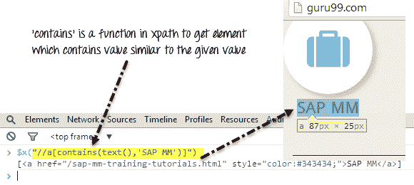
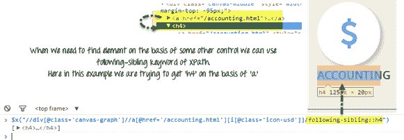
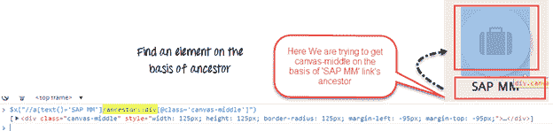
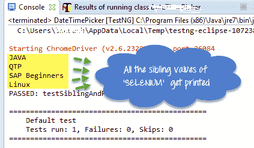
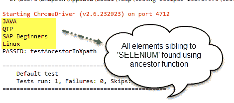
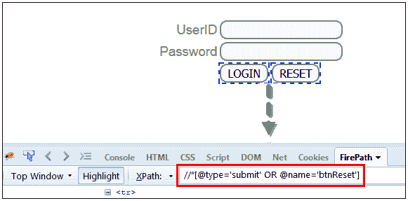
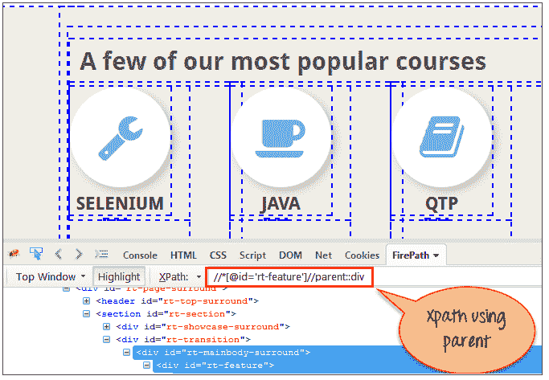
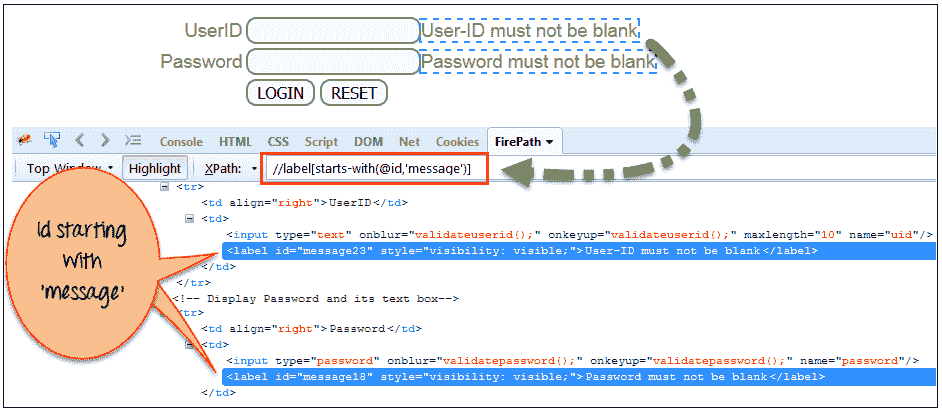
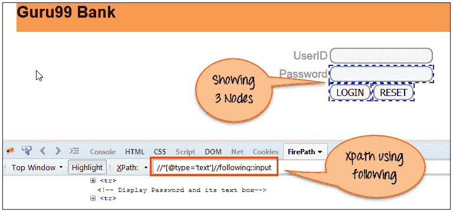
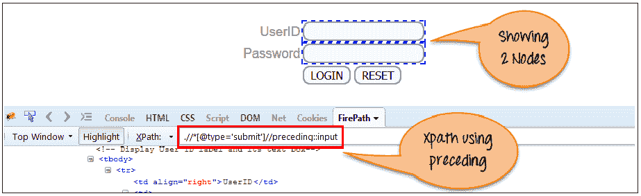

# XPath 在 Selenium Webdriver 中包含，同级，祖先，与或，父级，开头，轴

> 原文： [https://www.guru99.com/using-contains-sbiling-ancestor-to-find-element-in-selenium.html](https://www.guru99.com/using-contains-sbiling-ancestor-to-find-element-in-selenium.html)

如果简单的 [XPath](/xpath-selenium.html) 不能为我们的测试脚本找到复杂的 Web 元素，则需要使用 XPath 1.0 库中的函数。 通过这些功能的组合，我们可以创建更特定的 XPath。 让我们讨论 3 种这样的功能–

1.  [包含](#1)
2.  [兄弟姐妹](#2)
3.  [祖先](#3)
4.  [和或](#4)
5.  [父级](#5)
6.  [以](#6)开头
7.  [XPath 轴](#7)

让我们详细研究它们-

## 包含

通过在 XPath 中使用“包含”功能，我们可以提取与特定文本值匹配的所有元素。

例如 在这里，我们正在搜索锚点，其中包含的文本为“ SAP M”。

```
"//h4/a[contains(text(),'SAP M')]"
```



## 兄弟姐妹

使用同级关键字，我们可以在上获取与其他元素相关的 Web 元素。

示例：在此基于“ a”的同级元素，我们找到“ h4”

```
"//div[@class='canvas- graph']//a[@href='/accounting.html'][i[@class='icon-usd']]/following-sibling::h4"
```



**祖先**：要在父元素的基础上查找元素，我们可以使用 XPath 的祖先属性。



让我们通过一个例子来理解这三个功能–

测试步骤

**注意：**自创建教程以来，Guru99 的主页已更新，因此请使用演示站点来运行测试。

1.  转到 [http://demo.guru99.com/test/guru99home/](http://demo.guru99.com/test/guru99home/)
2.  在“一些最受欢迎的课程”部分中，搜索与文本为“ SELENIUM”的 WebElement 的同级的所有 Web 元素。
3.  我们将使用 contains，祖先和同级函数找到元素


## 使用包含和同级

```
import java.util.List;
import java.util.concurrent.TimeUnit;
import org.openqa.selenium.By;
import org.openqa.selenium.WebDriver;
import org.openqa.selenium.WebElement;
import org.openqa.selenium.firefox.FirefoxDriver;
import org.testng.annotations.Test;

public class SiblingAndParentInXpath {

    @Test

    public void testSiblingAndParentInXpath(){

    	WebDriver driver;
    	String driverPath = "C:\\geckodriver.exe";
    	System.setProperty("webdriver.gecko.driver", driverPath);
        driver = new FirefoxDriver();        

        driver.manage().timeouts().implicitlyWait(10, TimeUnit.SECONDS);
        driver.get("http://demo.guru99.com/test/guru99home/");

        //Search element inside 'Popular course' which are sibling of control 'SELENIUM' ,Here first we will find a h2 whose text is ''A few of our most popular courses' ,then we move to its parent element which is a 'div' , inside this div we will find a link whose text is 'SELENIUM' then at last we will find all of the sibling elements of this link('SELENIUM')

        List <WebElement> dateBox = driver.findElements(By.xpath("//h2[contains(text(),'A few of our most popular courses')]/parent::div//div[//a[text()='SELENIUM']]/following-sibling::div[@class='rt-grid-2 rt-omega']"));

        //Print all the which are sibling of the the element named as 'SELENIUM' in 'Popular course'
        for (WebElement webElement : dateBox) {
            System.out.println(webElement.getText());
        }     

        driver.close();
    }
}

```

输出将如下所示：



## 祖先功能

我们也可以借助“祖先”功能实现相同的功能。

现在，假设我们需要在文本为“ SELENIUM”的锚的祖先的帮助下搜索“热门课程”部分中的所有元素

在这里，我们的 xpath 查询将像

```
"//div[.//a[text()='SELENIUM']]/ancestor::div[@class='rt-grid-2 rt-omega']/following-sibling::div"
```

### 完整的代码

```
import java.util.List;
import java.util.concurrent.TimeUnit;
import org.openqa.selenium.By;
import org.openqa.selenium.Keys;
import org.openqa.selenium.WebDriver;
import org.openqa.selenium.WebElement;
import org.openqa.selenium.firefox.FirefoxDriver;
import org.testng.annotations.Test;

public class AncestorInXpath{

@Test

    public void testAncestorInXpath(){

        WebDriver driver = new FirefoxDriver();             
		driver.manage().timeouts().implicitlyWait(10, TimeUnit.SECONDS);
        driver.get("http://demo.guru99.com/test/guru99home/");

        //Search All elements in 'Popular course' section 
		//with the help of ancestor of the anchor whose text is 'SELENIUM'

        List <WebElement> dateBox = driver.findElements(By.xpath("//div[.//a[text()='SELENIUM']]/ancestor::div[@class='rt-grid-2 rt-omega']/following-sibling::div"));

        //Print all the which are sibling of the element named as 'SELENIUM' in 'Popular course'

        for (WebElement webElement : dateBox) {
            System.out.println(webElement.getText());
        }

        driver.quit();
    }
}

```

输出看起来像-



## 使用 AND 和 OR

通过使用 AND 和 OR，可以在我们的 XPath 表达式中放入 2 个条件。

*   如果 AND 为 2，则两个条件均应为 true，则只有找到条件的元素。
*   如果为 OR，则两个条件中的任何一个都应为 true，然后只有它才能找到该元素。

在这里，我们的 XPath 查询将像

```
Xpath=//*[@type='submit' OR @name='btnReset']
```

```
Xpath=//input[@type='submit' and @name='btnLogin']
```



测试步骤：

1.  转到 [http://demo.guru99.com/v1/](http://demo.guru99.com/v1/)
2.  在本节中，将使用上面的演示站点来搜索具有 XPath 不同功能的元素。

您将找到使用 AND 和 OR，父代，始于和 XPath 轴的元素

### AND OR 范例

```
import org.openqa.selenium.By;
import org.openqa.selenium.WebDriver;
import org.openqa.selenium.WebElement;
import org.openqa.selenium.chrome.ChromeDriver;

public class AND_OR {

	public static void main(String[] args) {
		WebDriver driver;
		WebElement w,x;
		System.setProperty("webdriver.chrome.driver","E://Selenium//Selenium_Jars//chromedriver.exe");
		 driver= new ChromeDriver();

         // Launch the application
     	 driver.get("https://www.guru99.com/");

     	//Search element using OR in the xpath
     	 w=driver.findElement(By.xpath("//*[@type='submit' OR @name='btnReset']"));

     	 //Print the text of the element
			System.out.println(w.getText());

		//Search element using AND in the xpath
			x=driver.findElement(By.xpath("//input[@type='submit' and @name='btnLogin']"));	

		//Print the text of the searched element
			System.out.println(x.getText());

	//Close the browser
     driver.quit();
	}

}

```

## 父级

通过使用父级，您可以在网页中找到当前节点的父级节点。

Here our XPath query will be like

```
Xpath=//*[@id='rt-feature']//parent::div
```



```
import org.openqa.selenium.By;
import org.openqa.selenium.WebDriver;
import org.openqa.selenium.WebElement;
import org.openqa.selenium.chrome.ChromeDriver;

public class Parent {

	public static void main(String[] args) {
		WebDriver driver;
		WebElement w;

		System.setProperty("webdriver.chrome.driver","E://Selenium//Selenium_Jars//chromedriver.exe");
		 driver= new ChromeDriver();

         // Launch the application
     	 driver.get("https://www.guru99.com/");

     	 //Search the element by using PARENT
     	 w=driver.findElement(By.xpath("//*[@id='rt-feature']//parent::div"));

		//Print the text of the searched element
     	 System.out.println(w.getText());

	//Close the browser
     driver.quit();

	}

}

```

## 开头为

使用 Starts-with 函数，您可以找到其属性在刷新或其他操作（例如单击，提交等）时动态变化的元素。

Here our XPath query will be like

```
Xpath=//label[starts-with(@id,'message')]
```

[ ](/images/1/081319_1305_XPathContai9.png) 

```
import org.openqa.selenium.By;
import org.openqa.selenium.WebDriver;
import org.openqa.selenium.WebElement;
import org.openqa.selenium.chrome.ChromeDriver;

public class StartsWith {

	public static void main(String[] args) {
		WebDriver driver;
		WebElement w;

		System.setProperty("webdriver.chrome.driver","E://Selenium//Selenium_Jars//chromedriver.exe");
		 driver= new ChromeDriver();

         // Launch the application
     	 driver.get("https://www.guru99.com/");

     	 //Search the element by using starts-with
     	 w=driver.findElement(By.xpath("//label[starts-with(@id,'message')]"));

     	 //Print the text of the searched element
     	System.out.println(w.getText());

     	//Close the browser
	        driver.quit();
	}

}

```

## Xpath 轴

通过使用 XPath 轴，您可以在网页上找到动态且非常复杂的元素。 XPath 轴包含几种查找元素的方法。 在这里，将讨论几种方法。

之后的**：此函数将返回特定组件的直接元素。**

Here our XPath query will be like

```
Xpath=//*[@type='text']//following::input
```



```
import org.openqa.selenium.By;
import org.openqa.selenium.WebDriver;
import org.openqa.selenium.WebElement;
import org.openqa.selenium.chrome.ChromeDriver;

public class Following {

	public static void main(String[] args) {
		WebDriver driver;
		WebElement w;

		System.setProperty("webdriver.chrome.driver","E://Selenium//Selenium_Jars//chromedriver.exe");
		 driver= new ChromeDriver();

         // Launch the application
     	 driver.get("https://www.guru99.com/");

     	 //Search the element by using Following method
     	 w=driver.findElement(By.xpath("//*[@type='text']//following::input"));

		//Print the text of the searched element
     	 System.out.println(w.getText());

	//Close the browser
     driver.quit();
	}

}

```

**前面的内容：**此函数将返回特定元素的前面的元素。

Here our XPath query will be like

```
Xpath= //*[@type='submit']//preceding::input
```



```
import org.openqa.selenium.By;
import org.openqa.selenium.WebDriver;
import org.openqa.selenium.WebElement;
import org.openqa.selenium.chrome.ChromeDriver;

public class Preceding {

	public static void main(String[] args) {

		WebDriver driver;
		WebElement w;

		System.setProperty("webdriver.chrome.driver","E://Selenium//Selenium_Jars//chromedriver.exe");
		 driver= new ChromeDriver();

         // Launch the application
     	 driver.get("https://www.guru99.com/");

     	 //Search the element by using preceding method
     	 w=driver.findElement(By.xpath("//*[@type='submit']//preceding::input"));

		//Print the searched element
     	 System.out.println(w.getText());

	//Close the browser
     driver.quit();

	}

}

```

d）**后代：**此函数将返回特定元素的后代元素。

Here our XPath query will be like

```
Xpath= //*[@id='rt-feature']//descendant::a
```


```
import org.openqa.selenium.By;
import org.openqa.selenium.WebDriver;
import org.openqa.selenium.WebElement;
import org.openqa.selenium.chrome.ChromeDriver;

public class Descendant {

	public static void main(String[] args) {
		WebDriver driver;
		WebElement w;
		System.setProperty("webdriver.chrome.driver","E://Selenium//Selenium_Jars//chromedriver.exe");
		 driver= new ChromeDriver();

         // Launch the application
     	 driver.get("https://www.guru99.com/");

     	 //Search the element by using descendant method
     	 w=driver.findElement(By.xpath("//*[@id='rt-feature']//descendant::a"));

		//Print the searched element
     	 System.out.println(w.getText());

	//Close the browser
     driver.quit();

	}

}

```

### 摘要

*   在某些情况下，无法使用常规 XPath 查找元素。 在这种情况下，我们需要与 xpath 查询不同的功能。
*   这里有一些重要的 XPath 函数，例如 contains，parent，祖先，following-sibling 等。
*   借助这些功能，您可以创建复杂的 XPath 表达式。