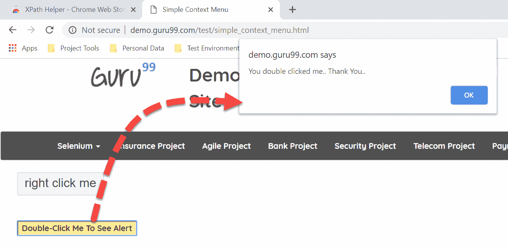
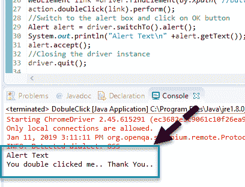
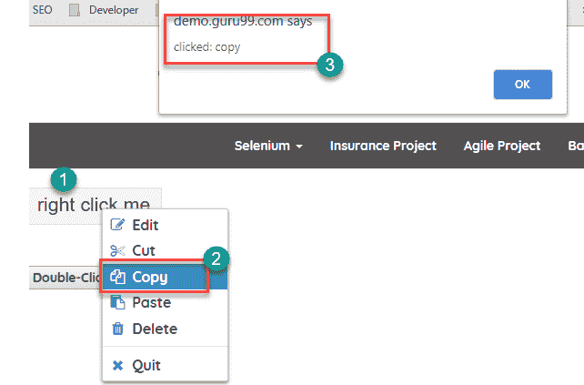

# 双击并右键单击 Selenium 中的示例

> 原文： [https://www.guru99.com/double-click-and-right-click-selenium.html](https://www.guru99.com/double-click-and-right-click-selenium.html)

## 双击硒

可以使用 Actions 类在 Selenium Web 驱动程序中双击动作。 Actions 类是 Selenium Web 驱动程序中的预定义类，用于执行多个键盘和鼠标操作，如右键单击，拖放等。

使用 Actions 类双击 Selenium

```
Actions actions = new Actions(driver);
WebElement elementLocator = driver.findElement(By.id("ID"));
actions.doubleClick(elementLocator).perform();

```

*   最初，我们需要通过将驱动程序实例作为参数传递来实例化 Actions 类的对象
*   使用 find element 命令，我们需要找到要双击的元素的定位符
*   使用 Actions 类的预定义双击方法，我们需要在 Web 元素上执行双击操作

## 右键单击 Selenium

可以使用 Actions 类在 Selenium Web 驱动程序中右键单击动作。 右键单击操作在 Selenium 中也称为“上下文单击”。 Actions 类提供的预定义方法上下文单击用于执行右键单击操作。 下面的代码演示了使用 Actions 类的右键单击操作。

```
Actions actions = new Actions(driver);
WebElement elementLocator = driver.findElement(By.id("ID"));
actions.contextClick(elementLocator).perform();

```

## 双击示例

**测试场景**

*   启动 URL： [http://demo.guru99.com/test/simple_context_menu.html](http://demo.guru99.com/test/simple_context_menu.html)
*   双击标有“双击我以查看警报”的按钮
*   单击显示的警报上的 OK 按钮。

**代码：**

```
package test;
import org.openqa.selenium.By;
import org.openqa.selenium.WebDriver;
import org.openqa.selenium.WebElement;
import org.openqa.selenium.chrome.ChromeDriver;
import org.openqa.selenium.interactions.Actions;
import org.openqa.selenium.Alert;

public class DobuleClickDemo {
public static void main(String[] args) throws InterruptedException {

	WebDriver driver;
	System.setProperty("webdriver.chrome.driver","X://chromedriver.exe");
	 driver= new ChromeDriver();

//Launch the Application Under Test (AUT)
driver.get("http://demo.guru99.com/test/simple_context_menu.html");
driver.manage().window().maximize();

driver.get("http://demo.guru99.com/test/simple_context_menu.html");
driver.manage().window().maximize();
//Double click the button to launch an alertbox
Actions action = new Actions(driver);
WebElement link =driver.findElement(By.xpath("//button[text()='Double-Click Me To See Alert']"));
action.doubleClick(link).perform();
//Switch to the alert box and click on OK button
Alert alert = driver.switchTo().alert();
System.out.println("Alert Text\n" +alert.getText());
alert.accept();
//Closing the driver instance
//driver.quit();

}
}

```

**结果：**

单击标有“双击我以查看警报”的按钮，并显示弹出窗口



在 Eclipse 中，您会在控制台中看到输出



## 右键单击示例

**测试方案：**

1.  启动 URL： [http://demo.guru99.com/test/simple_context_menu.html](http://demo.guru99.com/test/simple_context_menu.html)
2.  在按钮上执行右键单击操作：右键单击我
3.  单击显示的右键单击列表上的“编辑”链接
4.  在显示的警报上单击确定按钮
5.  关闭浏览器

**Code:**

```
package test;
import org.openqa.selenium.By;
import org.openqa.selenium.WebDriver;
import org.openqa.selenium.WebElement;
import org.openqa.selenium.chrome.ChromeDriver;
import org.openqa.selenium.interactions.Actions;

public class ContextClick {
public static void main(String[] args) throws InterruptedException {

	WebDriver driver;
	System.setProperty("webdriver.chrome.driver","X://chromedriver.exe");
	 driver= new ChromeDriver();

//Launch the Application Under Test (AUT)
driver.get("http://demo.guru99.com/test/simple_context_menu.html");
driver.manage().window().maximize();

// Right click the button to launch right click menu options
Actions action = new Actions(driver);

WebElement link = driver.findElement(By.cssSelector(".context-menu-one"));
action.contextClick(link).perform();
// Click on Edit link on the displayed menu options
WebElement element = driver.findElement(By.cssSelector(".context-menu-icon-copy"));
element.click();
// Accept the alert displayed
//driver.switchTo().alert().accept();
// Closing the driver instance
//driver.quit();

}
}

```

**Result:**

[ ](/images/1/011119_1109_Doubleclick3.png) 

## 摘要：

*   Selenium 中的 Actions 类主要用于执行复杂的键盘和鼠标操作。 因此，与 Javascript 相比，Actions 类在执行 Selenium 中的右键单击和双击之类的操作时更为可取。
*   在元素上单击鼠标右键以打开新菜单时，通常使用鼠标右键操作。 可以使用预定义的命令在 Selenium Web 驱动程序中进行右键单击操作。上下文单击，如下所述

    ```
    Actions action = new Actions(driver);
    WebElement link = driver.findElement(By.ID ("Element ID"));
    action.contextClick(link).perform();

    ```

*   双击操作后 Web 元素的状态更改时，将使用双击操作。 Selenium Web 驱动程序中的双击操作可以使用预定义的命令双击完成，如下所述

    ```
    Actions action = new Actions(driver);
    WebElement link = driver.findElement(By.ID ("Element ID"));
    action. doubleClick (link).perform();

    ```