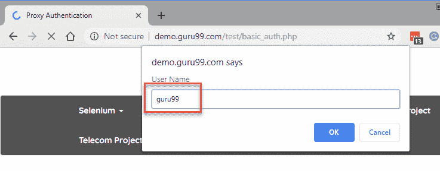
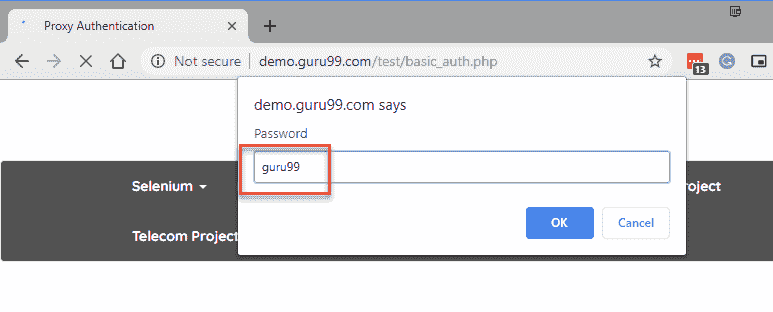

# 使用带有示例的 Webdriver 的 Selenium 代理身份验证

> 原文： [https://www.guru99.com/selenium-proxy-authentication.html](https://www.guru99.com/selenium-proxy-authentication.html)

## 什么是代理？

代理充当客户端发送请求和服务器响应之间的中介。 代理的主要用途是维护多个交互式系统之间的隐私和封装。

代理还可以充当客户端和 Web 服务器之间的防火墙，从而在 Web 上增加另一层安全性。 当必须根据网站内容将客户使用的网站标记为允许或阻止时，尤其可以使用此功能。

此过程称为“内容过滤”，最常用于教育机构，公司办公室等。借助代理可以轻松完成内容过滤。

就 Internet 而言，代理可以实现为单独的服务器，位于客户端计算机与实际的 Web 或数据库服务器之间进行响应。

在本教程中，您将学习

*   [什么是代理？](#1)
*   [SOCKS 和 HTTP 代理](#2)之间的区别
*   [2 在 Chrome 中使用 Selenium 进行 HTTP 代理身份验证的方法](#3)
*   [使用 AutoIT 工具](#4)
*   [使用警报](#5)

## SOCKS 和 HTTP 代理之间的区别

| 袜子 | HTTP 代理 |
| SOCKS 代表固定插座。 通常用作客户端和服务器之间的防火墙 | HTTP 代理也可以用作客户端和服务器之间的防火墙，但只能用于 HTTP 请求 |
| SOCKS 不解释正在交换的数据 | HTTP 代理解释客户端和服务器之间正在交换的数据 |
| 性能方面较慢 | 与袜子相比性能更好 |

## 2 在 Chrome 中使用 Selenium 进行 HTTP 代理身份验证的方法

可以使用以下方法在 Chrome 中使用 Selenium 进行 HTTP 代理身份验证

*   使用 AutoIT 工具
*   使用警报

## 使用 AutoIT 工具

Auto IT 是用于 Windows 桌面自动化的第三方工具。 由于 Selenium 仅处理基于 Web 的弹出窗口和窗口，因此无法使用 Selenium 处理操作系统控件。

这要求使用外部第三方工具（例如 Auto IT）与 Selenium 集成。 因此，Auto IT 最常用于处理网站上的文件上传和文件下载。

要使用 AutoIT，您需要在我们的本地计算机上下载并安装 AutoIT 软件。

[文章](https://www.guru99.com/use-autoit-selenium.html)中介绍了下载 AutoIT 的安装。

打开程序– Autoit 工具– SciTE 脚本编辑器，然后在 Autoit 编辑器中添加以下提到的 AutoIt 脚本，并将其另存为系统中的“ ProxyAuthentication.au3”

编译文件并将其转换为“ ProxyAuthentication.exe”。

在 Eclipse 中，将 Auto IT 文件添加到 Selenium Script 中并运行

以下是用于 HTTP 代理身份验证的 AutoIT 脚本

```
Send("guru99{ENTER}")
Send("guru99{ENTER}")

```

您需要使用以下代码传递自动 IT 文件以在 Selenium Webdriver 上执行

**源代码：**

```
package Guru99Demo;
import java.io.IOException;
import org.openqa.selenium.WebDriver;
import org.openqa.selenium.chrome.ChromeDriver;
public class AutoITDemo {
    public static void main(String[] args) throws IOException {
        System.setProperty("webdriver.chrome.driver", "D:\\ chromedriver.exe");;
        WebDriver driver = new ChromeDriver();
        driver.get("http://demo.guru99.com/test/basic_auth.php");
        //Passing the AutoIt Script to Selenium	
        Runtime.getRuntime().exec("D:\\Data_Personal\\ProxyAuthentication.exe");
    }
}

```

**代码说明：**

*   第一步，您正在通过设置系统属性以指向 chromedriver.exe 文件来初始化 Chrome 驱动程序的实例
*   在第二步中，您将初始化 Web 驱动程序的对象，并使用 get 方法传递网站 URL。
*   最后，您使用 AutoIT 脚本文件将用户名和密码传递给 HTTP 代理身份验证弹出窗口

**代码输出：**

<center>

<figure>

<figcaption style="display: table;">Username Alert Handling Using AutoIT</figcaption>

</figure>

</center>

<center>

<figure>

<figcaption style="display: table;">Password Alert Handling Using AutoIT</figcaption>

</figure>

</center>

<center>

<figure>

<figcaption style="display: table;">Proxy Authentication Success Screen</figcaption>

</figure>

</center>

## 使用警报

警报是 Selenium Web 驱动程序提供的简单的内置功能。 您可以使用 Selenium Web 驱动程序来处理代理身份验证弹出窗口，方法是切换到 HTTP 代理身份验证警报并将用户名和密码直接传递给警报。 借助发送密钥方法。

**范例**：

测试场景：

使用 Selenium Web 驱动程序中的警报处理网站上的 HTTP 代理身份验证弹出窗口： [http://demo.guru99.com/test/basic_auth.php](http://demo.guru99.com/test/basic_auth.php) 。

源代码示例：

```
package Guru99Demo;
import java.io.IOException;
import org.openqa.selenium.WebDriver;
import org.openqa.selenium.chrome.ChromeDriver;
public class AlertsDemo {
    public static void main(String args[]) throws IOException {
        System.setProperty("webdriver.chrome.driver", "D:\\Data_Personal\\Software\\chromedriver_win32\\chromedriver.exe");;
        WebDriver driver = new ChromeDriver();
        driver.get("http://demo.guru99.com/test/basic_auth.php");
        // Handling Username alert
        driver.switchTo().alert().sendKeys("guru99");
        driver.switchTo().alert().accept();
        // Handling Password alert
        driver.switchTo().alert().sendKeys("guru99");
        driver.switchTo().alert().accept();
    }
}

```

**Code Output:**

代理身份验证成功完成。

### 代码说明：

*   最初，您通过设置 webdriver 属性以指向 chromedriver.exe 文件的位置来实例化 Chrome 驱动程序的实例
*   然后，通过将 URL 作为参数传递给 driver.get（）方法来打开所需网站的 URL。
*   打开 URL 后，您将切换到用户名警报并发送用户名– guru99。 然后，您使用 alert.accept 方法在警报上单击“确定”按钮。
*   然后，您将切换到密码警报并发送密码– guru99。 然后，您使用 alert.accept 方法在警报上单击“确定”按钮。

### 摘要

*   代理充当客户端发送请求和服务器响应之间的中介。 代理的基本用途是维护多个交互式系统之间的隐私和封装。
*   可以使用以下方法在 Chrome 中使用 Selenium 进行 HTTP 代理身份验证
*   在网站 URL 中传递用户名和密码
*   使用 AutoIT 工具
*   使用警报
*   在以上三种方法中，使用警报是在 Selenium Webdriver 中处理 HTTP 代理身份验证的最有效方法