# 如何下载&为 Firefox 安装 Selenium IDE

> 原文： [https://www.guru99.com/install-selenuim-ide.html](https://www.guru99.com/install-selenuim-ide.html)

### Selenium IDE 的安装

你需要什么

*   火狐浏览器
*   活动的互联网连接

如果尚未安装 Mozilla Firefox，则可以从 [http://www.mozilla.org/en-US/firefox/new](http://www.mozilla.org/en-US/firefox/new) 下载。

**步骤 1）**启动 Firefox 并导航至 [https://addons.mozilla.org/en-US/firefox/addon/selenium-ide/](https://addons.mozilla.org/en-US/firefox/addon/selenium-ide/) 。 点击添加到 Firefox

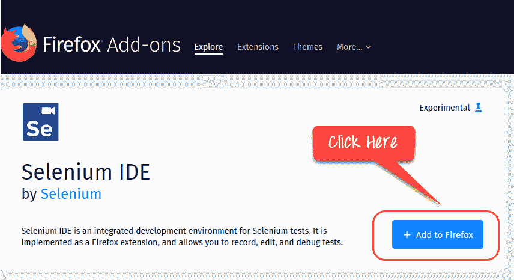

**步骤 2）**等待 Firefox 完成下载，然后单击“ **添加。**”

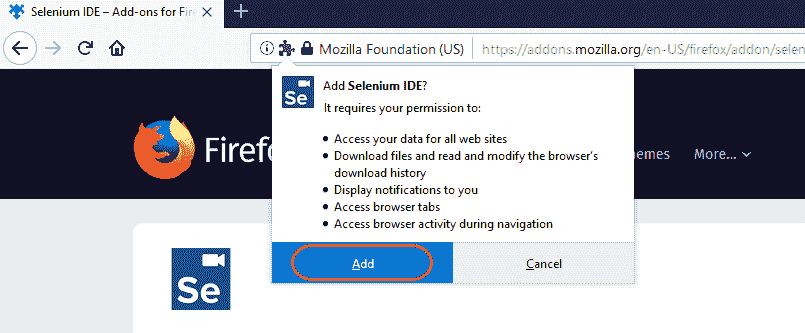

**步骤 3）**安装完成后，您将收到确认消息。 点击**“确定”**

[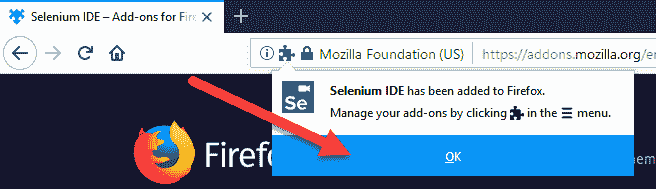 ](/images/1/073118_0611_Installatio3.png) 

**步骤 4）**单击 Selenium IDE 图标

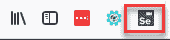

Selenium IDE 将打开

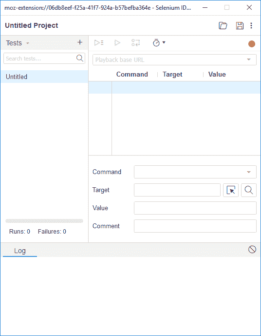

## **Firefox 中的 Firefox DevTools**

Firefox DevTools 是 Firefox 功能，我们将使用它来**检查被测 Web 应用程序的 HTML 元素**。 它将为我们提供我们的 Selenese 命令将要执行的元素的名称。

**步骤 1）**右键单击页面上的任意位置，然后选择检查元素。 您也可以使用快捷键 Cntrl + Shift + I

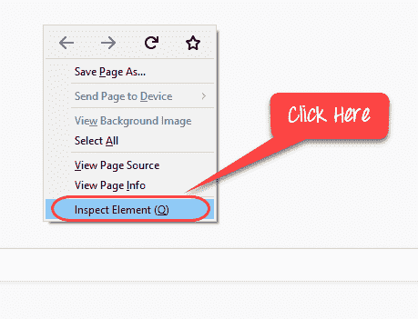

**步骤 2）**您将看到界面

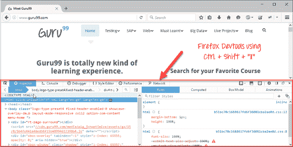

**步骤 3）**可以右键单击元素，然后选择 CSS 或 XPath。 这在对象识别中很有用

[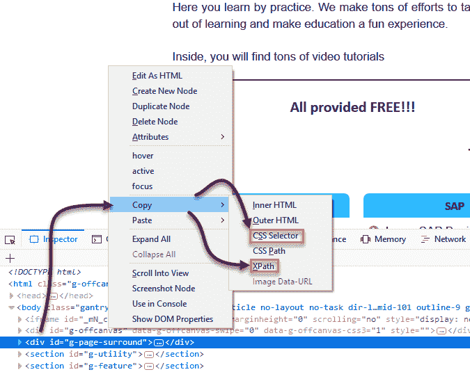 ](/images/1/073118_0611_Installatio8.png) 

注意：同样，您也可以在 Chrome 中使用开发人员工具来识别对象属性

[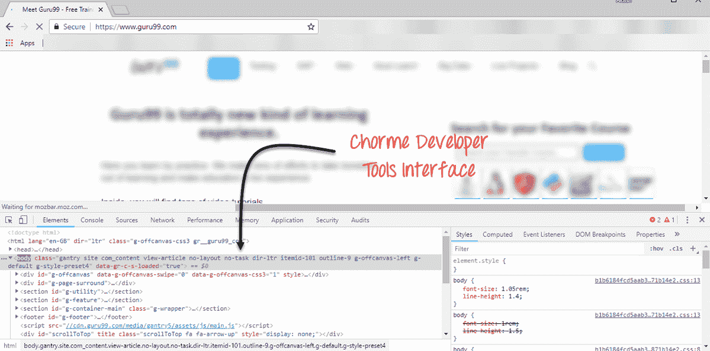 ](/images/1/073118_0611_Installatio9.png) 

Selenium IDE 已弃用，并且开发已停止。 直到最近该项目才复活。 与不推荐使用的 IDE 相比，新的 Selenium 缺少许多功能。 功能正在添加，但是速度较慢。 要探索 Selenium IDE 的所有功能，建议您使用旧版本。 使用旧版本的 IDE

步骤 1）使用 Firefox 54 便携式版本在此处选中

步骤 2）访问 Selenium IDE 版本 [https://addons.mozilla.org/en-US/firefox/addon/selenium-ide/versions/](https://addons.mozilla.org/en-US/firefox/addon/selenium-ide/versions/) 并安装

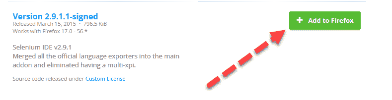

以下功能可能在最新的 IDE 版本中不可用。 随着新版本的更新，我们将继续更新教程。

**插件**

**Selenium IDE 可以支持其他用户**创建的其他 Firefox 附加组件或插件。 您可以在处访问[，以获取迄今为止可用的 Selenium 附加组件列表。 就像安装其他 Firefox 附加组件一样安装它们。](https://addons.mozilla.org/en-US/firefox/addon/selenium-ide/)

默认情况下，Selenium IDE 附带了 4 个插件：

1\. Selenium IDE： [C＃](/c-sharp-tutorial.html)格式化程序

2\. Selenium IDE： [Java](/java-tutorial.html) 格式化程序

3\. Selenium IDE： [Python](/python-tutorials.html) 格式化程序

4\. Selenium IDE：Ruby 格式化程序

Selenium IDE 需要这四个插件才能将 Selenese 转换为不同的格式。

**插件选项卡显示所有已安装插件的列表，以及每个插件的版本号和名称。**

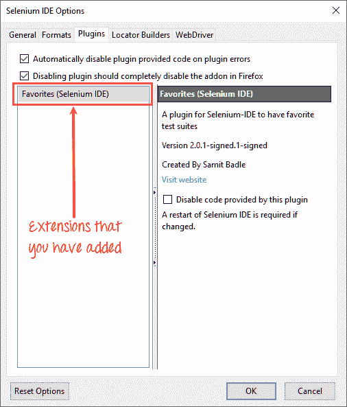

**用户扩展**

Selenium IDE 可以支持用户扩展以提供高级功能。 用户扩展名采用 JavaScript 文件的形式。 您可以通过在“选项”对话框的这两个字段之一中指定它们的绝对路径来安装它们。

*   Selenium Core 扩展（user-extensions.js）
*   Selenium IDE 扩展

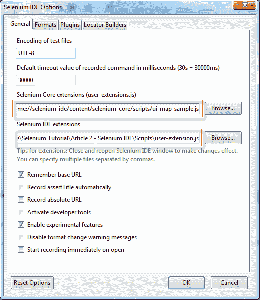

您将可以在此处找到大量的用户扩展[。](https://www.selenium.dev/downloads/)