# Selenium IDE 初学者教程

> 原文： [https://www.guru99.com/introduction-selenuim-ide.html](https://www.guru99.com/introduction-selenuim-ide.html)

### 什么是 Selenium IDE？

Selenium IDE（集成开发环境）是 Selenium Suite 中最简单的工具。 它是 Firefox 附加组件，可通过其记录和播放功能非常快速地创建测试。 此功能类似于 QTP。 它易于安装且易于学习。

由于其简单性，Selenium IDE 仅应用作原型工具，而不是用于开发和维护复杂测试套件的整体解决方案。

尽管您无需编程就可以使用 Selenium IDE，但至少应熟悉 HTML，JavaScript 和 DOM（文档对象模型）以充分利用此工具的潜力。 当我们到达有关 Selenese 命令“ **runScript”的部分时，将需要 [JavaScript](/interactive-javascript-tutorials.html) 的知识。**

创建测试时，Selenium IDE 支持自动完成模式。 此功能有两个作用：

*   它可以帮助测试人员更快地输入命令。
*   它限制了用户输入无效的命令。

## Selenium IDE 的功能

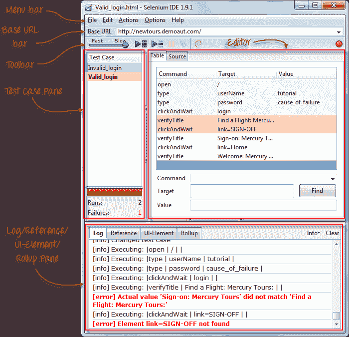

## 菜单栏

它位于 IDE 的**最顶部**。 最常用的菜单是“文件”，“编辑”和“选项”菜单。

**文件菜单**

*   它包含用于创建，打开，保存和关闭测试的选项。
*   测试以 HTML 格式保存**。**
*   最有用的选项是“ **导出”** ，因为**允许您将 Selenium IDE 测试用例转换为可以在 Selenium Remote Control 和 WebDriver** 上运行的文件格式。
*   **“将测试用例导出为...”** 将仅导出当前打开的测试用例。
*   **“将测试套件导出为...”** 将导出当前打开的测试套件中的所有测试用例。

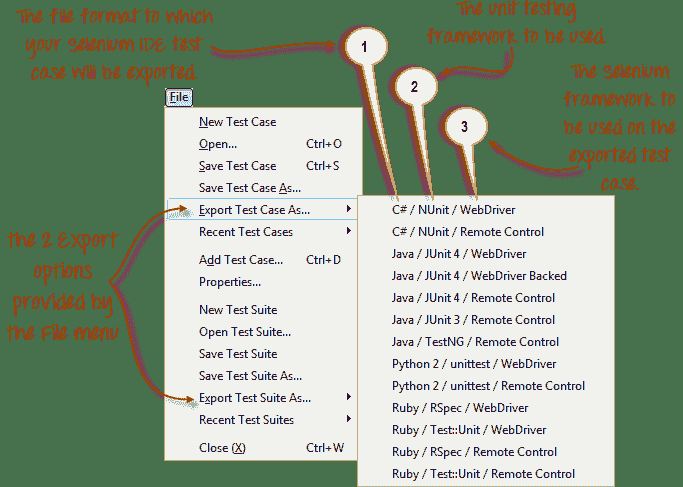

*   从 **Selenium IDE v1.9.1** 开始，测试用例只能导出为以下格式：
*   .cs（C＃源代码）
*   .java（Java 源代码）
*   .py（Python 源代码）
*   .rb（Ruby 源代码）

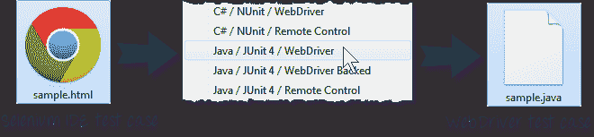

**编辑菜单**

*   它包含通常的选项，如“撤消”，“重做”，“剪切”，“复制”，“粘贴”，“删除”和“全选”。
*   两个最重要的选项是“ **插入新命令**”和“ **插入新注释**”。

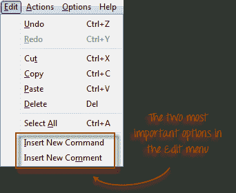

*   新插入的命令或注释**将放置在当前所选行**的顶部。

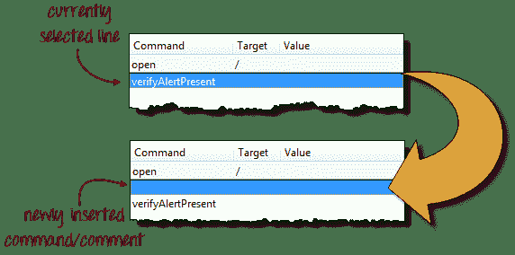

*   **命令**的颜色为**黑色**。
*   **注释**的颜色为**紫色。**

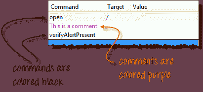

## **选项菜单**

它提供**界面，用于配置 Selenium IDE 的各种设置**。

我们将专注于**选项**和**剪贴板格式**选项。

| 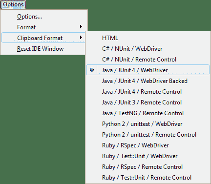 | **剪贴板格式**

*   **剪贴板格式允许您从编辑器复制 Selenese 命令并将其粘贴为代码段**。
*   代码的格式遵循您在“剪贴板格式”列表中在此处选择的选项。
*   **HTML 是默认选择。**

 |

例如，当选择 **Java / JUnit 4 / WebDriver** 作为剪贴板格式时，从 Selenium IDE 编辑器复制的每个 Selenese 命令都将粘贴为 **Java 代码**。 请参见下图。

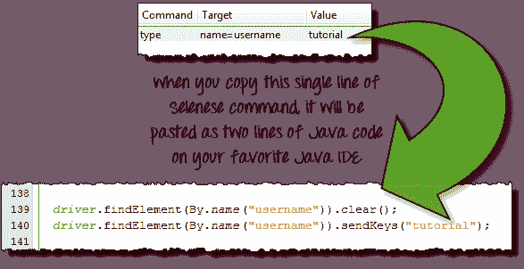

## Selenium IDE 选项对话框

通过单击菜单栏上的选项>选项...，可以启动 Selenium IDE 选项对话框。 尽管有许多可用的设置，但我们将专注于一些重要的设置。

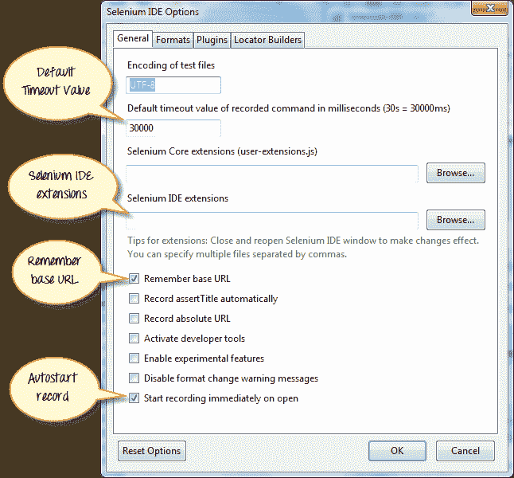

*   **默认超时值**。 这是指 Selenium 在生成错误之前必须等待某个元素出现或可访问的时间。 **默认超时值为 30000ms** 。
*   **Selenium IDE 扩展**。 在这里，您可以指定要用于扩展 Selenium IDE 功能的扩展。 您可以访问 [http://addons.mozilla.org/en-US/firefox/](http://addons.mozilla.org/en-US/firefox/) ，并使用“ Selenium”作为关键字来搜索特定的扩展名。
*   **记住基本 URL。** 如果希望 Selenium IDE 每次启动时都记住基本 URL，请选中此复选框。 如果您取消选中此选项，则 Selenium IDE 将始终以基本 URL 的空白值启动。
*   **自动启动记录。** 如果选中此选项，Selenium IDE 将在启动时立即记录您的浏览器操作。
*   **定位器生成器。** 在这里您可以指定录制时生成定位符的顺序。 **定位器是告诉 Selenium IDE 硒指令应对[UIG3]起作用的 UI 元素的方法。 在下面的设置中，当您单击具有 ID 属性的元素时，该元素的 ID 将用作定位符，因为“ id”是列表中的第一个元素。 如果该元素没有 ID 属性，则 Selenium 接下来将查找“名称”属性，因为它是列表中的第二个属性。 该列表会一直不断下去，直到找到合适的列表为止。**

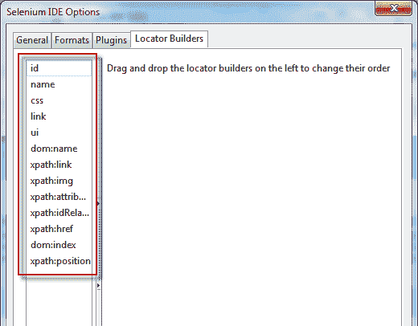.png)

## 基本网址栏

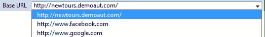

*   它具有**下拉菜单，** **会记住所有先前的值**，以便于访问。
*   Selenese 命令**“打开”会将您带到您在基本 URL** 中指定的 URL。
*   在本教程系列中，我们将使用 [http://newtours.demoaut.com](http://newtours.demoaut.com/) 作为我们的基本 URL。 它是 Mercury Tours 的站点，Mercury Tours 是 HP 维护的一种 Web 应用程序，用于进行[测试](/software-testing.html)。 我们将使用此应用程序，因为它包含了后续主题所需的一整套元素。
*   **基本 URL 在访问相对 URL** 中非常有用。 假设您的基本 URL 设置为 [http://newtours.demoaut.com](http://newtours.demoaut.com/) 。 当您使用目标值“ signup”执行命令“ open”时，Selenium IDE 会将浏览器定向到注册页面。 请参见下图。

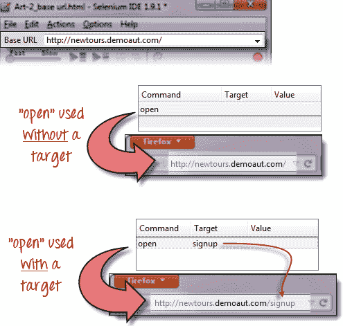

## 工具列

| [ 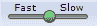 | **播放速度**。 这控制了测试脚本执行的速度。 |
|   | **记录。** 这将开始/结束录制会话。 每个浏览器操作均作为 Selenese 命令输入到编辑器中。 |
|   | **播放整个测试套件**。 这将依次播放[测试用例](/test-case.html)窗格中列出的所有测试用例。 |
|   | **播放当前测试用例**。 这将仅播放“测试用例窗格”中当前选择的测试用例。 |
|   | **暂停/恢复**。 这将暂停或继续播放。 |
|   | **步骤**。 该按钮将允许您进入测试脚本中的每个命令。 |
|   | **应用汇总规则**。 这是一项高级功能。 它使您可以将 Selenese 命令组合在一起，并作为一个单独的动作执行它们。 |

## 测试用例窗格

| 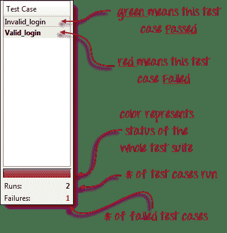 | 

*   在 Selenium IDE 中，您可以一次打开 **多个测试用例。**
*   **测试用例窗格显示了当前打开的测试用例的列表。**
*   当打开测试套件时，测试用例窗格将 **自动列出其中包含的所有测试用例** 。
*   用 **粗体字** 编写的测试用例是当前选择的 **测试用例**
*   播放后， **每个测试用例都用颜色编码** 表示它是通过还是失败。
    *   绿色表示“通过”。
    *   红色表示“失败”。
*   底部是运行和失败的测试用例数量的摘要。

 |

## 编辑

您可以将编辑器视为**，即发生所有动作的位置**。 它有两个视图可用：表和源。

##### 表格检视

*   大多数时候，您将使用**表视图**在 Selenium IDE 上工作。
*   在**中，您可以创建和修改 Selenese 命令。**
*   播放后，每个步骤都用颜色编码。

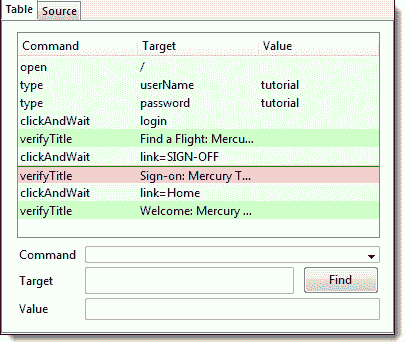

*   要创建步骤，请在“命令”文本框中键入命令的名称。
*   **显示与您当前键入的条目匹配的命令**的下拉列表。
*   目标是命令的任何参数（例如用户名，密码），而值是这些目标的输入值（例如 tom，123pass）。

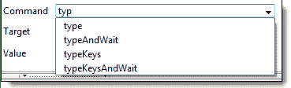

##### 源视图

*   它以 HTML（默认）格式显示步骤。
*   它还允许您像在表视图中一样编辑脚本。

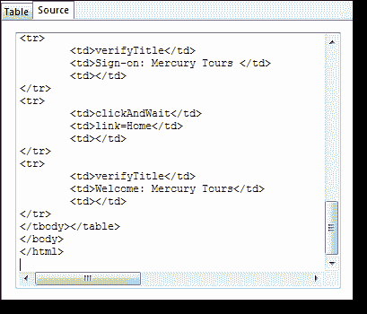

## 日志窗格

**日志窗格在执行期间显示运行时消息**。 它提供有关 Selenium IDE 正在执行的实时更新。

**日志分为四种类型：**

*   调试-默认情况下，调试消息不显示在日志面板中。 它们仅在您过滤它们时显示。 他们提供有关 Selenium IDE 在后台执行操作的技术信息。 它可能显示消息，例如特定模块已完成加载，调用了某些功能或外部 JavaScript 文件已作为扩展加载。
*   信息-它说明 Selenium IDE 当前正在执行哪个命令。
*   警告-这些是在特殊情况下遇到的警告消息。
*   错误-这些是当 Selenium IDE 无法执行命令或不满足“验证”或“声明”命令指定的条件时生成的错误消息。

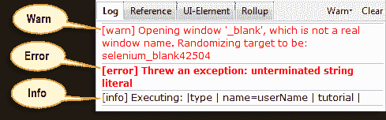

**日志可以按**类型过滤。 例如，如果您选择从下拉列表中选择“错误”选项，则“日志窗格”将仅显示错误消息。

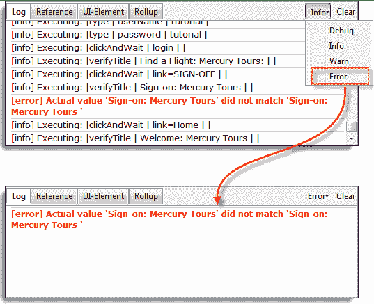

## 参考窗格

**参考窗格显示了在编辑器**中当前选择的 Selenese 命令的简要描述。 它还显示了有关定位器的**描述和该命令要使用的值**。

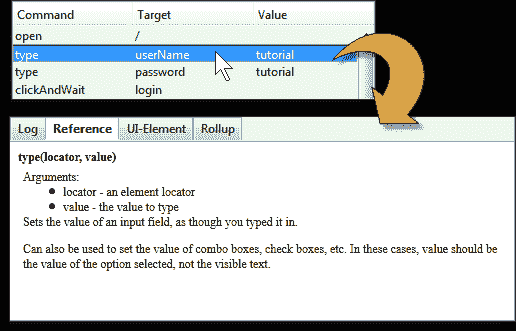

## UI 元素窗格

UI 元素适用于高级 Selenium 用户。 **它使用 JavaScript 对象表示法（JSON）定义元素映射。** 文档和资源可在 Selenium IDE 的“帮助”菜单下的“ UI 元素文档”选项中找到。

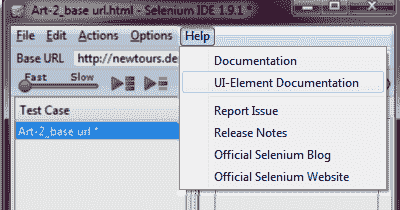

UI 元素屏幕的示例如下所示。

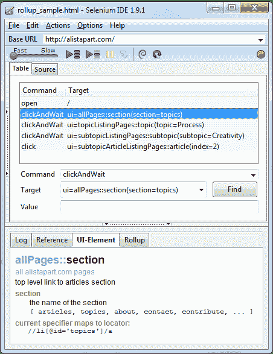

## 汇总窗格

**汇总使您可以一步执行一组命令。** 一组命令简称为“汇总”。 它大量使用 JavaScript 和 UI-Element 概念来制定类似于编程语言中“功能”的命令集合。

**汇总是可重用的**； 意思是，它们可以在测试用例中多次使用。 由于汇总是压缩为一组的命令组，因此它们在缩短测试脚本方面起了很大作用。

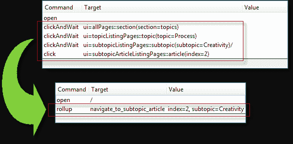

下面显示了一个汇总选项卡的内容示例的示例。

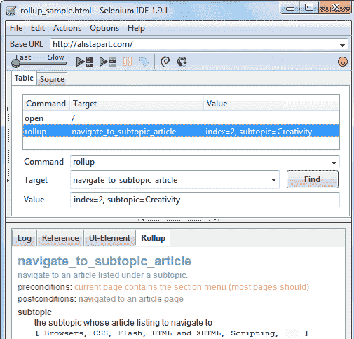

## 摘要

*   Selenium IDE（集成开发环境）**是 Selenium Suite 中最简单的工具**。
*   它只能用作**原型工具**。
*   **中等主题**（例如执行“ runScript”和“ rollup”命令）需要 JavaScript 和 HTML 知识。**汇总**是可重复使用以缩短测试时间的命令集合 剧本。 **定位符**是告诉 Selenium IDE 如何访问元素的标识符。
*   **Firebug** （或任何类似的附件）用于获取定位器值**。**
*   **菜单栏**用于创建，修改测试案例并将其导出为 Selenium RC 和 WebDriver 可用的格式。
*   Selenese 命令的**默认格式为 HTML** 。
*   **“选项”菜单提供对 Selenium IDE 的各种配置**的访问。
*   **基本 URL** 在访问**相对 URL** 时很有用。

*   **测试用例窗格**显示当前打开的测试用例的列表以及测试运行的简要摘要。
*   **编辑器**为您的测试脚本提供**界面。**
*   **表格视图**以 **表格格式**显示您的脚本**，其中“命令”，“目标”和“值”为列。**
*   **源代码视图**以 HTML 格式显示您的脚本**。**
*   **日志**和**参考**选项卡在执行测试时提供反馈和其他有用的信息。
*   **UI 元素和汇总**选项卡是**，仅适用于高级 Selenium IDE 用户**。 它们都需要花费大量精力来编写 JavaScript。
*   **UI 元素**允许您使用 JavaScript 对象表示法（JSON）方便地**映射 UI 元素**。

下表总结了 Selenium IDE 的发行历史。

| 主要版本 | 发布日期 |
| 1.0.10 | 2010 年 12 月 6 日 |
| 1.5.0 | 2011 年 12 月 15 日 |
| 1.8.1 | 01-Jun-12 |
| 2.1.0 | 30-Jun-13 |
| 2.2.0 | 2013 年 7 月 6 日 |
| 2.3.0 | 2013 年 8 月 9 日 |
| 2.5.0 | 2014 年 1 月 2 日 |
| 2.8.0 | 2014 年 9 月 29 日 |
| 2.9.0 | 15 年 3 月 9 日 |
| 2.9.1 | 2015 年 3 月 15 日 |
| 3.0 | 2018 年 4 月 11 日 |
| 3.1.0 | 2018 年 6 月 26 日 |
| 3.2.0 | 18 年 8 月 13 日 |
| 3.4.4 | 18 年 10 月 15 日 |