# 如何通过脚本&命令（声明，验证）使用 Selenium IDE

> 原文： [https://www.guru99.com/first-selenium-test-script.html](https://www.guru99.com/first-selenium-test-script.html)

我们将使用 Mercury Tours 网站作为受测试的 Web 应用程序。 这是一个在线航班预订系统，其中包含我们需要的所有元素。 它的 URL 是 [http://demo.guru99.com/test/newtours/](http://demo.guru99.com/test/newtours/) ，这将是我们的基本 URL。

## 通过录制创建脚本

现在让我们使用最常见的方法-通过记录在 Selenium IDE 中创建第一个测试脚本。 之后，我们将使用回放功能执行脚本。

**步骤 1**

*   启动 Firefox 和 Selenium IDE。
*   输入基本 URL 的值： [http://demo.guru99.com/test/newtours/](http://demo.guru99.com/test/newtours/)。
*   启用“记录”按钮（如果默认情况下尚未启用）。

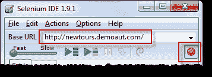.png) 

| **Step 2**在 Firefox 中，导航到 [http://demo.guru99.com/test/newtours/](http://demo.guru99.com/test/newtours/) 。 Firefox 应该带您进入类似于以下所示的页面。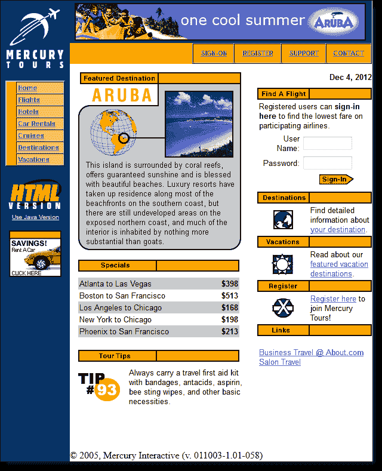.png) |
| **步骤 3**

*   右键单击页面上的任何空白区域，例如左上角的 Mercury Tours 徽标。 这将弹出 Selenium IDE 上下文菜单。 注意：请勿单击任何超链接的对象或图像
*   选择“显示可用命令”选项。
*   然后，选择“确切的 assertTitle：欢迎使用：Mercury Tours”。 这是确保页面标题正确的命令。

 |
| 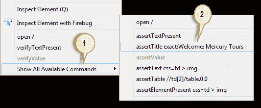.png)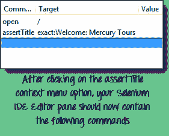 |
| **步骤 4**

*   在 Mercury Tours 的“用户名”文本框中，键入无效的用户名“ invalidUNN”。
*   在“密码”文本框中，输入无效的密码“ invalidPWD”。

 |
| 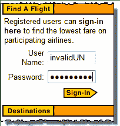 | 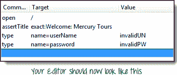 |
| **Step 5**

*   点击“登录”按钮。 Firefox 应该带您到此页面。

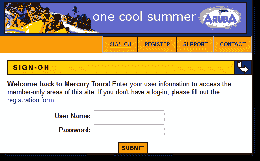 |
| **Step 6**将录制按钮切换为关闭以停止录制。 现在，您的脚本应如下图所示。 |
| **Step 7**现在我们已经完成了测试脚本，我们将其保存在测试用例中。 在“文件”菜单中，选择“保存测试用例”。 或者，您只需按 Ctrl + S。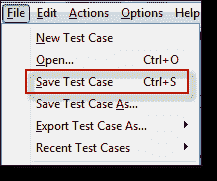 |
| **Step 8**

*   选择所需的位置，然后将[测试用例](/test-case.html)命名为“ Invalid_login”。
*   点击“保存”按钮。

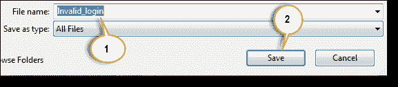 |
| **Step 9.**请注意，该文件已另存为 HTML。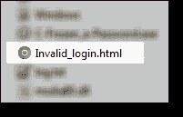 |

**步骤 10。**

返回 Selenium IDE，然后单击“播放”按钮以执行整个脚本。 Selenium IDE 应该能够完美地复制所有内容。

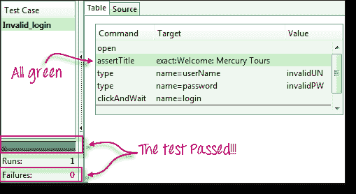

## Selenium 命令简介-Selenese

*   Selenese 命令最多可以有两个参数：目标和值。
*   并非始终需要参数。 它取决于命令的数量。

## 3 种命令

| **动作** | 这些是与页面元素直接交互的命令。示例：“ click”命令是一个操作，因为您直接与要单击的元素进行交互。“类型”命令也是一种操作，因为您正在将值放入文本框，并且文本框会向您显示它们。 您和文本框之间存在双向交互。 |
| **存取器** | 它们是允许您将值存储到变量的命令。示例：“ storeTitle”命令是访问器，因为它仅“读取”页面标题并将其保存在变量中。 它不会与页面上的任何元素交互。 |
| **断言** | 它们是验证是否满足特定条件的命令。**3 种断言**

*   **声明**。 当“断言”命令失败时，测试将立即停止。
*   **验证**。 当“验证”命令失败时，Selenium IDE 记录此失败并继续执行测试。
*   **等待**。 在继续执行下一个命令之前，“ waitFor”命令将首先等待某个条件变为真。
    *   如果条件在等待期内变为真，则步骤通过。
    *   如果条件不成立，则该步骤失败。 记录失败，并且测试执行前进到下一个命令。
    *   默认情况下，超时值设置为 30 秒。 您可以在“常规”选项卡下的“ Selenium IDE 选项”对话框中更改此设置。

 |

**声明与验证**

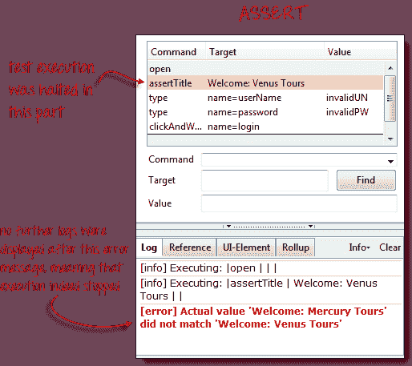

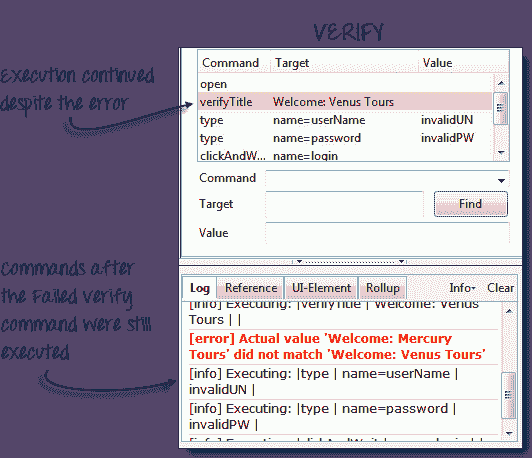

## 常用命令

| **命令** | **参数数** | **说明** |
| 打开 | 0 - 2 | 使用 URL 打开页面。 |
| click / clickAndWait | 1 | 单击指定的元素。 |
| type / typeKeys | 2 | 键入一个字符序列。 |
| verifyTitle / assertTitle | 1 | 将实际页面标题与期望值进行比较。 |
| verifyTextPresent | 1 | 检查在页面内是否找到特定文本。 |
| verifyElementPresent | 1 | 检查某个元素的存在。 |
| 验证表 | 2 | 将表的内容与期望值进行比较。 |
| waitForPageToLoad | 1 | 暂停执行，直到页面完全加载为止。 |
| waitForElementPresent | 1 | 暂停执行直到指定的元素出现。 |

## 使用 Firebug 手动创建脚本

现在，我们将通过键入命令来手动重新创建相同的测试用例。 这次，我们将需要使用 Firebug。

| **Step 1**

*   打开 Firefox 和 Selenium IDE。
*   输入基本 URL（ [http://demo.guru99.com/test/newtours/](http://demo.guru99.com/test/newtours/) ）。
*   记录按钮应为 OFF。

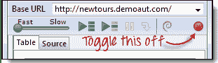 |
| **Step 2:** Click on the topmost blank line in the Editor.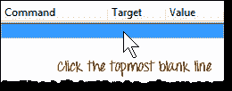 |
| 在“命令”文本框中键入“打开”，然后按 Enter。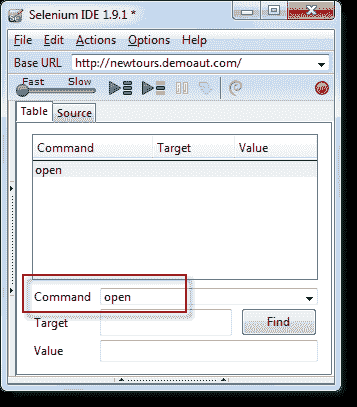 |
| **Step 3**

*   将 Firefox 导航到我们的基本 URL 并激活 Firebug
*   在 Selenium IDE 编辑器窗格中，选择第二行（“打开”命令下方的行），然后在“命令”框中键入“ assertTitle”来创建第二条命令。
*   随时使用自动完成功能。

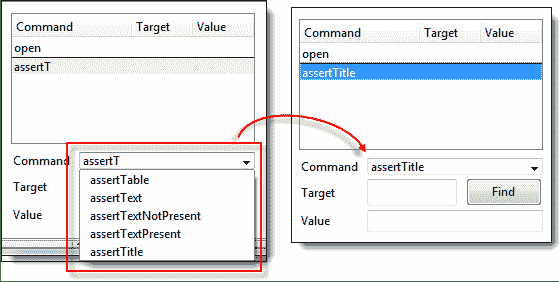.png) |
| **Step 4**

*   在 Firebug 中，展开<标题>标签以显示<标题>标签。
*   单击<标题>标签的值（即“ Welcome：Mercury Tours”），然后将其粘贴到编辑器的“目标”字段中。

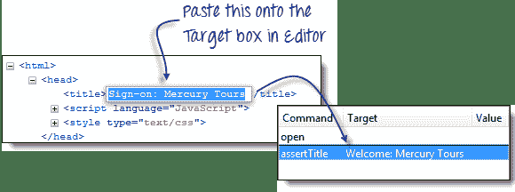 |
| **Step 5**

*   要创建第三个命令，请在编辑器中单击第三个空白行，然后在“命令”文本框中键入“类型”。
*   在 Firebug 中，单击“检查”按钮。

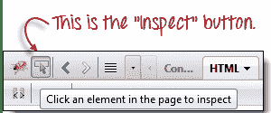 |
| Click on the User Name text box. Notice that Firebug automatically shows you the HTML code for that element.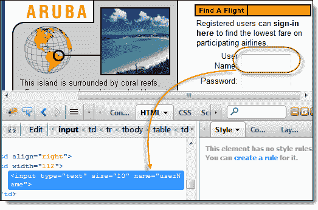 |
| **Step 6**请注意，“用户名”文本框没有 ID，但是具有 NAME 属性。 因此，我们将使用它的名称作为定位器。 复制 NAME 值并将其粘贴到 Selenium IDE 中的 Target 字段中。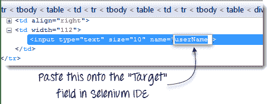仍在“目标”文本框中，在“ userName”前面加上“ name =“，表示 Selenium IDE 应该以 NAME 属性为“ userName”的元素为目标。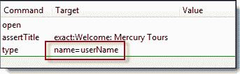在 Selenium IDE 的“值”文本框中键入“ invalidUN”。 现在，您的测试脚本应如下图所示。 我们已经完成了第三条命令。 注意：您可以输入任何其他文本字符串来代替 invalidUN。 但是 Selenium IDE 区分大小写，并且您键入值/属性的方式与在应用程序中完全相同。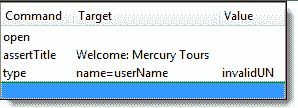 |
| **Step 7**

*   要创建第四个命令，请在“命令”文本框中键入“类型”。
*   同样，使用 Firebug 的“检查”按钮获取“密码”文本框的定位器。

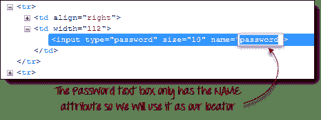

*   将 NAME 属性（“密码”）粘贴到“目标”字段，并以“ name =“

*   在 Selenium IDE 的“值”字段中键入“ invalidPW”。 现在，您的测试脚本应如下图所示。

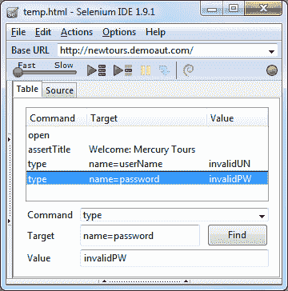 |
| **Step 8**

*   对于第五个命令，在 Selenium IDE 的“命令”文本框中键入“ clickAndWait”。
*   使用 Firebug 的“检查”按钮获取“登录”按钮的定位器。

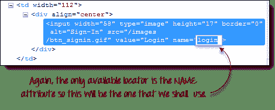

*   将 NAME 属性的值（“ login”）粘贴到“目标”文本框中，并以“ name =“为前缀。
*   现在，您的测试脚本应如下图所示。

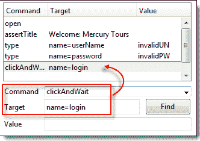 |

**步骤 9：**以与上一节相同的方式保存测试用例。

## 使用查找按钮

**Selenium IDE 中的“查找”按钮用于验证我们在“目标”文本框中输入的内容是否确实是正确的 UI 元素。**

让我们使用前面几节中创建的 Invalid_login 测试用例。 单击带有“目标”条目的任何命令，例如第三个命令。

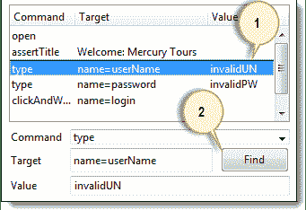.png)

单击查找按钮。 请注意，Mercury Tours 页面中的“用户名”文本框将突出显示一秒钟。

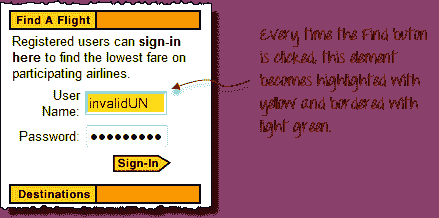.png)

这表明 Selenium IDE 能够正确检测和访问期望的元素。 如果“查找”按钮突出显示了一个不同的元素，或者根本没有任何元素，则您的脚本肯定有问题。

## 执行命令

**这使您可以执行任何单个命令，而无需运行整个测试用例**。 只需单击要执行的行，然后从菜单栏中单击“操作>执行此命令”，或在键盘上按“ X”。

**步骤 1。**确保您的浏览器在 Mercury Tours 主页上。 单击您要执行的命令。 在此示例中，单击“类型| userName | invalidUN”行。

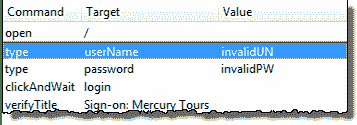

**步骤 2。**按下键盘上的“ X”。

**步骤 3。**观察到用户名文本框中填充了文本“ invalidUN”

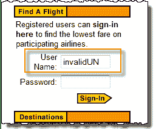

**以这种方式执行命令在很大程度上取决于 Firefox 当前显示的页面**。 这意味着，如果您尝试上面的示例显示的是 Google 主页而不是 Mercury Tours，则您的步骤将失败，因为 Google 主页中没有带有“ userName”属性的文本框。

## 起点

**起点是指示 Selenium IDE 的行将开始执行的指示器**。 **其快捷键是“ S”。**

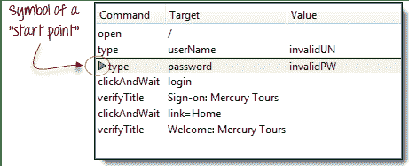

在上面的示例中，播放将从第三行开始（类型|密码| invalidPW）。 **一个测试脚本中只能有一个起点。**

起点与“执行命令”相似，因为它们取决于当前显示的页面。 如果您在错误的页面上，起点将失败。

## 断点

断点是指示 Selenium IDE 在何处自动暂停测试的指示器。 **快捷键为“ B”。**

黄色突出显示表示当前步骤处于待处理状态。 这证明 Selenium IDE 已在该步骤上暂停执行。 **一个测试用例中可以有多个断点。**

## 步

它允许您在暂停测试用例之后一次执行一次后续命令。 让我们使用上一节“断点”中的场景。

| 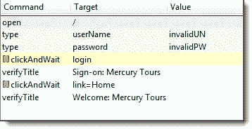 | **单击“步骤”之前。**测试用例在“ clickAndWait &#124; login”行处暂停。 |
| 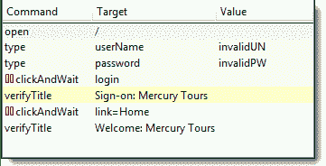 | **单击“步骤”后。**运行“ clickAndWait &#124;登录”行，并暂停到下一个命令（verifyTitle &#124;登录：Mercury Tours）。请注意，即使那里没有断点，下一行也会暂停。 这是“步进”功能的主要目的-一次执行一个后续命令，使您有更多时间在每一步之后检查结果。 |

## 在源代码视图中使用其他格式时要注意的重要事项

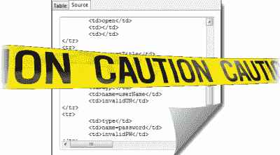

**Selenium IDE 仅适用于 HTML，其他格式仍处于实验模式**。 建议不要使用**在源代码视图中使用其他格式创建或编辑测试，因为仍然需要进行大量工作才能使其稳定。 以下是 1.9.1 版以来的已知错误。**

*   除非您恢复为 HTML，否则将无法执行播放或切换回“表视图”。
*   在源代码上安全添加命令的唯一方法是记录它们。
*   当您手动修改源代码时，当您切换到另一种格式时，所有源代码都将丢失。
*   尽管您可以在 Source View 中保存测试用例，但 Selenium IDE 将无法打开它。

**转换 Selenese 测试的推荐方法是使用“文件”菜单下的“将测试用例导出为...”选项，而不是通过“源代码”视图。**

## 摘要

*   可以通过记录或手动键入命令和参数来创建测试脚本。
*   手动创建脚本时，将使用 Firebug 获取定位器。
*   “查找”按钮用于检查命令是否能够访问正确的元素。
*   表视图以表格形式显示测试脚本，而源视图以 HTML 格式显示。
*   将“源视图”更改为非 HTML 格式仍处于试验阶段。
*   在以其他格式创建测试时，请勿使用“源视图”。 请改用导出功能。
*   并非始终需要参数。 这取决于命令。
*   共有三种类型的命令：

*   动作-与页面元素直接互动
*   访问器-“读取”元素属性并将其存储在变量中
*   断言-将实际值与预期值进行比较

*   断言具有三种类型：

*   断言-失败时，不再执行后续步骤
*   验证-失败后，仍将执行后续步骤。
*   WaitFor-如果指定的条件在超时时间内变为 true，则通过； 否则会失败

*   最常见的命令是：

*   打开
*   click / clickAndWait
*   type / typeKeys
*   verifyTitle / assertTitle
*   verifyTextPresent
*   verifyElementPresent
*   验证表
*   waitForPageToLoad
*   waitForElementPresent