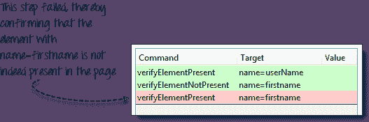
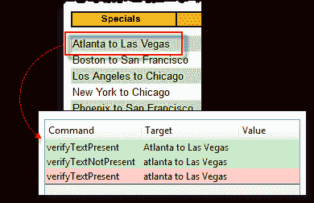
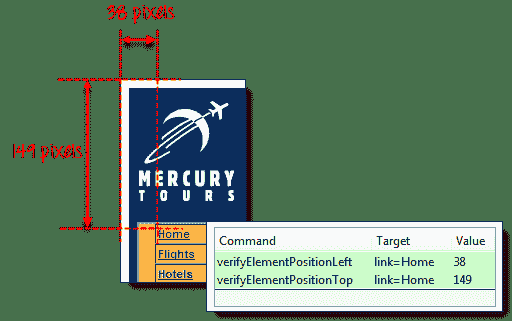
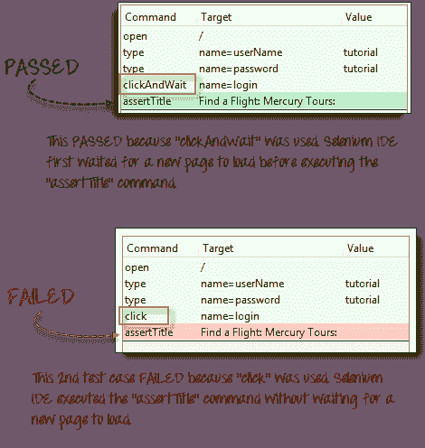
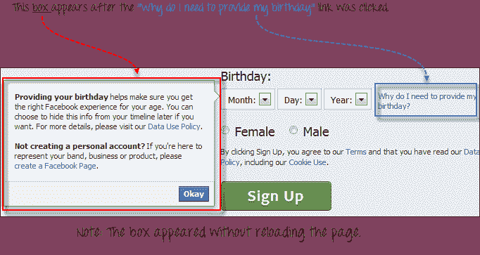
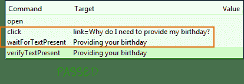
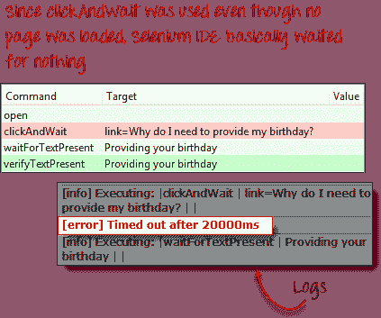

# 在 Selenium IDE 中验证 Element Present，waitFor 和 Wait

> 原文： [https://www.guru99.com/enhancing-selenium-ide-script.html](https://www.guru99.com/enhancing-selenium-ide-script.html)

在本教程中，我们将介绍可使您的自动化脚本更加智能和完整的命令。

*   [验证元素](#1)的存在
*   [验证特定文本的存在](#2)
*   [验证元素](#3)的特定位置
*   [和等待命令](#4)
*   [waitFor 命令](#5)

## 验证元素的存在

我们可以使用以下两个命令来验证元素的存在：

*   **verifyElementPresent** -如果在页面中找到了指定的元素，则返回 TRUE； 否则为 FALSE
*   **verifyElementNotPresent** -如果在页面的任何地方都找不到指定的元素，则返回 TRUE； 如果存在，则为 FALSE。

下面的测试脚本验证了 Mercury Tours 主页中是否存在“用户名”文本框，而没有“名字”文本框。 “名字”文本框实际上是一个元素，该元素存在于 Mercury Tours 的“注册”页面中，而不是在主页中。

## 验证特定文本的存在

*   **verifyTextPresent** -如果在页面中的某处找到了指定的文本字符串，则返回 TRUE；否则，返回 TRUE。 否则为 FALSE
*   **verifyTextNotPresent** -如果在页面的任何地方都找不到指定的文本字符串，则返回 TRUE；否则，返回 TRUE。 如果找到，则为 FALSE

请记住，这些命令区分大小写。

在上述情况下，“亚特兰大到拉斯维加斯”与“亚特兰大到拉斯维加斯”的处理方式有所不同，因为“亚特兰大”的字母“ A”在第一个字母中大写，在另一个字母中小写。 当对每个命令使用 verifyTextPresent 命令时，一个命令通过，而另一个失败。

## 验证元素的特定位置

Selenium IDE 通过测量（以像素为单位）元素与浏览器窗口左边缘或上边缘的距离来指示元素的位置。

*   **verifyElementPositionLeft** -验证指定的像素数是否与元素到页面左边缘的距离匹配。 如果指定的值与左边缘的距离不匹配，则将返回 FALSE。
*   **verifyElementPositionTop** -验证指定的像素数是否匹配元素到页面顶部边缘的距离。 如果指定的值与上边缘的距离不匹配，则将返回 FALSE。

## 等待命令

## 和等待命令

这些命令在进入下一个命令之前将等待新页面加载。

例子是

*   clickAndWait
*   typeAndWait
*   选择并等待

## waitFor 命令

这些命令将等待指定条件变为真，然后继续执行下一个命令（与装入新页面无关）。 这些命令更适合在基于 AJAX 的动态网站上使用，这些网站可以更改值和元素而无需重新加载整个页面。 示例包括：

*   waitForTitle
*   waitForTextPresent
*   等待警报

考虑下面的 Facebook 场景。

我们可以结合使用“ click”和“ waitForTextPresent”来验证文本“ Providing your Birthday”的存在。

我们无法使用 clickAndWait，因为单击“为什么需要提供我的生日？”时没有页面加载。 链接。 如果这样做，测试将失败

## 摘要

*   验证页面元素时最常用的三个命令是：
    *   verifyElementPresent / verifyElementNotPresent
    *   verifyTextPresent / verifyTextNotPresent
    *   verifyElementPositionLeft / verifyElementPositionTop
*   等待命令分为两种：
    *   andWait 命令-在预期要加载页面时使用
    *   waitFor 命令-在预期不加载新页面时使用