# 在 Selenium IDE 中存储变量，回显，警报，弹出窗口处理

> 原文： [https://www.guru99.com/store-variables-handling-selenium-ide.html](https://www.guru99.com/store-variables-handling-selenium-ide.html)

在本教程中，我们将学习，存储命令，回显命令，警报和弹出窗口处理。

## 存储变量和 Echo 命令

### 商店

要在 Selenium IDE 中存储变量，我们使用“ store”命令。 下图说明将值“ tutorial”存储到名为“ myVariable”的变量。

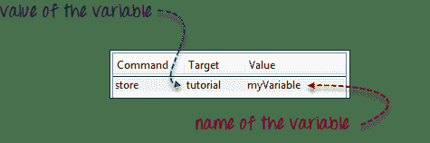

要访问该变量，只需将其括在$ {...}符号中即可。 例如，要将“ myVariable”的值输入到 Mercury Tours 的“ userName”文本框中，请在“值”字段中输入$ {myVariable}。

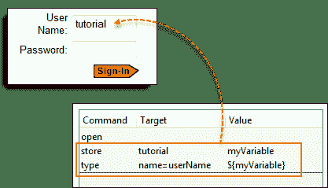

## StoreElementPresent

此命令根据指定元素的存在存储“ true”或“ false”。 下面的脚本将布尔值“ true”存储为“ var1”，将“ false”存储为“ var2”。 为了验证，我们将使用“ echo”命令显示 var1 和 var2 的值。 下图的基本 URL 设置为 Mercury Tours 主页。

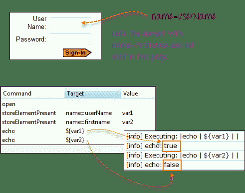

## StoreText

此命令用于将元素的内部文本存储到变量中。 下图将 Facebook 中标签的内部文本存储到名为“ textVar”的变量上。

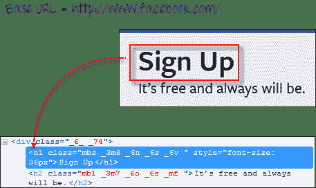

由于它是页面中的唯一元素，因此可以安全地使用“ css = h1”作为目标。 下图显示 Selenium IDE 能够通过正确打印其值将字符串“ Sign Up”保存在'textVar'变量中。

## 警报，弹出窗口和多个 Windows

警报可能是弹出窗口的最简单形式。 用于处理警报的最常见的 Selenium IDE 命令如下：

| assertAlert assertNotAlert | 检索警报消息并将其断言为您指定的字符串值 |
| assertAlertPresent assertAlertNotPresent | ， 断言是否存在警报 |
| storeAlert | 检索警报消息并将其存储在您将指定的变量中 |
| storeAlertPresent | 如果存在警报，则返回 TRUE； 否则为 FALSE |
| verifyAlert verifyNotAlert | 检索警报消息并验证其是否等于您指定的字符串值 |
| verifyAlertPresent verifyAlertNotPresent | 验证是否存在警报 |

使用警报时，请记住以下两点：

*   Selenium IDE 将自动单击警报窗口的“确定”按钮，因此您将无法看到实际的警报。
*   Selenium IDE 将无法处理页面的 onload（）函数中的警报。 它只能处理页面完全加载后生成的警报。

在此示例中，我们将使用 storeAlert 命令显示，即使 Selenium IDE 没有显示实际的警报，它仍然能够检索其消息。

**步骤 1。**在 Selenium IDE 中，将基本 URL 设置为 http://jsbin.com。 &的完整网址为：http://jsbin.com/usidix

**步骤 2。**如下所示创建脚本。

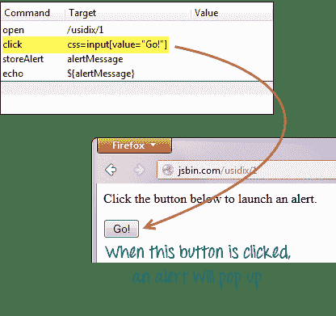

**步骤 3。**执行脚本，不要期望您将看到实际的警报。

**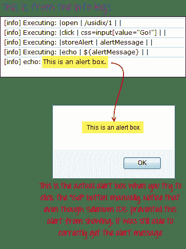** 

## 确认书

确认是弹出式窗口，提供给您一个确定和一个取消按钮，而不是仅给您一个确定按钮的警报。 可用于处理确认的命令与用于处理警报的命令相似。

*   assertConfirmation / assertNotConfirmation
*   assertConfirmationPresent / assertConfirmationNotPresent
*   storeConfirmation
*   storeConfirmationPresent
*   verifyConfirmation / verifyNotConfirmation
*   verifyConfirmationPresent / verifyConfirmationNotPresent

但是，这些是您需要用来指示 Selenium 选择哪个选项的附加命令，无论是“确定”还是“取消”按钮。

*   选择 OKOnNextConfirmation /选择 OKOnNextConfirmationAnd
*   选择取消下一步确认

**您应该在触发确认框的命令之前使用这些命令，以便 Selenium IDE 事先知道要选择哪个选项。** 再次，您将无法在脚本执行期间看到实际的确认框。

让我们测试一个网页，该网页的按钮经过编码以显示用户是否按下了 OK 或 CANCEL 按钮。

**步骤 1。**在 Selenium IDE 中，将基本 URL 设置为 http://jsbin.com。&完整 URL 为：http://jsbin.com/enifaf

**步骤 2。**如下所示创建脚本。 这次，我们将首先按“确定”按钮。

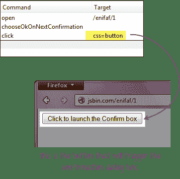

**步骤 3。**执行脚本，请注意您没有看到实际的确认，但是网页能够指示 Selenium IDE 按下了哪个按钮。

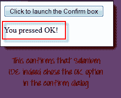

**步骤 4。**将“ chooseOkOnNextConfirmation”命令替换为“ chooseCancelOnNextConfirmation”，然后再次执行脚本。

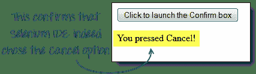

## 多视窗

如果您碰巧单击了一个可启动单独窗口的链接，则必须先指示 Selenium IDE 首先选择该窗口，然后才能访问其中的元素。 为此，您将**使用窗口的标题作为其定位符**。

**我们使用 selectWindow 命令在窗口之间切换。**

我们将使用标题为“第一个窗口”的链接 http://jsbin.com/ocinaj/1。 在该页面上找到的“此处”超链接将在新窗口中打开 Facebook，之后我们将指示 Selenium IDE 执行以下操作：

*   使用“ selectWindow”命令及其标题作为定位器，将控件从父窗口转移到新启动的 Facebook 窗口
*   验证新窗口的标题
*   使用“ selectWindow”命令并以“ null”作为目标选择回原始窗口。
*   验证当前所选窗口的标题

**步骤 1\.** 将基本 URL 设置为 http://jsbin.com。

**Step 2.** Create the script as shown below.

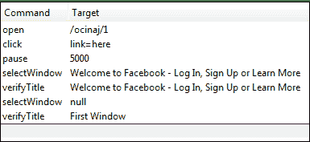

我们需要“ pause”命令来等待新启动的窗口加载，然后才能访问其标题。

**步骤 3。**执行脚本。 请注意，[测试用例](/test-case.html)通过了，这意味着我们能够在窗口之间切换并成功验证其标题。

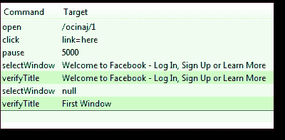

始终记住，将 selectWindow 的目标设置为“ null”将自动选择父窗口（在这种情况下，将找到元素“ link = here”的窗口）

**注意：**自创建教程以来，Facebook 更改了标题。 请相应地修改代码

## 摘要

*   “存储”命令（及其所有变体）用于在 Selenium IDE 中存储变量
*   “ echo”命令用于打印字符串值或变量
*   在元素上打印或使用变量时，将其包含在$ {...}中
*   Selenium IDE 在处理警报时会自动按“确定”按钮
*   处理确认对话框时，您可以指示 Selenium IDE 使用哪个选项：
    *   选择 OKOnNextConfirmation /选择 OKOnNextConfirmationAnd
    *   选择取消下一步确认
*   在浏览器窗口之间切换时，窗口标题用作定位器。
*   使用“ selectWindow”命令时，将 Target 设置为“ null”将自动指示 Selenium IDE 选择父窗口。