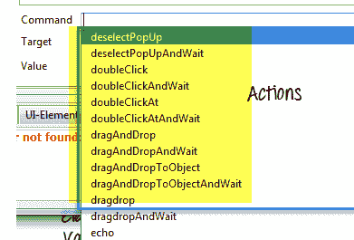
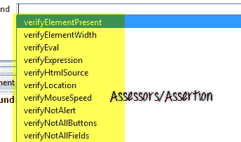
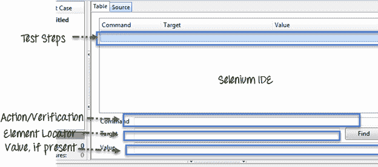
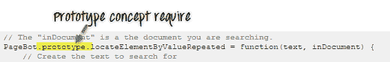
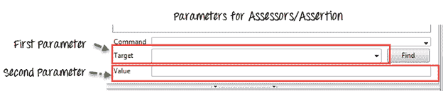
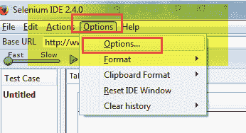
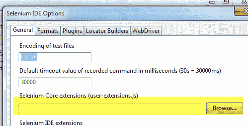
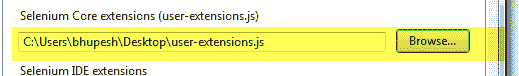
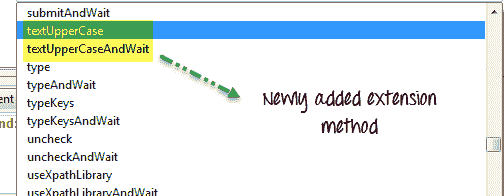

# 硒核心扩展（User-Extensions.js）

> 原文： [https://www.guru99.com/selenium-core-extensions.html](https://www.guru99.com/selenium-core-extensions.html)

要了解扩展，首先让我们了解 Selenium IDE 的三大支柱

1.  Action: What operation you are performing on UI Screen

    

2.  评估者/断言：您对从 UI 获得的数据进行何种验证



3.  定位器策略：如何在 UI 中找到元素。



现在，Selenium IDE 拥有一个非常成熟的库，其中包含大量的动作，断言/评估器和定位器策略。

但是有时我们需要为项目需求添加更多功能。 在这种情况下，我们可以通过添加自定义扩展来扩展此库。 这些自定义扩展名称为“用户扩展名”。

例如，我们需要一个 Action，它可以在将文本填充到 Web 元素之前将其转换为大写形式。 您无法在默认操作库中找到此操作。 在这种情况下，您可以创建自己的“用户扩展名”。 在本教程中，我们将学习如何创建用户扩展名以将 Text 转换为大写

## 创建 Selenium 用户扩展的要求：

要为 Selenium IDE 创建用户扩展，我们需要了解 [JavaScript](/interactive-javascript-tutorials.html) 和 [Java](/java-tutorial.html) Script 原型对象概念的基本概念。



要创建用户扩展，您需要创建 Java 脚本方法并将其添加到 selenium 对象原型和 PageBot 对象原型中。

## Selenium IDE 如何识别用户扩展？

在启动 Selenium IDE 时将用户扩展添加到 Selenium IDE 中之后，将加载 javascript 原型中的所有这些扩展，并且 Selenium IDE 会通过它们的名称识别它们。

## 如何创建用户扩展

**步骤 1）动作**-所有动作均以“ do”开始，即，如果该动作是大写文本，则其名称为 **doTextUpperCase。** 当我们在 Selenium IDE 中添加此操作方法时，Selenium IDE 本身将为此操作创建一个等待方法。 因此，在这种情况下，当我们创建 **doTextUpperCase** 操作时，Selenium IDE 将创建一个相应的等待函数作为 **TextUpperCaseAndWait** 。 它可以接受两个参数

***示例：大写文本操作***

```
Selenium.prototype.doTextUpperCase = function(locator, text) {
     // Here findElement is itself capable to handle all type of locator(xpath,css,name,id,className), We just need to pass the locator text
     var element = this.page().findElement(locator);

     // Create the text to type
     text = text.toUpperCase();

     // Replace the element text with the new text
     this.page().replaceText(element, text);
    };

```

**步骤 2）评估者/断言-**在硒对象原型中注册的所有评估者都将加上前缀

通过“获取”或“是” getValueFromCompoundTable，isValueFromCompoundTable。在测试案例中，它可以接受两个参数，一个用于目标，另一个用于值字段。



对于每个评估者，将具有以“ verify”，“ assert”为前缀的相应验证功能，以及以“ waitFor”为前缀的 wait 函数。

***示例：用于大写文本评估者***

```
Selenium.prototype.assertTextUpperCase = function(locator, text) {
     // All locator-strategies are automatically handled by "findElement"
     var element = this.page().findElement(locator);

     // Create the text to verify
     text = text.toUpperCase();

     // Get the actual element value
     var actualValue = element.value;

     // Make sure the actual value matches the expected
     Assert.matches(expectedValue, actualValue);
    };

    Selenium.prototype.isTextEqual = function(locator, text) {
     return this.getText(locator).value===text;
    };

    Selenium.prototype.getTextValue = function(locator, text) {
     return this.getText(locator).value;
    };
```

**步骤 3）定位器策略-**如果我们要创建自己的函数来定位元素，则

我们需要使用前缀为“ locateElementBy”的函数扩展 PageBot 原型。

它需要两个参数，第一个是定位符字符串，第二个是文档

需要搜索的地方。

示例：对于大写文本定位器

```
// The "inDocument" is a document you are searching.
    PageBot.prototype.locateElementByUpperCase = function(text, inDocument) {
     // Create the text to search for
     var expectedValue = text.toUpperCase();

     // Loop through all elements, looking for ones that have
     // a value === our expected value
     var allElements = inDocument.getElementsByTagName("*");
// This star '*' is a kind of regular expression it will go through every element (in HTML DOM every element surely have a tag name like<body>,<a>,<h1>,<table>,<tr>,<td> etc. ). Here our motive is to find an element which matched with the Upper Case text we have passed so we will search it with all elements and when we get match we will have the correct web element.
     for (var i = 0; i < allElements.length; i++) {
     var testElement = allElements[i];
     if (testElement.innerHTML && testElement.innerHTML === expectedValue) {
     return testElement;
     }
     }
     return null;
    };
```

## 如何使用新创建的核心扩展？

1.  Go to Selenium IDE

    单击选项->选项...



2.  In General section select the location of the newly created Selenium Core Extension

    

3.  单击“确定”，然后重新启动 Selenium IDE。



4.  您将在命令列表中找到扩展名



## 这是 Selenium IDE 中使用的流行扩展/插件的列表

<colgroup><col> <col></colgroup> 
| **名称** | **目的** |
| 收藏夹 | 要将测试套件标记为收藏，并一键执行 |
| Flex 飞行员 X | 对于基于 Flex 的自动化 |
| FlexMonkium | 对于基于 Adobe Flex 的记录和回放[在 Selenium IDE 中测试](/software-testing.html) |
| 文件记录 | 用于将日志保存到文件中 |
| 流量控制 | 控制测试执行流程 |
| 高亮元素 | 突出显示 Web 控件 |
| 隐式等待 | 等待元素一定的时间限制 |
| 屏幕截图失败 | 截屏失败 |
| 检测结果 | 一键式保存测试套件的[测试用例](/test-case.html)结果 |

您可以从 SeleniumHQ 官方网站的下载部分获得所有这些信息。

http://docs.seleniumhq.org/download/

摘要：

*   Selenium IDE 包含三个部分：操作，评估器/断言，定位器策略。
*   当 Selenium IDE 不满足当前要求时，将创建用户扩展。
*   要创建用户扩展名，需要将 javascript 添加到硒的对象原型中。
*   创建扩展后，需要将其添加到 Selenium IDE 中并重新启动 IDE。

[下载本教程中使用的 Selenium Core 扩展](https://drive.google.com/uc?export=download&id=0B_vqvT0ovzHcc3pRcV84eUpiQmM)