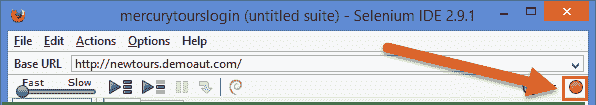
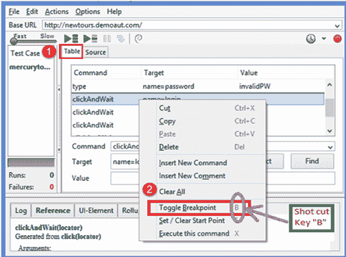
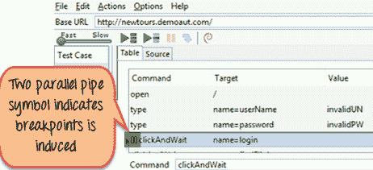
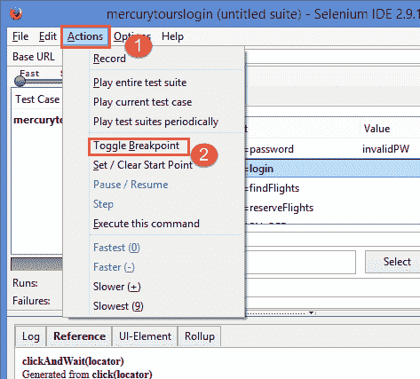
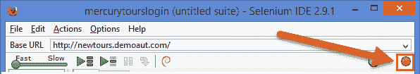
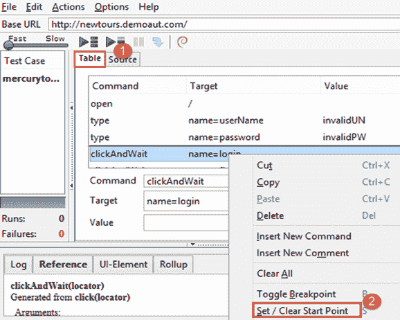
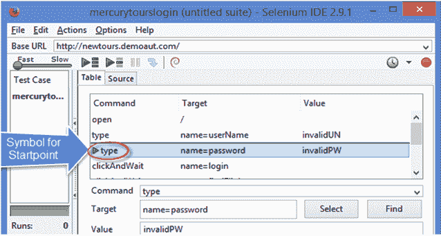
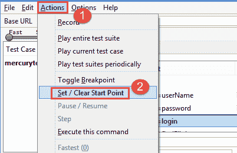

# 如何在 Selenium IDE 中进行调试 断点&起点

> 原文： [https://www.guru99.com/breakpoints-startpoints-selenium.html](https://www.guru99.com/breakpoints-startpoints-selenium.html)

断点用于检查代码的执行。 每当您在代码中实现断点时，执行都将在此处停止。 这可以帮助您验证代码是否按预期工作。 断点通常与源代码一起显示在 UI 中。

在本教程中，您将学习-

*   [硒的断点](#1)
*   [在硒](#2)中实现断点的方法
*   [硒的起点](#3)
*   [设置硒](#4)起始点的方法

## 硒的断点

Selenium 中的断点有助于调试。

有两种设置断点的方法，

*   在第一种方法中
    *   右键单击该命令，然后选择“ Toggle Breakpoint”。 您也可以使用键盘上的快捷键“ B”。
    *   您可以在要检查的[测试用例](/test-case.html)之前设置一个断点。
    *   设置断点后，单击“运行”按钮以从头到断点运行测试用例。
    *   重复相同的步骤以取消选择断点。
*   在第二种方法中
    *   选择菜单栏**->** '动作'**->** 选择 Toggle Breakpoint。 要取消选择，请重复相同的步骤。

为了演示，让我们考虑以下情形。 单击“登录”按钮时，验证“用户名”和“密码”。

## 在 Selenium 中实现断点的方法

**第一种方法：**

**步骤 1）**启动 Firefox 和 Selenium IDE。

**步骤 2）**键入基本 URL 为--- > **http://newtours.demoaut.com/**

**步骤 3）**单击“记录”按钮（在下面的屏幕快照中的红色框中标记）。

**步骤 4）**在此步骤中，

1.  在“表格”标签下，右键单击命令（“点击并等待”）
2.  在“命令”列下，选择“切换断点”。 您也可以使用键盘上的快捷键“ B”。

切换断点时，它将打开另一个窗口，如下所示。 您将在“命令”列下的“单击并等待”前面看到两个黄色管道标记。

它表明了两件事，

*   黄色的管道表明测试用例在该点已暂停。 因此，当您单击“运行”按钮时，执行从测试用例的开头开始到这一点。 之后，需要开始手动执行。

*   测试脚本可以具有多个断点，可以按照与上述相同的方式进行设置。

**第二种方法：**

**步骤 1）**遵循在第一种方法中提到的上述步骤 1、2 & 3。

**步骤 2）**在此步骤中，

1.  从菜单栏中单击选项“操作”，然后
2.  单击选项“切换断点”。

这一切都与 Selenium 中的断点有关。

## 硒的起点

在 Selenium 中，“起点”指示执行应从其开始的点。 当您想从代码中间或断点运行测试脚本时，可以使用起点。

为了理解这一点，让我们以登录方案为例。 假设，如果您必须登录网站并执行一系列测试，然后尝试调试其中一个测试。

在这种情况下，您必须登录一次，然后在开发测试时重新运行测试。 您可以设置登录后起点功能。 因此，每次执行新测试时，它将在登录功能后开始执行。

起点可以通过两种方法选择：

1.右键单击 Selenium IDE 中“命令”列下的任何命令。 选择选项“设置/清除起点”。 您也可以使用键盘上的快捷键“ S”标记起点（在屏幕截图中显示为绿色三角形）。 重复相同的步骤以取消选择起点。

2.单击“操作”->'设置/清除起点'。 这将选择起点或重复相同的步骤以取消选择它们。

## 设置硒起始点的方法

让我们来看第一种方法的例子，

**第一种方法：**

**Step 1)** Launch Firefox and Selenium IDE.

**Step 2)** Type the Base URL as ---> **http://newtours.demoaut.com/**

**步骤 3）**单击“记录”按钮（在下面的屏幕截图中以红色矩形框标记）。

**Step 4)** In this step,

1.  在“表格”标签下，右键单击命令“ clickandwait”
2.  现在选择选项“设置/清除起点”。 您也可以使用键盘上的快捷键“ S”来选择相同的“设置/清除起点”。

单击“设置/清除起点”时，它将打开另一个窗口。 在此窗口中，您可以在“命令”列下的“类型”之前看到绿色的三角形符号。

这个三角形符号表示测试用例从这一点开始。 所以

当您单击“运行”按钮时，从该点开始执行。

**注意**：单个测试脚本中只能有一个起点。 另外，起点取决于当前显示的页面。 如果用户在错误的页面上，执行将失败。

**第二种方法**：

1.  请按照前面（第一种）方法中提到的上述步骤 1、2 & 3 进行操作。
2.  接下来，请按照以下步骤操作，

1.  从菜单栏中单击选项“操作”，然后
2.  单击选项“设置/清除起点”。

**摘要**

*   断点和起点功能有助于调试过程。 它有助于在特定的实例点开始或暂停任何给定的测试。 这有助于观察测试脚本的行为。
*   在一个测试脚本中，与多个断点相比，只能有一个起点。

***本文由 Rupa Nallani 提供***