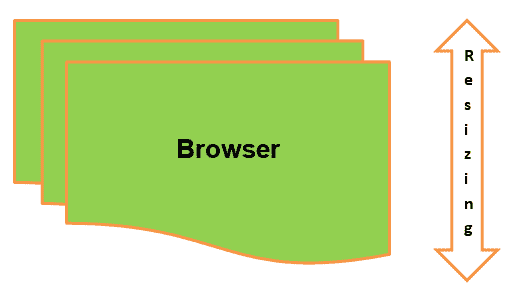

# 最大化 Selenium 中的浏览器

> 原文： [https://www.guru99.com/maximize-resize-minimize-browser-selenium.html](https://www.guru99.com/maximize-resize-minimize-browser-selenium.html)

在本教程中，您将学习如何使用 Selenium Webdriver 最大化，最小化或调整浏览器的大小。 通过使用 maximum（）方法和尺寸调整浏览器大小的不同场景进行了解释。

这是我们涵盖的内容：

*   [为什么要在 Selenium Automation 中最大化浏览器？](#1)
*   [如何最大化硒中的浏览器](#2)
*   [示例：使用 Selenium Web 驱动程序](#3)调整浏览器的大小
*   [示例：使用 Web 驱动程序最大化浏览器窗口。](#4)
*   [示例：使用 Web 驱动程序最小化浏览器窗口。](#5)

## 为什么要在 Selenium Automation 中最大化浏览器？

*如果浏览器未最大化，则硒可能无法识别 Web 应用程序上的元素，从而使框架失效。* 因此，最大化浏览器是 Selenium 框架中非常重要的部分。 最佳做法是在自动化任何 Web 应用程序时最大化浏览器。 当用户执行 Selenium 框架或任何脚本时，浏览器可能未处于全屏状态，因此您需要最大化浏览器以查看 Web 应用程序的所有元素。 最好在脚本开始时最大化浏览器，以使脚本成功执行而没有任何错误。

## 如何在 Selenium 中最大化浏览器

要最大化浏览器窗口，您需要调用驱动程序类的 Window 接口的 maximum（）方法。

```
void maximize() – This method is used to maximize the current browser.
```



您可以根据方案的要求自定义浏览器的大小。 Selenium Webdriver 没有提供任何最小化浏览器的方法，也没有这种直接方法。 您需要使用调整大小方法来最小化浏览器。

```
void setSize() – This method is used to set the size of the current browser.

Dimension getSize() – This method is used to get the size of the browser in height and width. It returns the dimension of the browser.

Point setPosition() – This method is used to set the position of the current browser.
```

## 示例：使用 Selenium Web 驱动程序调整浏览器的大小

### a）带有说明的硒脚本。

**脚本描述：**在下面的 Selenium 脚本中，显示了使用 testNG 框架调整浏览器的大小，该场景的步骤如下：

1.  打开 chrome 浏览器。
2.  启动站点。
3.  等待几秒钟以查看调整大小操作。
4.  关闭浏览器。

```
import org.openqa.selenium.Dimension;
import org.openqa.selenium.WebDriver;
import org.openqa.selenium.chrome.ChromeDriver;

public class Resize {

	public static void main(String args[]) throws InterruptedException
	{
		WebDriver driver;

		System.setProperty("webdriver.chrome.driver","E://Selenium//Selenium_Jars//chromedriver.exe");
		 driver= new ChromeDriver();

         // Launch the application
     	 driver.get("https://www.guru99.com/");

     	Dimension d = new Dimension(300,1080);
     	//Resize current window to the set dimension
     	   driver.manage().window().setSize(d);

     	 //To Delay execution for 10 sec. as to view the resize browser
     	 Thread.sleep(10000);

     	 //Close the browser
     	 driver.quit();
	}	
}

```

#### b）输出分析

打开 chrome 浏览器，调整浏览器的大小，等待几秒钟，然后关闭浏览器。

## 示例：使用 Web 驱动程序最大化浏览器窗口。

### a) Selenium script with explanation.

**脚本描述：**在下面的 Selenium 脚本中，显示了使用 testNG 框架最大化浏览器的情况，该场景的步骤如下：

1.  打开 chrome 浏览器。
2.  启动站点。
3.  等待几秒钟，以查看最大化操作。
4.  关闭浏览器。

```
import org.openqa.selenium.WebDriver;
import org.openqa.selenium.chrome.ChromeDriver;

public class Maximize {

	public static void main(String args[]) throws InterruptedException
	{
		WebDriver driver;

		System.setProperty("webdriver.chrome.driver","E://Selenium//Selenium_Jars//chromedriver.exe");
		 driver= new ChromeDriver();

         // Launch the application
     	 driver.get("https://www.guru99.com/");

     	     	//Resize current window to the set dimension
     	        driver.manage().window().maximize();

     	       //To Delay execution for 10 sec. as to view the maximize browser
     	        Thread.sleep(10000);

     	        //Close the browser
     	        driver.quit();
	}	
}

```

#### b) Output Analysis

打开 chrome 浏览器，最大化浏览器，等待几秒钟，然后关闭浏览器。

## 示例：使用 Web 驱动程序最小化浏览器窗口。

### a) Selenium script with explanation.

**脚本描述：**在下面的 Selenium 脚本中，使用 testNG 框架最小化了浏览器，该场景的步骤如下：

1.  打开 chrome 浏览器。
2.  启动站点。
3.  等待几秒钟以查看最小化操作。
4.  关闭浏览器。

```
import org.openqa.selenium.Point;
import org.openqa.selenium.WebDriver;
import org.openqa.selenium.chrome.ChromeDriver;

public class Minimize {

	public static void main(String args[]) throws InterruptedException
	{
		WebDriver driver;

		System.setProperty("webdriver.chrome.driver","E://Selenium//Selenium_Jars//chromedriver.exe");
		 driver= new ChromeDriver();

         // Launch the application
     	 driver.get("https://www.guru99.com/");

     	Point p = new Point(0,3000);

     	//Minimize the current window to the set position
     	        driver.manage().window().setPosition(p);

     	       //To Delay execution for 10 sec. as to view the minimize browser
     	        //you can view in the taskbar below of the screen.
     	        Thread.sleep(10000);

     	        //Close the browser
     	        driver.quit();
	}	
}

```

**注意：**如果用户要使用 Firefox 浏览器，则需要在以下所有上述 3 种场景脚本中设置 FirefoxDriver 的属性并创建 FirefoxDriver 对象而不是 ChromeDriver 对象，如下所示：

```
System.setProperty("webdriver.gecko.driver","E://Selenium//Selenium_Jars//geckodriver.exe ");
 driver= new FirefoxDriver();

```

#### b) Output Analysis

打开 chrome 浏览器，最小化浏览器，等待几秒钟，然后关闭浏览器。

## 故障排除

*   使用最新版本的 Selenium Jars，chromedriver，木偶驱动程序和 IEdriver 等。
*   检查硒罐和使用的浏览器的兼容性。

#### 摘要

*   在以上教程中，我们说明了通过不同场景调整浏览器的大小，例如根据项目框架中针对不同功能的要求最大化，最小化和调整大小。
*   在第一种情况下，我们显示了使用硒调整浏览器的大小。

    ```
    Dimension d = new Dimension(300,1080);
    driver.manage().window().setSize(d);

    ```

*   在第二种情况下，我们展示了硒中浏览器的最大化。

    ```
    driver.manage().window().maximize();

    ```

*   在第三种情况下，我们展示了最小化硒浏览器。

    ```
    Point p = new Point(0,3000);     	
    driver.manage().window().setPosition(p);

    ```