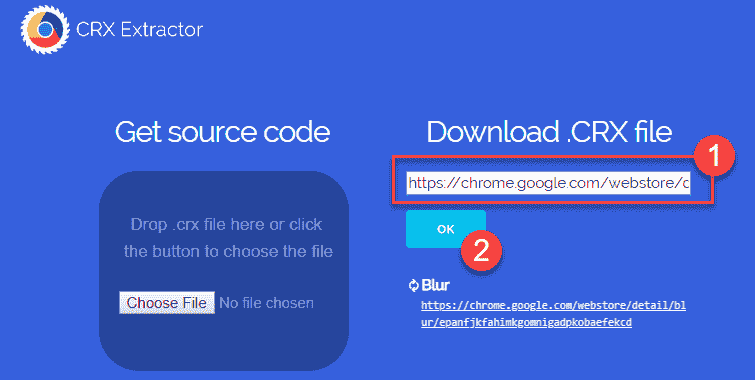
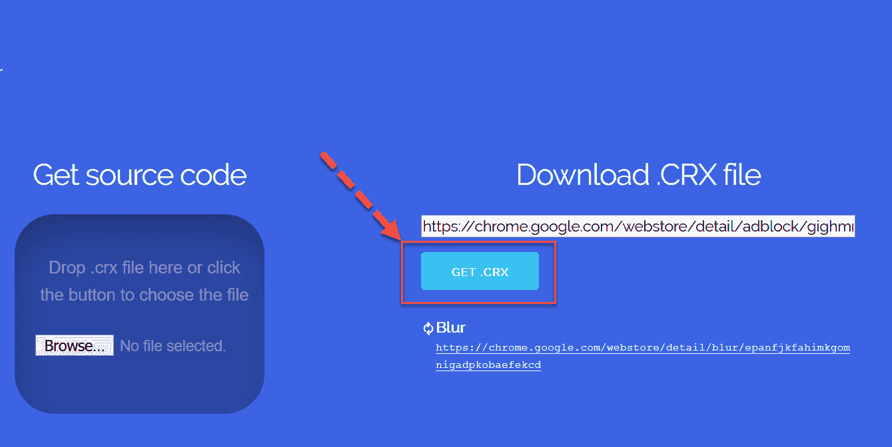
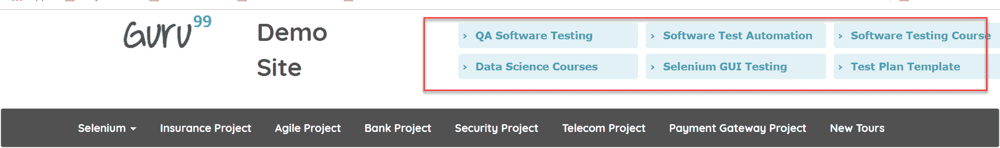
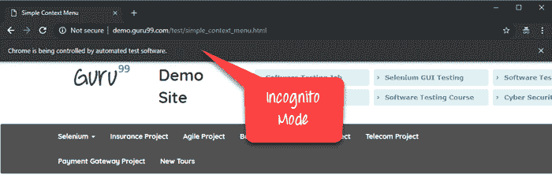
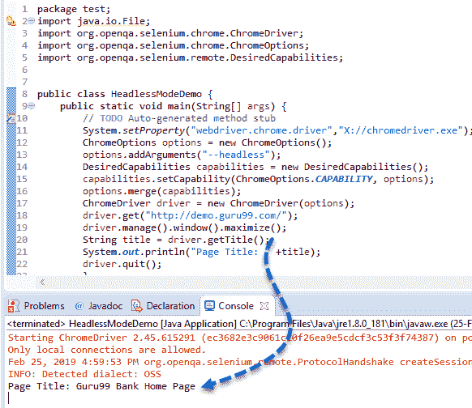

# Chrome 选项&所需功能：AdBlocker，隐身，无头

> 原文： [https://www.guru99.com/chrome-options-desiredcapabilities.html](https://www.guru99.com/chrome-options-desiredcapabilities.html)

## 什么是 Chrome 选项类？

Chrome 选项类用于操纵 Chrome 驱动程序的各种属性。 Chrome 选项类通常与所需功能结合使用。

**示例：**

以下示例显示了使用 ChromeOptions 类以最大化模式打开 Chrome 浏览器的方法。 我们需要将 ChromeOptions 类的实例传递给网络驱动程序初始化。

```
ChromeOptions options = new ChromeOptions()
options.addArgument("start-maximized");
ChromeDriver driver = new ChromeDriver(options);

```

以下是 ChromeOptions 类的可用参数和最常用参数的列表

*   **开始最大​​化**：以最大化模式打开 Chrome
*   **隐身模式：**以隐身模式打开 Chrome
*   **无头：**以无头模式打开 Chrome
*   **disable-extensions** ：禁用 Chrome 浏览器上的现有扩展
*   **disable-popup-blocking** ：禁用 Chrome 浏览器上显示的弹出窗口
*   **make-default-browser：**将 Chrome 设置为默认浏览器
*   **版本**：打印 Chrome 浏览器版本
*   **disable-infobars：**阻止 Chrome 显示“ Chrome 由自动化软件控制的通知

在本教程中，您将学习

*   [什么是 Chrome 选项类？](#1)
*   [所需功能类别](#2)
*   [Adblocker 扩展程序](#3)的 Chrome 选项
*   [隐身模式下的 Chrome 选项](#4)
*   [无头 Chrome](#5) 的 Chrome 选项

## 所需功能类别

所需功能类用于修改 Web 驱动程序的多个属性。 所需功能类提供一组键值对，以更改 Web 驱动程序的各个属性，例如浏览器名称，浏览器平台等。所需功能类最常用的方法是 setCapability 方法。 所需功能最常与 Selenium Grid 一起使用，在 Selenium Grid 中，相同的测试用例需要在不同的浏览器上执行。

**Example:**

下例显示了默认情况下使用 Desired Capabilities 类使 chrome 浏览器能够接受网站上的 SSL 证书的方法。

```
// Create an object of desired capabilities class with Chrome driver
DesiredCapabilities SSLCertificate = DesiredCapabilities.chrome();
// Set the pre defined capability – ACCEPT_SSL_CERTS value to true
SSLCertificate.setCapability(CapabilityType.ACCEPT_SSL_CERTS, true);
// Open a new instance of chrome driver with the desired capability
WebDriver driver = new ChromeDriver(SSLCertificate);

```

以下是最常用的预定义功能类型。

| 能力名称 | 描述 |
| ACCEPT_SSL_CERTS | 此属性告诉浏览器默认情况下接受 SSL 证书 |
| PLATFORM_NAME | 此属性用于设置用于访问网站的操作系统平台 |
| BROWSER_NAME | 此属性用于设置 Web 驱动程序实例的浏览器名称 |
| 版 | 此属性用于设置浏览器版本 |

## 适用于 Adblocker 扩展程序的 Chrome 选项

可以使用 Chrome Options 和 Desired Capabilities 类来处理 Chrome 浏览器的 Adblocker 扩展。 以下是使用 Desired Capabilities 类在 Chrome 浏览器上访问 AdBlocker 扩展程序的步骤。

**步骤 1）** AdBlocker 扩展程序必须在 Chrome 浏览器上安装，然后才能使用 Chrome 选项类

**步骤 2）**通过 http://crxextractor.com/提取与 AdBlocker 扩展名对应的 CRX 文件

**步骤 3）**将下载的 CRX 文件路径传递给 Chrome Options 类

**步骤 4）**使用所需的功能类和 chrome 选项对象实例化 Web 驱动程序

**Example:**

下面的示例演示了如何使用 Chrome Options 和 Desired Capabilities 类在 Chrome 浏览器上激活广告拦截器扩展。

```
ChromeOptions options = new ChromeOptions();
options.addExtensions(new File("Path to CRX File"));
DesiredCapabilities capabilities = new DesiredCapabilities();
capabilities.setCapability(ChromeOptions.CAPABILITY, options);
ChromeDriver driver = new ChromeDriver(capabilities);

```

### 提取 CRX 文件：

以下步骤演示了通过网站- [http://crxextractor.com/](http://crxextractor.com/) 通过 Ad Blocker 提取 CRX 文件的过程。

**步骤 1）**转到 [http://crxextractor.com/](http://crxextractor.com/) ，然后单击开始按钮


**步骤 2）**在文本框下方输入 Chrome 扩展程序–广告拦截器网址。 Chrome 网上应用店上 Adblock 的网址为 [https://chrome.google.com/webstore/detail/adblock/gighmmpiobklfepjocnamgkkbiglidom](https://chrome.google.com/webstore/detail/adblock/gighmmpiobklfepjocnamgkkbiglidom)

然后单击确定



**步骤 3）**单击“确定”按钮后，按钮的标签将变为“获取.CRX”，如下所示。 点击获取.CRX 按钮，扩展名对应的 CRX 文件将被下载



**步骤 4）**将文件保存到本地计算机上，记下保存的路径。 下一步是将保存的路径传递给 Chrome Options 类

#### 样例代码：

1.  您将在 [http://demo.guru99.com/](http://demo.guru99.com/) 上看到广告，如下所示



2.  在 Chrome 浏览器上启用 AdBlocker 扩展程序后，应禁用广告

```
package adblock;
import java.io.File;
import org.openqa.selenium.chrome.ChromeDriver;
import org.openqa.selenium.chrome.ChromeOptions;
import org.openqa.selenium.remote.DesiredCapabilities;

public class AdblockDemo {
public static void main(String[] args)  {

	System.setProperty("webdriver.chrome.driver","X://chromedriver.exe");		
	ChromeOptions options = new ChromeOptions();
	options.addExtensions(new File("X://extension_3_40_1_0.crx")); 
	DesiredCapabilities capabilities = new DesiredCapabilities();
	capabilities.setCapability(ChromeOptions.CAPABILITY, options);
	options.merge(capabilities);
	ChromeDriver driver = new ChromeDriver(options);
	driver.get("http://demo.guru99.com/test/simple_context_menu.html");
	driver.manage().window().maximize();
	//driver.quit();
	}

}

```

代码说明：

1.  最初，由于您使用的是 Chrome 浏览器进行测试，因此您需要使用 set 属性方法设置 chromedriver.exe 文件的路径
2.  您需要设置 CRX 文件的路径以添加扩展名方法
3.  然后，您需要创建一个具有所需功能类的对象，并将其传递给 Web 驱动程序实例。 从 Selenium 3.8.1 版本开始，不赞成使用驱动程序功能类，您需要先将功能对象与 Chrome 选项对象合并，然后再将其作为参数传递给 Chrome 驱动程序构造函数
4.  打开 URL- [http://demo.guru99.com/test/simple_context_menu.html](http://demo.guru99.com/test/simple_context_menu.html) 启用广告拦截程序扩展
5.  最大化并关闭浏览器

**注意：**我们正在通过自动化脚本在 Chrome 浏览器中启用 AdBlocker 扩展，而不是在 Chrome 浏览器中手动启用 Adblocker 扩展。 CRX 文件是一种使用自动化脚本访问广告拦截器扩展的方法

**输出：**

Chrome 浏览器将启用 AdBlocker 扩展程序，如下所示，并且没有任何广告


## 隐身模式下的 Chrome 选项

通过使用预定义参数– **incognito** ，Chrome 选项可用于隐身模式。

下面是实现相同目的的示例代码。

**示例代码：**

```
package test;
import java.io.File;
import org.openqa.selenium.chrome.ChromeDriver;
import org.openqa.selenium.chrome.ChromeOptions;
import org.openqa.selenium.remote.DesiredCapabilities;

public class Incognito{
public static void main(String[] args) {
	// TODO Auto-generated method stub
	System.setProperty("webdriver.chrome.driver","X://chromedriver.exe");
	ChromeOptions options = new ChromeOptions();
	options.addArguments("--incognito");
	DesiredCapabilities capabilities = new DesiredCapabilities();
	capabilities.setCapability(ChromeOptions.CAPABILITY, options);
	options.merge(capabilities);
	ChromeDriver driver = new ChromeDriver(options);		
	driver.get("http://demo.guru99.com/test/simple_context_menu.html");
	driver.manage().window().maximize();		
	//driver.quit();
	}
	}

```

**代码说明**：

1.  最初，由于您使用的是 Chrome 浏览器进行测试，因此您需要使用 set 属性方法设置 chromedriver.exe 文件的路径
2.  然后，您需要创建一个 Chrome Options 类的对象，并将其传递给 Web 驱动程序实例。 由于我们要以隐身模式打开 Chrome 浏览器，因此您需要将参数–incognito 传递给 Chrome Options 类。
3.  接下来，创建 Desired Capabilities 类的对象，并使用 merge 方法将 Desired Capabilities 类对象与 Chrome Options 类对象合并
4.  您需要创建一个 Chrome 驱动程序类的对象，并将 Chrome 选项对象作为参数传递
5.  最后，我们需要将 URL-http://demo.guru99.com/test/simple_context_menu.html 传递给 driver.get 方法
6.  最大化并关闭浏览器

**Output:**

chrome 浏览器窗口将以隐身模式打开，如下所示



## 无头 Chrome 的 Chrome 选项

无头浏览器在后台运行。 您将不会看到浏览器 GUI 或对其进行的操作。

可以通过使用预定义的参数 **headless** 来实现以无头模式运行 Chrome 浏览器的 Chrome 选项。

下面提到了实现它的示例代码。

**Example:**

```
package test;
import java.io.File;
import org.openqa.selenium.chrome.ChromeDriver;
import org.openqa.selenium.chrome.ChromeOptions;
import org.openqa.selenium.remote.DesiredCapabilities;

public class HeadlessModeDemo {
	public static void main(String[] args) {
		// TODO Auto-generated method stub
		System.setProperty("webdriver.chrome.driver","X://chromedriver.exe");
		ChromeOptions options = new ChromeOptions();
		options.addArguments("--headless");
		DesiredCapabilities capabilities = new DesiredCapabilities();
		capabilities.setCapability(ChromeOptions.CAPABILITY, options);
		options.merge(capabilities);
		ChromeDriver driver = new ChromeDriver(options);		
		driver.get("http://demo.guru99.com/");
		driver.manage().window().maximize();
		String title = driver.getTitle();
		System.out.println("Page Title: " +title);
		driver.quit();
		}

}

```

**Code Explanation**:

1.  最初，由于您使用的是 Chrome 浏览器进行测试，因此您需要使用 set 属性方法设置 chromedriver.exe 文件的路径
2.  接下来，创建一个 Chrome Options 类的对象，并将其传递给 Web 驱动程序实例。 由于我们想以无头模式打开 Chrome 浏览器，因此我们需要将参数–headless 传递给 Chrome Options 类。
3.  创建 Desired Capabilities 类的对象，并使用 merge 方法将 Desired Capabilities 类对象与 Chrome Options 类对象合并
4.  创建 Chrome 驱动程序类的对象，并将 Chrome 选项对象作为参数传递
5.  最后，我们需要将 URL-http://demo.guru99.com/传递给 driver.get 方法。
6.  打印页面标题并关闭浏览器

**输出**

由于上述代码将在无头模式下运行，因此对于以上代码，浏览器将不可见。 页面标题将被获取并显示如下。



### 摘要：

*   Chrome 选项类用于操纵 Chrome 驱动程序的各种属性
*   所需功能类提供一组键值对，以修改 Web 驱动程序的各个属性，例如浏览器名称，浏览器平台等。
*   要操作 Chrome 浏览器的任何扩展程序，必须提取与该扩展程序相对应的 CRX 文件，并将其添加到 Chrome 选项类
*   --incognito 和–headless 是 Chrome Options 类提供的预定义参数，用于在隐身模式和无头模式下使用 Chrome 浏览器