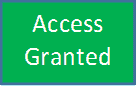
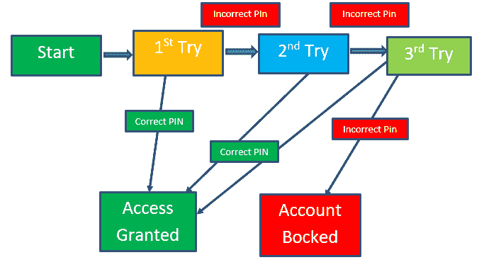
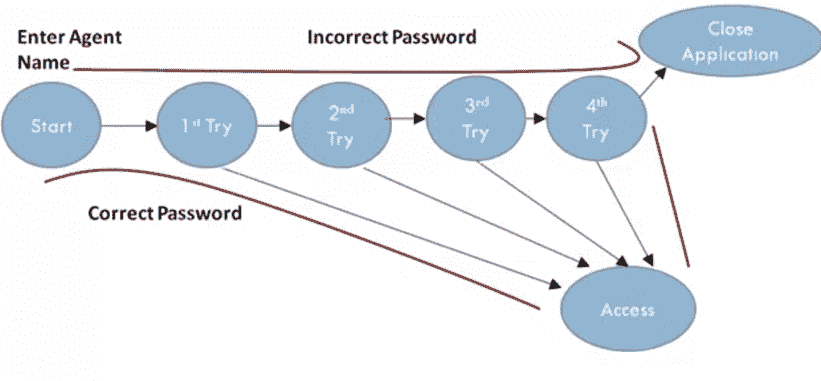
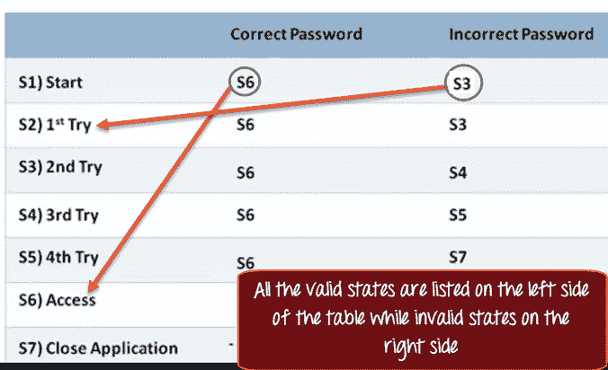

# 什么是状态转换测试？ 图表，技术，示例

> 原文： [https://www.guru99.com/state-transition-testing.html](https://www.guru99.com/state-transition-testing.html)

## 什么是测试状态转换？

状态转换测试定义为一种软件测试技术，其中输入条件的变化导致被测应用程序（AUT）的状态发生变化。

这是一种黑盒测试技术，其中测试人员针对序列中的不同输入条件来分析被测应用程序的行为。 在这种技术中，测试仪提供正输入和负输入测试值并记录系统行为。

它是系统和测试所基于的模型。 根据先前发生的情况，对于同一输入获得不同输出的任何系统都是有限状态系统。

**状态转换测试技术**在需要**测试不同系统转换的地方很有帮助。**

在本教程中，您将学习-

*   [什么是测试状态转换？](#1)
*   [何时使用状态转换？](#2)
*   [何时不依赖状态转换？](#3)
*   [状态转换图的四个部分](#4)
*   [状态转换图和状态转换表](#5)
*   [如何进行状态转换（状态转换的示例）](#6)
*   [状态转换技术的优缺点](#7)

## 何时使用状态转换？

*   当测试人员正在测试应用程序的一组有限的输入值时，可以使用此方法。
*   当测试人员试图测试被测应用程序中发生的事件序列时。 即，这将允许测试人员针对一系列输入值测试应用程序行为。
*   当被测系统过去依赖于事件/值时。

## 什么时候不依赖状态转换？

*   未针对顺序输入组合进行测试时。
*   如果要针对不同的功能（例如探索性测试）进行测试

## 状态转换图的四个部分

状态过渡模型包含以下四个主要部分

**1）指出软件可能会获得的**

**2）**从一种状态过渡到另一种状态

**3）引发过渡的事件**，例如关闭文件或取款

**4）过渡（错误消息或收到现金）导致的操作**。

## 状态转换图和状态转换表

有两种主要的方式来表示或设计状态转换，状态转换图和状态转换表。

在状态转换图中，状态以方框文本显示，并且转换由箭头表示。 也称为状态图或图形。 在识别有效过渡时很有用。

在状态转换表中，所有状态都在左侧列出，事件在顶部列出。 表中的每个单元格代表事件发生后系统的状态。 它也称为状态表。 在识别无效过渡时很有用。

## 如何进行状态转换（状态转换的示例）

### 范例 1：

让我们考虑一个 ATM 系统功能，如果用户输入无效密码三次，该帐户将被锁定。

在此系统中，如果用户在前三次尝试中均输入了有效密码，则该用户将成功登录。 如果用户在第一次或第二次尝试中输入了无效的密码，将要求用户重新输入密码。 最后，如果用户在第 3 次和第次输入错误的密码，该帐户将被阻止。

### 状态转换图

在图中，每当用户输入正确的 PIN 时，他便进入“访问授权”状态，如果输入的密码错误，则他将进入下一次尝试，并且如果在帐户的第 3 次和相同时都进行了相同操作 达到阻止状态。

### 状态转换表

|  | 

**正确的 PIN 码**

 | 

**PIN 码错误**

 |
| **S1）启动** | **S5** | **S2** |
| **S2）1 次 st 尝试** | **S5** | **S3** |
| **S3）2 和尝试** | **S5** | **S4** |
| **S4）3 次次尝试** | **S5** | **S6** |
| **S5）授予访问权限** | **-** | **-** |
| **S6）帐户已被阻止** | **-** | **-** |

在表中，当用户输入正确的 PIN 时，状态将转换为 S5（已授予访问权限）。 并且，如果用户输入了错误的密码，他将进入下一个状态。 如果他第 3 次和做相同的时间，则他将进入帐户被阻止状态。

### 范例 2：

**在参考以下示例之前，请先检查此视频：**

在航班预订登录屏幕中，考虑到您必须输入正确的座席名称和密码才能访问航班预订应用程序。

<figure>

 

<figcaption>状态转换图</figcaption>

</figure>

它使您可以使用正确的密码和登录名访问应用程序，但是如果输入错误的密码怎么办。

该应用程序允许进行三次尝试，如果用户在第四次尝试中输入了错误的密码，则系统会自动关闭该应用程序。

状态图可帮助您确定要测试的有效过渡。 在这种情况下，必须使用正确的密码和错误的密码进行测试。 对于测试方案，登录第 2 和第，第 3 和和第 4 和可以尝试测试任何人。

您可以使用状态表来确定无效的系统转换。

在状态表中，所有有效状态都列在表的左侧，而导致它们发生的事件则列在顶部。

每个单元代表当相应事件发生时状态系统将移至的状态。

例如，在 S1 状态下，输入正确的密码将进入状态 S6（已授予访问权限）。 假设第一次尝试输入的密码错误，将进入状态 S3 或第二次尝试。

同样，您可以确定所有其他状态。

使用此方法突出显示两个无效状态。 假设您处于状态 S6，即您已经登录到应用程序，并且您打开了另一个航班预订实例，并为同一座席输入了有效或无效的密码。 这种情况下的系统响应需要进行测试。

## 状态转换技术的优缺点

| 

**优势**

 | 

**劣势**

 |
| 这种测试技术将以图形或表格形式表示系统行为，这将使测试人员有效地覆盖和理解系统行为。 | 这种测试技术的主要缺点是我们不能每次都依赖这种技术。 例如，如果系统不是有限系统（不是按顺序排列），则不能使用此技术。 |
| 通过使用此测试，技术测试人员可以验证是否满足所有条件并捕获了结果 | 另一个缺点是，您必须定义系统的所有可能状态。 尽管对于小型系统而言这是可以的，但由于状态数量呈指数级增长，因此很快可以分解为大型系统。 |

## 摘要：

*   状态转换测试定义为一种测试技术，其中输入条件的变化导致被测应用程序的状态发生变化。
*   在软件工程中，状态转换测试技术在需要测试不同系统转换的地方很有用。
*   表示或设计状态转换的两种主要方法是：状态转换图和状态转换表。
*   在状态转换图中，状态以方框文本显示，并且转换由箭头表示。
*   在状态转换表中，所有状态都在左侧列出，事件在顶部列出。
*   此测试技术的主要优点是，它将提供系统行为的图形或表格表示形式，这将使测试人员有效地了解和理解系统行为。
*   这种测试技术的主要缺点是我们不能每次都依赖这种技术。