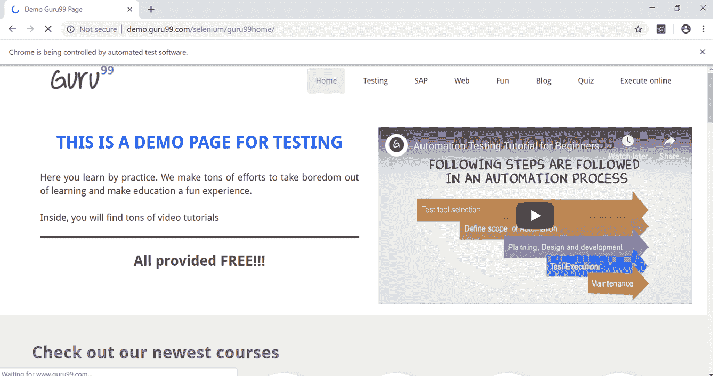

# 使用 Selenium Webdriver 刷新页面

> 原文： [https://www.guru99.com/selenium-refresh-page.html](https://www.guru99.com/selenium-refresh-page.html)

在基于 Web 的应用程序的测试自动化期间，需要多次刷新页面才能完全加载所有 Web 元素。 在初始页面加载时，某些 Web 元素可能会加载，而所有要加载的 Web 元素都需要刷新第二页面。 这可以使用 Selenium Web 驱动程序提供的刷新命令来完成。 可以在 Selenium 中使用以下方式执行浏览器刷新操作。 在整篇文章中，我们将详细讨论以下提到的方式。

1.  Driver.navigate.refresh 命令
2.  发送密钥命令
3.  Driver.navigate.to 命令

## Driver.navigate.refresh 命令：

这是 Selenium Web 驱动程序提供的用于执行页面刷新操作的内置方法。 该命令是整个测试自动化中最常用的用于执行页面刷新操作的命令。 刷新命令可以以一种简单的方式使用，如下所述。

```
driver.get("http://demo.guru99.com/selenium/guru99home/");
driver.navigate().refresh();
```

导航是用于执行各种浏览器操作的界面，例如导航到上一页，导航到下一页，页面刷新，浏览器关闭。 可以使用命令 driver.navigate（）访问导航界面方法。 Navigation 界面的 Refresh 方法不带任何参数或返回任何值。

## **示例：**

## **测试方案：**

1.  使用网页打开 Firefox 浏览器- [http://demo.guru99.com/selenium/guru99home/](http://demo.guru99.com/selenium/guru99home/)
2.  成功加载页面后，请使用 driver.navigate.refresh 方法刷新网页
3.  使用 driver.close（）方法关闭浏览器

### 码

```
package Guru99Demo;
import org.openqa.selenium.WebDriver;
import org.openqa.selenium.chrome.ChromeDriver;
public class RefreshDemo {
public static void main(String args[]) throws InterruptedException
{
System.setProperty("webdriver.chrome.driver", "D: \\chromedriver.exe");
WebDriver driver = new ChromeDriver();
driver.get("http://demo.guru99.com/selenium/guru99home/");
driver.manage().window().maximize();
driver.navigate().refresh();
driver.close();
}
}
```

**代码输出：**

初始页面加载


页面刷新操作后...视频已更改



## **多种其他方式刷新页面**

## 1）获取方法：

可以以递归方式使用 Get 方法刷新页面。 为了实现这一点，我们需要将另一个方法作为参数传递给 get 方法。

### **示例：**

```
driver.get("https://www.guru99.com");
driver.get(driver.getCurrentURL());
```

## 2）导航方法：

此方法使用与上述相同的递归概念。 getCurrentURL（）方法作为参数传递给 driver.navigate.to 方法。

### **Example:**

```
driver.get("https://www.guru99.com");
driver.navigate.to(driver.getCurrentURL());
```

## 3）使用 F5 键发送键方法：

这是在 Selenium 中刷新页面的第二种最常用的方法。 它以刷新键（F5 键）作为参数来发送键方法。 由于发送键仅适用于 Web 元素，而不适用于浏览器，因此我们必须首先在网页上标识有效的 Web 元素，然后再使用发送键方法。 可以如下所示完成。

### **Example:**

```
driver.get("https://www.guru99.com");
driver. findElement(By.id("username")).sendKeys(Keys.F5); 
```

## 4）使用 ASCII 码的发送密钥方法：

此方法使用与上面相同的概念，但是没有将 F5 键作为参数传递，而是将刷新键的 ASCII 码作为参数发送。 可以如下所示完成。

```
driver.get("https://www.guru99.com");
driver. findElement(By.id("username")).sendKeys(“\uE035”); 
```

## **摘要：**

*   页面刷新操作可确保在继续进行测试用例自动化之前，已完全加载页面的所有 Web 元素
*   Selenium 中最常用的页面刷新方法是 driver.navigate（）。refresh（）方法
*   Get 方法和 Navigation 方法包括在 Selenium 中刷新页面的递归方法
*   通过将 F5 键作为参数或其对应的 ASCII 代码传递，可以使用“发送键”方法刷新页面。