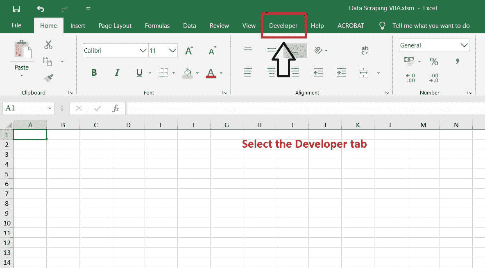
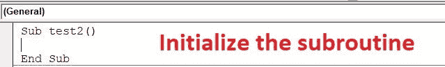
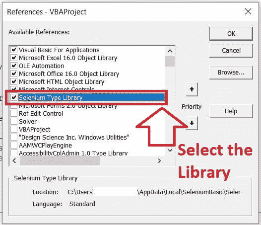
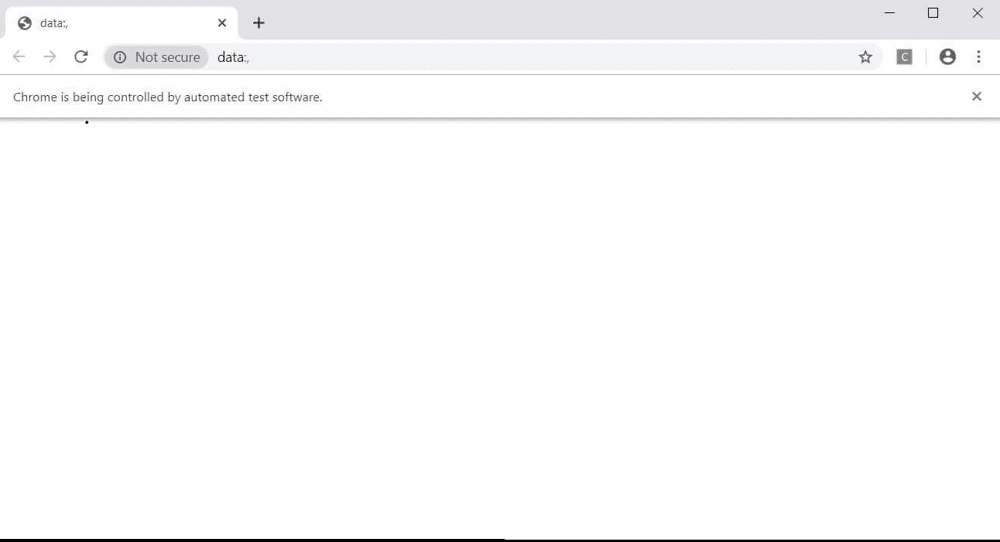
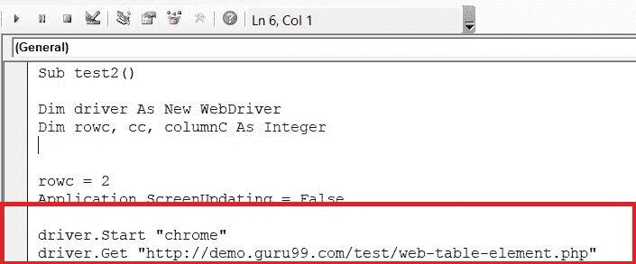
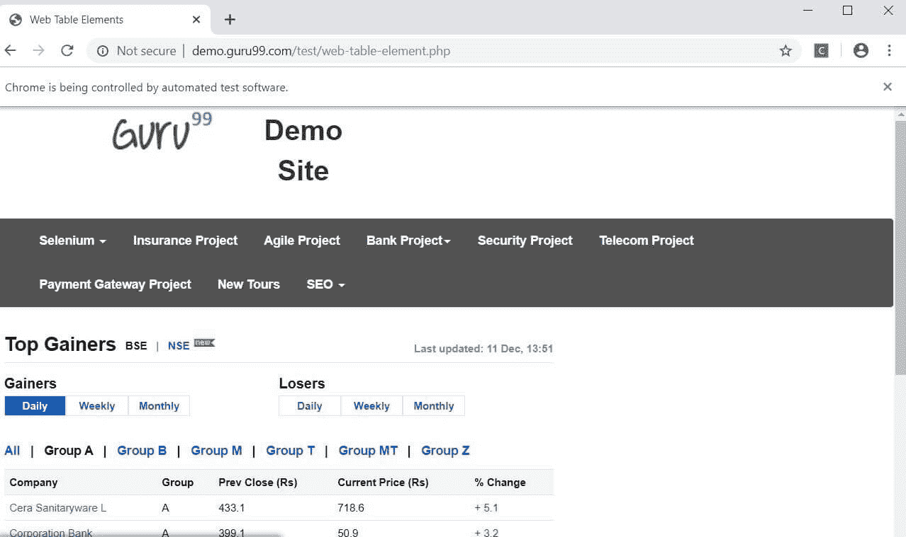
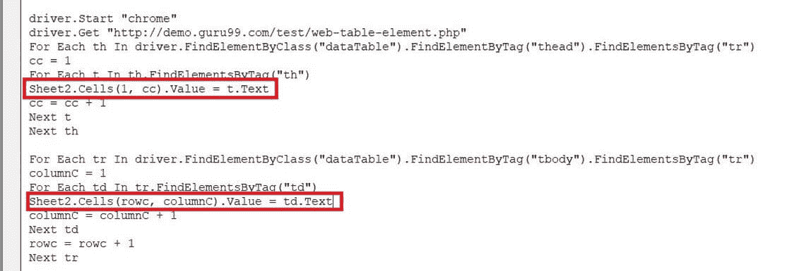
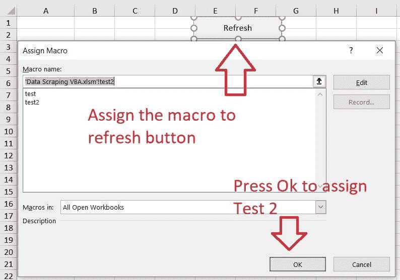
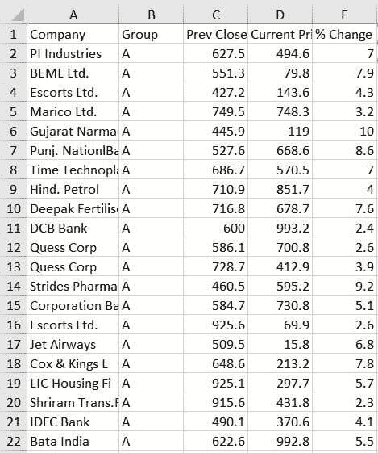
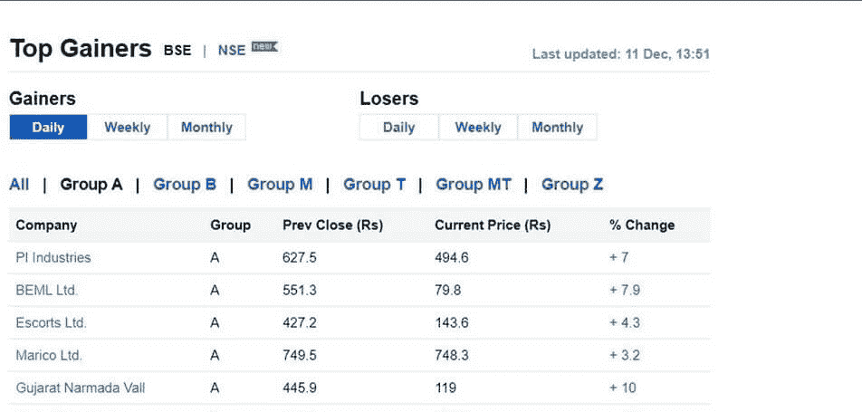

# 使用 Excel VBA 和 Selenium

> 原文： [https://www.guru99.com/excel-vba-selenium.html](https://www.guru99.com/excel-vba-selenium.html)

## 什么是使用硒的数据收集？

硒可以归类为自动化工具，可帮助从 HTML 网页抓取信息以利用 Google chrome 进行网页抓取。

在本教程中，您将学习：

*   [什么是使用硒的数据收集？](#1)
*   [如何在使用 Selenium 执行数据抓取之前准备 Excel 宏？](#2)
*   [如何使用 VBA 打开 Goog​​le Chrome？](#3)
*   [如何使用 VBA 在 Google chrome 中打开网站？](#4)
*   [如何使用 VBA 从网站上抓取信息？](#5)

## 如何在使用 Selenium 执行数据抓取之前准备 Excel 宏？

在进入 excel 中的数据抓取过程之前，必须对 excel 宏文件执行某些先决条件。

这些先决条件如下：-

**步骤 1）**打开一个基于 Excel 的宏，并访问 excel 的开发人员选项。



**步骤 2）**在“开发人员”功能区下选择“ Visual Basic”选项。


**步骤 3）**插入一个新模块。


**步骤 4）**初始化一个新的子例程，并将其命名为 test2。

```
Sub test2()
End sub

```

以下是模块中的结果：-



**步骤 5）**访问“工具”选项卡下的引用选项，并引用 Selenium 类型库。 以下库将作为该模块的参考，因为它有助于打开 google chrome，并有助于宏脚本的开发。



现在，Excel 文件已准备就绪，可以与 Internet Explorer 进行交互。 下一步将是合并一个宏脚本，该脚本有助于以 HTML 抓取数据。

## 如何使用 VBA 打开 Goog​​le Chrome？

这是使用 VBA 打开 Goog​​le Chrome 浏览器的步骤

**步骤 1）**声明并初始化子例程中的变量，如下所示

```
Sub test2()
Dim driver as new webdriver
Dim rowc, cc, columnC as integer

```

**步骤 2）**要使用硒和 VBA 打开 google chrome，请编写 driver.start“ chrome”，然后按 **F5** 。

以下是代码。

```
Sub test2()
Dim driver as new webdriver
Dim rowc, cc, columnC as integer
Driver.start "Chrome"
Application.Wait Now+Timevalue("00:00:20")
End sub

```

该模块的结果如下：-



## 如何使用 VBA 在 Google chrome 中打开网站？

一旦您能够使用 VBA 访问 Google chrome，下一步就是合并使用 VBA 对网站的访问。 通过 get 函数可以方便地完成此操作，其中 URL 必须在属性中作为双引号传递。

按照显示的以下步骤

该模块如下所示：-



按 F5 执行宏。

以下网页将在谷歌浏览器中打开，如下所示

```
Sub test2()
Dim driver as new webdriver
Dim rowc, cc, columnC as integer
Driver.start "Chrome"
Driver.get "http://demo.guru99.com/test/web-table-element.php"
Application.Wait Now+Timevalue("00:00:20")
End sub

```



现在，excel 宏已准备好执行抓取任务。 下一步将显示如何通过应用硒和 VBA 提取信息。

## 如何使用 VBA 从网站中抓取信息？

假设日间交易员希望每天访问网站上的数据。 当日交易者每次点击按钮时，它将自动将市场数据提取到 excel 中。

在上述网站上，有必要检查元素并观察数据的结构。 通过按 Control + Shift + I 访问下面的 HTML 源代码

```
<table class="datatable">
<thead>
<tr>
<th>Company</th>
<th>Group</th>
<th>Pre Close (Rs)</th>
<th>Current Price (Rs)</th>
<th>% Change</th>
</tr>

```

源代码如下：-

可以看出，数据被构造为单个 HTML 表。 因此，为了从 HTML 表中提取整个数据，将需要设计宏，该宏将提取 HTML 表的标题信息以及与该表关联的相应数据。 执行以下显示的任务：-

**步骤 1）**制定一个将 HTML 头信息作为集合运行的 for 循环。 硒驱动程序必须找到 HTML 表的标题信息。 为此，我们利用 FindElementByClass（）和 FindElementByTag（）方法执行显示的任务

VBA 模块如下所示：-

```
Sub test2()
Dim driver As New WebDriver
Dim rowc, cc, columnC As Integer
rowc = 2
Application.ScreenUpdating = False
driver.Start "chrome"
driver.Get "http://demo.guru99.com/test/web-table-element.php"
For Each th In driver.FindElementByClass("dataTable").FindElementByTag("thead").FindElementsByTag("tr")
cc = 1
For Each t In th.FindElementsByTag("th")
Sheet2.Cells(1, cc).Value = t.Text
cc = cc + 1
Next t
Next th

```

**步骤 2）**接下来，如上所述，Selenium 驱动程序将使用类似的方法来定位表数据。 您必须编写以下代码：-

```
Sub test2()
Dim driver As New WebDriver
Dim rowc, cc, columnC As Integer
rowc = 2
Application.ScreenUpdating = False
driver.Start "chrome"
driver.Get"http://demo.guru99.com/test/web-table-element.php"
For Each th In driver.FindElementByClass("dataTable").FindElementByTag("thead").FindElementsByTag("tr")
cc = 1
For Each t In th.FindElementsByTag("th")
Sheet2.Cells(1, cc).Value = t.Text
cc = cc + 1
Next t
Next th
For Each tr In driver.FindElementByClass("dataTable").FindElementByTag("tbody").FindElementsByTag("tr")
columnC = 1
For Each td In tr.FindElementsByTag("td")
Sheet2.Cells(rowc, columnC).Value = td.Text
columnC = columnC + 1
Next td
rowc = rowc + 1
Next tr
Application.Wait Now + TimeValue("00:00:20")
End Sub

```

vba 模块如下所示：-

可以通过 excel 表格的 Range 属性或 excel 表格的单元格属性来初始化 excel。 为了降低 VBA 脚本的复杂性，将收集数据初始化为工作簿中存在的工作表 2 的 excel 单元格属性。 此外，text 属性有助于获取放置在 HTML 标记下的文本信息。

```
Sub test2()
Dim driver As New WebDriver
Dim rowc, cc, columnC As Integer
rowc = 2
Application.ScreenUpdating = False
driver.Start "chrome"
driver.Get"http://demo.guru99.com/test/web-table-element.php"
For Each th In driver.FindElementByClass("dataTable").FindElementByTag("thead").FindElementsByTag("tr")
cc = 1
For Each t In th.FindElementsByTag("th")
Sheet2.Cells(1, cc).Value = t.Text
cc = cc + 1
Next t
Next th
For Each tr In driver.FindElementByClass("dataTable").FindElementByTag("tbody").FindElementsByTag("tr")
columnC = 1
For Each td In tr.FindElementsByTag("td")
Sheet2.Cells(rowc, columnC).Value = td.Text
columnC = columnC + 1
Next td
rowc = rowc + 1
Next tr
Application.Wait Now + TimeValue("00:00:20")
End Sub

```

The vba module would look as follows: -



**步骤 3）**宏脚本准备就绪后，将子例程传递并分配给 excel 按钮，然后退出 VBA 模块。 将按钮标记为刷新或可以对其进行初始化的任何合适的名称。 对于此示例，按钮被初始化为刷新。



**步骤 4）**按下刷新按钮以获取以下提到的输出



**步骤 5）**将 excel 中的结果与 Google chrome 的结果进行比较



### 摘要：

*   硒可以归类为自动化工具，可帮助从 HTML 网页抓取信息以利用 Google chrome 进行网页抓取。
*   互联网上的抓取操作应谨慎进行。
*   刮除信息通常违反网站条款。
*   通过硒进行抓取时，它将提供多种浏览器支持。
*   换句话说，抓取工具还可以通过 Firefox 和 Internet Explorer 执行类似的抓取任务。