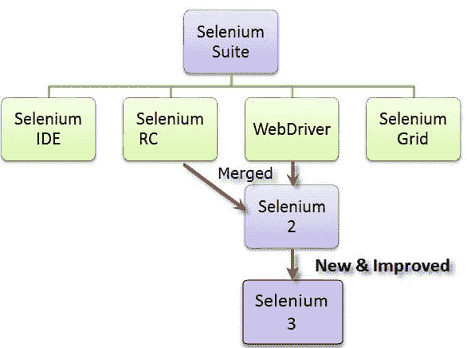

# 前 100 个硒面试问题&答案

> 原文： [https://www.guru99.com/top-100-selenium-interview-questions-answers.html](https://www.guru99.com/top-100-selenium-interview-questions-answers.html)

以下是针对新生和经验丰富的 Selenium Tester 的采访中的常见问题。

#### 1）什么是硒，由什么组成？

Selenium 是一套用于自动 Web 测试的工具。 它是由

*   **Selenium IDE（集成开发环境）：**是用于记录和回放的工具。 这是一个 Firefox 插件
*   **WebDriver 和 RC：**它提供​​适用于 Java，.NET，PHP 等多种语言的 API。大多数浏览器都可使用 Webdriver 和 RC。
*   **网格：**借助网格，您可以在多台计算机上分发测试，以便测试可以并行运行，这有助于减少在浏览器测试套件中运行所需的时间

#### 2）什么是 Selenium 2.0？

Web [测试](/software-testing.html)工具 Selenium RC 和 WebDriver 整合在 Selenium 2.0 的单个工具中

#### 3）提到什么是硒 3.0？

Selenium 3.0 是 Selenium 的最新版本。 它已经发布了硒 3.0 的 2 个 beta 版本，但几乎没有进行以下更改：

这是 Selenium 3.0 中添加的一些新功能

| **Beta 1 更新** | **Beta 2 更新（仅适用于 Java）** |
| 

*   最低 [Java](/java-tutorial.html) 版本现在为 8+

 | 

*   现在，系统属性 webdriver.gecko.driver 强制服务器以木偶或传统的 Firefox 驱动程序模式运行，而忽略任何相关的所需功能

 |
| 

*   它将通过 Mozilla 的 geckodriver

支持 Firefox。 | 

*   当未指定-browser 时，Grid 会修复 NPE 的注册问题

 |
| 

*   MS 提供了对 Edge 的支持
*   现在，它通过 Apple 自己的 Safari 驱动程序

支持 MacOS 上的 Safari。 | 

*   在所有绑定中更新 GeckoDriver –port 参数

 |

#### 4）您将如何使用 Selenium 查找元素？

在 Selenium 中，网页中的每个对象或控件都称为元素，有多种方法可在网页中查找元素

*   ID
*   Name
*   标签
*   属性
*   的 CSS
*   LinkText
*   PartialLink 文字
*   Xpath 等

#### 5）列出 Selenium 支持的测试类型吗？

对于基于 Web 的应用程序测试，可以使用硒

可以支持的测试类型是

a）功能，了解有关[功能测试的更多信息。](/functional-testing.html)

b）回归

对于带有持续集成自动化工具的发布后验证，可以使用

a）詹金斯

b）哈德逊

c）快速构建

d）CruiseCont

#### 6）解释 Selenium 中的断言是什么，断言的类型是什么？

断言用作验证点。 它验证应用程序的状态是否符合预期。 断言的类型为“断言”，“验证”和“ waitFor”。

#### 7）提到 X 路径的用途是什么？

X-Path 用于在网页中查找 WebElement。 在识别动态元素时也很有用。

请参阅 [XPath](/xpath-selenium.html) 的完整指南

#### 8）解释 X 路径中单斜杠和双斜杠之间的区别吗？

Single slash ‘/ ’

*   从文档节点开始选择单斜杠（/）
*   它允许您创建“绝对”路径表达式

Double Slash ‘// ’

*   双斜杠（//）开始选择匹配文档中的任何位置
*   它可以创建“相对”路径表达式

#### 9）列出硒的技术挑战吗？

Technical challenges with Selenium are

*   Selenium 仅支持基于 Web 的应用程序
*   它不支持位图比较
*   对于任何与报告相关的功能，都必须依赖第三方工具
*   与 HP UFT 等商业工具相比，该工具没有供应商支持
*   由于 Selenium 中没有对象存储库概念，因此对象的可维护性变得困难

#### 10）输入键和输入命令有什么区别？

在大多数情况下，TypeKeys（）会触发 [JavaScript](/interactive-javascript-tutorials.html) 事件，而.type（）不会。 Type 键使用 JavaScript 填充 value 属性，而.typekeys（）类似于实际用户键入

#### 11）验证和断言命令之间有什么区别？

**断言：**断言允许检查元素是否在页面上。 如果断言的元素不可用，则测试将在失败的步骤上停止。 换句话说，测试将在检查失败的地方终止。

**验证：**验证命令将检查元素是否在页面上，如果不是，则测试将继续执行。 在验证中，即使任何测试失败，所有命令也将保证运行。

#### 12）什么是 JUnit 注释？什么是有用的不同类型的注释？

在 JAVA 中，可以将特殊形式的语法元数据添加到 Java 源代码中，这被称为注释。 变量，参数，包，方法和类都带有注释，其中一些有用的 [Junit](/junit-tutorial.html) 注释是

*   测试
*   之前
*   后
*   忽视
*   课前
*   下课以后
*   运行方式

#### 13）使用点击命令时，可以使用屏幕坐标吗？

要单击元素的特定部分，您将需要使用 clickAT 命令。 ClickAt 命令接受元素定位符和 x，y 坐标作为参数-clickAt（定位符，cordString）

#### 14）硒的优点是什么？

*   它支持 C＃，PHP，Java，Perl，Phython
*   它支持 Windows，[，Linux](/unix-linux-tutorial.html) 和 Mac OS 等不同的操作系统
*   它具有强大的方法来定位元素（Xpath，DOM，CSS）
*   它拥有 Google 高度支持的开发者社区

#### 15）为什么测试人员应该选择硒而不是 QTP？

Selenium is more popular than [QTP](/quick-test-professional-qtp-tutorial.html) as

*   硒是开放源，而 QTP 是商业工具
*   Selenium 专门用于测试基于 Web 的应用程序，而 QTP 也可以用于测试客户端服务器应用程序
*   Selenium 在 Windows，Mac，Linux 等操作系统上支持 Firefox，IE，Opera 和 Safari。但是 QTP 仅限于 Windows 上的 Internet Explorer。
*   Selenium 支持许多编程语言，例如 Ruby，Perl， [Python](/python-tutorials.html) ，而 QTP 仅支持 VB 脚本

#### 16）您必须在 Selenium 中传递四个参数？

Four parameters that you have to pass in Selenium are

*   主办
*   端口号
*   浏览器
*   网址

#### 17）setSpeed（）和 sleep（）方法有什么区别？

两者都会延迟执行速度。

Thread.sleep（）：将在指定时间段内停止当前（java）线程。 只做一次

*   它采用整数形式的单个参数

Ex: thread.sleep(2000)- It will wait for 2 seconds

*   它仅在睡眠时给出的命令中等待一次

SetSpeed () :  For specific amount of time it will stop the execution for every selenium command.

*   它采用整数形式的单个参数

Ex: selenium.setSpeed(“2000”)- It will wait for 2 seconds

*   在 setSpeed 延迟后以 set Speed 中提到的毫秒数运行每个命令

This command is useful for  demonstration purpose or if you are using a slow web application

#### 18）什么是原产地政策？ 如何避免采用相同来源政策？

出于安全原因引入**“相同来源策略”** ，它可以确保您站点的内容永远不会被其他站点的脚本访问。 根据该政策，浏览器中加载的任何代码只能在该网站的域内运行。

为了避免使用“相同起源策略”代理注入方法，在代理注入模式下，Selenium Server 充当客户端配置的 **HTTP 代理**，该代理位于浏览器和被测应用程序之间，然后在 AUT 下屏蔽 AUT。 虚构网址

#### 19）什么是特权更高的浏览器？

特权提高的目的类似于代理注入，它允许网站执行通常不允许的操作。 关键区别在于浏览器以一种特殊的方式启动，该方式称为“增强特权”。 通过使用这些浏览器模式，Selenium 核心可以直接打开 AUT，也可以读取/写入其内容，而无需将整个 AUT 传递给 Selenium RC 服务器。

#### 20）您如何使用 Selenium 来“提交”表单？

您可以在元素上使用“提交”方法来提交表单-

element.submit（）;

或者，您可以在进行表单提交的元素上使用 click 方法

#### 21）TestNG 的功能是什么，并列出了 TestNG 的一些功能使其更有效？

TestNG 是基于 JUnit 和 NUnit 的测试框架，可简化从[单元测试](/unit-testing-guide.html)到[集成测试](/integration-testing.html)的广泛测试需求。 使其成为高效测试框架的功能是

*   支持注释
*   支持数据驱动的测试
*   灵活的测试配置
*   能够重新执行失败的测试用例

#### 22）提及隐式等待和显式等待之间有什么区别？

隐式等待：为所有连续的 Web 元素搜索设置超时。 在指定的时间内，它将尝试一次又一次查找元素，然后引发 NoSuchElementException。 它等待元素出现。

显式等待：这是一次计时器，用于特定搜索。

#### 23）您应该在脚本中的哪个属性中考虑“如果没有 ID，也没有名称”？

您可以使用…..driver.findElements（By.xpath（“ // iframe”））…。

这将返回帧列表。

您将需要切换到每一帧并搜索我们想要的定位器。

然后打破循环

#### 24）请解释一下 find 元素（）和 find 元素（）有什么区别？

查找元素（）：

它使用给定的“定位机制”在当前页面中找到第一个元素。 它返回一个 WebElement

findElements（）：使用给定的“定位机制”查找当前页面内的所有元素。 它返回 Web 元素列表。

#### 25）解释与 Selenium 链接的 JUnits 批注是什么？

与 Selenium 链接的 JUnits 注释是

*   @Before public void method（）–它将在每次测试之前执行 method（），此方法可以准备测试
*   @Test public void method（）–注释@Test 标识此方法是测试方法环境
*   @after public void method（）-要在使用此批注之前执行方法，测试方法必须以 test @ Before 开头

#### 26）解释什么是数据驱动框架和关键字驱动？

**数据驱动框架：**在此框架中，测试数据被分离并保存在测试脚本之外，而[测试用例](/test-case.html)逻辑位于测试脚本中。 从外部文件（Excel 文件）中读取测试数据，并将其加载到“测试脚本”内部的变量中。 变量用于输入值和验证值。

**关键字驱动的框架：**关键字驱动的框架要求开发数据表和关键字，而与测试自动化无关。 在关键字驱动的测试中，被测试应用程序的功能记录在表格中，并逐项记录每个测试的说明。

#### 27）请解释如何显示任何密码和用户名身份验证弹出窗口以登录任何网站？

通过网址传递用户名和密码

*   语法-http：//用户名：password @ url
*   ex- http：// creyate：此电子邮件地址已受到防止垃圾邮件机器人的保护。 您需要启用 JavaScript 才能查看它。

#### 28）说明如何使用 Selenium 2.0 声明网页文本？

WebElement el = driver.findElement（By.id（“ ElementID”））

//从元素获取测试并存储在文本变量中

字符串文本= el.getText（）;

//从预期中声明文本

Assert.assertEquals（“元素文字”，文字）；

#### 29）解释 Borland Silk 和 Selenium 有什么区别？

| **丝绸测试工具** | **硒测试工具** |
| 

*   Borland Silk 测试不是免费的测试工具

 | 

*   Selenium 是完全免费的测试自动化工具

 |
| 

*   Silk 测试仅支持 Internet Explorer 和 Firefox

 | 

*   Selenium 支持许多浏览器，例如 Internet Explorer，Firefox，Safari，Opera 等

 |
| 

*   Silk 测试使用测试脚本语言

 | 

*   Selenium 套件具有使用 Java，Ruby，Perl 等

等多种语言的灵活性。 |
| 

*   Silk 测试可用于客户端服务器应用程序

 | 

*   硒只能用于 Web 应用程序

 |

#### 30）什么是对象存储库？

在任何 UI 自动化中，对象存储库都是必不可少的实体，它允许测试人员将要在脚本中使用的所有对象存储在一个或多个集中位置，而不是分散在整个测试脚本中。

#### 31）解释 Selenium Grid 的工作原理吗？

[Selenium Grid](/introduction-to-selenium-grid.html) 将测试发送到中心。 这些测试将重定向到 Selenium Webdriver，后者将启动浏览器并运行测试。 对于整个测试套件，它允许并行运行测试。

#### 32）我们可以使用 Selenium 网格进行性能测试吗？

是。 但是没有像 Loadrunner 这样的专用[性能测试](/performance-testing.html)工具那样有效。

#### 33）列出 Webdriver 优于 Selenium Server 的优势吗？

*   如果您使用的是 Selenium-WebDriver，则不需要 Selenium Server，因为它使用的是完全不同的技术
*   Selenium Server 提供 Selenium RC 功能，用于 Selenium 1.0 向后兼容
*   Selenium Web 驱动程序使用每个浏览器对自动化的本机支持直接调用浏览器，而 Selenium RC 要求 Selenium 服务器将 Javascript 注入浏览器

#### 34）提到 Selenium WebDriver 或 Selenium 2.0 的功能是什么？

当需要改进对以下内容的支持时，应使用 WebDriver

*   处理多个框架，弹出窗口，多个浏览器窗口和警报
*   页面导航并拖动&
*   基于 Ajax 的 UI 元素
*   多浏览器测试，包括 Selenium 1.0 不太支持的改进的浏览器功能

#### 35）虽然在 webdriver 中注入了在不支持 webdriver 的浏览器上执行测试的功能，但是可以遇到的限制是什么？

注入功能的主要限制是“ findElement”命令可能无法按预期运行。

#### 36）说明如何使用 Selenium Web 驱动程序在页面中查找损坏的图像？

要使用 Selenium Web 驱动程序在页面中查找损坏的图像，请执行以下操作：

*   获取 XPath 并使用标签名称获取页面中的所有链接
*   在页面中单击每个链接
*   在目标页面标题中查找 404/500

#### 37）解释如何处理 Web 驱动程序中的颜色？

要在 Web 驱动程序中处理颜色，您可以使用

使用 getCssValue（arg0）函数通过发送“ color”字符串作为参数来获取颜色

#### 38）使用 Web 驱动程序如何存储文本框的值？

您可以使用 Web 驱动程序使用以下命令存储文本框值

driver.findElement（By.id（“您的文本框”））。sendKeys（“您的关键字”）;

#### 39）解释如何在帧之间切换？

要在框架之间切换 Web 驱动程序 **[driver.switchTo（）。frame（）]** 方法采用三个可能的参数之一

*   一个数字：它通过其（从零开始的）索引选择数字
*   名称或 ID：通过其名称或 ID 选择框架
*   先前找到的 WebElement：使用其先前找到的 WebElement 选择框架

#### 40）提到 Selenium Web 驱动程序中提到的 5 种不同的异常吗？

您在 Selenium Web 驱动程序中有 5 种不同的例外是

*   WebDriverException
*   NoAlertPresentException
*   NoSuchWindowException
*   NoSuchElementException
*   TimeoutException

#### 41）使用 Webdriver 说明如何执行双击？

您可以使用进行双击

*   **语法-Actions act = new Actions（驱动程序）；**
*   **act.doubleClick（webelement）;**

#### 42）您将如何使用硒上传文件？

您可以使用“ type”命令输入上传文件的文件输入框。 然后，您必须使用 JAVA 中的“机器人”类来使文件上传生效。

#### 43）哪些 Web 驱动程序实现最快？

HTMLUnit Driver 实现最快，HTMLUnitDriver 不会在浏览器上执行测试，而是执行简单的 http 请求，这比启动浏览器和执行测试快得多

#### 44）解释如何使用 Selenium 2.0 处理帧？

要控制 HTML 框架，您可以使用“ SwitchTo”框架方法-

driver.switchTo（）。frame（“ frameName”）;

要指定框架，您可以使用索引号

driver.switchTo（）。frame（“ parentFrame.4.frameName”）;

这将控制第 4 个子帧名称“ parentFrame”的名为“ frameName”的帧

#### 45）getWindowhandles（）和 getwindowhandle（）有什么区别？

getwindowhandles（）：用于获取所有打开的浏览器的地址，其返回类型为 Set < String >

getwindowhandle（）：用于获取控件所在的当前浏览器的地址，返回类型为 string

#### 46）请解释如何从帧切换回？

要从框架切换回去，请使用方法 defaultContent（）

语法 driver.switchTo（）。defaultContent（）;

#### 47）列出不同类型的定位器吗？

不同类型的定位器是

*   By.id()
*   By.name()
*   By.tagName（）
*   By.className（）
*   By.linkText（）
*   By.partialLinkText（）
*   By.xpath
*   By.cssSelector（）

#### 48）用来在输出控制台或日志中显示变量值的命令是什么？

*   为了显示常量字符串，可以使用命令 echo <常量字符串>
*   如果要显示变量的值，则可以使用 echo $ {变量名> >之类的命令

以上是使用 PHP。 如果使用的是 Java，请将 echo 替换为 System.out.println

#### 49）解释如何将恢复方案与 Selenium 一起使用？

恢复方案取决于您使用的编程语言。 如果您使用的是 Java，则可以使用异常处理来克服它。 通过在 Selenium WebDriver Java 测试中使用“尝试捕获块”

#### 50）解释如何遍历测试脚本中的选项？

要遍历测试脚本中的选项，您可以循环编程语言的功能，例如，在文本框中键入不同的测试数据，可以在 Java 中使用“ for”循环

//测试数组中的数据收集

字符串[] testData = {“ test1”，“ test2”，“ test3”}；

//遍历每个测试数据

对于（字符串 s：测试数据）{selenium.type（“ elementLocator”，testData）; }

#### 51）如何在混合框架中使用 TestNG 编写自定义的 html 报告？

有三种方法

*   Junit：在 ANT 的帮助下
*   TestNG：使用内置的 default.html 获取 HTML 报告。 还来自 ANT，硒， [Testng](/all-about-testng-and-selenium.html) 组合的 XST 报告
*   使用我们自己的自定义报告（使用 XSL jar）将 XML 内容转换为 HTML

#### 52）如何从您的测试脚本中创建 html 测试报告？

创建 html 测试报告的方法有三种

*   TestNG：使用内置的 default.html 获取 HTML 报告。 也是来自 ANT，Selenium，TestNG 组合的 XLST 报告
*   JUnit：借助 ANT
*   使用我们自己的自定义报告（使用 XSL jar）将 XML 内容转换为 HTML

#### 53）解释如何在 Selenium IDE 中插入断点？

在 [Selenium IDE](/introduction-selenuim-ide.html) 中插入一个断点

*   通过右键单击 Selenium IDE 中的命令来选择“切换断点”
*   在键盘上按“ B”，然后在 Selenium IDE 中选择命令
*   可以在 Selenium IDE 中设置多个断点

#### 54）在 Selenium IDE 中解释如何调试测试？

*   从您要逐步执行测试的位置插入一个断点
*   运行测试用例
*   在给定的断点处将暂停执行
*   要继续下一条语句，请单击蓝色按钮
*   单击“运行”按钮以一次一次继续执行所有命令

#### 55）什么是硒硒？硒硒的类型是什么？

Selenese 是一组硒命令，用于运行测试

硒油有三种

*   动作：用于执行与目标元素的操作和交互
*   断言：用作检查点
*   访问器：用于将值存储在变量中

#### 56）解释 Selenium IDE 的局限性是什么？

Selenium IDE 的局限性

*   不存在异常处理
*   Selenium IDE 仅使用 HTML 语言
*   使用 IDE 无法读取外部数据库
*   无法从.txt，.xls 等外部文件读取
*   无法执行条件或分支语句，例如 if，else，select 语句

#### 57）Selenium IDE 中的两种视图模式是什么？

Selenium IDE 可以作为弹出窗口或在侧栏中打开

#### 58）在 Selenium IDE 中，哪些元素定位符可用于在网页上定位元素？

硒中主要使用 4 种定位器

*   X 路径定位器
*   CSS 定位器
*   HTML ID
*   HTML 名称

#### 59）在 Selenium IDE 中，如何为测试数据生成随机数和日期？

在 Selenium IDE 中，您可以使用 Java 脚本生成随机数

类型

css = input＃s

javascript {Math.random（）}

而对于

类型

css=input#s

javascript {new Date（）}

#### 60）如何将 Selenium IDE 测试从 Selenese 转换为另一种语言？

您可以使用 Selenium IDE 的 format 选项将测试转换为另一种编程语言

#### 61）使用 Selenium IDE 是否可以从特定的 html 表单元获取数据？

您可以使用“ storeTable”命令

示例存储来自 html 表的单元格 0,2 中的文本

大桌子

CSS =＃表 0.2

textFromCell

#### 62）解释什么会导致 Selenium IDE 测试失败？

*   定位器更改后，Selenium IDE 无法定位元素
*   当等待访问的 Selenium IDE 元素未出现在网页上并且操作超时
*   未创建元素 Selenium IDE 尝试访问时

#### 63）解释如何在 Selenium IDE 中调试测试？

*   从要逐步执行的位置插入一个断点
*   运行测试用例
*   在给定的断点处将暂停执行
*   要继续下一步，请单击蓝色按钮。
*   要一次运行命令，请单击“运行”按钮

#### 64）从 Selenium IDE 如何执行一行代码？

在 Selenium IDE 中，单行命令可以通过两种方式执行

*   右键单击 Selenium IDE 中的命令，选择“执行此命令”
*   在 Selenium IDE 中选择命令后，按键盘上的“ X”键

#### 65）在 Selenium IDE 中，源代码视图以哪种格式显示您的脚本？

在 Selenium IDE 中，源代码视图以 XML 格式显示脚本

#### 66）解释如何在 Selenium IDE 中插入起点？

可以通过两种方式设置 Selenium IDE

*   按键盘上的“ S”键，然后在 Selenium IDE 中选择命令

*   在 Seleniun IDE 中右键单击命令，然后选择``设置/清除起点''

#### 67）如果编写了自己的元素定位器怎么办？如何测试呢？

要测试定位器，您可以使用 Selenium IDE 的“查找按钮”，当您单击它时，您会在屏幕上看到一个突出显示的元素，前提是您的元素定位器是正确的，否则将显示错误消息

#### 68）什么是正则表达式？ 如何在 Selenium 中使用正则表达式？

正则表达式是用于描述搜索模式的特殊文本字符串。 在 Selenium IDE 中，可以将正则表达式与关键字 **regexp：**用作值的前缀，并且期望值包括模式。

#### 69）什么是核心扩展？

如果您要“扩展” Selenium Function Library 提供的默认功能，则可以创建一个 Core Extension。 它们也称为“用户扩展”。 您甚至可以下载由其他 Selenium 爱好者创建的现成的 Core Extension。

#### 70）在 Selenium 中如何处理多个窗口？

我们可以使用命令 **selectWindow** 在窗口之间切换。 此命令使用 Windows 的标题来标识要切换到的窗口。

#### 71）您将如何验证 Web 元素的特定位置

您可以使用 verifyElementPositionLeft & verifyElementPositionTop。 它分别从页面的左侧和顶部对元素的位置进行像素比较

#### 72）如何在警报框中检索消息？

您可以使用 storeAlert 命令，该命令将获取弹出的警报消息并将其存储在变量中。

#### 73）什么是硒 RC（遥控器）？

Selenium IDE 在浏览器支持和语言支持方面有限制。 通过使用硒 RC，可以减少限制。

*   在不同的平台和用于自动化 Web 应用程序的不同 Web 浏览器上，Selenium RC 与 Java，C＃，Perl，Python 等语言一起使用
*   Selenium RC 是基于 Java 的，可以使用任何语言与 Web 应用程序进行交互
*   使用服务器，您可以绕过限制并针对任何 Web 应用程序运行自动化脚本

#### 74）为什么使用 Selenium RC？

Selenium IDE 不直接支持许多功能，例如条件语句，迭代，测试结果的日志记录和报告，意外错误处理等，因为 IDE 仅支持 HTML 语言。 为了解决此类问题，使用了 Selenium RC，它支持 Perl，Ruby，Python， [PHP](/php-tutorials.html) 等语言，使用这些语言，我们可以编写程序来解决 IDE 问题。

#### 75）解释 Web 驱动程序和 RC 之间的主要区别是什么？

Selenium RC 和 Webdriver 之间的主要区别在于，Selenium RC 在加载页面时将 javascript 函数注入浏览器。 另一方面，Selenium Webdriver 使用支持内置的浏览器来驱动浏览器

#### 76）RC 的优点是什么？

RC 的优点是

*   可以从.xls，.txt 等读取数据或向其中写入数据
*   它可以处理动态对象和基于 Ajax 的 UI 元素
*   循环和条件可用于提高性能和灵活性
*   支持多种编程语言和操作系统
*   对于任何启用了 Java 脚本的浏览器，都可以使用 Selenium RC

#### 77）解释什么是框架以及 RC 中可用的框架是什么？

库和类的集合称为 Framework，它们在测试人员必须自动执行测试用例时会很有用。 NUnit，JUnit，TestNG，Bromine，RSpec，unittest 是 RC 中可用的一些框架。

#### 78）我们如何处理 RC 中的弹出窗口？

要在 RC 中处理弹出窗口，请使用 selectWindow 方法，选择一个弹出窗口，并且 windowFocus 方法将使控件从当前窗口到弹出窗口，并根据脚本执行操作

#### 79）使用 Selenium RC 有哪些技术限制？

除了 js 的“相同来源策略”限制外，Selenium 还被限制执行浏览器之外的任何内容。

#### 80）我们可以使用 Selenium RC 在没有 Selenium Grid 的一个操作系统上的两种不同浏览器上进行测试吗？

是的，当您不使用 JAVA 测试框架时，这是可能的。 如果您使用的是硒的 Java 客户端驱动程序，则可以使用 TestNG 来代替 Java 测试框架。 通过使用“ parallel = test”属性，您可以将测试设置为并行执行，并且可以定义两个不同的测试，每个使用不同的浏览器。

#### 81）为什么将 TestNG 与 Selenium RC 一起使用？

如果要针对不同的服务器和客户端平台实现完全自动化，则需要一种从命令行过程调用测试的方法，该报告可以告诉您发生了什么以及如何灵活地创建测试套件。 TestNG 提供了这种灵活性。

#### 82）解释如何捕获服务器端日志 Selenium Server？

要捕获 Selenium Server 中的服务器端日志，可以使用以下命令

*   java –jar .jar –log selenium.log

#### 83）除了默认端口 4444 之外，如何运行 Selenium Server？

您可以在默认端口以外的 java-jar selenium-server.jar-port 上运行 Selenium 服务器

#### 84）Selenium 网格集线器如何与 RC 从机保持联系？

在预定义的时间，Selenium 网格集线器将继续轮询所有 RC 从站，以确保可用于测试。 该决定参数称为“ remoteControlPollingIntervalSeconds”，并在“ grid_configuration.yml”文件中定义

#### 85）使用 Selenium 如何处理网络延迟？

要处理网络延迟，可以使用 driver.manage.pageloadingtime 作为网络延迟

#### 86）要在文本框中输入值，可以使用什么命令？

要在文本框中输入值，我们可以使用命令 **sendkeys（）**

#### 87）如何使用硒识别物体？

要使用 Selenium 识别对象，可以使用

isElementPresent（字符串定位符）

isElementPresent 将定位符作为参数，如果找到则返回布尔值

#### 88）在硒中，断点和起点是什么？

*   **断点：**当您在代码中实现断点时，执行将在那里立即停止。 这可以帮助您验证代码是否按预期工作。
*   **起点**起点指示应从此处开始执行的点。 当您想从代码中间或断点运行测试脚本时，可以使用起点。

#### 89）提到为什么在 Selenium 中选择 Python 而不是 Java？

与 Selenium 一起使用 [Python](/python-tutorials.html) 胜过 Java 的观点很少，

*   与 Python 程序相比，Java 程序的运行速度往往较慢。
*   Java 使用传统花括号来开始和结束块，而 Python 使用缩进。
*   Java 采用静态类型，而 Python 采用动态类型。
*   与 Java 相比，Python 更简单，更紧凑。

#### 90）提到在 Selenium Webdriver 中处理 Ajax 调用有哪些挑战？

在 Selenium Webdriver 中处理 Ajax 调用面临的挑战是

*   使用“ pause”命令来处理 Ajax 调用并不完全可靠。 较长的暂停时间会使测试缓慢到无法接受的程度，并增加测试时间。 相反，“ waitforcondition”将对测试 Ajax 应用程序更有帮助。
*   很难评估与特定 Ajax 应用程序相关的风险
*   开发人员拥有充分的自由来修改 Ajax 应用程序，这使测试过程具有挑战
*   对于测试工具而言，创建自动测试请求可能很困难，因为此类 AJAX 应用程序经常使用不同的编码或序列化技术来提交 POST 数据。

#### 91）提及什么是 IntelliJ？

Intellij 是一个 IDE，可帮助您编写更好，更快的 Selenium 代码。 Intellij 可以在 Java bean 和 Eclipse 的选项中使用。

#### 92）提及您可以通过哪些方式自定义 TestNG 报告？

您可以通过两种方式自定义 TestNG 报告：

*   使用 ITestListener 接口
*   使用 IReporter 界面

#### 93）要生成 pdf 报告，请提及需要什么 Java API？

要生成 pdf 报告，您需要 Java API IText。

#### 94）提到 Selenium WebDriver 中的侦听器是什么？

在 Selenium WebDriver 中，侦听器“侦听” Selenium 脚本中定义的事件并相应地执行操作。 它允许自定义 TestNG 报告或日志。 有两个主要的侦听器，即 WebDriver 侦听器和 TestNG 侦听器。

#### 95）提到 TestNG 中[侦听器的类型是什么？](/listeners-selenium-webdriver.html)

TestNG 中的侦听器类型为

*   IAnnotationTransformer
*   IAnnotationTransformer2
*   可配置
*   IConfigurationListener
*   IExecutionListener
*   挂钩
*   IInvokedMethodListener
*   IInvokedMethodListener2
*   IMethodInterceptor
*   报告
*   ISuiteListener
*   ITestListener

#### 96）提到所需的功能是什么？ 就硒而言，它有什么用？

所需的功能是一系列键/值对，它们存储浏览器属性（例如浏览器名称，浏览器版本，浏览器驱动程序在系统中的路径等），以确定运行时浏览器的行为。

对于硒

*   它可用于配置 Selenium WebDriver 的驱动程序实例。
*   当您想在具有不同操作系统和版本的不同浏览器上运行测试用例时。

#### 97）对于 Selenium Webdriver 中的数据库测试，需要什么 API？

对于 Selenium Webdriver 中的[数据库测试](/data-testing.html)，您需要 JDBC（Java 数据库连接）API。 它允许您执行 [SQL](/sql.html) 语句。

#### 98）提及何时使用 AutoIT？

Selenium 旨在在不同的浏览器上自动化基于 Web 的应用程序。 但是要处理应用程序中的窗口 GUI 和非 HTML 弹出窗口，您需要使用 AutoIT。 了解有关[的更多信息如何将 AutoIT 与硒](/use-autoit-selenium.html)结合使用

#### 99）提到为什么在使用 Selenium 时需要会话处理？

在使用 Selenium 时，您需要会话处理。 这是因为在测试执行期间，Selenium WebDriver 必须一直与浏览器进行交互以执行给定的命令。 在执行时，也有可能在当前执行完成之前，其他人在同一台机器和相同类型的浏览器中开始执行另一个脚本。 因此，为了避免这种情况，您需要会话处理。

#### 100）提到对硒使用 Git Hub 有什么好处？

对硒使用 Git Hub 的优点是

*   多人在同一个项目上工作时，他们可以更新项目详细信息并同时通知其他团队成员。
*   Jenkins 可以帮助您定期从远程存储库构建项目。 这可以帮助您跟踪失败的构建。

准备您的工作面试！！！ 仔细阅读 [Selenium 教程](/selenium-tutorial.html)。
使用 [Selenium Quiz](/tests.html) 测试您的知识

[免费 PDF 下载：Selenium 面试问题&答案](#)