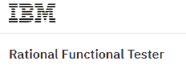

# 2020 年排名前 15 位的硒替代品

> 原文： [https://www.guru99.com/selenium-alternatives.html](https://www.guru99.com/selenium-alternatives.html)

Selenium 是一种开源自动测试工具。 它可以跨不同的浏览器和平台在 Web 应用程序上执行功能，回归，负载测试。 硒是最好的工具之一，但确实有一些缺点。

市场上有一些强大的硒竞争者。 以下是经过高度审查的硒替代品的精选清单。

### [1）TestCraft](https://bit.ly/2LQfzIl)

[TestCraft](https://bit.ly/2LQfzIl) 是无代码的 Selenium 测试自动化平台。 革命性的 AI 技术和独特的可视化建模可以更快地创建和执行测试，同时消除测试维护开销。 测试人员无需编码即可创建全自动测试场景。 客户可以更快地发现错误，更频繁地发布错误，与 CI / CD 集成并提高其数字产品的整体质量。

**主要功能：**

*   无需编程技能。 利用手动测试人员的业务知识，并允许他们创建自动化测试方案
*   大大降低维护成本。 由于我们的 AI 机制，脚本会自动进行调整以进行更改。 只需单击几下，即可进行主要更改
*   基于硒。 快速集成和利用社区开发的模块
*   提供即时的价值实现。 无需安装（SaaS）。 容易掌握

* * *

### 2） [HeadSpin](https://bit.ly/2OyYN2G)

[HeadSpin](https://bit.ly/2OyYN2G) 是世界上第一个互联智能平台 TM ，它提供 Web，移动，IoT 和 5G 解决方案，以统一跨应用程序，设备和网络的测试，监视和分析。 HeadSpin 支持开发，质量保证，运营和产品团队，以优化关联体验并确保数字业务成功。

**功能：**

*   在共享设备云上访问 30 多个国家/地区的 300 多个设备：
*   远程调试
*   支持 Real SIM 的 Android 和 iOS 设备
*   500 多个并行测试
*   回归测试
*   自动化
*   本地化测试
*   本地调试和代码分析

* * *

### 3）[压扁](https://bit.ly/2W85Lhp)

[Squish](https://bit.ly/2W85Lhp) 是全球 3000 多家公司选择的 GUI 测试自动化工具，用于自动化其图形用户界面（GUI）和人机界面（HMI）的功能回归测试和系统测试。 Squish GUI 测试工具是 100％跨平台的工具，具有

*   对所有主要 GUI 技术的深入支持
*   全面支持所有桌面，移动，Web 和嵌入式平台
*   测试脚本录制
*   强大而可靠的对象识别和验证（基于对象和基于图像）
*   不依赖于屏幕截图或外观
*   强大的集成开发环境（IDE）
*   多种流行的脚本语言可用于测试脚本
*   全面支持行为驱动开发（BDD）
*   通过命令行工具完全控制
*   与测试管理和 CI 系统集成

* * *

### 4） [Ranorex](https://bit.ly/2M8kp6n)

使用 [**Ranorex Webtestit**](https://bit.ly/2M8kp6n) 获得针对 Selenium 的开箱即用的 Web 测试自动化，这是一种轻量级的 IDE，旨在使用 Java 或 TypeScript 进行 Web 测试自动化。 跳过耗时的设置，并通过优化的工作流程和最佳实践来减少维护工作。

**Key Features:**

*   快速简便的设置：搭建整个测试框架
*   自动应用最佳实践，例如页面对象模式
*   使用适用于 Chrome DevTools 的 Ranorex Selocity 扩展即时生成 UI 元素选择器和屏幕截图
*   创建有效的硒兼容代码
*   将跨浏览器测试分发到本地 WebDriver 端点，Selenium Grid 或基于云的提供程序
*   与 Jira，VSTS，Jenkins 和 TestRail 等工具集成

* * *

### 5） [Parasoft Selenic](https://bit.ly/2MvETnw)

[Parasoft Selenic](https://bit.ly/2MvETnw) 利用 AI 解决您的 Selenium 问题，因此您不必摆脱 Selenium。 它可以直接与您现有的 Selenium 测试一起使用，因此您不必局限于专有平台。

**Key Features:**

*   运行时自我修复，执行后由 AI 驱动的建议。 您可以有效地维护现有的 Selenium 脚本，从而减少维护，修复和修复损坏的测试所花费的时间。
*   使用页面对象模型创建 Selenium 测试套件。 团队可以从一开始就迅速建立可维护的测试实践。
*   使用“测试影响分析”优化测试执行。 将测试执行与基础代码更改进行互相关可为您提供更快的 CI / CD 管道反馈。

* * *

### 6） [Subject7](https://bit.ly/2QvGPju)

[Subject7](https://bit.ly/2QvGPju) 是一个自动化平台，可通过一系列命令提供端到端测试自动化功能。 可通过易于使用的 Web 界面使用这些命令。 模仿用户操作，每个命令都隐藏了诸如 Selenium，Appium，SikuliX，JMeter，ZAP 等行业标准软件包的复杂性。

**Key Features:**

*   易于使用的非编码器 Web 界面
*   与 JIRA，Jenkins 和 REST 支持的 DevOps 管道集成
*   利用 AWS，Azure 和 Google 云进行零设置并扩展执行范围
*   电子邮件通知，视频记录，团队协作等
*   使用 Selenium 和 Appium 等开源标准来驱动 Web 和移动

* * *

### 7）柏树

[赛普拉斯](https://www.cypress.io/)是针对 Web 环境的开源测试自动化解决方案。 与 Selenium 相比，该工具与当前的开发实践紧密结合。

**Features:**

*   测试状态菜单功能可查看通过或失败的测试数量
*   赛普拉斯会自动等待命令和断言再继续
*   允许使用视口大小检查响应站点。
*   它拍摄测试运行的快照。 对于无头执行，它会记录整个测试运行的视频。
*   赛普拉斯会自动重新加载测试中所做的所有更改
*   命令日志和应用程序预览显示了测试执行过程中 Web 应用程序上的精确自动化操作。

[了解更多信息](https://www.cypress.io/)

* * *

### 8）iMacros：

[iMacros](https://imacros.net/) 是用于 Web 测试的记录和回放工具。 iMacros 还可以使重复的工作自动化。 该测试工具用于

1.  浏览器自动化
2.  网络测试
3.  数据提取

**Features:**

*   适用于 Internet Explorer，Firefox 和 Chrome 的免费插件。 可以自动化几乎所有的 Web 任务。
*   允许对 Web 应用程序进行功能，性能和回归测试
*   iMacros 允许将数据从电子表格上传到网站，或直接在网站中填充 Excel 表格。
*   对网站技术（包括 Java，Flex，Ajax 或 Silverlight 小程序）进行功能，性能和回归测试的自动化。

[了解更多信息](https://imacros.net/)

* * *

### 9）黄瓜

[Cucumber](https://cucumber.io/) 是一种开源 BDD（行为驱动开发）测试工具。

**功能：**

*   由于使用了 BDD，因此业务和 IT 团队可以理解测试。
*   Cucumber 将规范和测试文档合并为一个整体
*   在社区的大力支持下不断更新。

[了解更多信息](/cucumber-tutorials.html)

* * *

### 10）UFT（统一功能测试）

[UFT](https://www.microfocus.com/en-us/products/uft-one/overview) 也被称为 QTP（快速测试专家），是最强大的商业测试自动化工具。 它最初由 Mercury Interactive 开发，后来被 HPE 收购，现在由 MicroFocus 拥有。 它对于功能测试和回归测试很有用。

**Features:**

*   UFT 不仅支持 Web，还支持各种开发环境，例如 SAP，Oracle，Seibel 等。
*   该工具支持跨浏览器和多平台测试，
*   允许在多台计算机之间分布测试。
*   基于图像的对象识别是业界最佳的。
*   可视化测试脚本设计，可帮助您更快地进行测试修改和升级。
*   QTP / UFT 使用 VBScript 语言，与其他测试脚本语言相比，该语言易于使用。

[了解更多信息](/quick-test-professional-qtp-tutorial.html)

* * *

### 11）宁静

[宁静](http://www.thucydides.info/) BDD 是自动接受和回归测试的硒替代品。 该工具生成测试报告，以记录和描述功能测试范围。

**Features:**

*   每个测试步骤的注释/说明和屏幕截图。
*   按需求或发布汇总测试结果。
*   帮助您编写更简洁，更可维护的自动化代码。
*   将您的自动化测试映射回您的需求
*   提供测试范围。

[了解更多信息](http://www.thucydides.info/)

* * *

### 12）IBM Ration 功能测试仪

[IBM Rational Functional Tester](https://www.ibm.com/in-en/marketplace/rational-functional-tester) 是一种自动化的功能和回归测试工具。 该软件为功能，回归，GUI 和数据驱动的测试提供了自动测试功能。 它支持 Java，Siebel，SAP，Net，PowerBuilder，Ajax 等一系列应用程序。

**Features:**

*   通过屏幕截图进行可视化编辑
*   Rational Functional Tester 使您的开发团队能够创建关联的关键字脚本，从而易于重用，从而提高了效率。
*   使用 Eclipse，可以更轻松地用 Java 编写测试脚本代码。
*   此功能测试工具可自动完成代码，并提供高级调试选项
*   与其他第三方软件轻松集成

[了解更多信息](https://www.ibm.com/in-en/marketplace/rational-functional-tester)

* * *

### 13）Galen 框架

[Galen 框架](http://galenframework.com/)最初是为了在真实浏览器中测试 Web 应用程序的布局而引入的。 今天，它已经成为一个功能齐全的测试框架。 该自动化测试工具可以与 Selenium 集成在一起，用于 Web 应用程序的可视化和布局测试。

**Features:**

*   基于 HTML 的错误报告和屏幕截图
*   易于编写/阅读的语法
*   它提供多种浏览器支持
*   使用 Galen 规范语言，您可以描述任何复杂的布局，包括不同的屏幕尺寸或浏览器。
*   Galen Framework 在 Selenium Grid 中运行良好。 这允许设置测试以在类似云的 Sauce Labs 或 BrowserStack 中运行
*   图像比较功能。

[了解更多信息](http://galenframework.com/)

* * *

### 14) SikuliX

[SikuliX](http://sikulix.com/) 可以自动执行 Windows，Mac 或 Linux / Unix 操作系统中屏幕上显示的所有内容。 它使用 OpenCV 提供的图像识别功能来识别和控制 GUI 组件。 SikuliX 工作流程基于搜索图像并使用鼠标和键盘作用于 GUI 元素。

**Features:**

*   SikuliX 可用于自动执行重复性任务。
*   它可用于自动执行日常任务或桌面/ Web 应用程序。
*   测试正在开发的应用程序或网站。

[了解更多信息](http://sikulix.com/)

* * *

### 15）红木

[RedwoodHQ](http://redwoodhq.com/) 是一个开源测试自动化框架。 它安装在单个服务器上，可以从 Web 界面使用多个人。 它可以与任何与 HTML5 兼容的浏览器一起运行，而无需进行任何安装。

**Features:**

*   它允许实时观察测试执行情况以及详细结果，可单击的堆栈跟踪异常和屏幕截图
*   它允许在多台机器上并行执行自动化测试用例
*   导入现有的 TestNG / JUnit 测试用例并开发新的用例
*   与 Jenkins 或 TeamCity 之类的工具兼容，以与持续集成过程集成

[了解更多信息](http://redwoodhq.com/)

* * *

### 16）瓦蒂尔

[Watir](http://watir.com/) 是用于自动化测试的开源 Ruby 库。 它支持功能和回归 Web 测试。

**Features:**

*   无论开发什么应用程序，它都支持 Web 应用程序。
*   它支持不同平台上的多个浏览器
*   Watir 是 Ruby 库的一个家族，但它支持所有其他技术
*   它使用 Ruby（一种功能齐全的现代脚本语言）而不是专有的供应商脚本

[了解更多信息](http://watir.com/)

* * *

### 17）Telerik 测试室

[Test Studio](https://www.telerik.com/teststudio) 是由 Progress 开发的软件自动化工具。 它支持自动化的应用程序，例如 AJAX，HTML5，JavaScript，Silverlight，WPF，MVC，iOS，Android，PHP。 它具有本机跨浏览器支持，并且是一种记录和回放工具。

**Features:**

*   可以执行 API 以及负载测试
*   强大的对象存储库功能。
*   支持持续集成。
*   对 Telerik UI 控件的本机支持
*   测试 HTML 弹出窗口和浏览器对话框

[了解更多信息](https://www.telerik.com/teststudio)

* * *

### 18）筛选器

[Screenster](https://screenster.io/) 是基于云的 UI 测试平台。 它用于 Web 应用程序和网站的视觉回归测试。 它捕获每个步骤的屏幕快照并将其存储为基线。

**功能：**

*   低代码解决方案，使您无需手工编码即可自动执行 UI 测试。
*   以最简单，最快的方式记录测试以自动化视觉测试
*   Screenster 可以将测试作为 CI 的一部分运行。 因此，如果在基线运行和回归运行之间检测到差异，则测试将标记为失败。
*   Screenster 具有强大的功能，例如自动更正智能选择器和自动超时管理。

[了解更多信息](https://screenster.io/)

* * *

### 19）Catalog Studio

[Katalon Studio](https://www.katalon.com/) 是一款自动化测试工具，可用于 Web 和移动应用程序测试。 它是为支持不再能够记录和回放自动化测试的用户而开发的。

**Features:**

*   提供用于组织关键字，测试用例和对象存储库的项目模板
*   允许针对 Web，iOS，Android，iOS 和 OS 系统进行 API 测试
*   易于通过本地插件与 JIRA，Jenkins，GIT 和 qTest 集成
*   使用 IDE 构建高级脚本或使用表格界面自定义步骤

[了解更多信息](https://www.katalon.com/)

* * *

### 20）特里森蒂斯·托斯卡

[Tricentis Tosca](https://www.tricentis.com/software-testing-tools/) 是一个连续测试平台，可加速测试以与 DevOps 和 Agile 保持同步。 通过提供基于模型的测试自动化的可维护性，它允许重用测试。 它有助于将回归测试时间减少到几分钟。

**Features:**

*   自动化 API，SAP，Web，机器人，移动等
*   为敏捷和 DevOps 提供快速反馈
*   将回归测试时间减少到几分钟
*   清晰了解业务风险

[了解更多信息](https://www.tricentis.com/software-testing-tools/)

* * *

### 21）云质量检查

[CloudQA](https://cloudqa.io/) 是支持 SaaS 的功能测试自动化工具，用于基于 Selenium 构建的 Web 应用程序。 这种硒替代品包括三种不同的工具，即 TruRT 用于功能性&回归测试，TruLoad 用于负载测试和 TruMonitor 用于综合监控。

**Features:**

*   完全集成的质量检查自动化工具
*   测试模块是在具有通用架构的平台上开发的
*   它提供了一个无代码的环境来设置健壮的自动化测试用例
*   允许与其他 ALM，错误跟踪和版本控制工具集成

[了解更多信息](https://cloudqa.io/)