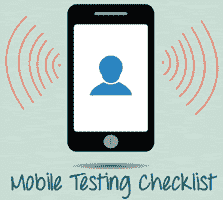
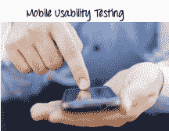

# 移动应用程序测试：示例测试用例&测试方案

> 原文： [https://www.guru99.com/testing-mobile-apps.html](https://www.guru99.com/testing-mobile-apps.html)

学习者经常提出的问题是如何测试移动应用程序？ 在本教程中，我们提供了用于测试移动应用程序的示例测试方案/测试用例。

您可以根据您的移动测试要求执行部分或全部测试用例。 测试用例基于移动测试类型进行组织。

*   [功能测试测试用例](#1)
*   [性能测试](#2)
*   [安全测试测试用例](#3)
*   [可用性测试测试用例](#4)
*   [兼容性测试测试用例](#5)
*   [可恢复性测试测试用例](#6)
*   [重要清单](#7)

## 功能测试测试用例

手机的功能测试通常包括测试用户交互以及测试交易的领域。 与功能测试相关的各种因素是

1.  基于业务功能使用的应用程序类型（银行，游戏，社交或业务）
2.  目标受众类型（消费者，企业，教育程度）
3.  用于传播应用程序的分发渠道（例如 Apple App Store，Google Play，直接分发）

功能测试中最基本的测试场景可以认为是：

1.  验证是否所有必需的必填字段都按要求工作。
2.  验证强制字段以与非强制字段不同的方式显示在屏幕上。
3.  在应用程序启动/停止时验证应用程序是否按要求工作。
4.  在有来电时验证应用程序是否进入最小化模式。 为了验证相同的身份，我们需要使用第二部电话来拨打设备。
5.  在应用程序运行时验证手机是否能够存储，处理和接收 SMS。 为了验证相同的身份，我们需要使用第二部手机将短信发送到正在测试的设备以及正在运行的被测试应用程序所在的位置。
6.  为了验证设备能够在必要时执行所需的多任务处理要求。
7.  为了验证应用程序是否允许必要的社交网络选项，例如共享，发布和导航等。
8.  验证应用程序是否支持应用程序所需的任何付款网关交易，例如 Visa，Mastercard，Paypal 等。
9.  为了验证是否有必要在应用程序中启用了页面滚动方案。
10.  为了验证应用程序中相关模块之间的导航是否符合要求。
11.  确认截断错误绝对在可承受的范围内。
12.  为了验证用户是否收到适当的错误消息，例如“网络错误。 每当出现任何网络错误时，请稍候片刻。
13.  为了验证已安装的应用程序使其他应用程序能够令人满意地执行，并且不会占用其他应用程序的内存。
14.  在硬重启或系统崩溃的情况下，验证应用程序在上一次操作时恢复运行。
15.  为了验证是否可以顺利进行应用程序的安装，前提是用户拥有必要的资源并且不会导致任何重大错误。
16.  验证应用程序是否根据要求执行自动启动功能。
17.  验证应用程序是否在 2g，3g 和 4g 所有版本的 Mobile 中均按照要求执行。
18.  要进行[回归测试](/regression-testing.html)，以便在对系统的现有区域进行更改后发现新的软件错误。 还重新运行以前执行的测试，以确定由于更改，程序行为未更改。
19.  验证应用程序是否为不熟悉该应用程序的用户提供了可用的用户指南

## 性能测试测试用例

这种测试的基本目标是确保应用程序在某些性能要求下（例如，大量用户的访问或删除关键基础架构部分，如数据库服务器）的性能令人满意。

在移动应用程序中进行性能测试的常规测试方案为：

1.  确定应用程序是否在不同的负载条件下按要求执行。
2.  确定当前网络覆盖范围是否能够在峰值，平均和最低用户级别上支持该应用程序。
3.  确定现有的客户端-服务器配置设置是否提供所需的最佳性能水平。
4.  识别导致应用程序无法以所需的可接受级别运行的各种应用程序和基础结构瓶颈。
5.  验证应用程序的响应时间是否符合要求。
6.  评估产品和/或硬件以确定它是否可以处理预计的负载量。
7.  评估电池寿命是否可以支持应用程序在预计的负载量下执行。
8.  当网络从 2G / 3G 更改为 WIFI 或反之时，以验证应用程序性能。
9.  为了验证每个所需的 CPU 周期是否在优化
10.  为了验证电池消耗，内存泄漏，GPS 等资源，相机性能是否在要求的准则之内。
11.  每当用户负载严格时，都要验证应用程序的寿命。
12.  在随设备一起移动时验证网络性能。
13.  仅在需要间歇性连接阶段时才能验证应用程序性能。

## 安全测试测试用例

安全测试的基本目标是确保按照指南满足应用程序的数据和网络安全要求。

以下是检查移动应用程序安全性的最关键区域。

1.  为了验证该应用程序是否能够承受任何蛮力攻击，这是一种自动反复试验的过程，用于猜测用户的用户名，密码或信用卡号。
2.  验证应用程序是否允许未经适当身份验证的攻击者访问敏感内容或功能。
3.  为了验证该应用程序具有强大的密码保护系统，并且不允许攻击者获取，更改或恢复另一个用户的密码。
4.  验证应用程序没有会话过期不足。
5.  确定动态依赖关系并采取措施防止任何攻击者访问这些漏洞。
6.  防止与 [SQL](/sql.html) 注入相关的攻击。
7.  识别任何非托管代码方案并从中恢复。
8.  为了确保证书得到验证，应用程序是否实现了证书固定。
9.  保护应用程序和网络免受拒绝服务攻击。
10.  分析数据存储和数据验证需求。
11.  启用会话管理以防止未经授权的用户访问未经请求的信息。
12.  要检查是否有任何密码学密码被破坏并确保已修复。
13.  验证业务逻辑实现是否安全并且不受外部攻击的影响。
14.  要分析文件系统交互，确定任何漏洞并纠正这些问题。
15.  为了验证协议处理程序，例如尝试使用恶意 iframe 重新配置应用程序的默认登录页面。
16.  防止恶意客户端注入。
17.  防止恶意运行时注入。
18.  调查文件缓存，并从中防止任何恶意可能性。
19.  为了防止不安全的数据存储在应用程序的键盘缓存中。
20.  调查 Cookie 并防止 Cookie 产生任何恶意行为。
21.  提供定期审核以进行数据保护分析。
22.  研究自定义创建的文件，并阻止自定义创建的文件中的任何恶意行为。
23.  为了防止缓冲区溢出和内存损坏的情况。
24.  分析不同的数据流并防止其中存在任何漏洞。

## 可用性测试测试用例

执行 Mobile 应用程序的可用性测试过程是为了拥有一个快速简便的步骤应用程序，其功能要比具有许多功能的缓慢而困难的应用程序少。 主要目的是确保我们最终拥有易于使用，直观且类似于广泛使用的行业认可的界面。

1.  为了确保按钮应具有所需的大小并适合大手指。
2.  确保将按钮放置在屏幕的同一部分，以避免对最终用户造成混淆。
3.  确保图标自然且与应用程序一致。
4.  为确保功能相同的按钮也应具有相同的颜色。
5.  为确保应启用对点击放大和缩小功能的验证。
6.  为了确保可以以适当的方式最小化键盘输入。
7.  为确保应用程序提供一种在可接受的时间内触摸错误项目后返回或撤消操作的方法。
8.  为了确保上下文菜单不会超载，因为必须快速使用它。
9.  确保文本保持简洁明了以使用户可见。
10.  确保简短的句子和段落对最终用户可读。
11.  确保字体大小足够大以便可读，并且不要太大或太小。
12.  为了验证应用程序，只要用户开始下载可能不利于应用程序性能的大量数据，就会提示用户。
13.  验证是否从不同状态关闭了应用程序，并验证它是否以相同状态重新打开。
14.  确保在有语言翻译工具时将所有字符串都转换为适当的语言。
15.  确保始终根据用户操作同步应用程序项。
16.  为确保向最终用户提供了一个用户手册，该手册可以帮助最终用户理解和操作可能不熟悉应用程序的应用程序

可用性测试通常由手动用户执行，因为只有人类才能了解其他用户的敏感性和舒适性。

## 兼容性测试测试用例

在移动设备上进行兼容性测试是为了确保由于移动设备具有不同的尺寸，分辨率，屏幕，版本和硬件，因此应在所有设备上对应用程序进行测试，以确保应用程序能够按需运行。

以下是兼容性测试的最突出领域。

1.  为了验证应用程序的用户界面是否与设备的屏幕尺寸一致，没有任何文本/控件不能部分隐藏或无法访问。
2.  确保该文本对应用程序的所有用户均可读。
3.  确保在运行应用程序时启用呼叫/警报功能。 发生呼叫时，将应用程序最小化或挂起，然后在呼叫停止时恢复应用程序。

## 可恢复性测试测试用例

1.  崩溃恢复和事务中断
2.  验证有效的应用程序恢复情况后，会发布意外的中断/崩溃情况。
3.  验证应用程序在断电期间（例如电池没电或设备突然手动关机）如何处理事务
4.  在验证连接被挂起的过程时，系统需要重新建立以恢复受挂起的连接直接影响的数据。

### 重要清单

1.  安装测试（是否可以在合理的时间内按要求的标准安装应用程序）
2.  卸载测试（是否可以在合理的时间内按要求的标准卸载应用程序）
3.  网络测试用例（验证网络是否在所需的负载下运行，在测试过程中网络是否能够支持所有必要的应用程序）
4.  检查未映射的密钥
5.  检查应用程序启动画面
6.  在中断和其他时间（例如网络问题）期间继续输入键盘
7.  退出应用程序的方法
8.  应用程序在后台运行时的充电器效果
9.  电池电量低，性能要求高
10.  执行应用程序时取出电池
11.  按应用消耗电池
12.  检查应用程序的副作用