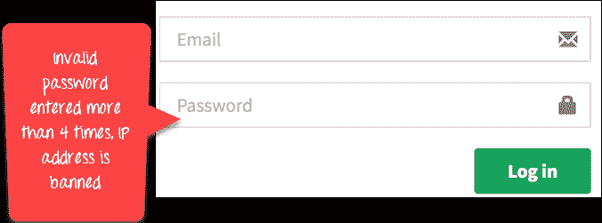

# 什么是用例测试？ 技术，范例

> 原文： [https://www.guru99.com/use-case-testing.html](https://www.guru99.com/use-case-testing.html)

在了解什么是用例测试之前，让我们了解一下

### 什么是用例？

用例是对参与者或用户对系统的特定使用的描述。 它广泛用于开发系统或验收级别的测试。

### 什么是用例测试？

用例测试被定义​​为一种软件测试技术，它可以帮助您从头到尾逐个事务地确定覆盖整个系统的测试用例。

## 如何进行用例测试：示例

在用例中，参与者由“ A”代表，系统由“ S”代表。 我们创建用于 Web 应用程序登录功能的代码，如下所示

| 主要成功方案 | 步 | 描述 |
| A：演员
S：系统 | 1 | **答：输入代理名称&密码** |
| 2 | **S：验证密码** |
| 3 | **S：允许帐户访问** |
| 扩展名 | 2a | **密码无效**
S：显示消息并要求重试 4 次 |
| 2b | **密码无效 4 次**
S：关闭应用程序 |

*   考虑我们的 Web 应用程序的登录功能的端到端方案的第一步，其中 Actor 输入电子邮件和密码。
*   在下一步中，系统将验证密码
*   接下来，如果密码正确，将授予访问权限
*   可以扩展此用例。 如果密码无效，系统将显示一条消息并要求重试四次
*   如果输入密码，无效四次，系统将禁止该 IP 地址。

在这里，我们将测试成功方案以及每种扩展的一种情况。

这是软件工程中的用例测试