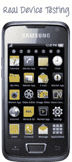
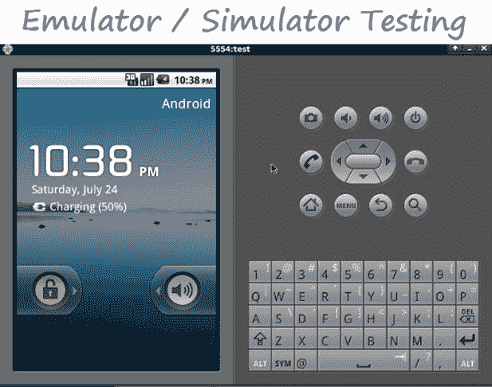

# 真实设备与模拟器与模拟器的测试：主要差异

> 原文： [https://www.guru99.com/real-device-vs-emulator-testing-ultimate-showdown.html](https://www.guru99.com/real-device-vs-emulator-testing-ultimate-showdown.html)

在本教程中，您将学习-

*   [什么是真实测试设备？](#1)
*   [什么是模拟器？](#2)
*   [仿真器和基于模拟器的测试之间的区别](#3)
*   [真实设备和基于仿真器/仿真器的测试的优势](#4)
*   [仿真器和真实设备的缺点](#5)
*   [结论](#6)

### 什么是真实测试设备？

在真实设备上进行测试可以使您运行移动应用程序并检查其功能。 真实设备[测试](/software-testing.html)可确保您的应用程序在客户手机中可以正常运行。

### 什么是模拟器？

模拟器是一种软件程序，通过将其安装到计算机或 Mobile 上，您的手机可以模仿它们希望模仿的另一台计算机或移动软件的功能。

## 仿真器和基于仿真器的测试之间的区别

仿真器和仿真器都是虚拟设备。 虚拟设备不是真实的电话，而是提供与真实电话相同的功能的软件（除了一些功能，例如摄像头）。

但是，仿真器和仿真器之间存在一些区别，如下所述–

| 基于模拟器的测试 | 基于仿真器的测试 |
| --- | --- |
| 模拟器的目的是模拟对象的内部状态，使其尽可能接近对象的内部状态。 | 仿真器旨在模拟或模仿对象的外部行为 |
| 每当测试团队需要测试移动设备的内部行为（例如其内部硬件，固件等）时，最好使用模拟器。 | 每当测试团队需要测试手机的外部行为（例如计算，进行交易等）时，最好使用仿真器。 |
| 模拟器是用高级语言编写的。 | 仿真器是用机器级汇编语言编写的。 |
| 就调试目的而言，模拟器可能很困难。 | 模拟器更适合调试目的 |
| 模拟器只是原始软件的部分重新实现。 | 通常，模拟器是对原始软件的完整重新实现。 |

## 真实设备和基于仿真器/仿真器的测试的优势

| 问题 | 仿真器测试 | 真实设备测试 |
| --- | --- | --- |
| 基于情况的应用 | 在某些情况下，产生文本执行结果的期限很短，并且可能无法购买所需的移动设备。 因此，可能有必要在这些情况下使用仿真器/模拟器来测试需要测试的相关移动应用程序。 | 真实的设备允许测试人员测试几乎所有可以针对移动应用进行测试的实时场景。 这些设备使用手指操作并模拟现实生活中的使用情况。 它们在实际情况下也有帮助：在火车上或在街上走动时是否容易使用该应用程序？ 在明亮的阳光下或在雨中情况如何？ |
| 对真正的手持设备的亲近感 | 移动设备的种类繁多会带来问题，考虑到预算限制，测试人员对购买哪些移动设备进行测试没有信心。 仿真器/模拟器是针对此类情况量身定制的。 | 真正的设备使测试人员甚至可以测试可用性问题，例如应用程序的外观和感觉，屏幕的颜色分辨率，在白天和黑夜条件下图片是否明亮等等。 |
| 易用性 | 仿真器/仿真器在大多数情况下是开放和免费的软件，可以很容易地从 Internet 下载并准备对其进行测试。 | 实际设备允许进行严格的[性能测试](/performance-testing.html)问题，例如连续 15 个小时使用实时传输应用程序，而仿真器无法成功模拟这些问题。 |
| 通过 URL 轻松打开 Web 应用程序 | 在打开 Web 应用程序时，更容易进行 Web 应用程序测试。 用户只需要复制并粘贴应用程序 URL。 | 在真实设备上进行测试可以提供更多的可靠性。 |
| 捕获出现缺陷情况的屏幕截图 | 使用模拟器非常容易在模拟器上捕获屏幕截图，因为我们只需要使用 Microsoft 办公设施即可。 | 在互操作性测试方面，使用实际设备进行测试非常有帮助。 |
| 电池情景验证的仿真 | 仿真器无法仿真电池问题。 | 现实世界中的设备可以轻松执行相同的操作。 |
| 验证传入的中断 | 仿真器无法模拟 SMS 的传入中断以及传入的呼叫。 | 实际设备可以轻松模拟传入的中断。 |
| 验证准确的彩色显示 | 当真实设备在阳光或黑色下时，仿真器/仿真器无法正确仿真/模拟设备的确切颜色显示。 | 现实世界中的设备可以轻松模拟精确的颜色显示。 |
| 表现验证 | 仿真器/仿真器的性能有时会比原始设备慢。 | 原始设备的性能往往比仿真器或仿真器快。 |
| 模拟内存相关问题 | 仿真器/仿真器上可用的内存往往远大于实际设备，因此这可能会给使用相同验证的用户造成误解。 | 设备的内存存储级别往往远低于仿真器，因此可能 |

## 仿真器/仿真器和真实设备的缺点

| 仿真器/模拟器 | 真实设备 |
| --- | --- |
| 对于某些场景（例如测试团队需要较长时间来验证应用程序性能的场景），仿真器/模拟器并不总是最佳的解决方案类型。 | 与仿真器相比，实际设备的成本很高。 因此，受预算和时间限制的项目可能会冒获利的风险，也可能给整个项目的可行性带来风险。 |
| 仿真器/仿真器最适合某些类型的功能测试用例执行。 | 从 Apple 到 Samsung 到 android 再到 Symbian 等等，移动设备种类繁多。 考虑到如此众多的移动设备，测试团队很难在预算和时间轴相关的大量约束下安排各种移动设备同时工作。 |
| 仿真器/仿真器有时可能不支持某些类型的应用程序，在这种情况下，测试团队可能需要购买软件补丁程序，这些补丁程序可能并不总是免费的，但有时可能会很昂贵。 | Real Mobile 设备在开发阶段用于[单元测试](/unit-testing-guide.html)和类似目的时，可能会比仿真器更难连接到 IDE，这会给调试带来很大的问题，在项目中， 时间轴的限制，这很可能会妨碍项目的总体完成。 |
| 并非所有的仿真器/仿真器都支持整个移动应用程序。 例如，bada 模拟器支持 Maemo（如诺基亚 N900），Symbian Touch（如诺基亚 N8）和 Symbian 非触摸（如诺基亚 E71），但不支持其他移动设备，如 Android。 就应用程序测试功能而言，bada 不支持直接的 Web 浏览测试，但它允许用户仅测试和创建 webapp 和小部件。 | 为了测试实际设备，必须始终将设备连接到计算机的 USB 端口。 因此，如果 USB 端口无法正常工作，则无法进行测试。 如果没有提供足够的安全措施，移动设备（如果它们像 Apple iPhone 那样价格昂贵）可能会丢失或被盗，从而阻碍了整体工作。 安全性的提高也可能会增加项目的总支出。 |
|   | 用户必须手动键入 URL 才能打开需要测试的 Web 应用程序。 为了解决此特定问题，测试人员可能需要创建电话书签，简短的 URL 服务，或者使用蓝牙连接将 URL 发送到手机或创建包含某些 URL 的网页。 这些过程的采用将确保可能耗尽很多非常重要的内存空间，从而影响应用程序的整体性能。 |

## 总结

考虑到当今移动应用程序在日常生活中所起的重要作用，对这些应用程序的测试将不断发展，因此它们需要进行大量测试才能使其按需运行。 为了保持强大的标准和质量保证，必须在模拟器/仿真器以及实际设备中进行测试。

仔细考虑移动仿真器和真实设备的优缺点，有必要得出这样的结论：针对企业的最佳移动测试解决方案既不能把所有的鸡蛋都放到真实设备的篮子中，也不能将它们放到真实的设备中。 模拟器，但我们需要的是**两者的最佳组合。**

仿真器可以认为非常适合应用程序开发的初始阶段。

但是，为了避免发布具有缺陷的关键业务应用程序的昂贵方案，企业需要确保在应用程序投入生产之前，他们在真实设备上执行其移动测试的主要部分。

每个组织都需要制定战略并仔细计划，以确定在什么阶段引入真实设备。 他们还需要确定有多少设备足以满足市场需求，以及哪种可能是管理这些设备的最佳选择。

最佳实践表明，实际开发应使用仿真器（和一些参考的真实手机），以便在编码阶段加快应用程序的调试，而理智，[冒烟测试](/smoke-testing.html)，性能，互操作性和 网络可行性和[回归测试](/regression-testing.html)应该在真实手机上进行。

确保开发人员在开发阶段使用仿真器进行快速执行也是一种新兴做法，然后测试团队应在测试阶段对真实设备进行测试，以确保总体[质量保证](/all-about-quality-assurance.html)目标 和目标。 为了节省成本，他们可以考虑使用虚拟移动测试工具。 这些服务使开发人员可以使用遍布全球的不同移动网络在各种手机上测试其应用程序（对于使用 GPS 的应用程序很有用）。 此类服务按小时提供，与购买新手机相比，非常划算。