# 适用于 Android 的 APPIUM 教程& iOS 移动应用测试

> 原文： [https://www.guru99.com/introduction-to-appium.html](https://www.guru99.com/introduction-to-appium.html)

### 什么是阿皮？

APPIUM 是一个自由分发的开源移动应用程序 UI [测试](/software-testing.html)框架。 Appium 允许进行本机，混合和 Web 应用程序测试，并支持对物理设备以及仿真器或模拟器的自动化测试。 它提供跨平台的应用程序测试，即单个 API 适用于 Android 和 iOS 平台测试脚本。

它对移动设备 OS 具有 **NO** 依赖性。 因为 APPIUM 具有框架或包装程序，所以根据设备类型（而不是任何 OS 类型）将 [Selenium](/selenium-tutorial.html) Webdriver 命令转换为 UIAutomation（iOS）或 UIAutomator（Android）命令。

Appium 支持所有具有 Selenium 客户端库的语言，例如 Java，Objective-C，带有 node.js 的 [JavaScript](/interactive-javascript-tutorials.html) ，PHP，Ruby，Python， [C＃，](/c-sharp-tutorial.html)等。

在本教程中，我们将学习

*   [APPIUM 的工作原理？](#1)
*   [使用 APPIUM](#2) 的前提条件
*   [安装 Appium 桌面：](#22)
*   [阿皮安检查员](#3)
*   [将 Android 模拟器附加到 Appium](#4)
*   [适用于本机 Android App（计算器）的 APPIUM 测试用例](#5)
*   [使用 APPIUM](#6) 的局限性
*   [Appium](#7) 中常见的常见错误和故障排除步骤

### APPIUM 是如何工作的？

*   Appium 是使用[和 Node.js](/node-js-tutorial.html) 平台编写的“ HTTP 服务器”，并使用 Webdriver JSON 有线协议驱动 iOS 和 Android 会话。 因此，在初始化 Appium Server 之前，必须在系统上预安装 Node.js。
*   下载和安装 Appium 后，将在我们的计算机上设置一个服务器，该服务器公开 REST API。
*   它从客户端接收连接和命令请求，并在移动设备（Android / iOS）上执行该命令。
*   它以 HTTP 响应进行响应。 同样，为了执行此请求，它使用移动测试自动化框架来驱动应用程序的用户界面。 像这样的框架：
    *   适用于 iOS 的 Apple Instruments（仪器仅在 Xcode 3.0 或更高版本以及 OS X v10.5 和更高版本中可用）
    *   适用于 Android API 级别 16 或更高版本的 Google UIAutomator
    *   适用于 Android API 级别 15 或更低的 Selendroid

### 使用 APPIUM 的先决条件

1.  安装 ANDROID SDK（Studio）[[链接](http://developer.android.com/sdk/index.html)]-
2.  安装 JDK（Java 开发工具包）[[链接](https://www.guru99.com/install-java.html)]
3.  安装 Eclipse [[链接](http://www.eclipse.org/downloads/)]
4.  为 Eclipse 安装 TestNg [[链接](https://www.guru99.com/all-about-testng-and-selenium.html#1)]
5.  安装 Selenium Server JAR [[链接](https://www.guru99.com/introduction-to-selenium-grid.html#1)]
6.  Appium 客户端库[[链接](http://appium.io/docs/en/about-appium/appium-clients/index.html)]
7.  APK 应用信息在 Google Play 上[[链接](https://play.google.com/store/apps/details?id=de.migali.soft.apkinfo&hl=en)]
8.  js（不需要-每次安装 Appium 服务器时，默认情况下，它都附带“ Node.exe” & NPM。它包含在当前版本的 Appium 中。）
9.  桌面安装时代

## 安装 Appium 桌面：

Appium Studio 是用于安装 Appium Server 的开源 GUI 应用程序。 它与安装和使用 Appium Server 的所有必备组件捆绑在一起。 它还具有检查器，可获取有关您的应用程序的基本信息。 它带有一个记录器，用于创建样板代码来自动执行您的移动应用程序。

**步骤 1）**转到 [http://appium.io/](http://appium.io/) ，然后单击“下载 Appium”。

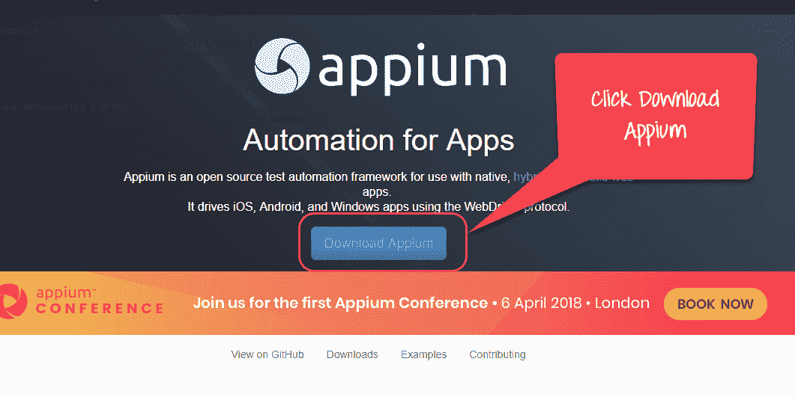

**步骤 2）**对于 Windows，选择 exe 文件并下载。 该文件大约为 162MB，根据您的互联网速度需要花费一些时间来下载。

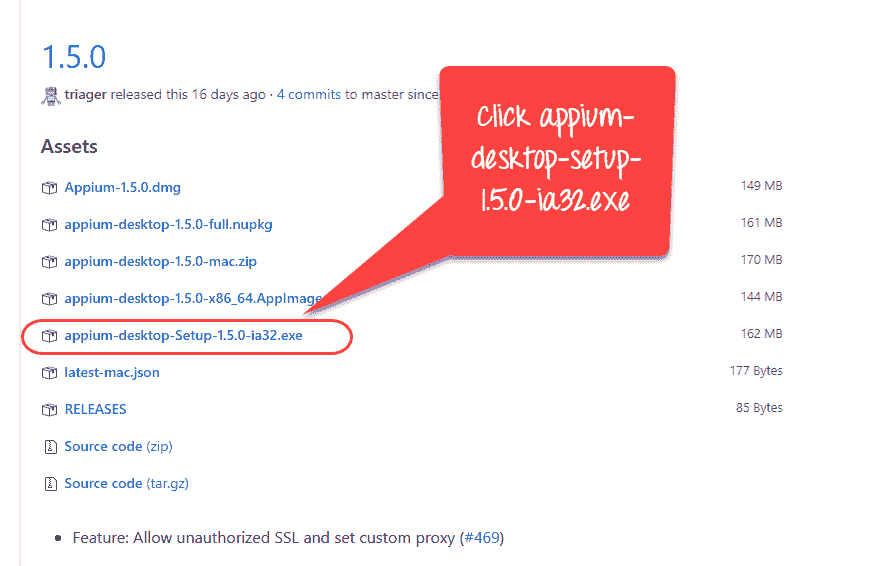

**步骤 3）**单击下载的 exe。

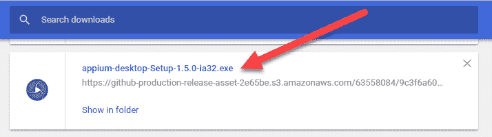

**步骤 4）**在 Windows 计算机上，无需安装 Appium。 它直接从 exe 运行。 单击 exe 后，您将在几分钟后看到以下图像。


对于 Mac，您需要安装 dmg

**步骤 5）**接下来，您将看到服务器启动窗口。 它会填充您可以更改的默认主机和端口选项。 它还提到了正在使用的 Appium 版本。

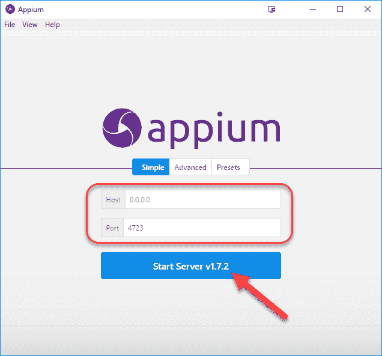

**步骤 6）**单击“启动服务器”按钮后，将在指定的主机和端口上启动新服务器。 显示服务器日志输出。

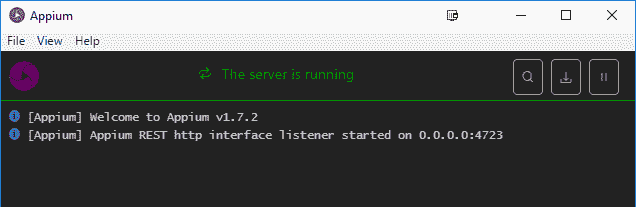

**步骤 7）**单击“新建会话窗口” **。**

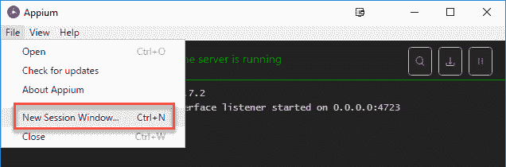

**步骤 8）**您可以输入所需功能并开始会话。

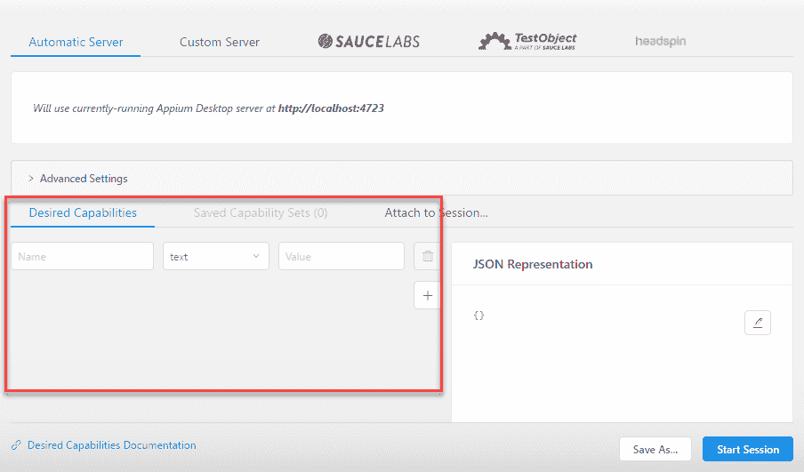

### Appian 检查员

与 Selenium IDE 记录和播放工具类似，Appium 具有一个“检查器”来记录和播放。 它通过检查 DOM 记录并播放本机应用程序的行为，并以任何所需的语言生成测试脚本。 但是，当前，不支持 Microsoft Windows 的 Appium Inspector。 在 Windows 中，它将启动 Appium Server，但无法检查元素。 但是，UIAutomator 查看器可以用作检查元素的选项。

在 Mac 计算机上从 Appium Inspector 开始的步骤：-

**步骤 1）**下载并使用默认 IP 地址 0.0.0.0 和端口 4725 启动 Appium 服务器。

1.  从本地选择源文件或.app 文件进行测试。
2.  选中“应用程序路径”复选框以启用“选择”按钮。

**步骤 2）**现在，单击“选择”按钮将提供浏览和从本地驱动器选择测试文件的选项。

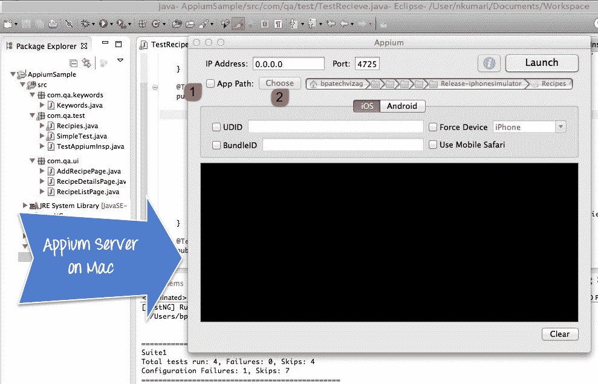

**步骤 3）**在 Mac 机器上启动 Simulator。

**步骤 4）**从右上角单击“启动”按钮，这将启用蓝色图标。 再次单击该蓝色图标，它将打开带有预选应用程序的 Appium 检查器和模拟器。

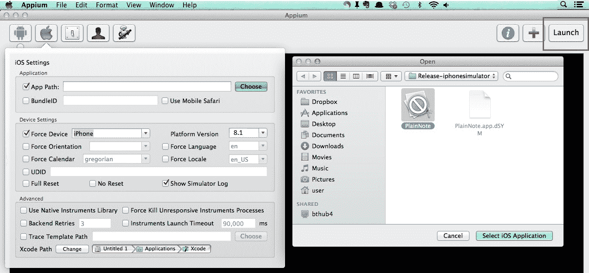

**步骤 5）**-启动您的 Appium Inspector 将按列结构显示元素层次结构。 此外，用户可以使用“点击”，“滑动”等按钮应用动作。

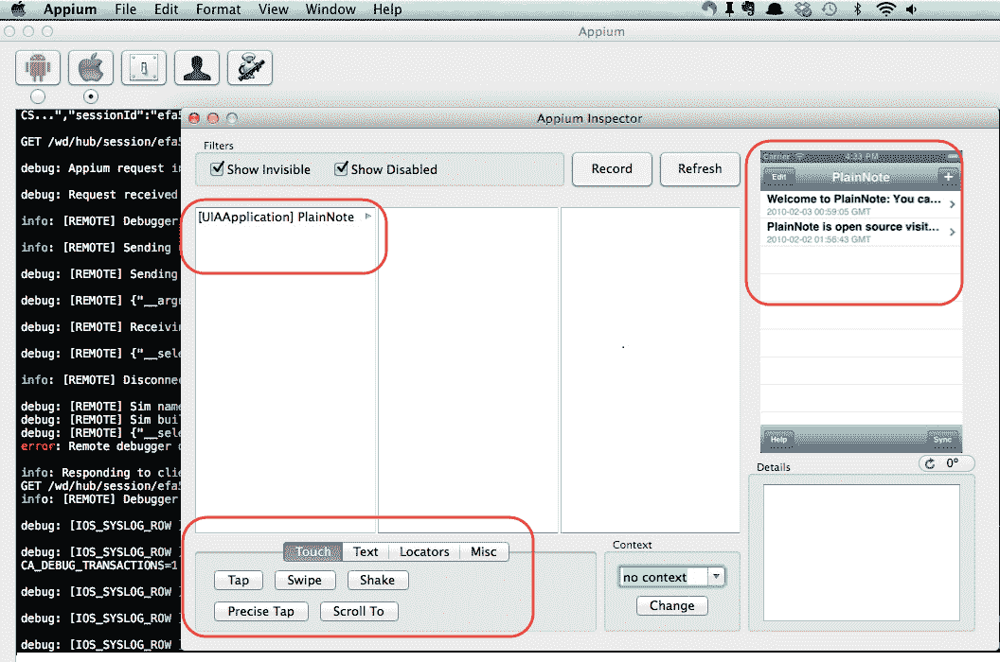

**步骤 6）**单击“停止”按钮停止录制。

### 将 Android 模拟器附加到 Appium

**步骤 1）**在系统中安装 Android SDK。

转到控制面板> >系统和安全性> >系统，然后从左侧面板中单击“高级系统设置”。 从“系统属性”弹出，单击“高级”选项卡，然后单击“环境变量”按钮。

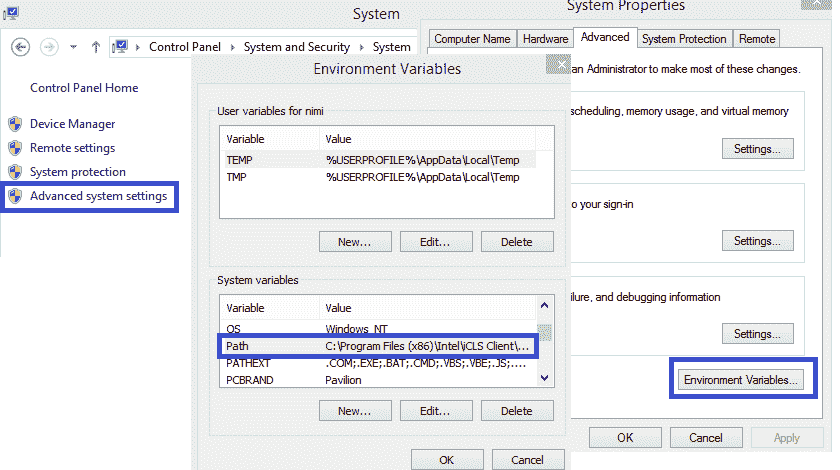

**步骤 2）**现在，从“环境变量”弹出窗口中，双击“路径”并设置指向您的 SDK 目录的 ANDROID_HOME 变量。 在路径中，附加整个 SDK 文件夹路径。

例如 --

```
C:\User\ABC\Desktop\adt-bundled-windows-x86_64-20140321\sdk
```

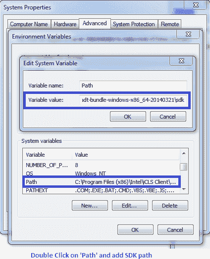

**步骤 3）**启动您的 Android 模拟器或将任何 Android 设备连接到系统（确保您在 Android 设备中启用了 Android 调试选项。要检查调试选项，请转到设备设置> >开发人员选项> >选中“调试选项”。

**步骤 4）**打开命令提示符，然后导航至 Android SDK 的\ platform-tools \目录（例如 D：\ adt-bundle-windows-x86_64-20130514 \ sdk \ platform-tools）。

**步骤 5）**-运行“ adb 设备”命令。 您可以在“命令提示符”窗口中看到已连接的设备。 （在 CMD 中写'> adb devices'-此命令将列出已连接的仿真器实例。例如：adb –s emulator-5554 install < .apk 文件>的位置）

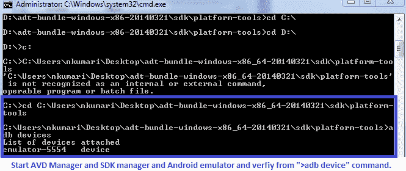

**步骤 6）**-运行'adb start-server'命令。 它将启动 ADB 服务器，Appium 将使用该服务器将命令发送到您的 Android 设备。

**步骤 7）**现在，导航至系统中的 Appium 目录，并通过单击 Appium.exe 文件启动 Appium。

**步骤 8）**请勿更改 IP 地址或端口号，然后单击“启动”按钮。 您的 Appium 控制台从 127.0.0.1:4723 开始，如下所示。

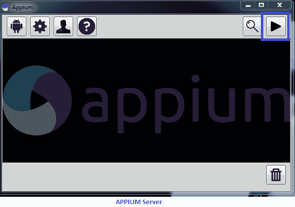

**步骤 9）**单击“开始”按钮，Appium 服务器开始在您的系统上运行。

### 适用于本机 Android App（计算器）的 APPIUM 测试用例

**步骤 1）**）下载 ADT eclipse 插件，或在此处下载单独捆绑的 ADT[](http://developer.android.com/tools/help/adt.html)

**步骤 2）**打开 Eclipse 并创建一个新项目> >包> >类

**步骤 3）**在该新项目中导入 Selenium 库和 [Testng](/all-about-testng-and-selenium.html) 。

**步骤 4）**现在为'Calculator.app'创建一个小的测试程序，将两个数字相加。

```
package src_Appium;
import java.net.MalformedURLException;
import java.net.URL;
import org.openqa.selenium.By;
import org.openqa.selenium.WebDriver;
import org.openqa.selenium.WebElement;
//import org.openqa.selenium.remote.CapabilityType;
import org.openqa.selenium.remote.DesiredCapabilities;
import org.openqa.selenium.remote.RemoteWebDriver;
import org.testng.annotations.*;

public class Calculator {
WebDriver driver;

@BeforeClass
public void setUp() throws MalformedURLException{
	//Set up desired capabilities and pass the Android app-activity and app-package to Appium
	DesiredCapabilities capabilities = new DesiredCapabilities();
	capabilities.setCapability("BROWSER_NAME", "Android");
	capabilities.setCapability("VERSION", "4.4.2"); 
	capabilities.setCapability("deviceName","Emulator");
	capabilities.setCapability("platformName","Android");

   capabilities.setCapability("appPackage", "com.android.calculator2");
// This package name of your app (you can get it from apk info app)
	capabilities.setCapability("appActivity","com.android.calculator2.Calculator"); // This is Launcher activity of your app (you can get it from apk info app)
//Create RemoteWebDriver instance and connect to the Appium server
 //It will launch the Calculator App in Android Device using the configurations specified in Desired Capabilities
   driver = new RemoteWebDriver(new URL("http://127.0.0.1:4723/wd/hub"), capabilities);
}

@Test
public void testCal() throws Exception {
   //locate the Text on the calculator by using By.name()
   WebElement two=driver.findElement(By.name("2"));
   two.click();
   WebElement plus=driver.findElement(By.name("+"));
   plus.click();
   WebElement four=driver.findElement(By.name("4"));
   four.click();
   WebElement equalTo=driver.findElement(By.name("="));
   equalTo.click();
   //locate the edit box of the calculator by using By.tagName()
   WebElement results=driver.findElement(By.tagName("EditText"));
	//Check the calculated value on the edit box
assert results.getText().equals("6"):"Actual value is : "+results.getText()+" did not match with expected value: 6";

}

@AfterClass
public void teardown(){
	//close the app
	driver.quit();
}
}

```

“ AVD 管理器”中的 Appium 服务器和 Android 仿真器，然后单击运行> > TestNG。 上面的程序将在选定的模拟器上运行“ Calculator.app”，并使用 TestNG 框架在 Eclipse 控制台下显示结果。

### 使用 APPIUM 的局限性

1.  Appium 不支持低于 4.2 的 Android 版本的测试
2.  对混合应用程序测试的支持有限。 例如：无法测试应用程序从网络应用到本机的切换操作，反之亦然。
3.  不支持在 Microsoft Windows 上运行的时代检查器。

### **在 Appium 中遇到的常见错误和故障排除步骤**

| **错误** | **故障排除步骤** |
| 1.错误：-需要以下所需功能，但未提供：设备名称，平台名称 | 1.添加所需的功能：APPIUM 脚本中的设备名称，平台名称。 例如：capabilities.setCapability（“ deviceName”，“ Emulator”）; abilities.setCapability（“ platformName”，“ Android”）; |
| 2.错误：找不到 adb。 请使用 Android SDK 根目录路径设置 ANDROID_HOME 环境变量。 | 2.您可能需要在“路径”列的“环境变量”系统中设置 SDK 根目录路径 |
| 3.error：org.openqa.selenium.SessionNotCreatedException：无法创建新会话。 | 3.您需要设置正确的 App 路径并重新启动 Appium 服务器。 |
| 4.如何在移动应用程序中查找 DOM 元素或 [XPath](/xpath-selenium.html) ？ | 4.使用“ UIAutomatorviewer”查找适用于 Android 应用程序的 DOM 元素。 |