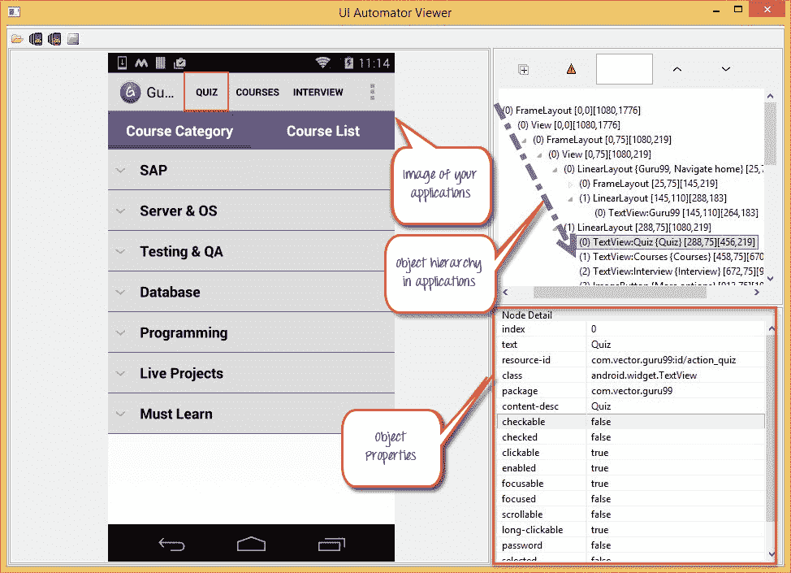
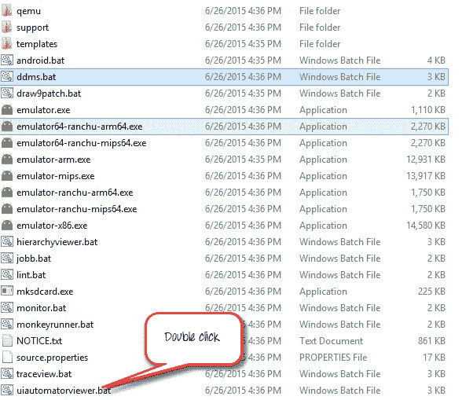
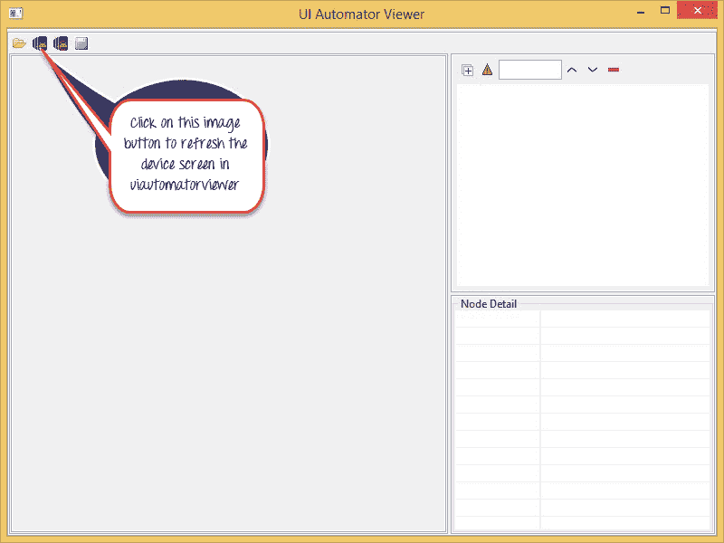
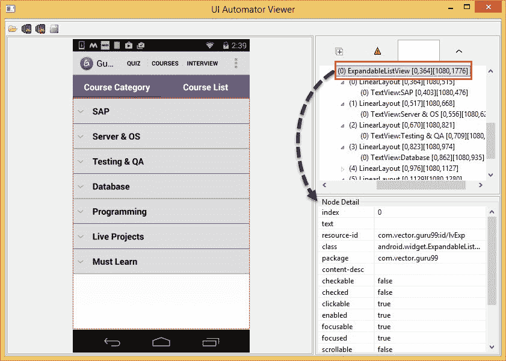
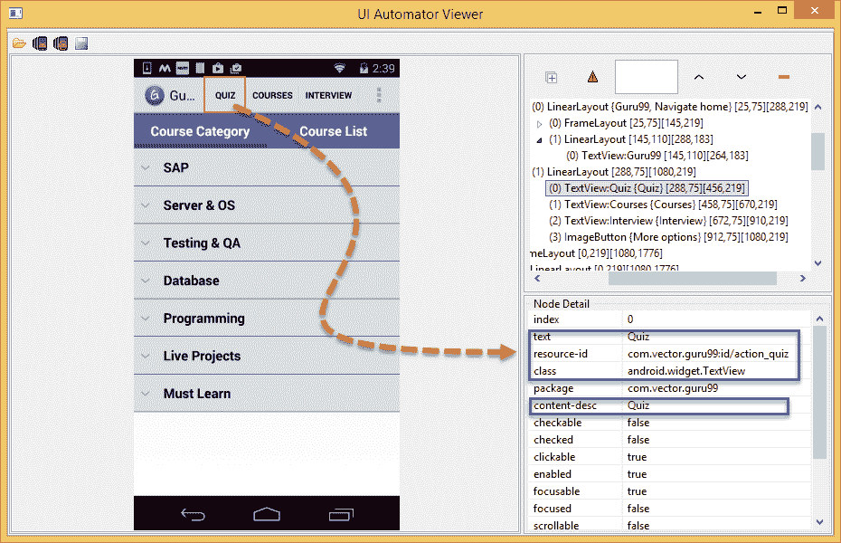
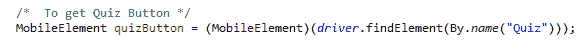
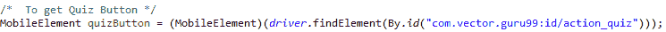
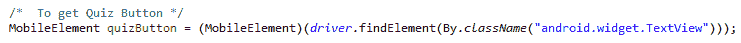
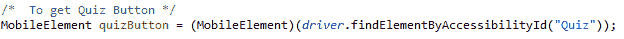

# UIAutomatorViewer 教程：Android 测试检查器

> 原文： [https://www.guru99.com/uiautomatorviewer-tutorial.html](https://www.guru99.com/uiautomatorviewer-tutorial.html)

## 什么是 UiAutomatorViewer？

“ UIautomatorviewer”是用于扫描和分析 Android 应用程序的 UI 组件的 GUI 工具。要使用 Appium 自动化任何 Android 应用程序，用户需要在 AUT（被测应用程序）中标识对象。 使用“ UIautomatorviewer”，您可以检查 android 应用程序的 UI，以查找层次结构并查看元素的不同属性（id，text…）。

在执行自动化脚本时，Appium 使用“ Uiautomatorviewer”来标识对象的不同属性，并使用这些属性来标识所需的对象。



在本教程中，您将学习-

*   [如何下载&安装 UIAutomator](#1)
*   [如何使用 Uiautomatorviewer 在我的应用程序中查找对象](#2)
*   [如何使用这些属性来标识自动化元素](#3)
*   [使用 Uiautomatorviewer](#4) 时可能会遇到错误

## 如何下载&安装 UIAutomator

“ Uiautomatorviewer”是 Android SDK 管理器的一部分，安装 SDK 管理器后即可访问。 在上从[下载并安装 Android SDK 管理器](http://developer.android.com/sdk/index.html)

安装 Android SDK 后，导航至链接

```
c:\users\<username>\AppData\Local\Android\sdk\tools 
```

You'll notice a batch file with name

```
uiautomatorviewer.bat
```

. Double click on it to launch "Uiautomatorviewer" GUI



## 如何使用 Uiautomatorviewer 在我的应用程序中查找对象

1.  在设备上启用“开发人员”选项。 单击此处的[了解如何在 Android 设备上启用开发人员选项](https://developer.android.com/studio/debug/dev-options)
2.  通过 USB 电缆将 android 设备连接到 PC
3.  从应用程序中选择“ Guru99”应用程序


4.  单击“设备屏幕截图”按钮以刷新“ Uiautomatorviewer”，并在“ Uiautomatorviewer”上加载 guru99 应用程序 GUI



5.  刷新完成后，将打开 Guru99 应用程序的屏幕截图。



6.  如上图所示，在窗口的右侧有 2 个面板。

上面板包含 UI 组件的排列和包含方式的节点层次结构，单击每个节点可在下面板中提供 UI 元素的属性

7.  选择上图中的“ **测验**”按钮以查看不同的属性（文本，资源 ID ...）



## 如何使用这些属性来标识自动化元素

好吧，您不能直接使用属性，每个属性都有其他名称。 让我们看看如何使用这些属性值来工作。 以下属性可用于标识 Guru99 应用中的“ **测验**”按钮。

*   **文本**属性可以用作“ **名称”**



*   **resource-id** 属性可以用作“ **id”**



*   **类**属性可以用作“ **className”**



*   **content-desc** attribute can be used as "**AccessibilityId"**

    

    连同以上属性，我们可以编写 xpath 来进行对象识别

## 使用 Uiautomatorviewer 时可能遇到错误

*   我看到错误-“ adb 未检测到 Android 设备”，如下面的屏幕截图所示，我该如何解决此问题


**解决方案：**确保您的设备已连接到 PC