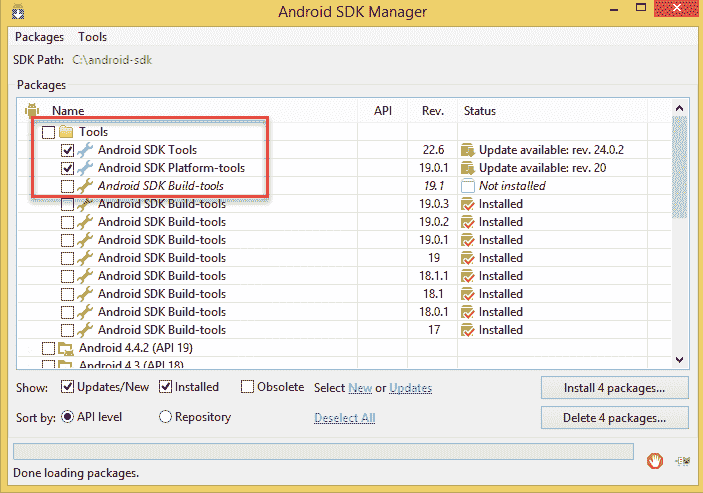
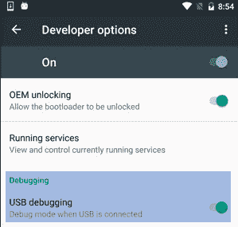
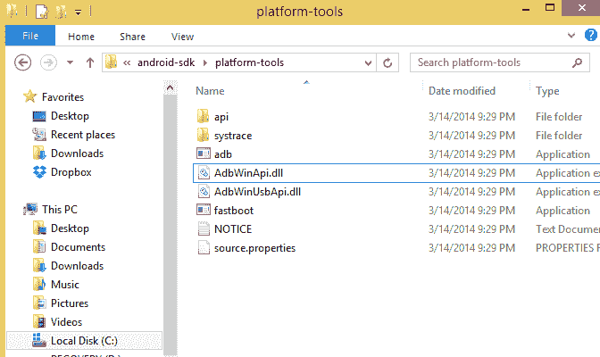
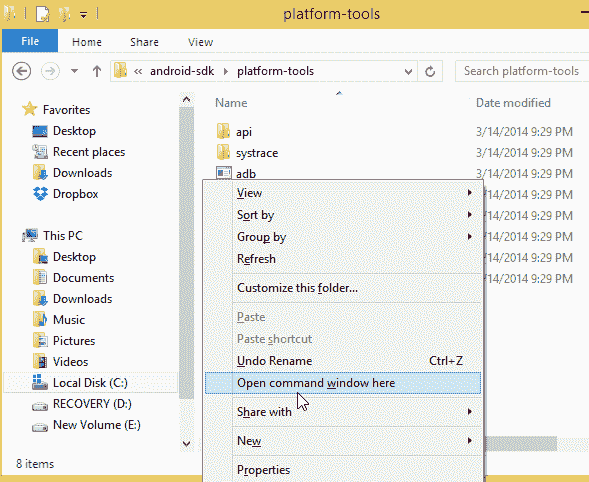
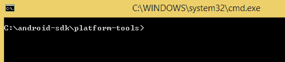
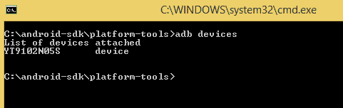
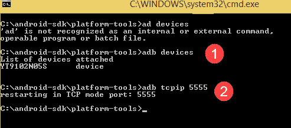

# 将具有 Android 调试桥（ADB）的移动设备连接到 USB，WiFi

> 原文： [https://www.guru99.com/adb-connect.html](https://www.guru99.com/adb-connect.html)

## 什么是亚行？

使用任何真实的设备进行移动自动化[测试对于测试人员来说一直是一个挑战。 但是，Android 提供了一些解决方案，可以通过 USB（即 Android 调试桥（ADB））连接真实设备。](/software-testing.html)

ADB 是命令行工具。 它用于桥接仿真器实例（Android 设备）和后台运行的守护进程（服务器）之间的通信。

在本教程中，您将学习-

*   [USB 调试和 ADB 配置](#1)
*   [如何连接到仿真器](#2)
*   [如何连接 Android 设备](#3)
*   [如何为 Wi-Fi 支持配置 ADB](#4)

## USB 调试和 ADB 配置-

APPIUM 具有在真实设备上执行测试的优势。 但是在运行测试之前，我们需要按照以下先决条件进行设置。

*   应启用 USB 调试
*   ADB 配置
*   根据硬件更改进行所需的功能设置。

在这里，我们将看到连接仿真器和真实设备进行测试的两种方法。 请参阅以下步骤连接到仿真器。

### 如何连接到仿真器

先决条件-SDK（软件开发套件）应安装在计算机上。 ADB 与 Google 的 Android SDK（软件开发工具包）打包在一起。 **从 SDK Manager 启用 ADB 的步骤。**

**步骤 1）**打开 Android SDK 文件夹

**步骤 2）**双击 SDK Manager

**步骤 3）**从所有软件包的列表中选择“工具”，然后选中

*   Android SDK 工具和
*   Android SDK 平台工具。



### 如何连接 Android 设备

**步骤 1）**从 Android 手机的“开发人员选项”中启用 USB 调试选项。



**步骤 2）**打开已保存 Android SDK 文件的本地文件夹“ Android SDK > > Platform-tools”，例如：C：\ android-sdk \ platform-tools



**步骤 3）**在文件夹内按住 Shift +右键单击菜单> >选择**'此处打开命令窗口'**选项。

它将使用命令提示符打开文件夹。

**注意**-您也可以直接从命令提示符下的“运行”命令打开文件夹路径。



该命令窗口将直接在命令提示符窗口中打开该文件夹。



**步骤 4）**现在，在检查设备之前，用户必须连接外部 Android 设备（手机）。 要连接，请使用设备的 USB 电缆连接器连接到系统。 然后在上面的命令提示符下键入 command-

```
'adb devices' & press Enter
```

它将显示所有已连接设备的所有列表。



但是，在此之前，我们应该检查该 ADB 服务器。 检查它是否正在作为后台进程运行。 只需从上述过程中打开命令提示符并输入'adb'，然后按 Enter。 它应该显示所有 adb 的进程正在运行。

服务器启动时，它始终绑定本地 TCP 端口 5037。所有 ADB 客户端都侦听 5037 TCP 端口以与服务器请求进行通信。

现在，正在运行的 ADB 服务器可以通过扫描端口来扫描所有连接的仿真器或设备实例。

始终记住，ADB 守护程序在 5555 到 5558 范围之间的奇数端口上运行。

ADB 守护进程通过控制台连接运行，该控制台连接获取偶数端口。

**例如：**如果连接了单个设备，则服务器会自动扫描该设备并建立连接，但是如果正在运行多个设备或仿真器，则用户需要提供 ADB 命令行指令进行连接。

连接到奇数编号 5557 的仿真器实例具有在偶数编号 5556 端口（即）上运行的相同控制台。 每个运行的设备都有 1 个奇数端口和 1 个偶数连接端口。

```
emulator 1: console 5556
emulator 1: adb 5557
emulator 2: console 5554
emulator 2: adb 5555
```

用于检测所有已连接设备的命令-

```
<$ adb devices>
emulator-5554 device
emulator-5556 device
emulator-5558 device
```

命令从多个连接的设备中检测单个设备-

```
<$ adb –s emulator-5554 install Guru99.apk>
```

它将检测到设备-5554 的 adb 连接并安装该应用程序。

因此，通过这种方式，用户可以使用 ADB 命令建立成功的连接以访问 ADB 实例。

```
Syntax used to access ADB instances from commands line:
Adb [-d – An adb command when a single USB device is connected
Adb [-e – An adb command when only single emulator is running
Adb devices--- This will print all the list of emulator / devices attached.
Adb version--- List the adb version number.
Adb help---- Print the list of supported commands.
```

## 如何配置 ADB 以支持 Wi-Fi

就像通过 USB 配置 ADB 一样，用户也可以通过 wi-fi 配置 ADB。

**前提条件**

*   Android 设备和主机都应连接到同一无线网络，并且
*   设备蓝牙选项应禁用。

**Steps to connect-**

1.  使用 USB 电缆将设备连接到主机。 确认设备中已启用 USB 调试。
2.  设置目标设备以在端口 5555

    ```
    $ adb tcpip 5555
    ```

    上连接 TCP / IP



3.  现在，断开 USB 电缆与设备的连接。
4.  In Android device find the IP address from Settings >> wi-fi Setting >> Advanced >> IP Address.

    使用相同的 IP 地址通过 ADB 连接连接设备

    ```
    eg: Network IP address is- 148.100.1.17
    $ adb devices
    List of devices attached
    148.100.1.17:5555 device
    ```

因此，完成了最终配置，并通过无线网络成功配置了“ adb”。

**注意-**如果发生任何连接错误，请重置或终止 adb 主机连接。 为此使用以下命令

< adb 杀死服务器>，然后从第一步开始再次连接。