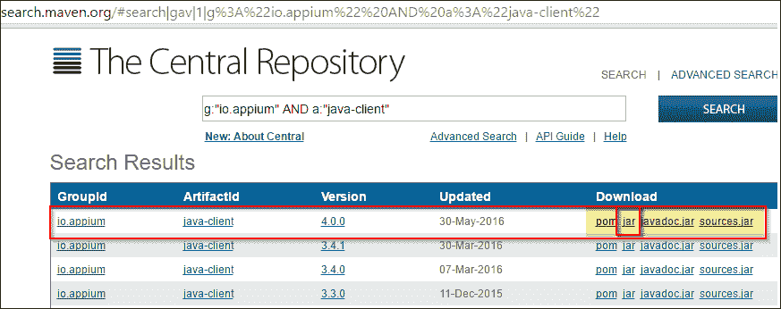
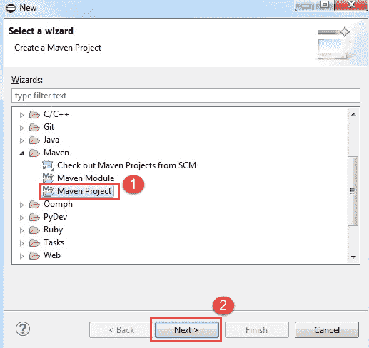
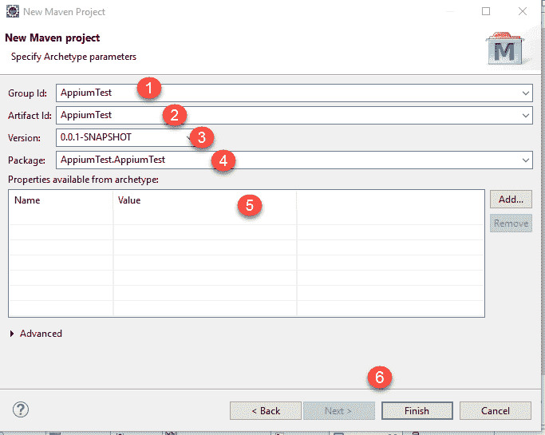
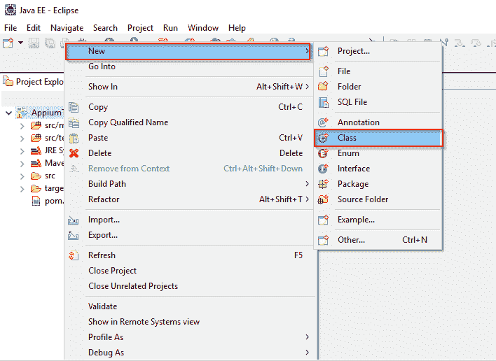
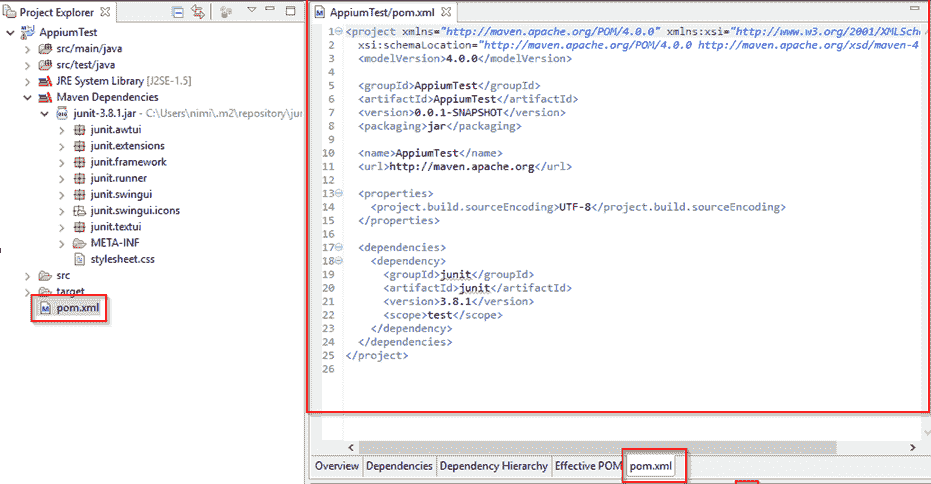
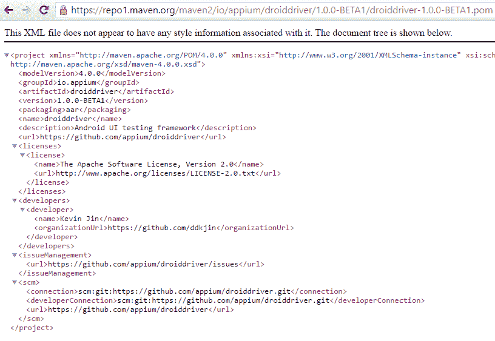
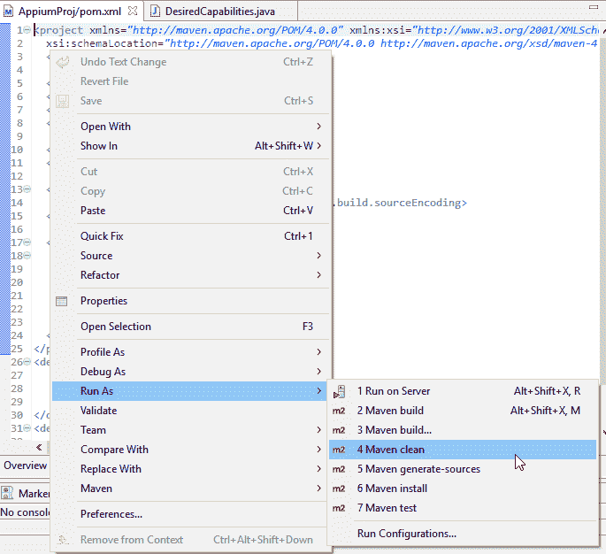
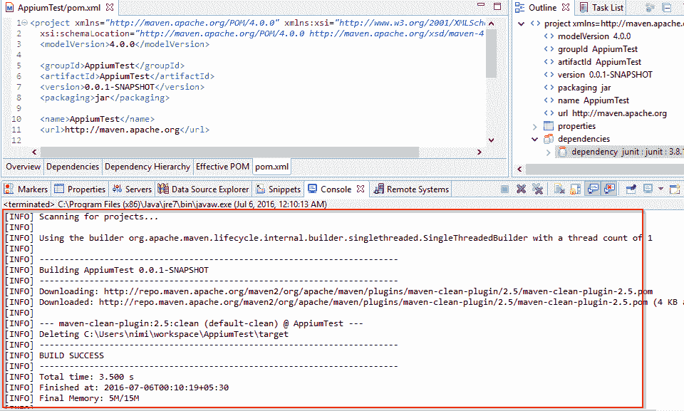

# Appium Maven 依赖项：项目示例

> 原文： [https://www.guru99.com/appium-maven.html](https://www.guru99.com/appium-maven.html)

Apache Maven 是基于 Java 的项目管理工具。 它可以为开发人员提供一个多任务框架。 它简化了完整的构建生命周期。 Maven 是预定义的，并以 XML 格式声明，称为 **POM** （项目对象模型），并称为“ pom.xml”。

使用 Maven 框架，我们可以轻松地在任何项目中管理以下任务-

*   建立周期
*   项目文件
*   报告检查
*   Scrum 管理
*   发布信息

Maven 的基本用途是-

*   强制采用标准目录结构。
*   提供可重用且易于维护的项目结构。
*   解决程序包依赖性。
*   提供配置管理框架。

**观看纪元 Maven 依赖项**

在开始使用 Maven 编写 APPIUM 测试之前，我们必须从 [Maven 中央存储库](http://search.maven.org/)网站下载 JAR 文件。



或直接添加下面提到的 POM.xml 工件：

```
<dependency>
  <groupId>io.appium</groupId>
  <artifactId>java-client</artifactId>
  <version>3.4.1</version>
</dependency>

```

请阅读我们的 [Maven 教程](/maven-jenkins-with-selenium-complete-tutorial.html)，以了解如何使用 Eclipse 配置 Maven。

## 使用 APPIUM 和 Maven 测试应用程序

配置 Maven 插件后，使用 Eclipse。 准备使用 Appium 和 Maven 测试任何 android .apk 应用程序。

**步骤 1）**在此步骤中，

1.  转到新建> >选择 Maven 项目
2.  点击“下一步”按钮



**步骤 2）**然后在“ New Maven 项目”窗口中，在“组 ID”和“工件 ID”列中输入“ Appium 测试”。 在此步骤中，您必须输入。

1.  群组编号
2.  工件 ID
3.  版
4.  打包
5.  名称和说明
6.  完



单击完成按钮。 它将在已定义的组 ID（AppiumTest）名称上打开一个新类。

**步骤 3）**从 Appium 脚本**开始。** 在左侧资源管理器窗口中右键单击“ src / main / java”。 然后选择新建> >类。 在所选类中编写 Appium 代码。



**步骤 4）**在同一项目中，从左侧资源管理器菜单中单击 pom.xml。 默认情况下，所有依赖项都将在“ pom.xml”选项卡中可见。 请参阅下面的图像-



如果在默认情况下 pom.xml 不存在，则只需添加所有 Maven Appium 依赖项。 （摘自 Maven 中央存储库网站}

**http://search.maven.org/#search|gav|1|g%3A%22io.appium%22%20AND%20a%3A%22java-client%22**



**步骤 5）**现在，右键单击左侧资源管理器中的“ pom.xml”，或在“ AppiumTest”项目的 xml 代码上单击鼠标右键。 然后单击“运行为> > Maven Clean”选项。



运行时，用户可以看到所有与 Maven 相关的 jar 文件和成功消息。 因此，通过这种方式，用户可以在 Maven 配置的环境中运行 APPIUM 测试。



**摘要：**

*   Maven 是一个基于 Java 的项目管理框架。
*   它是预定义的，并以称为 POM（项目对象模型）的 XML 格式声明，并称为“ pom.xml”。