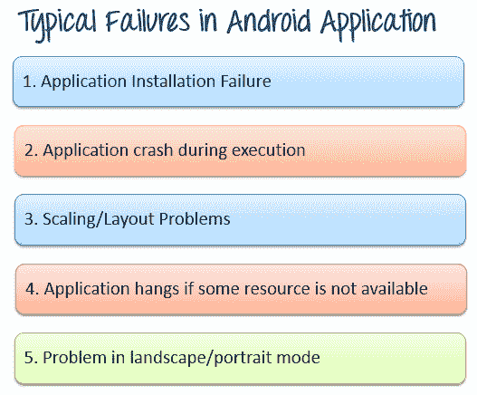
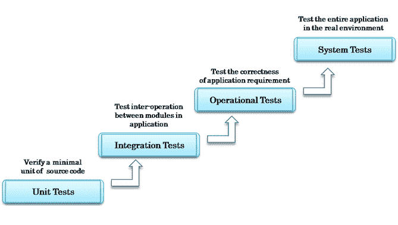
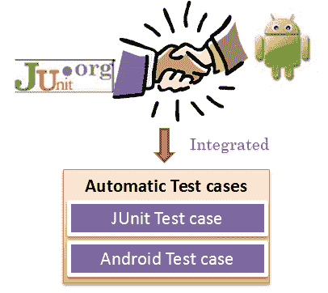
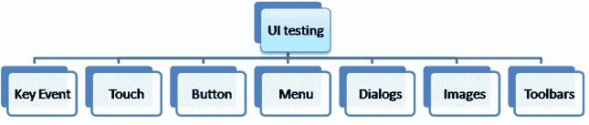
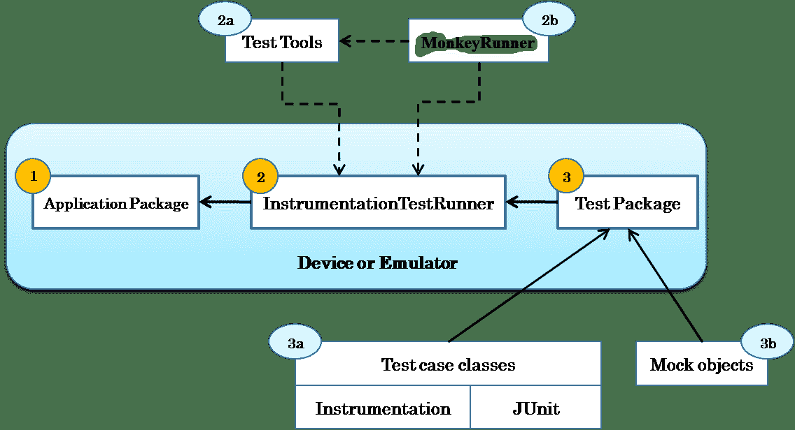
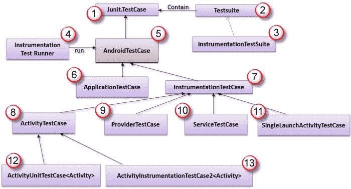
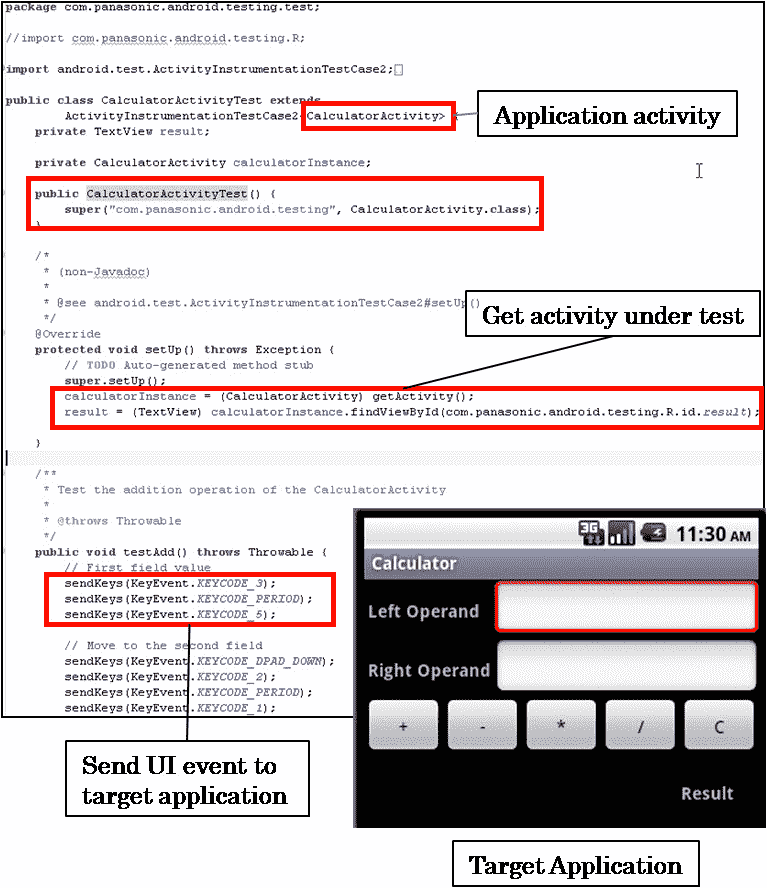
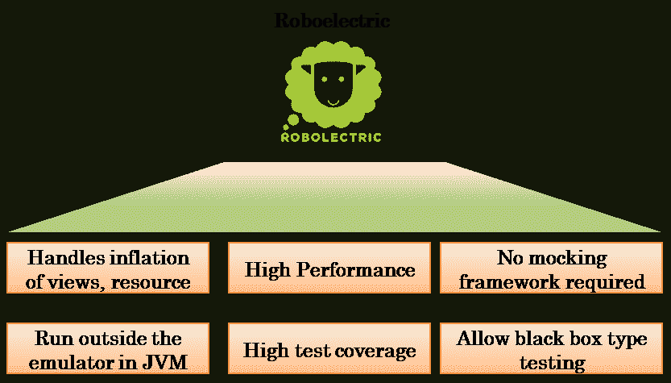
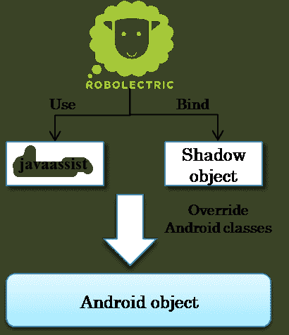
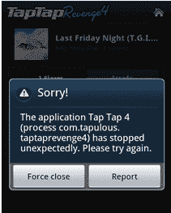

# 带有自动化框架的 Android APP 测试教程

> 原文： [https://www.guru99.com/why-android-testing.html](https://www.guru99.com/why-android-testing.html)

## 为什么要进行 Android 测试？

Android 是世界上最大的操作系统。 同时，Android 支离破碎。 您的应用必须兼容许多设备和 Android 版本。

花费多少时间在设计和实施上无关紧要，错误是不可避免的，并且会出现错误。

.png)

在本教程中，您将学习-

*   [为什么要进行 Android 测试？](#1)
*   [Android 测试策略](#2)

*   [单元测试](#3)
*   [集成测试](#4)
*   [操作测试](#5)
*   [系统测试](#6)

*   [自动 ANDROID 测试](#7)

*   [Android 测试框架](#8)
*   [气胸测试框架](#9)

*   [Android 测试的神话](#10)
*   [Android 测试中的最佳做法](#11)

## Android 测试策略

正确的 android 测试策略应包括以下内容

1.  单元测试
2.  整合测试
3.  操作测试
4.  系统测试

.png)

## 单元测试

单元测试包括一组一个或多个程序，这些程序旨在验证源代码的原子单位，例如方法或类。

Android 平台预先集成了 [Junit](/junit-tutorial.html) 3.0 框架。 它是用于自动化[单元测试](/unit-testing-guide.html)的开源框架。 Android Testing Framework 是开发人员编写有效的单元测试程序的强大工具。

.png)

Android 与 JUnit 框架的集成

用户界面（UI）测试是对单元测试的补充。 这些测试与目标应用程序的 UI 组件有关。 UI 测试可确保您的应用程序响应设备上的用户操作序列，返回正确的 UI 输出。

应用程序上的常见用户界面操作

在设备上进行性能 UI 测试的常用方法是 Android [Instrumentation](https://developer.android.com/reference/android/test/InstrumentationTestCase.html) 。 但这存在性能问题。 在 Android 上进行 UI 测试的最佳工具之一是 [Robotium](http://code.google.com/p/robotium/) 。

## 集成测试

在[集成测试](/integration-testing.html)中，所有经过单元测试的模块都经过组合和验证。 在 Android 中，集成测试通常涉及检查与 Android 组件的集成，例如服务测试，活动测试，内容提供者测试等。

Android 上的集成测试类型

有许多测试框架可用于进行 Android 的集成测试，例如 Troyd，Robolectric，Robotium。

## 操作测试

*   操作性也称为功能测试或验收测试。 它们是旨在检查应用程序完整性和正确性的高级测试。
*   在 Android 中， [FitNesse](http://www.fitnesse.org/) 是开放源代码框架，可轻松对目标应用程序进行操作测试。

## 系统测试

在[系统测试](/system-testing.html)中，对系统进行了整体测试，并检查了组件，软件和硬件之间的交互。

在 Android 中，系统测试通常包括

*   GUI 测试
*   可用性测试
*   性能测试
*   压力测试

在上面的列表中， ***性能测试*** 更加受关注。 您可以使用 [Traceview](http://developer.android.com/tools/help/traceview.html) 之类的工具在 Android 上进行性能测试。该工具可以帮助您调试应用程序并分析其性能。

## 自动 ANDROID 测试

由于 android 支离破碎，因此必须在众多设备上进行测试。 但这也将花费您的钱。 自动化的 Android 测试可以帮助降低成本

自动化 android 测试的好处

*   减少执行测试用例的时间
*   提高开发过程的生产率
*   及早发现错误，节省软件维护成本
*   快速发现并修复实施中的错误
*   确保软件质量

我们将研究以下两个框架

*   Android 测试框架
*   robolectric 测试框架

## Android 测试框架

Android 应用程序的标准测试框架之一是 **Android 测试框架**。 它是一个功能强大且易于使用的测试框架，与 Android SDK 工具很好地集成在一起。

.png)

Android 测试框架架构

1.  **应用程序包**是您的目标应用程序，需要进行测试
2.  **InstrumentationTestRunner** 是[测试用例](/test-case.html)运行器，它在目标应用程序上执行测试用例。 这包括：

2a）**测试工具：**用于构建测试的 SDK 工具。 它们集成在 Eclipse IDE 中或作为命令行运行。

2b） **MonkeyRunner：**一种工具，提供用于编写​​程序的 API，这些 API 在 Android 代码之外控制 Android 设备或模拟器。

3.  **测试包**被组织到测试项目中。 该软件包遵循命名约定。 如果被测应用程序的软件包名称为“ *com.mydomain.myapp* ”，则测试软件包应为“ *com.mydomain.myapp.test* ”。测试软件包包含 2 个对象 下面：

3a）测试用例类：包括要在目标应用程序上执行的测试方法。

3b）模拟对象：包括模拟数据，这些数据将用作测试用例的样本输入。

## Android 测试用例类

AndroidTestCase 类图

1.  **TestCase** 包括用于运行 JUnit 测试的 JUnit 方法
2.  **TestSuite** 用于运行一组测试用例
3.  **InstrumentationTestSuite** 是一个 TestSuite，可在运行之前将 Instrumentation 注入 InstrumentationTestCase。
4.  **InstrumentationTestRunner** 是在目标应用程序上执行测试用例的测试用例运行器。
5.  **AndroidTestCase** 扩展了 JUnit TestCase。 它包含用于访问资源（例如活动上下文）的方法。
6.  **ApplicationTestCase** 在受控环境中验证 Application 类。
7.  **InstrumentationTestCase** 验证目标应用程序的特定功能或行为，例如，验证应用程序的 UI 输出。
8.  **ActivityTestCase** 是支持测试应用程序活动的基类。
9.  **ProviderTestCase** 是用于测试单个 ContentProvider 的类。
10.  **ServiceTestCase** 用于在测试环境中测试 Service 类。 它还支持服务的生命周期。
11.  **SingeLauchActivityTestCase** 用于通过 InstrumentationTestCase 测试单个活动。
12.  **ActivityUnitTestCase <活动>** 用于测试单个隔离的活动。
13.  **ActivityInstrumentationTestCase2 <活动>，**扩展了 JUnit TestCase 类。 它通过仪器将您连接到目标应用程序。 使用此类，您可以访问应用程序的 GUI 组件并将 UI 事件（按键或触摸事件）发送到 UI。

以下是 ActivityInstrumentationTestCase 的示例。 它验证计算器应用程序的 UI 操作，检查 UI 输出的正确性。

ActivityInstrumentationTestCase2 测试示例

## Robolectric 测试框架

使用带有设备或仿真器的 Android 测试框架进行测试非常困难。 构建和运行测试很慢，需要大量开发工作。 要解决此问题，还有另一种选择- **Robolectric** 测试框架。

Robolectric 框架允许您直接在 JVM **上运行**的 Android 测试**，而无需**使用设备或仿真器。

.png)

Robolectric 的先进功能

## 机器人测试案例类

.png)

Robolectric 的操作

*   如上所示，Robolectric 可以执行以下操作：
*   注册并创建 Shadow 类
*   拦截 Android 类的加载
*   使用 javaassist 覆盖 Android 类的方法主体
*   将 Shadow 对象绑定到 Android 类
*   这允许被测代码在没有 Android 环境的情况下执行。

## 其他测试框架

除了上面提到的测试框架外，还有许多其他测试框架，例如：

*   [Android Junit 报告](https://github.com/jsankey/android-junit-report)，这是 Android 的自定义检测测试运行程序，可生成 XML 报告以与其他工具集成。
*   [Express](https://developer.android.com/training/testing/espresso/index.html)
*   [纪元](http://appium.io/)

## Android 测试的神话

许多企业基于常见的误解开发了 android [测试](/software-testing.html)策略。 本节探讨了一些流行的误解和 Android 测试的现实情况。

**误区 1：所有 Android 设备都相同...在模拟器上进行测试就足够了**

让我们从一个简单的例子开始。 应用程序可以在模拟器上完美运行，但在某些实际设备上，在执行过程中会崩溃

在真实设备上执行期间，应用程序崩溃

仿真器**不足以进行移动测试**。 您必须在真实设备上测试您的应用。

**误区 2：在一些常见设备上进行测试就足够了**

*   在不同的设备上，您的应用程序看起来会有所不同，因为不同的设备具有不同的硬件，屏幕大小，内存等。您必须在不同的设备，操作系统版本，运营商网络和位置上测试应用程序。

**误区三：发射前进行探索性测试就足够了**

*   通常，在所有测试中，我们都会设计测试用例，然后执行它们。 但是在探索性测试中，测试设计和执行将一起完成。
*   在探索性测试中，没有计划，没有准备，那么测试人员将进行他想做的测试。 某些功能将被重复测试，而某些功能将不被完全测试。

**误区 4：如果应用程序中存在一些错误，用户将理解**

*   如果应用程序无法运行且存在错误，则用户会卸载您的应用程序
*   质量问题是 Google Play 中评价不佳的首要原因。 它会影响您的声誉，并失去客户的信任。

因此，拥有适当的 android 测试策略至关重要

## Android 测试中的最佳做法

*   应用程序开发人员应在编写代码的同时创建测试用例
*   所有测试用例应与源代码一起存储在版本控制中
*   每次更改代码时使用连续集成并运行测试
*   避免使用仿真器和有根设备