# Robotium 教程：您的第一个 Android 框架

> 原文： [https://www.guru99.com/first-android-testing.html](https://www.guru99.com/first-android-testing.html)

### 什么是机械人？

Robotium 是一个 android 测试框架，用于自动化本机和混合应用程序的测试用例。 使用 Robotium，开发人员可以为 Android 应用程序创建强大的自动 GUI 测试用例。 此外，开发人员可以编写功能，系统和验收测试方案，以传播许多 Android 活动。

在本教程中，您将学习-

*   [机器人测试框架](#1)
*   [如何使用 Robotium](#2)
*   [步骤 1）设计测试规范](#3)
*   [步骤 2）编写测试程序](#4)
*   [步骤 3）运行测试](#5)
*   [步骤 4）获取测试结果](#6)

## 机器人测试框架

标准的 Android 测试框架具有以下局限性

*   无法处理多项活动
*   测试执行速度慢
*   测试用例很复杂&难以实现

**Robotium** **框架**是在 Android 应用程序上进行测试的更好选择

Robotium 是开源框架，被认为是 Android 测试框架的扩展。 使用 Robotium，开发人员可以为 Android 应用程序创建强大的自动 GUI 测试用例。 此外，开发人员可以编写功能，系统和验收测试方案，涵盖多个 Android 活动。

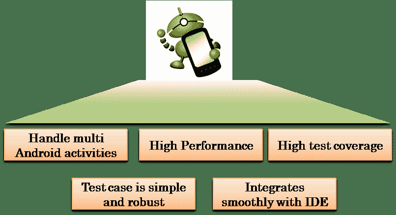.png)

Robotium 的高级功能

## Robotium 测试用例类

Robotium 使用一组类（ **com.jayway.android.robotium.solo** ）来测试**。** 此类支持跨多个活动的测试用例。 Solo 已与 ActivityInstrumentationTestCase2 集成。

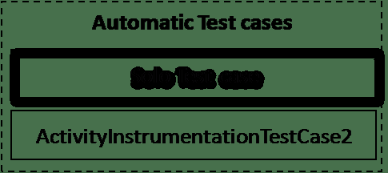.png)

集成 Robotium 和 ActivityInstrumentationTestCase2

**通过使用 Robotium 测试用例类，测试人员可以在不具备应用程序设计知识（黑盒测试）的情况下编写测试用例。 与 Android 测试用例类相比，它是一项杰出的功能。**

## 如何使用 Robotium

To use Robotium in your Android test project, you need follow the steps below

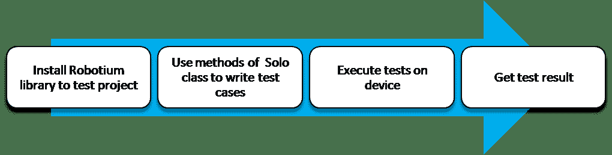.png)

使用 Robotium 在 Android 应用程序上进行测试。 为了保证您的 Android 应用程序的质量，请按照以下步骤操作

1.  设计测试规范
2.  制定测试程序
3.  在目标设备上执行[测试用例](/test-case.html)
4.  收集测试结果

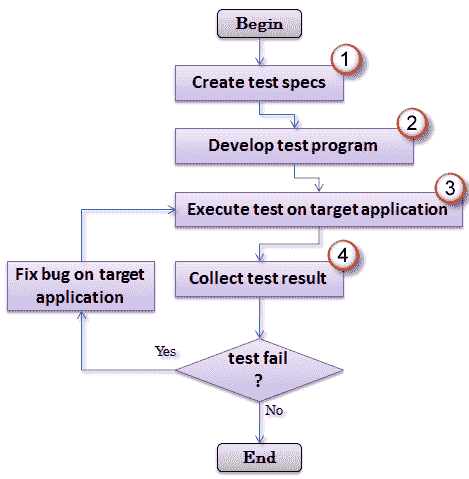

Android 应用程序[测试](/software-testing.html)程序

## 步骤 1）设计测试规范

*   这是测试应用程序的第一步。在此步骤中，定义要测试的目标。 在您的 Android 应用程序中，需要测试许多目标，例如 UI，活动，组件，服务。 在应用程序中明确定义目标将有助于实现广泛的测试范围。
*   计划应进行的测试类型（单元测试，功能测试，系统测试）。
*   设计测试用例以最大程度地覆盖测试范围，但最大程度减少测试用例的数量。 测试的代码越多，早期漏洞检测的机会就越大。

## 步骤 2）编写测试程序

本节指导您如何使用 Android [Junit](/junit-tutorial.html) Test and Robotium 编写 Android 测试程序。 假设您已经开发了一个 Android 程序名称 *HelloAndroid。* 该程序具有以下一些功能：

*   显示文本“ Hello world！” 在屏幕上。
*   当用户按下“开始”按钮时显示消息 HelloAndroid


HelloAndroid 应用程序

## 系统要求

*   Android 平台随附了预先集成的 JUnit 3.0 框架。
*   为了从 Eclipse 创建 Android 测试项目，您的计算机必须已安装：
    *   最新版本的 Android 平台（当前为 Android 8.1）

您可以[下载带有内置 ADT（Android 开发人员工具）的](http://developer.android.com/sdk/index.html) Eclipse IDE。 它包括基本的 Android SDK 组件和 Eclipse IDE 的版本。

对于 Robotium 测试框架，您需要从 [Robotium 网页](https://github.com/robotiumtech/robotium)中关闭 Robotium 库。

## 创建 Android 测试项目

*   点击文件->新建->其他
*   选择：Android-> Android 测试项目，如下图所示->选择“下一步”

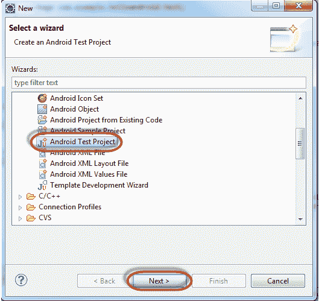

创建新的 Android 测试项目

输入测试项目的名称。 按照命名约定，您的测试项目应命名为“ *HelloAndroidTest* ”

.png)

根据命名约定添加测试项目名称

选择要测试的目标应用程序。 在这种情况下，这是 HelloAndroid，请单击“完成”。

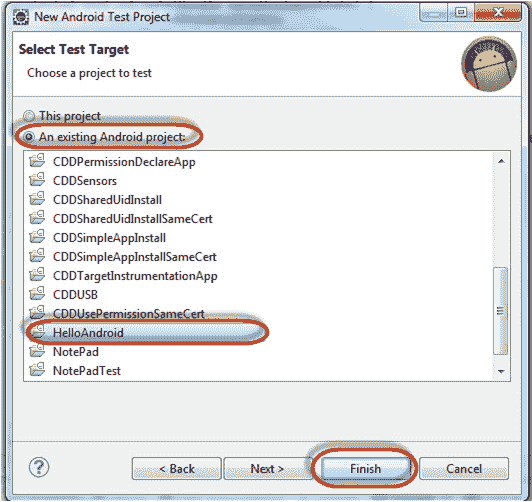

选择要测试的目标应用程序

## 创建测试套件

根据测试规范，您开始为测试程序创建测试套件。 您可以选择各种测试框架。 在本教程中，我选择标准的 Android 测试框架 **ActivityInstrumentationTestCase2** 。 如果要使用 Robotium 框架进行测试，则必须将 Robotium 库文件添加到项目文件夹中的*库*目录中。 （您在项目文件夹中创建 lib 文件夹）。

测试用例定义了夹具以运行多个测试。 要定义测试用例，必须遵循以下程序结构：

*   实现`TestCase`的子类。
*   定义存储夹具状态的实例变量
*   通过覆盖 [setUp（）](https://developer.android.com/reference/junit/framework/TestCase.html#setUp%28%29)初始化灯具状态
*   通过覆盖 [tearDown（）](https://developer.android.com/reference/junit/framework/TestCase.html#tearDown%28%29)进行测试后进行清理。

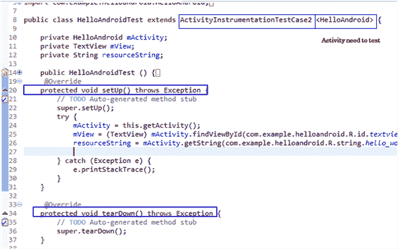.png)

测试程序的结构

```
package com.example.helloandroid.test;

import com.example.helloandroid.HelloAndroid;
import com.jayway.android.robotium.solo.Solo;
import android.test.ActivityInstrumentationTestCase2;
import android.widget.TextView;

public class HelloAndroidTest extends ActivityInstrumentationTestCase2 <HelloAndroid> {

	private HelloAndroid mActivity;
	private TextView mView;
	private String resourceString;
	private Solo solo;

	public HelloAndroidTest () {
		// TODO Auto-generated constructor stub
		super("com.example.helloandroid",HelloAndroid.class);	
	}

	 @Override
	protected void setUp() throws Exception {
		// TODO Auto-generated method stub
	//	super.setUp();

	 	mActivity = this.getActivity();
		solo = new Solo(getInstrumentation(),getActivity());
		mView = (TextView) mActivity.findViewById(com.example.helloandroid.R.id.textview2);
		resourceString = mActivity.getString(com.example.helloandroid.R.string.hello_world);

	}

	 @Override
	protected void tearDown() throws Exception {
		// TODO Auto-generated method stub
		//super.tearDown();
		solo.finishOpenedActivities();
	}

	public void testPrecondition() {
		assertNotNull(mView);
	}

	/* test Target application contains a text display "Hello World!"*/
	public void testSearchText() {
		assertEquals(resourceString,(String) mView.getText());
	}

	/* test HelloAndroid Activity on target application is exist*/
	public void testCurrentActivity() throws Exception  {
    	solo.assertCurrentActivity("wrong activity", HelloAndroid.class);
    }

	/* test Application UI contains "Start" button */
	/* send event click button to target application */
    public void testSearchButton() throws Exception {
    	boolean found = solo.searchButton("Start");
    	solo.clickOnButton("Start");
    	assertTrue(found);
    }

}
```

## 添加测试用例

*   在与 TestSuite 相同的程序包中，我们创建 TestCase 类
*   要测试某些活动，即 *HelloAndroid* ，请创建一个测试用例范围 *ActivityInstrumentationTestCase2 < HelloAndroid >*
*   在此类中，测试人员可以通过 getActivity（）方法获得测试活动。
*   您可以通过名称为“ test + original Method Name”的创建方法来为测试活动自由创建测试
*   在测试方法中，测试人员可以使用 Android JUnit 函数比较实际值和期望值。 这些方法如下所示。

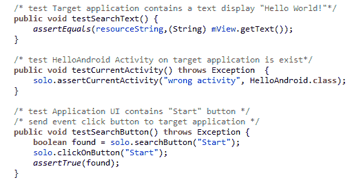.png)

Robotium 和 Android 测试框架的示例方法

上面的这些测试套件验证了 Application GUI 必须显示文本“ *Hello World！*”，并包含按钮名称“ *Start* ”。

## STEP 3）运行测试

完成编写测试程序后，请按照以下步骤运行测试

*   将 Android 设备连接到 PC（或在没有真实设备的情况下启动 Emulator）。
*   在您的 IDE 中，右键单击“运行为” Android 单元测试

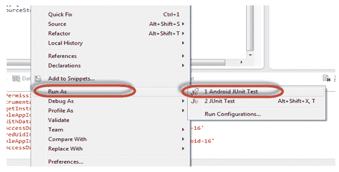

运行测试程序

除了在 IDE 上运行测试外，您还可以在命令行上运行测试。 在此测试程序中，测试包为 *com.example.helloandroid.test* 。 在 **Linux** 终端中，您可以使用以下命令运行此软件包中的所有测试：

*$ adb shell am instrument -w -e 包 com.example.helloandroid.test*

## 步骤 4）获取测试结果

执行测试后，您将获得测试结果。

在该测试程序中，执行 4 种测试方法。 在这种情况下，所有测试用例都将通过。

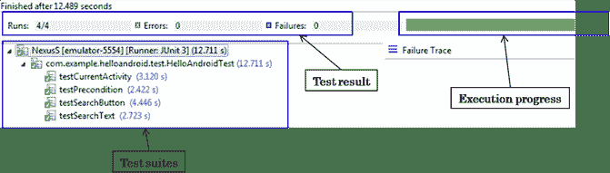.png)

在所有测试用例通过的情况下输出测试结果

如果测试用例失败，则显示输出，并向您显示哪些测试用例失败

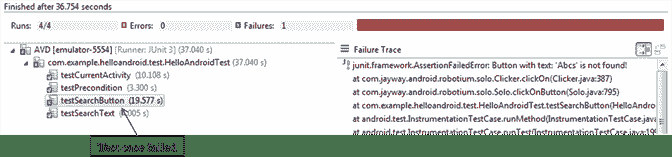.png)

如果所有测试用例都失败，则输出测试结果

## 源代码示例

本文包含一些源代码示例，这些示例可帮助您更清楚地理解本教程并快速掌握技术知识。

*   [HelloAndroid](https://drive.google.com/uc?export=download&id=0B_vqvT0ovzHca3Fpb3RjN2Jfb2c) ：正在测试的应用程序。
*   [HelloAndroidTest](https://drive.google.com/uc?export=download&id=0B_vqvT0ovzHcYW5LTWdhQ2pseTg) ：使用 Android 测试框架的测试程序