# Selendroid 入门实例教程

> 原文： [https://www.guru99.com/introduction-to-selendroid.html](https://www.guru99.com/introduction-to-selendroid.html)

您是否曾经开发过 Android 应用程序并将其发布到 Google Play？ 如果收到类似以下内容的用户评论，该怎么办？


当您将应用发布到 Google Play 时，必须对其进行良好的测试，以避免潜在的错误。 发布应用之前，应执行大量测试方案。 要节省[测试](/software-testing.html)的工作量，您需要一个测试工具。 **Selendroid 是适用于 Android 应用的最佳测试工具之一。**

*   [什么是 Selendroid？](#1)
*   [为什么我们需要 Selendroid？](#2)
*   [Selendroid 体系结构](#3)
*   [Selendroid](#4) 入门
*   [设置一个 Selendroid 环境](#5)
*   [如何启动 Selendroid](#6)
*   [Selendroid 基本命令](#7)
*   [使用 Selendroid](#8) 开始您的首次测试

## 什么是 Selendroid？

Selendroid 是用于多种类型的移动应用程序的测试自动化框架：**本机**和**混合** Android 应用程序和**移动**网络。


您可以使用 [Selenium](/selenium-tutorial.html) 2 客户端 API 编写测试。 因为 Selendroid 仍将现有的 Selenium 基础结构重用于 Web

Selendroid 是功能强大的测试工具。 它可以在**仿真器**和实际的**设备**上使用

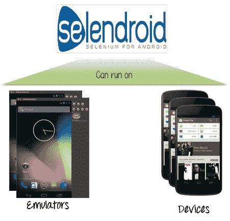

## 为什么我们需要 Selendroid？

Selendroid 是一个很棒的测试工具。 但是您可能仍然怀疑它的用处。


本节将介绍 Selendroid 的重要功能，以回答为什么需要 Selendroid 的问题。

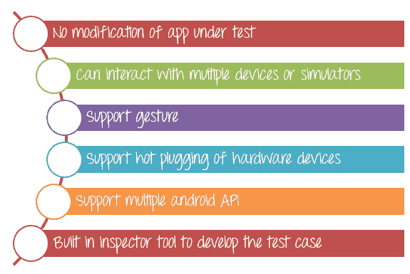

*   您可以使用 Selendroid 测试被测试的应用程序，而无需对该应用程序进行任何修改。 您只需要在计算机上安装二进制文件（ [APK](http://www.androidpit.com/android-for-beginners-what-is-an-apk-file) ）。 为了在设备上安装二进制文件，测试应用程序和移动应用程序必须使用相同的签名密钥进行签名
*   Selendroid 测试应用程序可以同时与多个设备或模拟器进行交互。 这是 Selendroid 的一大优势。 因此，您可以使用各种 Android 设备测试您的应用，以检查兼容性。
*   Selendroid 可以模拟用户在应用程序上的操作，例如在设备上进行触摸，滑动，拖放等操作
*   您可以在测试过程中更改硬件设备（即插拔），而无需重新启动或停止测试。 Selendroid 自动识别新设备
*   与 Android API 版本相对应，Selendroid 还支持新的 Android API（从 API 10 到 API 19）。
*   Selendroid 还具有一些内置的检查器工具，可帮助您识别被测应用程序的 UI 元素。 例如 ID 按钮，文本字段，文本视图…

## Selendroid 体系结构

Selendroid 基于 [Android 工具框架](http://developer.android.com/tools/testing/testing_android.html)。 Selendroid 测试是基于 Selenium Web 驱动程序客户端 API 编写的，因此它支持与当前 Selenium 框架的完全集成。

下图描述了 Selendroid 的体系结构

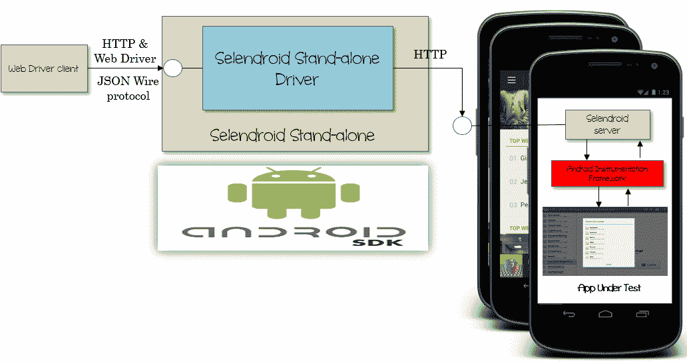

Selendroid 包含 4 个主要成分：

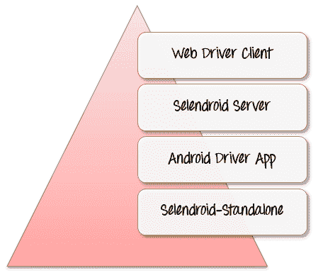

*   *Web 驱动程序客户端* –基于 Selenium 的 [Java](/java-tutorial.html) 客户端库。 该库应该安装在计算机上（用于开发测试用例）
*   *Selendroid-Server* –运行在受测应用中的 Android 设备或模拟器上的服务器。 这是 Selendroid 体系结构的主要组件
*   *Android Driver-App* -内置的 Android 驱动程序 Web View 应用程序，用于测试移动网络。
*   *Selendroid-Standalone* –此组件用于安装 Selendroid 服务器和被测应用程序（AUT）

## Selendroid 入门

您已经知道 Selendroid 的重要性。 现在，让我们与 Selendroid 擦干双手。

在使用 Selendroid 进行第一次测试之前，需要完成 3 个步骤

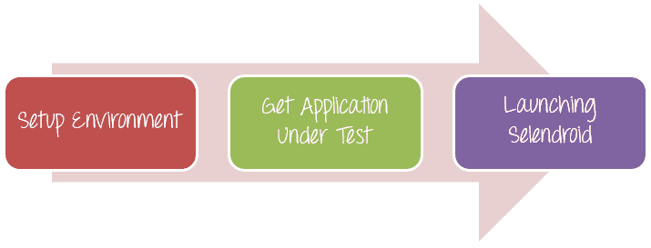

## 设置一个 Selendroid 环境

Selendroid 可以在 Window， [Linux](/unix-linux-tutorial.html) 和 Mac OS 上运行。 在本教程中，我们将在 Window OS 中设置 Selendroid。

在使用 Selendroid 之前，您需要先安装以下软件包

*   [Java SDK](/install-java.html) (minimum 1.6)

    您必须接受许可协议并下载 Java 安装程序（在您的操作系统上选择 x64 或 x86）

    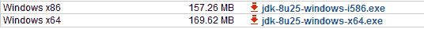

    下载并安装 Java SDK 作为常规软件

*   最新版本的 [Android SDK](https://developer.android.com/studio?pkg=tools)
*   您的计算机必须至少有一个 Android 虚拟设备（AVD），或一台真正的 Android 设备已插入 PC。
*   [具有依赖项的 Selendroid 独立](https://github.com/selendroid/selendroid/releases/download/0.11.0/selendroid-standalone-0.11.0-with-dependencies.jar)， [Selendroid 客户端](https://repo1.maven.org/maven2/io/selendroid/selendroid-client/0.10.0/selendroid-client-0.10.0.jar)和 [Selenium 客户端](http://selenium-release.storage.googleapis.com/2.44/selenium-java-2.44.0.zip)
*   [Eclipse](https://eclipse.org/downloads/packages/eclipse-ide-java-developers/lunasr1) 软件
*   Set up the JAVA_HOME and ANDROID_HOME

    **步骤 1）**在窗口上，右键单击计算机**->** 属性**->** 高级系统设置

    

    **步骤 2）在**系统属性窗口显示中，选择选项卡高级**->** 环境变量

    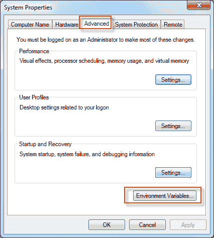

    **步骤 3）**在“环境”窗口显示中，单击“新建”。**->** 输入变量 ANDROID_HOME，如下所示

    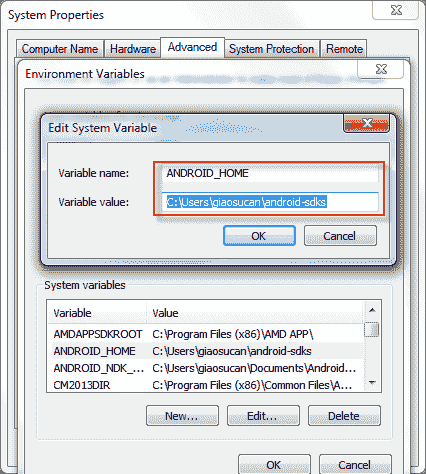

    变量值是您已经安装的 android-sdks 的路径。

    查找系统变量路径**->** 编辑**->** 在当前行之后添加以下行

    

    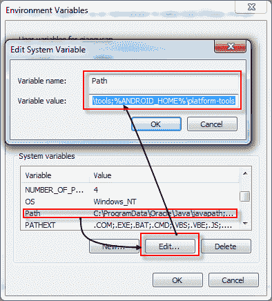

    与 ANDROID_HOME 类似，添加新变量 JAVA_HOME，其值如下

    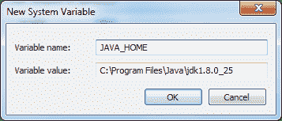

    该值是 Java JDK 安装的路径

    步骤 4）重新启动电脑**->** 完成

## 如何启动 Selendroid

***步骤 1）在测试中获取应用程序***

您可以使用现有的 Selendroid 测试应用程序来检查 Selendroid 的工作方式（[将](http://search.maven.org/remotecontent?filepath=io/selendroid/selendroid-test-app/0.12.0/selendroid-test-app-0.12.0.apk)链接到被测试的示例应用程序）

下载完成后，将此 APK 和上面的 [Selendroid 独立 jar](https://github.com/selendroid/selendroid/releases/download/0.11.0/selendroid-standalone-0.11.0-with-dependencies.jar) 文件复制到名为“ **Guru99”** 的文件夹中

***步骤 2）启动 Selendroid***

在 Windows &上打开终端，导航到在步骤 1 中创建的文件夹 Guru99。

运行以下命令


输出将显示如下

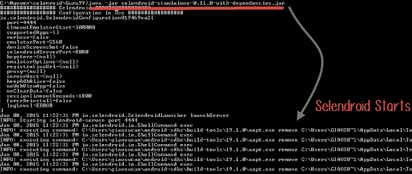

运行此命令后，Selendroid 独立 HTTP 服务器将启动！ 该服务器的默认端口号是 4444。将自动扫描和识别所有硬件设备以及 Android 虚拟设备。 Selendroid 将识别 Android 目标版本和设备屏幕尺寸。

要检查 Android 目标版本以及设备信息，可以在浏览器中启动以下 URL：

[http：// localhost：4444 / wd / hub / status](http://localhost:4444/wd/hub/status) 。

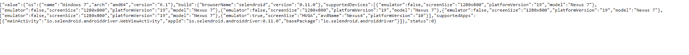

## Selendroid 基本命令

本节介绍一些基本的 Selendroid-Standalone 命令行。 您可以使用它们来设置 Selendroid 测试环境

1.  Setting port of Selendroid

    Selendroid 的默认端口是 4444。但是您可以通过在命令中添加参数以启动 Selendroid 来更改为其他端口。

    参数：-port *[端口号]*

    例如：

    

    在上面的命令中，5555 是新端口。

因此，用于检查 Android 目标版本的 URL 更改为： [http：// localhost：5555 / wd / hub / status](http://localhost:5555/wd/hub/status)

1.  Specify the location of the application under test (Binary APK file). Selendroid often required the absolute path for this file

    参数：-app *[文件路径]*

    For example:

    

    在上面的命令中，Selendroid 自动在“ C：\ Guru99App.apk”中找到二进制文件，以获取被测应用程序的信息。

    检查 URL [http：// localhost：4444 / wd / hub / status](http://localhost:4444/wd/hub/status) ，您将看到此信息

    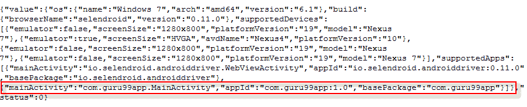

2.  Change the port the Selendroid uses to communicate with instrumentation server. Selendroid uses the port 8080 as the default

    参数：-selendroidServerPort *[端口号]*

    例

    

    端口现在更改为 9000

3.  Change the timeout to start emulators. The unit is milliseconds.

    参数：-timeoutEmulatorStart

    默认情况下，Selendroid 将等待 300,000 毫秒，直到模拟器启动。 您可以通过命令更改为新的超时时间（200,000 ms）

    

    这段时间过后，如果仿真器无法启动，则 Selendroid 将抛出异常错误（寻找设备/仿真器时发生错误。），然后停止运行

4.  When you start the Selendroid command on terminal, you will see a log printed out on the screen. You can change the type of log you see by adding the following parameter

    参数：-logLevel [*日志类型*]

    日志级别值为 ERROR，WARNING，INFO，DEBUG 和 VERBOSE。 默认值：ERROR。

    例如，将 Selendroid 设置为仅打印警告日志，则可以使用此命令

    

    Selendroid 仅打印警告日志

## 使用 Selendroid 开始您的第一次测试

本节是使用 Selendroid 创建第一个测试脚本的分步指南

假设我们有一个测试名称为 Guru99App 的 Android 应用程序。 该应用程序包括一个文本字段和一个名为“显示文本”的按钮。

[在此处下载 APK](https://drive.google.com/uc?export=download&id=0B_vqvT0ovzHcWFpYeVN4Tmlwckk)

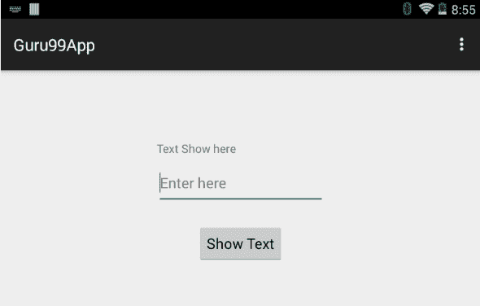

我们需要使用 Selendroid 执行以下[测试用例](/test-case.html)

| **测试用例** | **条件** | **预期输出：** |
| 

1.  启动应用程序
2.  在文本字段
3.  中输入文本“ **Guru99 Test** ”按下“显示文本”按钮

 | 受测应用程序的二进制文件可用设备已连接到 PC | 文本“此处显示文本”更改为文本哪个用户在文本字段中输入 |

**步骤 1）**在 Eclipse 中创建一个 Java 项目

**步骤 2）**在日食环境中添加硒和 Selendroid jar 文件

右键单击 Guru99Test 项目**->** 构建路径**->** 添加外部档案

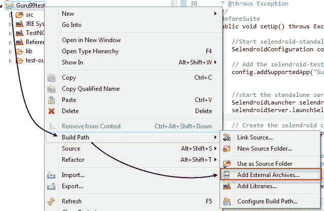

导航到存储 jar 文件的文件夹

应该添加 3 个 jar 文件

*   selendroid-client-0.10.0.jar：Selendroid Java 客户端库
*   selendroid-standalone-0.11.0-with-dependencies：Selendroid 独立服务器库
*   selenium-java-2.40.0.jar：Selenium Web 驱动程序库

全选**->** 选择“打开”以将 jar 文件添加到项目中

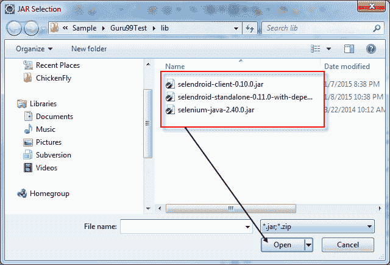

**步骤 3）**添加上述库之后，这些库将被添加到测试项目的参考库中。 测试人员可以使用这些库的 API 来开发测试程序

创建程序包“ com.guru.test”并添加如下所示的 java 文件“ Guru99Test.java”

右键单击 Guru99Test **->** 新**->** 程序包

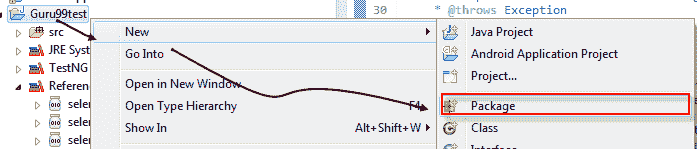

在“新建 Java 包”对话框中的“名称”字段中键入 com.guru.test，然后单击“完成”。

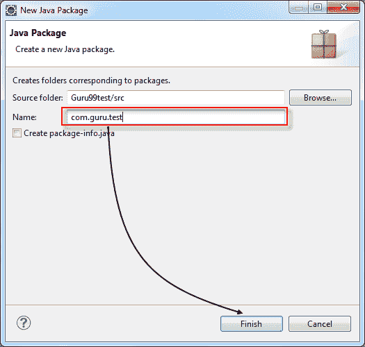

Eclipse 将在源代码结构中创建类似这样的列表文件夹和子文件夹

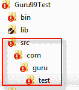

**步骤 4）**为 Eclipse 安装 [TestNG](http://testng.org/doc/download.html)

在 Eclipse 中，帮助**->** 安装新软件，在“安装”对话框中，单击“添加”并输入以下内容

*   名称：TestNG
*   位置： [http://selendroid.io/](http://selendroid.io/)

按确定**->** 接下来安装 TestNG

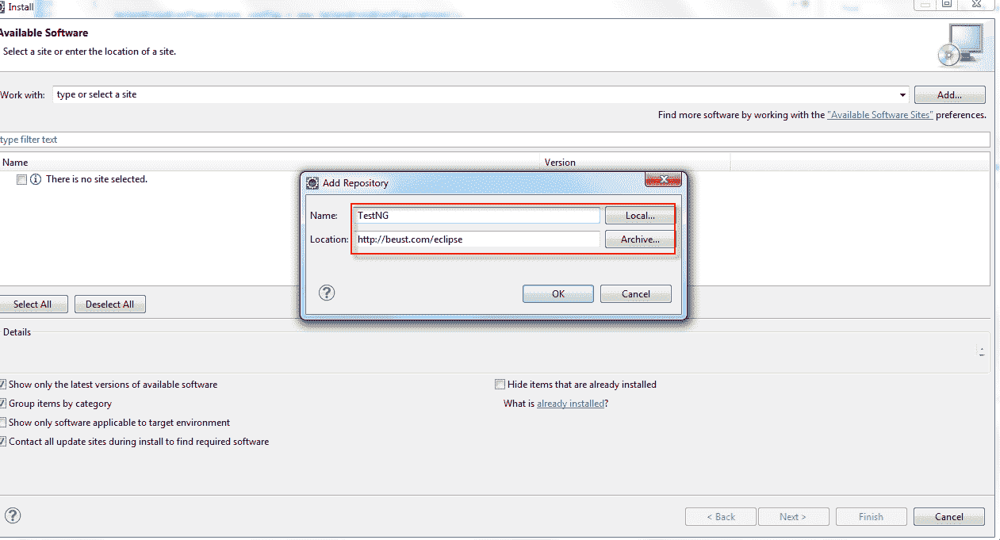

**步骤 5）**将 Guru99App.apk 复制到 Test App 的文件夹中

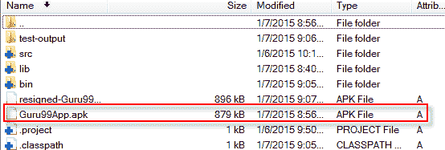

**步骤 6）**获取被测应用程序的 ID。

假设我们有一个 APK 文件名为 Guru99App.apk。 按照上一节中描述的步骤，在终端上执行命令


在浏览器中打开以下链接

[http：// localhost：4444 / wd / hub / status](http://localhost:4444/wd/hub/status) 。

显示设备信息，复制 appId 值“ com.guru99app：1.0”

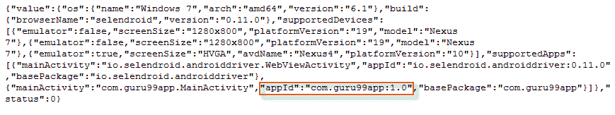

**步骤 7）**打开文件 Guru99Test.java（在示例代码中）并进行如下更改

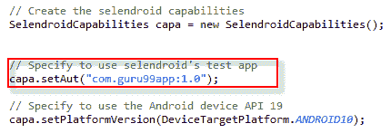

要使用 Selendroid 创建新的测试会话，您必须以 *com.guru99app：1.0* 格式提供应用 ID。 该应用程序 ID 可以在步骤 6 中进行标识。如果您未将应用程序 ID 设置为与 Android 设备匹配，则测试会话将引发错误并且无法启动。

初始化找到的设备后，Selendroid 创建一个自定义的 selendroid 服务器，并在其上安装 Selendroid 服务器

Selendroid 还将安装被测应用程序，并在设备上启动 selendroid-server

成功初始化测试会话后，将在设备上开始执行 test 命令。 （例如输入文本，请按按钮...）。 如果测试追加了测试会话，则仿真器将自动停止

**步骤 8）**开始新的测试会话

在终端上使用以下命令启动 Selendroid 服务器，如步骤 6 所示


Selendroid Server 启动后，在 Eclipse 上打开示例测试项目 Guru99test，双击文件 77- **->** 在文件 Guru99Test.java 的第 77 行设置一个断点。

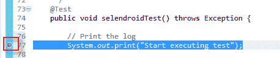

通过右键单击 Guru99Test 项目**->** 调试为**->** [Testng](/all-about-testng-and-selenium.html) 测试，开始测试会话。

测试会话将开始，如下所示

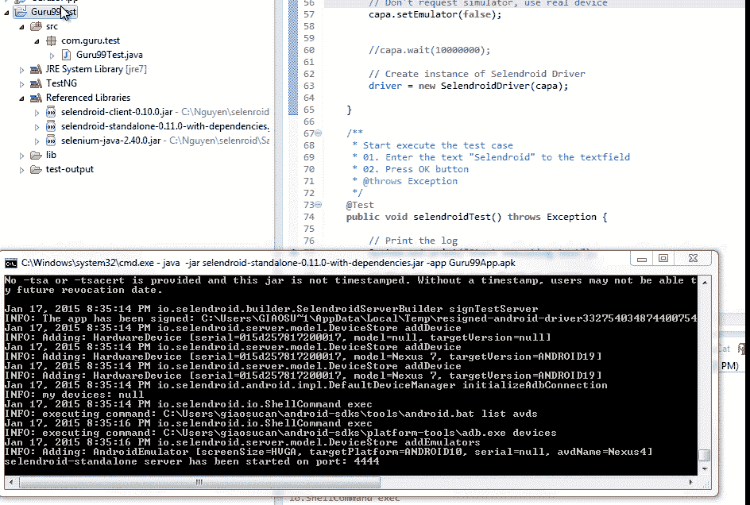

**步骤 9）**获取被测应用程序的 GUI 元素的 ID

测试会话成功启动后，打开浏览器，导航至 URL [http：// localhost：4444 / inspector](http://localhost:4444/inspector)

您将看到被测应用程序如下所示启动

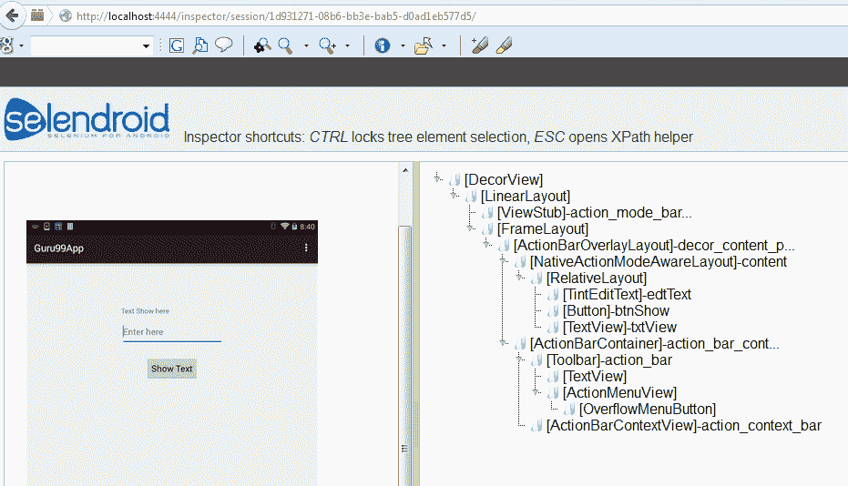

将鼠标悬停在 AUT 的每个 UI 元素（按钮，文本字段，文本标签）上，每个元素的 ID 都会在右窗格中突出显示

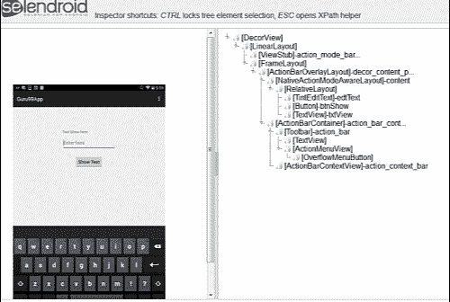

完成此步骤后，您可以获得上面每个 UI 元素的 ID

*   按钮显示文本 ID：“ **btnShow** ”
*   文本字段 ID：“ **edtText** ”
*   标签文字 ID：“ **txtView** ”

这些 ID 将在下一步中使用

**步骤 10）**如下输入测试程序

使用 Selendroid 的测试程序包括 3 个部分

**设置测试：**

以下是设置测试的代码，它将设置测试会话的条件。如果发生错误，Selendroid 将引发异常并停止测试应用程序。

该代码包含注释以解释每个语句。

```
package com.guru.test;

 import io.selendroid.SelendroidCapabilities;
		import io.selendroid.SelendroidConfiguration;
		import io.selendroid.SelendroidDriver;
		import io.selendroid.SelendroidLauncher;
		import io.selendroid.device.DeviceTargetPlatform;

		import org.openqa.selenium.By;
		import org.openqa.selenium.WebDriver;
		import org.openqa.selenium.WebElement;
		import org.testng.Assert;
		import org.testng.annotations.AfterSuite;
		import org.testng.annotations.BeforeSuite;
		import org.testng.annotations.Test;

 /**
		 * @author Guru99 Test App using Selendroid
			 * Application under test: Guru99App
		 *
		 */
		public
				class Guru99Test {

				     //Declare web driver variable
		    private WebDriver driver;

		    /**
		     * Setup the environment before testing
		     * @throws Exception
			     */
		    @BeforeSuite
		    public
					void setUp() throws Exception {

        //Start selendroid-standalone during test
		        SelendroidConfiguration config = new SelendroidConfiguration();

		      // Add the selendroid-test-app to the standalone server
		        config.addSupportedApp("Guru99App.apk");

		        //start the standalone server
		        SelendroidLauncher selendroidServer = new SelendroidLauncher(config);
			        selendroidServer.launchSelendroid();

		       // Create the selendroid capabilities
		        SelendroidCapabilities capa = new SelendroidCapabilities();

		       // Specify to use selendroid's test app
		        capa.setAut("com.guru99app:1.0");

		       // Specify to use the Android device API 19
		        capa.setPlatformVersion(DeviceTargetPlatform.ANDROID19);

		        // Don't request simulator, use real device
		        capa.setEmulator(false);

		        //capa.wait(10000000);

		        // Create instance of Selendroid Driver
		        driver = new SelendroidDriver(capa);

		    }

```

**执行测试**

以下是执行测试的代码。 该代码包含注释

再次是测试步骤

1.  输入文本“ Hello Guru”
2.  单击显示文本按钮
3.  请稍等
4.  验证应用程序是否在用户输入文本字段时显示文本（例如，显示文本“ Hello Guru”）。

```
 /**
		     * Start execute the test case
		     * 01\. Enter the text "Selendroid" to the textfield
		     * 02\. Press OK button
		     * @throws Exception
			     */
		    @Test
		    public
					void selendroidTest() throws Exception {

		        // Print the log 
		        System.out.print("Start executing test");

		        // Find the input text field on screen
        // The id of this text field was get from step 9
		        WebElement inputField = driver.findElement(By.id("edtText"));

		        // Verify that the text field enabled so user can enter text
		        Assert.assertEquals("true", inputField.getAttribute("enabled"));

		        // Enter a text to text field
		        inputField.sendKeys("Hello Guru");        

         // click Show Text button
        // The id of this button was get from step 9
		        WebElement button = driver.findElement(By.id("btnShow"));
					        button.click();

		        // Delay time to take effect
		        Thread.sleep(5000);

		        //Find the label "Text Show Here" on screen
        // The id of this label was get from step 9
		        WebElement txtView = driver.findElement(By.id("txtView"));

		        //Get the text display on screen
		        String expected = txtView.getText();

		// Verify that the text which user enter on text field is same as text display on screen
		        Assert.assertEquals(expected, inputField.getText());        

     }

```

**完成测试**

以下代码将通过停止 Selendroid 驱动程序来完成测试。

```
 /**
		     * Stop the Selendroid driver
		     * 
		     */
		    @AfterSuite
		    public
					void tearDown() {
					        driver.quit();
			    }

```

您可以在本文包含的示例代码中查看详细信息。

**步骤 10）**通过 USB 电缆将 Android 设备连接到 PC。 观察要点-

*   请确保设备未配置屏幕锁定。
*   设备必须通过 USB 插入运行 *selendroid-standalone* 组件的计算机。
*   设备应至少安装 Android Target 版本 API 10

**步骤 11）**运行 Test App：右键单击 Guru99test **->** 以**->** TestNG 测试运行

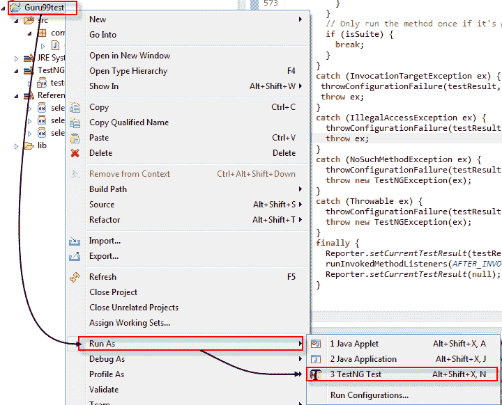

**步骤 10）**脚本开始如下执行

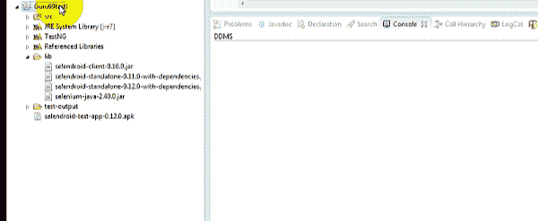

**步骤 12）**测试完成执行后，TestNG 自动生成测试报告，如下所示

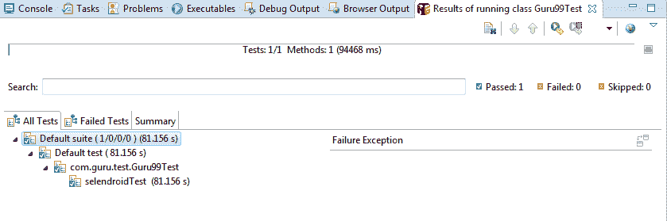

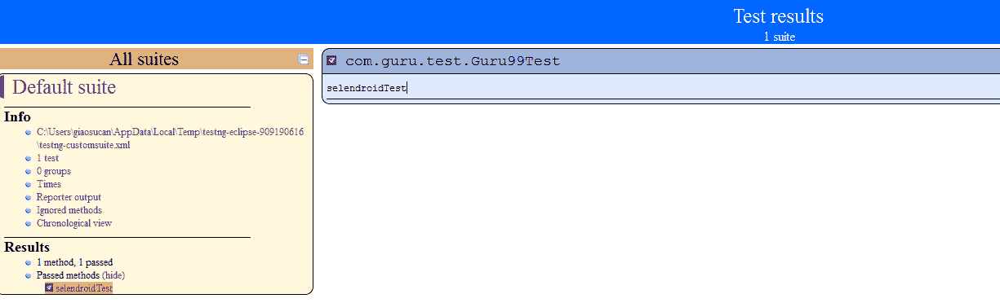

做得好，您现在已完成测试。

摘要

## 摘要

*   Selendroid 是用于测试 Android 本机应用程序，混合应用程序以及 Web 应用程序的功能非常强大的工具。
*   它可以在真实设备以及模拟器上使用。
*   它还允许您通过在多台设备上运行测试来并行运行测试。
*   整个 Selendroid 套件包含四个组件：
    *   Web 驱动程序客户端，
    *   Selendroid-Server，
    *   Android 驱动程序应用
    *   Selendroid 独立
*   要使用 Selendroid，您需要安装 Java JDK，Android SDK 和 Eclipse。