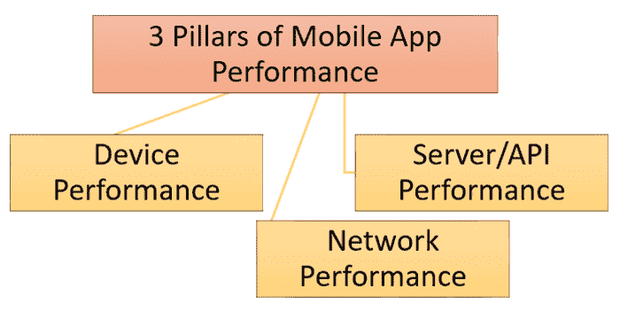

# 移动应用程序性能测试：清单，工具（Andriod & iOS）

> 原文： [https://www.guru99.com/mobile-app-performance-testing-strategy-tools.html](https://www.guru99.com/mobile-app-performance-testing-strategy-tools.html)

对于任何移动应用程序，性能都是至关重要的。 如果您的移动应用程序运行不佳，最终用户将卸载您的应用程序，然后找到性能更好的另一个应用程序。

在将移动应用程序发布给最终用户之前，需要对其进行彻底的测试。

在本教程中，您将学习-

*   [移动应用测试策略](#1)
*   [设备性能](#2)
*   [服务器性能](#3)
*   [网络性能](#4)
*   [对移动应用程序性能进行故障排除](#5)
*   [有用的移动应用测试工具](#6)
*   [挑战](#7)
*   [设置移动应用性能测试环境](#8)
*   [移动应用程序的性能清单](#9)

## 移动应用测试策略

手机或任何智能设备上的应用程序性能通常按以下三类进行衡量。

*   设备性能
*   服务器/ API 性能
*   网络性能

### 设备性能

当客户体验缓慢的应用程序时，他们会感到烦恼。

对于设备性能，您将检查以下内容-

*   **App Start-Up**

    您的应用启动需要多少时间？ 它是用户确定的第一个性能参数。 根据经验，在用户点击应用程序图标后，第一个屏幕应在 1-2 秒内显示出来。

*   **Battery Time while using an app**

    不断使用某些移动应用程序会消耗大量电池电量并加热手机。 此因素会大大提高任何移动应用程序的性能，通常可能会在您的应用程序使用的资源超出要求时发生。 资源使用过多会给处理器造成负担，并且手机会发热。

*   **Memory Consumption**

    在[测试](/software-testing.html)应用程序时，应检查应用程序的内存消耗。 通过在应用程序中实现某些功能，内存消耗也会增加。 例如，在 Android 应用中，当实施推送通知时，内存消耗会增加。

    在某些情况下，已经观察到整个操作系统的内存使用率仅为 14％，而新应用程序的使用率则为 11％。 因此，在将应用程序部署到现实世界或赠送给客户之前，必须处理这些因素。

*   **Hardware/Software Variation**

    测试移动应用程序时，必须检查不同设备上的应用程序。 应用可能在一台设备上流畅运行，而在另一台设备上却无法流畅运行。 像其他 Android 设备供应商一样，我们可以在 Samsung，HTC 和 Lenovo 手机上检查该应用程序。 同样，该应用需要使用不同的 RAM 和处理器规格（例如 1 GB 或 2 GB）进行测试。

*   **Usage with Other Apps**

    当被测应用程序与其他应用程序并行运行时，不应有干扰。 最好的检查方法是切换被测应用程序和其他应用程序。

*   **App in background**

    检索在后台运行的应用程序，它应保持与以前相同的状态。 如果未正确处理此方案，则数据将丢失。 同样，您必须在检索应用程序时从头开始输入数据。

### 服务器/ API 性能

当应用通过 API 与服务器交互时，响应时间对于性能至关重要。 对于服务器性能，您将检查-

*   **Data to and from server**

    该应用程序应有效处理从服务器发送的数据。 加载数据时不要花费太多时间。 在某些应用中，数据以指定格式发送。 因此，在将其显示在应用程序中之前，应将其转换为相关格式。 在此过程中，应用有时会变慢，响应时间也会变长。

*   **API Calls Generated from App**

    从测试中的应用程序到由应用程序生成的服务器的呼叫次数应更少。 在某些情况下，会对同一功能进行多个 API 调用。 为了获得更好的性能，应使用较少的呼叫次数来处理。

*   **Server Down Time**

    由于任何原因，如果服务器关闭或无法访问，我们可以将数据保存在本机数据库中。 因此，无论何时服务器关闭，我们都可以显示存储在本机数据库中的数据。 另一个解决方案可以是故障转移数据库服务器，即，如果其中一个服务器已关闭或处于维护阶段，则备用服务器应该可以进行切换。 故障转移/备份服务器应与主服务器保持连续复制和同步。

### 网络性能

需要衡量应用在不同网络上的性能和网络属性。

对于网络性能，您将检查以下内容。

*   **Jitters**

    当网络上接收信息存在延迟时，则称为抖动。 这是无连接网络或分组交换网络的问题。 随着信息被分发到数据包中，数据包可以通过一条不同的路径从发送者到接收者。 当数据到达目标位置时，它比原始发送的数据变得混乱。 对于抖动，移动应用程序应有足够的能力来处理它。

    您需要向最终用户显示适当的通知，以重新发送请求或等待系统再次响应。

*   **Packet Loss**

    在完全丢失数据包的情况下，该应用应该能够重新发送信息请求或相应地生成警报。 如果数据不完整，则用户将无法理解 App 中显示的信息。 这会对用户造成压力。 因此，最好显示适当的消息或提示用户重试。

*   **Network Speed**

    需要在各种速度可变的网络上检查该应用。 该应用应在 2.5G，3G 和 4G 网络上进行测试。 Wi-Fi 和移动网络都包括在其中。 此外，应监视应用程序的行为。 特别是，当两个网络都可用时，并且发生了从一个网络到另一个网络的切换。

    例如，在将电话网络从 4G 切换到 WIFI，反之亦然时，用户的应用程序中可能会出现问题。 在这种情况下，该应用将变得无响应，并可能需要重新启动该应用才能使用。

## 对移动应用程序性能进行故障排除

在[性能测试](/performance-testing.html)期间发现问题/问题之后。 现在是时候追踪和纠正故障了。

**问题 1）移动应用程序的响应滞后或缓慢。**

造成延迟的原因可能是 RAM，缓存等。

您需要杀死不必要的进程或清除缓存。 对连通性问题进行故障排除可能会解决一些导致滞后的问题

**问题 2）应用重新启动，锁定，冻结或无响应。**

它可以通过以下一些步骤来解决

*   优化应用程序代码
*   应该修补和更新软件。
*   自动还原
*   使用外部卡时管理 RAM 或某些情况下的 ROM
*   擦除缓存分区
*   验证该应用程序是否可与其他第三方应用程序和 API 一起使用
*   根据设备映射移动应用程序

## 有用的移动应用测试工具

移动应用程序测试工具因设备或移动操作系统而异。 一些常见的移动应用性能测试工具是

**ANDROID**

*   [Robotium](https://latestmodapks.com/robotium/)

    就像用于移动应用程序的 [Selenium](/selenium-tutorial.html) 一样。 测试人员可以记录并播放执行测试所需的几个步骤。

*   [Monkey Runner](https://developer.android.com/studio/test/monkeyrunner/index.html)

    MonkeyRunner 可以在连接到 PC 或仿真器的真实设备上运行测试。 该工具具有一个 API，可以从 Android 代码外部控制智能手机，平板电脑或仿真器。

**苹果**

*   [Automator (Mac)](http://macosxautomation.com/automator/)

    Automator 是 Apple 为 OS X 开发的应用程序。它实现了点击式（或拖放式）工作流创建，以将重复性任务自动化成批处理，以便更快地进行更改。 这样可以节省人工干预下分别手动更改每个文件的时间和精力。

## 挑战

性能测试面临的主要挑战包括

*   组织不同的移动平台及其操作系统
*   模拟 Edge，3G，4G 或 WiFi 等连接性
*   移动设备的限制，例如电池和资源消耗
*   手机可用性
*   可以运行相同应用程序的各种大小的移动设备

## 设置移动应用性能测试环境

要配置测试环境，您需要-

*   了解需要测试的移动应用
*   识别应用程序需要在其上运行的不同操作系统
*   建立测试设置
    *   构建仿真器或模拟器
    *   实际设置的原型
*   选择适当的测试工具

## 移动应用性能测试清单

在发布之前，测试移动应用程序的性能是一项重要措施。 性能测试已完成以检查

*   使用此应用程序需要多少 RAM？
*   验证不同网络和环境下 APP 的速度和响应时间。
*   确保在多种网络条件下的真实用户体验
*   如果有多个连接，请确保获得所需的结果
*   确保应用程序不会崩溃。
*   确保移动应用程序在使用数据，Wi-Fi 或其他连接时表现良好
*   监视正常运行时间和移动 API 使用瓶颈
*   确保最大同时用户数
*   最后，检查移动应用程序是否达到极限

**摘要**

*   性能测试需要了解移动应用程序，资源利用者，虚拟用户，仿真器和多种测试策略。
*   手机上的应用程序性能可通过以下三个类别进行衡量。
    *   设备性能
    *   服务器性能
    *   网络性能
*   性能测试面临的挑战包括移动设备的紧凑尺寸，资源可用性，成本和预算。

**本文由 Nosheen Wajahat** 贡献