# 适用于 Android 测试的 Calabash 自动化工具教程

> 原文： [https://www.guru99.com/calabash-android-ios-testing.html](https://www.guru99.com/calabash-android-ios-testing.html)

## 什么是葫芦？

Calabash 是一个开源验收[测试](/software-testing.html)框架，可让您编写和执行针对 iOS 和 Android 应用程序的测试。

这是一个自动化的用户界面框架，允许使用 Cucumber 用 Ruby 编写测试。

Calabash 通过在移动应用程序中启用自动 UI 交互（例如按下按钮，输入文本，验证响应等）来工作。可以将其配置为在不同的 Android 和 iOS 设备上运行，从而提供实时反馈和验证。 在本教程中，我们将学习-

*   [为什么选择葫芦自动化？](#1)
*   [葫芦和 BDD](#2)
*   [如何安装葫芦](#3)
*   [与葫芦](#4)

## 为什么选择葫芦自动化？

| **优势** | **劣势** |
| 它有助于提高产量/生产率。 | 需要具备编写自动化测试脚本的能力。 |
| 提高质量或提高质量可预测性 | 调试测试脚本是一个主要问题。 |
| 改进了流程或产品的鲁棒性（一致性）。 | 对于播放方法，测试维护成本很高。 |
| 增加产出的一致性并减少人工成本和费用 | 如果测试脚本测试更多屏幕，则很难维护测试数据文件 |

## 葫芦和 BDD

*   葫芦是**行为驱动开发（BDD）**。 它与测试驱动开发（TDD）相同，但是指定了应用程序行为，而不是创建描述 API 形状的测试。
*   BDD 是一个过程，其中多个利益相关者参与其中，以对要构建的内容达成共识。
*   BDD 从企业所有者的角度帮助构建正确的软件和进行设计。

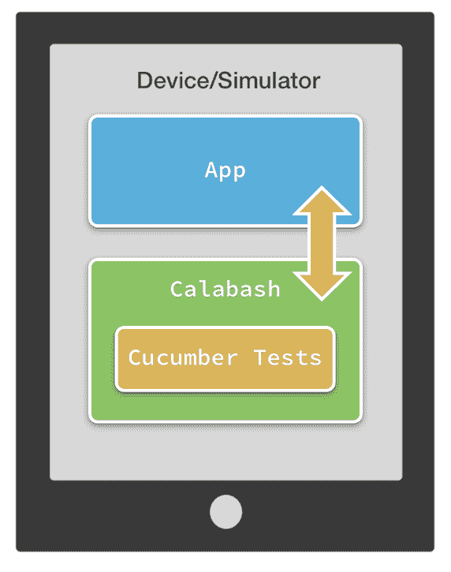

## 如何安装葫芦

**第 I 部分）**安装 [Java](/java-tutorial.html) JDK –请参阅本指南- [/install-java.html](/install-java.html)

**第二部分）下载并安装 Ruby。**

**步骤 1）**从 URL [下载[Ruby] **http://rubyinstaller.org/downloads**](http://rubyinstaller.org/downloads)

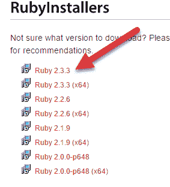

**步骤 2）**打开 exe，然后按照屏幕上的说明进行操作。 安装完成后，您将看到以下屏幕。 单击完成。

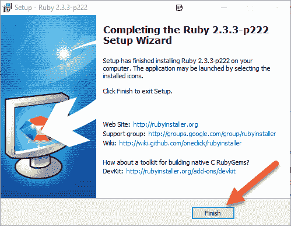

在 Windows 10 &上的 Ruby 中，在“命令”下键入 Ruby 启动命令提示符。

```
ruby –v
```

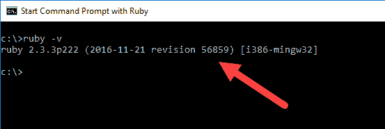

**第 III 部分）下载并安装 Android**

**步骤 1）**从[下载 Android Studio，网址为 http://developer.android.com/sdk/index.html](http://developer.android.com/sdk/index.html)

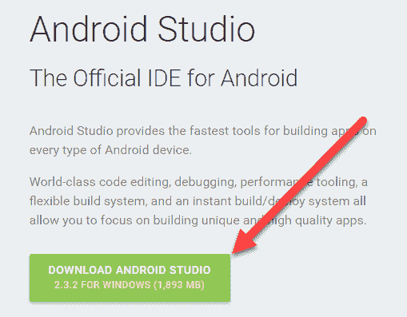

**步骤 2）**打开 exe，按照屏幕上的说明进行操作并完成安装。 完成后单击完成按钮

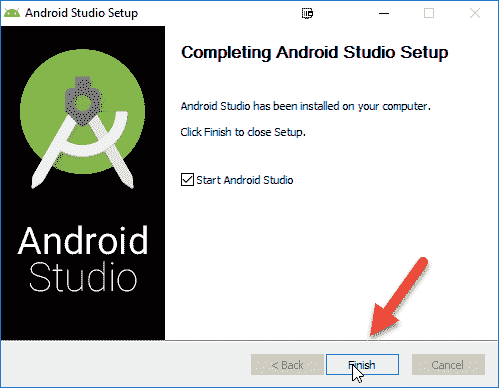

**第 IV 部分）安装 Calabash Android**

**步骤 1）**在控制台中，键入**，安装 calabash-android。** 安装将开始，并且需要一些时间才能完成


**步骤 2）**安装完成后，键入 **calabash-android 版本**

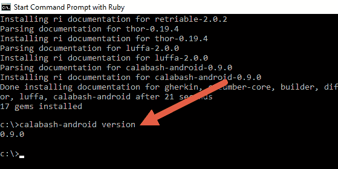

## 使用葫芦

打开“ calabash-android-0.9.0”文件夹。 它位于路径 C：\ Ruby23 \ lib \ ruby​​ \ gems \ 2.3.0 \ gems \ calabash-android-0.9.0。 文件夹名称将与您在计算机上安装的 ruby / calabash 版本同步更改。

打开特征骨架文件夹。 注意这个基本框架。

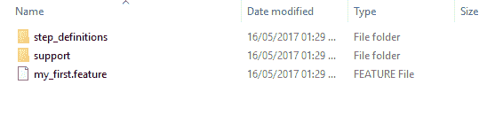

*   * .feature 文件包含我们将要自动化的方案。
*   功能文件使用的方法写在“ step_definitions”文件夹中的* .rb 文件中。
*   常用方法，环境设置，应用程序安装和挂钩应放在“ support”文件夹中。

**辞职&生成应用**

*   瓢虫 Android 辞职* .apk
*   葫芦 Android 构建* .apk

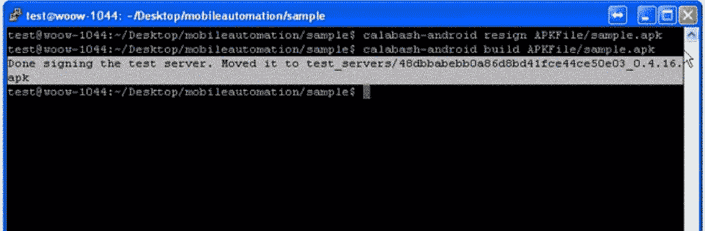

**将设备连接到系统/打开仿真器**

检查连接的设备。 键入命令

```
adb devices
```

应显示已连接的设备列表。

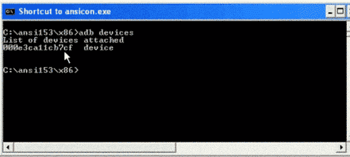

**如何查找元素定位器**

*   打开控制台。 键入命令。

    ```
    calabash android console "APK Path"
    start_test_server_in_background
    ```

*   Above command launch the app on the device. To find the element locator use following command.

    ```
    query "*"
    ```

    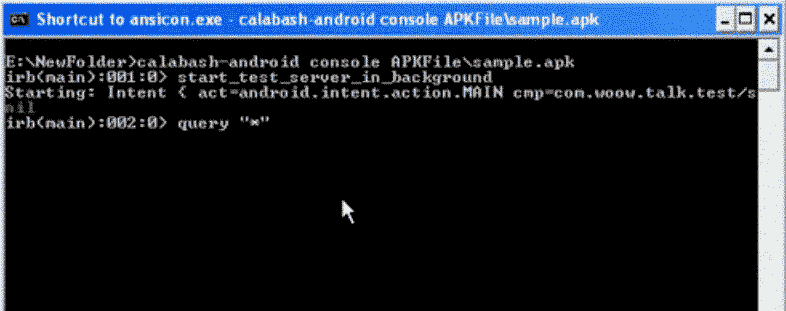

这将在当前屏幕上显示所有元素定位器。

**创建新脚本**

打开功能部件文件并遵循以下几行

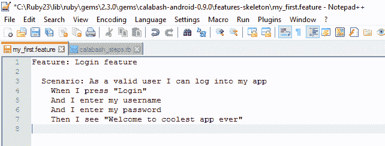

```
Feature: Login feature
  Scenario: As a valid user I can log into my app
    When I press "Login"
    And I enter my username 
    And I enter my password
    Then I see "Welcome to coolest app ever"
```

打开步骤定义文件&，将方法定义为* .rb 文件。

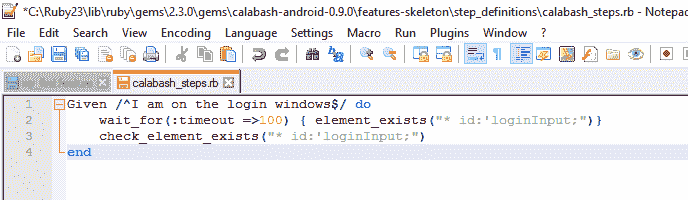

```
Given /^I am on the login windows$/ do
   wait_for(:timeout =>100) { element_exists("* id:'loginInput;")}
   check_element_exists("* id:'loginInput;")
end

```

**执行测试项目**

要执行测试项目，请使用以下命令

```
calabash-android run "APK Path" "feature file Path" – tags "tag name"
```

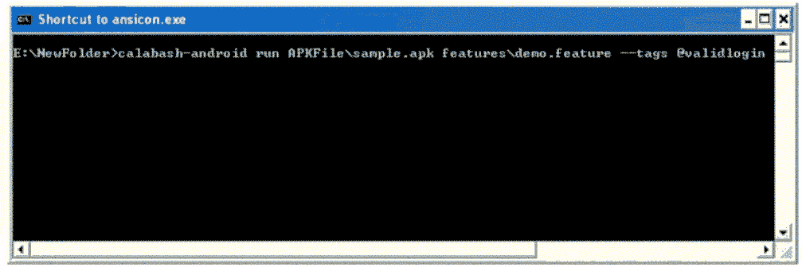


**摘要**

*   Calabash 是一个新的开源框架，可帮助自动化和测试任何 iOS 或 Android 应用程序。
*   要使用 Calabash，应使用 Cucumber 以 Ruby 编写测试。
*   它使用行为驱动开发（BDD）的概念
*   通过将其工作分为以下四个层，它使代码自动化：
    *   第一层
    *   业务层
    *   技术层
    *   最后一层