# iOS 应用测试教程：手册&自动化

> 原文： [https://www.guru99.com/getting-started-with-ios-testing.html](https://www.guru99.com/getting-started-with-ios-testing.html)

## 为什么要进行 iOS 测试？

iOS 于 2007 年 6 月 29 日首次发布，是**苹果针对移动应用程序的平台**的名称。 与 Android 不同，Apple **不许可** iOS 安装在非 Apple 硬件上。 iOS 和 iOS 应用程序仅在 Apple 设备上安装。 您的应用必须与四种类型的设备和 iOS 版本兼容。 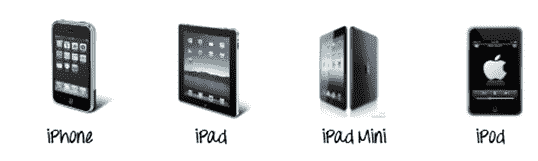.png)

这是开发人员创建 iOS 应用程序时的常见问题。

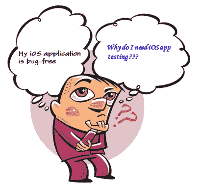

在设计和实现上投入多少时间都没有关系，错误是不可避免的，并且会出现错误。 iOS 应用程序上存在一些常见的错误。 如下图所示。

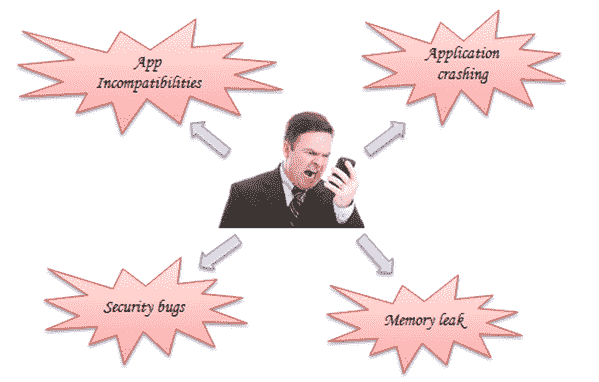

1.  **应用程序崩溃了**

使用 Apple 的设备时，最令人沮丧的问题之一是应用程序在执行期间可能经常崩溃。 很多时候应用程序崩溃是因为应用程序中存在一些错误或内存泄漏。

2.  **应用程序不兼容**

您的 iOS 应用程序可以在当前的 iOS 版本上完美运行，但是如果升级了 iOS，由于不兼容问题，它可能无法正常工作。

3.  **安全漏洞**

iOS 中的一个安全漏洞使黑客能够攻击您的 iOS 设备，窃取您的私人信息。 到目前为止，在不同的 iOS 版本中发现了严重的 iPhone 安全漏洞。

4.  **内存泄漏**

内存泄漏是程序不再使用的已分配内存块。 内存泄漏会导致您的 iOS 应用程序崩溃。 它们是错误，应始终修复。

在本教程中，您将学习-

*   [为什么要进行 iOS 测试？](#1)
*   [iOS 测试 MindMap](#2)
*   [iOS 测试清单](#16)
*   [iOS 测试策略](#3)
*   [自动化测试](#4)

*   [使用 OCUnit](#5) 进行单元测试
*   [使用 UIAutomation](#6) 进行 UI 测试

*   [手动测试](#7)

*   [探索性测试](#8)
*   [用户测试](#9)

*   [概念测试](#10)
*   [可用性测试](#11)
*   [Beta 测试](#12)
*   [A / B 测试](#13)

*   [iOS 测试最佳做法](#14)
*   [关于 iOS 测试的迷思](#15)

## iOS 测试 MindMap

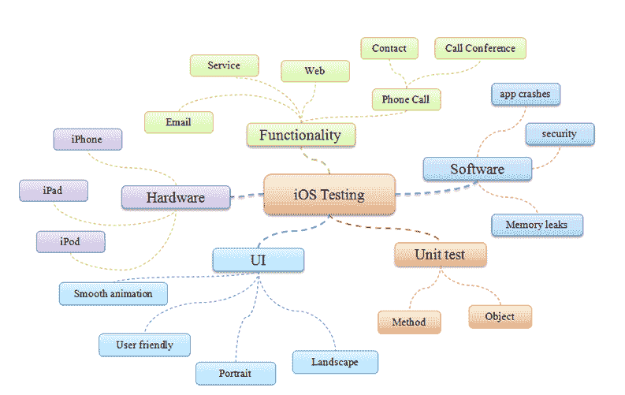

如上图所示，iOS [测试](/software-testing.html) MindMap 显示了测试人员在 iOS 上进行测试时应考虑的所有项目。

## iOS 应用测试清单

此清单是专门设计用于测试 iOS 移动应用程序的特征的。 显然，它仅测试通用应用程序特征，而不测试其功能。

*   检查应用程序在设备上花费的安装时间。 确保在可接受的时间内安装了该应用程序。
*   安装该应用程序后，请检查该应用程序是否具有应用程序图标和名称。 另外，请确保图标和名称都是不言自明的，以反映应用程序的核心意图。
*   启动应用程序，然后检查是否显示启动屏幕。
*   检查初始屏幕超时和加载主屏幕所需的时间。 应用程序的主屏幕应在可接受的时间内加载。 如果主屏幕仅花费更多时间加载，则用户有更多机会退出甚至卸载应用程序本身。 另外，检查内容如何在主屏幕中加载。
*   该应用程序的主要功能应立即显而易见。 它应该为自己说话。
*   检查应用程序是否同时支持横向和纵向。 如果是这样，请从两个方向检查应用程序。 应相应设置应用程序的用户界面。
*   没有互联网连接，启动应用程序。 确保该应用的行为符合设计/预期的要求。 应用程序可能会在启动时崩溃或仅显示空白屏幕。
*   如果应用程序使用位置服务，请检查是否显示位置许可警报。 该警报仅应提示用户一次。
*   如果应用程序发送了推送通知，请检查是否显示了推送通知权限警报。 该警报也应该仅向用户提示一次。
*   启动应用程序，退出并重新启动。 检查应用程序的行为是否符合设计/预期
*   通过点击设备的主页按钮关闭应用程序，然后再次打开应用程序。 检查应用程序是否按设计/预期运行。
*   安装后，请检查该应用程序是否列在 iPhone 的设置应用程序中。
*   启用该应用程序后，检查是否可以在“ App Store”中找到该应用程序。该应用程序将支持该 OS 版本，因此，请确保可以在那些受支持的 OS 版本设备的“ App Store”中找到该应用程序。 另外，该应用程序不应在不受支持的 OS 版本设备的“ App Store”中列出。
*   在后台运行时，请检查应用程序是否进入睡眠模式以防止电池耗尽。
*   如果应用程序的性能很慢或每当内容加载时，请检查是否有进度状态图标（“正在加载...”），最好带有特定的消息。
*   在设备搜索栏中搜索应用程序及其名称。 检查应用程序是否列出
*   检查执行标准操作的按钮的外观在应用程序中是否未更改（例如：刷新，整理，删除，回复，返回等）
*   检查标准按钮是否不用于其他功能，然后正常使用

## iOS 测试策略

下图介绍了一些常见的 iOS 测试策略类型。

## 自动化测试

自动化测试是 iOS 测试的最大优势。 它使您能够快速检测到错误和性能问题。 自动化测试的好处如下所示：

*   自动化测试可以在多个设备上运行，从而节省了时间
*   自动化测试可以针对 SDK。 您可以在不同的 SDK 版本上运行测试
*   自动化测试可提高测试效率，节省软件开发成本
*   有许多开源测试框架支持在 iOS 上进行自动化测试

## 使用 OCUnit 进行单元测试

当原始的 iOS SDK 发行时，它缺少[单元测试](/unit-testing-guide.html)功能。 因此，Apple 在 iOS SDK 版本 2.2 中带回了 [OCUnit](http://www.sente.ch/software/ocunit/) 单元测试解决方案。

OCUnit 是 Mac OS 中 C-Objective 的测试框架。 OCUnit 框架的最大优点是紧密集成到 [XCode](https://developer.apple.com/xcode/) 开发环境中，如下所示。

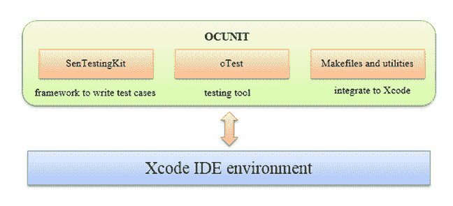

下图显示了 OCUnit 的一些优点。

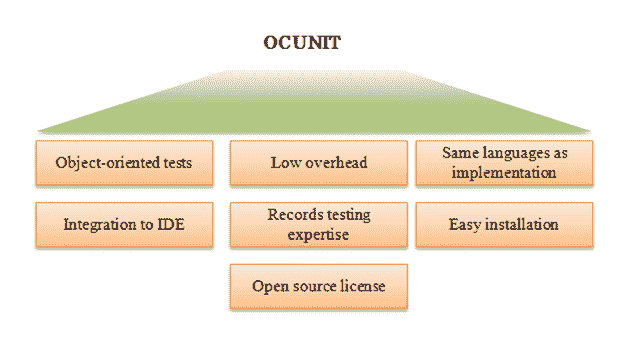

## 使用 UIAutomation 进行 UI 测试

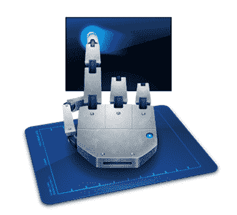

[UI 自动化](http://developer.apple.com/library/ios/#documentation/DeveloperTools/Reference/UIAutomationRef/Introduction/Introduction.html)是 Apple Inc.提供的 [JavaScript](https://en.wikipedia.org/wiki/JavaScript) 库，可用于在真实设备和 iOS Simulator 上执行自动化测试。 此框架已添加到 iOS SDK4.0。 使用 UI 自动化，您不仅可以在模拟器上而且可以在真实设备上自动化测试应用程序。

UIAutomation 为您带来以下好处：

*   减少[手动测试](/manual-testing.html)上的工作
*   用更少的内存来执行所有测试
*   简化您的 UI 测试程序（只需按一个或三个按钮即可运行完整的测试套件）

UIAutomation 仪器通过脚本编写，脚本使用 JavaScript 编写。 它模拟目标 iOS 应用程序上的用户事件。

***UIAutomation* *缺点* *与* *优点***

|   | **优点** | **缺点** |
| 1. | 对手势和旋转的良好支持 | 它不是开源的，更少的开发人员支持 |
| 2. | 可以在设备上运行 UIAutomation 测试，而不是唯一的模拟器。 | 无法与其他工具很好地集成 |
| 3. | 由 JavaScript 开发，它是一种流行的编程语言。 |   |

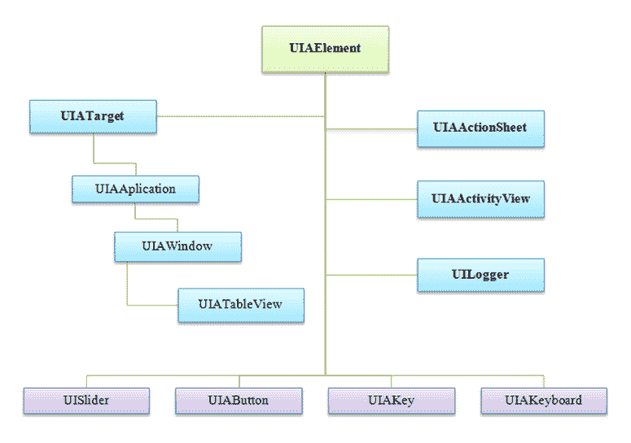

上图表示 UIAutomation 框架中的一些常见类。

*   **UIAElement** 类是自动化上下文中所有用户界面元素的超类。
*   **UIATarget** 类表示被测系统的高级用户界面元素
*   **UIALogger** 类提供有关检索功能的测试和错误信息
*   **UIAActivityView** 类允许访问和控制应用程序中的活动视图。
*   **UIAActionSheet** 类允许访问和控制应用程序内的操作表。
*   用户**事件操作**
    *   UISlider 类
    *   UIAButton 类
    *   UIAKey 类
    *   UIAKeyboard 类

### 其他自动化测试框架

*   [MonkeyTalk](http://www.gorillalogic.com/monkeytalk) ：一种用于自动测试 iOS，Android，HTML5 和 Adobe 应用程序的工具。 它是用于管理和运行测试套件的集成环境
*   [Frank](https://github.com/moredip/Frank) ：适用于 iPhone 和 iPad 的自动化**验收测试**框架
*   [KIF](https://github.com/kif-framework/KIF) ：是一个 iOS **集成测试**框架。 通过利用 OS 为视力障碍者提供的可访问性属性，它可以轻松实现 iOS 应用的自动化。

## 手动测试

### 探索性测试

这是没有正式测试计划的测试。 探索性测试是一种低成本的测试方法，但它可能会遗漏 iOS 应用程序中的潜在错误。

***探索性测试缺点与优点***

|   | 

**优点**

 | 

**缺点**

 |
| 1. | 需要的准备工作更少，及早发现严重的错误。 | 需要测试人员的高技能 |
| 2. | 不需要[测试计划](/what-everybody-ought-to-know-about-test-planing.html)可以加快错误检测速度。 | 测试覆盖率低。 它不能保证您的所有要求都经过测试。 |
| 3. | 大多数漏洞是通过某种探索性测试而发现的 | 缺乏测试文件 |

### 用户测试

用户测试是 iOS 上的一种手动测试。 该测试的目的是创建更好的应用程序，不仅是**无错误的**应用程序。 下图显示了四种类型的用户测试

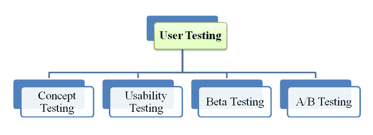

### 概念测试

在发布到市场之前，评估用户对应用程序构想的响应。 在 iOS 上进行概念测试的过程如下所述

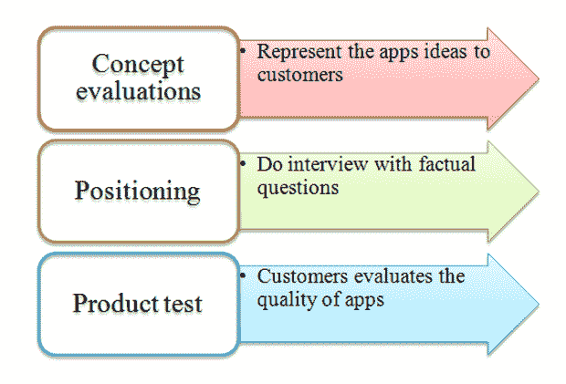

### 可用性测试

[可用性测试](/usability-testing-tutorial.html)是一项测试如何轻松使用 iOS 应用程序的测试。 在 iOS 测试中，可以将**记录为**以便记住或与他人共享可用性测试。

iOS 上有一些工具支持可用性测试。

[Magitest](http://magitest.com/) ，这是针对网站和应用的简单 iOS 可用性测试。

[Delight.io](http://www.delight.io/) ，此工具可以捕获 iOS 应用上的真实用户交互。

### Beta 测试

Beta Testing 是**集成测试**，具有真实数据，可以从用户那里获得最终反馈。 要分发您的应用以进行 Beta 测试，您必须执行以下步骤。

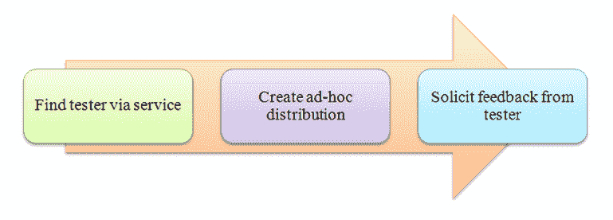

-**前提条件**：如果您正在对发布的最终候选者进行 Beta 测试，请确保在将其分发给测试人员之前验证该应用。

-**通过服务**查找测试仪：您从测试仪收集设备 ID，并将其添加到[会员中心](http://developer.apple.com/library/ios/#documentation/IDEs/Conceptual/AppDistributionGuide/MaintainingCertificatesandProvisioningAssets/MaintainingCertificatesandProvisioningAssets.html)

-**创建即席发行版**：即席发行版允许测试人员在不需要 Xcode 的情况下在其设备上运行您的应用。 此步骤包括 2 个子步骤

*   创建发行证书
*   创建临时配置文件

-**要求测试人员反馈：**测试人员进行测试并将错误报告发送给您。 发布应用后，您可以从 [iTunes](http://www.apple.com/itunes/) connect 获取报告。

### A / B 测试

A / B 测试是**评估 iOS 应用**有效性的最有效方法之一。 它使用**随机实验**和两个设备 A 和 B。

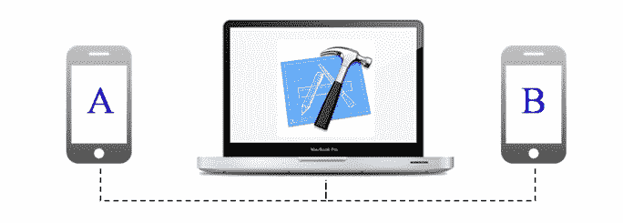

*A / B 测试包括三个主要步骤*

*   **配置测试**：准备了 2 个版本的 iOS 应用（A & B）和测试指标
*   **测试**：同时在设备上测试上述 2 个 iOS 应用版本。
*   **分析**：测量并选择更好的版本以发布

以下工具支持 iOS 上的 A / B 测试。

*   [出现](http://arise.io/)：适用于 iOS 和 Android 的 A / B 测试。 它可以集成到您的 iOS 应用中，从而使测试过程更快。

*A / B 测试的最佳做法*

*   定义测试的**目标**。 没有目标，任何测试都是没有用的。
*   **观看**最终用户首次使用您的应用
*   每次更新仅运行**一个**测试。 节省进行测试的时间
*   **监视**您的测试。 您可以通过监视测试来从中学习经验。

## iOS 测试最佳做法

这是组织 iOS 应用程序测试时应了解的一些技巧

1.  在**真实设备**上测试应用程序以获得真实的性能
2.  **改进**您的测试方法，因为传统的测试方法已不足以涵盖 iOS 测试中的所有测试
3.  使用**控制台日志**测试 iOS 应用程序。 这是一项 iOS 功能，包括来自设备上每个应用程序的信息。
4.  **文档**应用程序错误，使用**内置屏幕简短**命令。 它可以帮助开发人员了解错误的发生方式。
5.  **故障报告**是测试应用程序时的有用工具。 他们可以检测崩溃并记录详细信息，因此您可以轻松地调查错误。

## 关于 iOS 测试的迷思

本节探讨了 iOS 测试的一些流行神话和现实

**在 iOS 和 Android 上测试应用程序是同一回事。**

**iOS** 和 **Android** 是 Apple Inc 和 Google 开发的两个平台。 他们是完全不同的。 等测试环境，测试框架，编程语言。

**在 iOS Simulator 上测试应用程序就足够了。**

iOS 模拟器不足以测试应用程序。 由于 iOS 模拟器具有一些限制：

*   硬件限制（相机，麦克风输入，传感器）
*   您应用的用户界面可能比在设备上运行更快，更流畅
*   API 限制
*   某些框架不受支持（Media Player，Store Kit，Message UI ..）

**每个人都会在应用商店上下载我的应用，因为它具有许多功能**

您的应用程序具有的功能越多，您可以获得的错误就越多。 如果仍有许多缺陷，没有用户会下载您的应用程序。