# 使用 UIAutomation 框架的 iOS 自动化测试

> 原文： [https://www.guru99.com/ios-test-program-uiautomation-framework.html](https://www.guru99.com/ios-test-program-uiautomation-framework.html)

为了保证您的 iOS 应用程序的质量，您应该遵循下图所示的``测试驱动开发''过程。

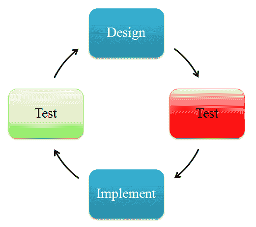

测试驱动开发（TDD）是一种[测试](/software-testing.html)模型，适用于 iOS 应用程序测试。 在此模型中，测试人员必须遵循以下四个阶段：

*   **设计**：确定要测试的内容，设计测试用例
*   **测试**：运行所有测试，看看测试用例是否失败
*   **实施**：修改您的代码，修复导致测试失败的错误
*   **再次测试**：如果失败，则返回设计。 如果所有测试用例都通过，则该代码符合整个测试需求。

## 设置测试环境

要创建 iOS 测试程序，您需要一本 **Mac Book。** 您的 Mac 已安装：

*   OSX。Mac PC 的操作系统
*   Xcode IDE，iOS 开发工具
*   自动化测试框架（UIAutomation，OCUnit ..）
*   iOS SDK 4（或更高版本）

## 使用 UIAutomation 框架创建 iOS 测试程序。

1.  **发射工具**

Open XCode-> Open Developer Tool-> **工具**

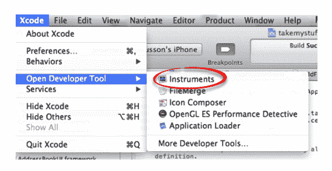

2.  **添加自动化仪器**

在**仪器**窗口中，选择**自动化仪器**

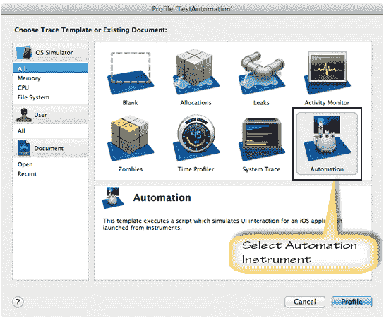

要创建测试脚本，您可以**记录**，[测试场景](/test-scenario.html)，也可以手动**对其编程**。

3.  仪器正在启动，**立即停止**录制。 如果要开始记录，请按红色按钮

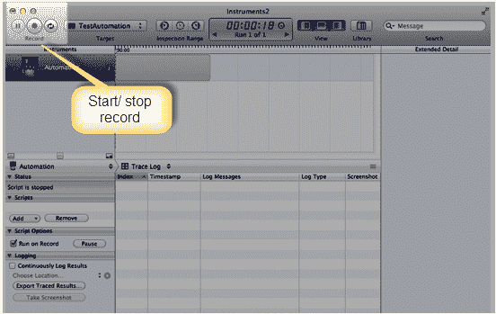

4.  在脚本窗口中，单击**添加>创建**以创建新脚本

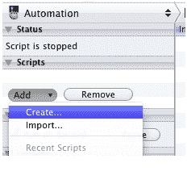

5.  **选择目标**

您在“跟踪”窗口中，使用“选择目标”下拉菜单导航到应用程序的调试版本。

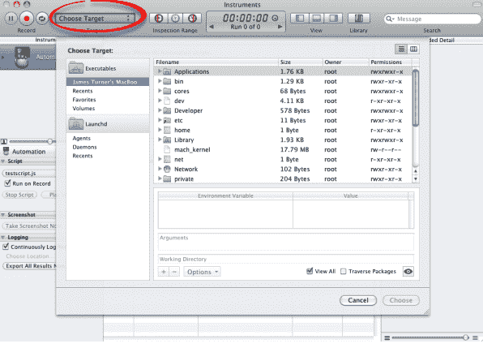

在这种情况下，我将使用 Apple 的示例 [SimpleDrillDown](http://developer.apple.com/library/ios/#samplecode/SimpleDrillDown/Introduction/Intro.html) 简单应用程序作为被测试的应用程序。 它在下面具有 GUI。

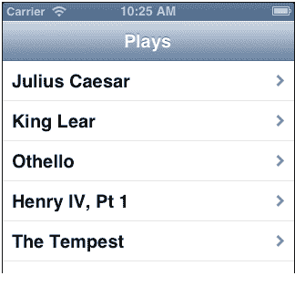

6.  **开始记录您的脚本**

通过点击工具顶部或底部的**记录**按钮来记录脚本。

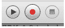

现在，您可以在测试中的应用程序上执行一些 UI 操作，并记录脚本。

7.  **查看您的脚本**

要查看您的脚本，请点击**跟踪日志/编辑器日志**下拉菜单并切换到脚本日志视图。

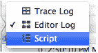

您将看到录制的脚本。

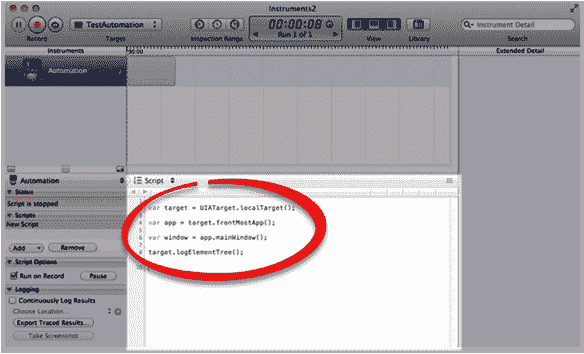

8.  **播放脚本**

按下**播放**按钮，脚本运行，您可以在出现日志后停止脚本。

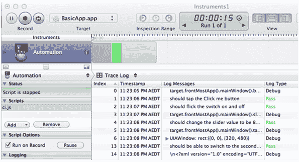

***使用 OCUnit 框架创建 iOS 测试程序***

1.  启动 Xcode IDE，添加**单元测试包**目标

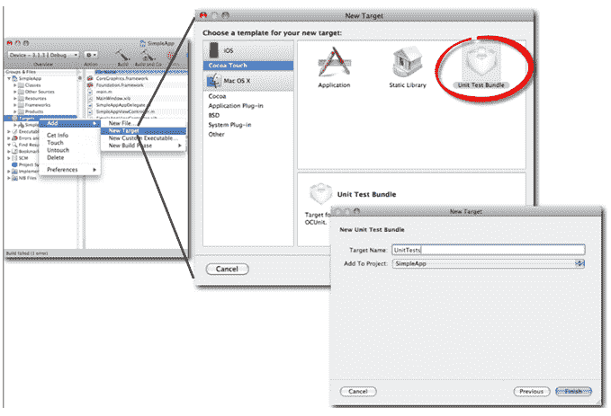

2.  如下图所示，写上新的单元测试捆绑包的名称，然后单击**完成**
3.  使单元测试成为活动目标

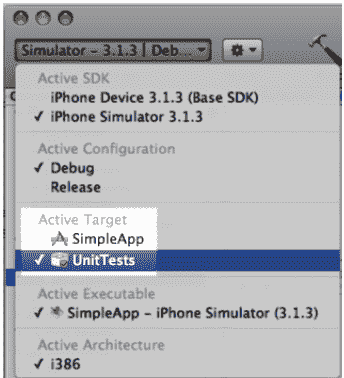

4.  为测试课程添加组

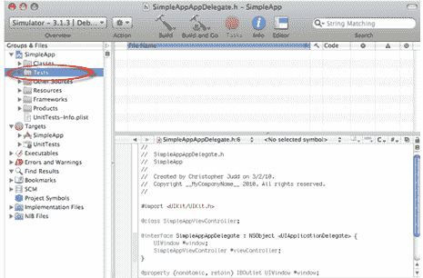

5.  添加单元测试类

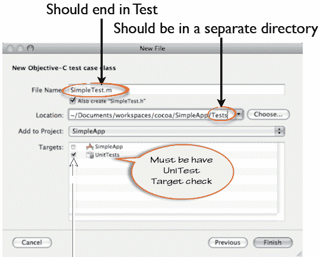

6.  现在开始您的工具

OCUnit 使用 Objective-C 语言创建测试程序。 开发人员必须了解这种语言。

## 源代码示例

本文包含一些源代码示例。 它们可以帮助您更清楚，快速地理解本教程。

[UIAutomationSample](https://drive.google.com/uc?export=download&id=0B_vqvT0ovzHcalpPZE5RbXExQm8) UIAutomation 演示的测试脚本。