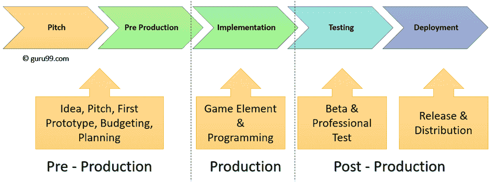

# 游戏测试：如何测试移动/桌面应用程序

> 原文： [https://www.guru99.com/game-testing-mobile-desktop-apps.html](https://www.guru99.com/game-testing-mobile-desktop-apps.html)

## 游戏开发生命周期

**试生产：**在此阶段，完成了游戏创意，情节提要，功能，需求分析和文档。 此阶段包括技术设计文档和功能规格，游戏架构，框架叠加，动画。 考虑以下项目

*   音乐，相机（放大和缩小，重播，电影视图）播放器和动作属性
*   游戏流程逻辑，规则和条件，以达到更高的水平
*   对象&事件触发，得分，玩家移动和定位，玩家统计信息，
*   非交互式序列，特殊效果，标题屏幕，多按钮操作
*   游戏手柄，影片剪辑，震动/振动效果，合法文本，按钮功能的使用，模拟&数字模式的使用。

**产生**：在此阶段，完成了实际的编码。 此阶段包括编码，各种模块的集成。

**测试和部署**：在此阶段，执行功能测试，回归测试，Alpha，Beta 和 Gold。 还进行了覆盖和流测试，数据完整性，特定于算法的测试，路径测试，增量测试。

在本教程中，您将学习

*   [游戏开发生命周期](#1)
*   [游戏测试与其他软件测试有何不同。](#2)
*   [游戏测试的类型](#3)
*   [使用自适应技术的辅助游戏](#4)
*   [测试人员应该知道的游戏指标。](#5)
*   [游戏测试中的主要风险](#6)

## 游戏测试与其他软件测试有何不同。

测试游戏是一个**重复过程**，每个新版本都可能存在错误，必须进行彻底的测试。

所有游戏测试均遵循基本结构，而与制作游戏所需的游戏大小&无关。

质量保证专业人员需要研究游戏规则&要求。 了解整体游戏组件架构和文件架构，流程，文件结构以及与游戏相关的依存关系。 对于游戏的每个新原型，都需要经常重新访问测试文档以更新规格，新测试用例&和新配置的任何更改。 测试人员应确保没有引入新问题。

游戏测试员的工作包括：

*   根据预期目的和目标受众对需求进行分类。
*   识别用户和系统需求，应分为功能需求，非功能需求，域需求
*   确定功能性和非功能性需求的可测试项目，不可测试项目，目标和措施
*   检查功能要求是否完整，可理解&
*   识别可自定义的需求，冲突的需求
*   确定相互依赖的需求。
*   根据唯一性，复杂性和重要性对需求进行优先级排序
*   识别游戏的主题，角色，动画，AI，电影，相机视图，游戏玩法

## 游戏测试的类型

**1）功能测试**

功能 QA 测试人员在游戏或其用户界面&图形中寻找通用问题，例如游戏机制问题，稳定性问题和游戏资产完整性。 用户界面测试可确保游戏的用户友好性

**示例：**检查颜色和背景，菜单结构，屏幕方向和屏幕分辨率，字体大小，对齐错误，可用性，系统导航（例如加载时间，超时和显示，排序，确认消息，序列，动画和 游戏的音频元素，说明和对话消息。 用户交互，用户界面，事务测试，手机摄像头的校准和准确性测试，屏幕分辨率，移动响应设计测试，音频质量测试

**2）兼容性测试**

检查游戏是否在不同设备上以及在不同硬件和软件配置上兼容。

**示例**：在所有受支持的控制台/台式机/手机上安装和卸载游戏。

**3）性能测试**

检查游戏的整体性能。 执行性能调整以优化游戏速度。

**性能测试期间检查了重要参数**

*   客户端和服务器上的响应时间，事务完成时间，峰值负载性能，寿命，网络覆盖范围，内存泄漏，内存不足，电池电量低，下载应用程序所花费的时间，同时（多个用户）访问应用程序服务器，速度， 吞吐量，可靠性，可伸缩性等
*   **电池消耗和图形性能：**测量手机游戏的电池消耗。 长时间的电池消耗必须是最佳的，并且在不同设备上负载变化时，游戏响应也应该令人满意
*   **处理器和内存限制**：性能计数器用于测量应用程序的 CPU 和内存消耗。
*   **网络连接性**：测量不同网络类型（Wi-Fi，2G，3G，4G）上手机游戏的响应时间，从而全面了解游戏在不可靠网络上的性能。 它还检查移动设备，数据中心或云之间的连接。 整个高峰时间，抖动连接，数据重复，数据包丢失，数据碎片都受到监控。
*   测试游戏性能，尤其是 MMO

**4）一致性/一致性测试**

市场准则合规性（例如，Apple App Store 政策），企业政策合规性（例如，禁止的内容。合规性也可以指诸如 PEGI 和 ESRB 之类的监管机构。游戏针对特定的内容分级。如果存在令人反感的内容 如果不符合期望的评级，则将其识别并报告，即使是提交许可审批中的一次违规，也可能会拒绝该游戏，从而导致进一步测试和重新提交的额外费用。

**示例**：如果该游戏要在欧洲国家发行，则测试该游戏是否针对北美市场，如果该游戏是为北美生产的，则测试 NTSC 转换。

**5）本地化测试**

当游戏面向全球市场时，本地化测试变得至关重要。 游戏标题，内容和文本需要使用多种语言的设备进行翻译和测试。 这些类型的测试可以快速执行（借助基于云的设备访问和测试自动化）。

**示例**：特定于 MENA 地区（中东/北非）的本地化需求，阿拉伯语的本地化（支持从右到左文本，双向显示），伪本地化测试，双字节字符（用于 东亚语言），本地时间/日期，货币，地址格式和其他本地要求。

**6）浸泡测试**

该测试涉及使游戏在各种操作模式下长时间运行。 例如，闲置暂停或在标题屏幕上。 浸泡可以识别内存泄漏或舍入错误。

**示例**：游戏已经开始，并且使角色处于闲置状态 24 小时。 此技术用于检测由内存泄漏和游戏引擎中的其他故障引起的崩溃。

**7）恢复测试**

在软件中，恢复测试检查从崩溃，硬件故障和其他类似故障中恢复应用程序的能力。 该应用程序被迫失败，之后将观察它如何从失败情况和环境中恢复。

**示例：**运行游戏应用程序时，突然重新启动游戏机，&检查验证数据完整性

**8）安全测试**

这样做是为了检查软件在受到外部威胁时的安全性。 防止外部威胁，不受控制的系统访问限制，数据泄露，操作系统漏洞，通信系统漏洞和弱加密算法的数据保护。

**示例：**在游戏站点上将 URL 从/ login 更改为/ play 不应允许直接访问游戏。

**9）其他游戏测试**

测试真实或虚拟字符。 在多人视频游戏中，与服务器的连接以及游戏状态的同步是要测试的两个关键领域。

**示例**：多人 3D 赛车游戏。

测试新功能，例如游戏状态更新，朋友邀请，高级礼物共享等。这确保了用户丰富的游戏体验。

**示例**：Facebook，博客

**声音测试**

测试加载文件时是否有错误，听声音文件中是否有错误或失真，CC 探查器分析颜色注释

**数据库和游戏统计信息**

使用调试进行数据库验证，以调查游戏是否正确使用了数据。 确保将数据加载到正确的位置并显示正确的信息

### 白盒测试

游戏白盒测试侧重于手机游戏的体系结构，集成和系统方面。

1.  **代码检查**：检查源代码，分析程序逻辑&常见的编程错误，分析与编码标准的符合性。
2.  **焦点测试：**将代码块馈送到隔离的模块，并分析输出。
3.  **数据分析：**对不同模块的数据使用，解释和操作进行了分析和验证。
4.  **路径和流测试：**执行正确的对象序列。
5.  **特定于算法的测试**：通过将数据变量，数据值设置为代码并在运行时环境中执行，来测试特定的游戏场景或功能。
6.  **人工智能分析：**生成 AI 组件的可编程动作和游乐的运行统计信息。 验证结果以检查是否使用了所有可编程动作。 例如：在滑雪板上使用侧握和打球（多方向动作中的组合拳/踢）。

## 使用自适应技术的辅助游戏

辅助游戏也称为辅助功能游戏。 这些功能是使用自适应技术为残障人士设计的，例如弱视，视力模糊，失明，无法区分颜色，语音，听力，认知，运动&行动障碍。

伦敦塔（TOL）的主要方向（CD）是为视障用户修改的两种流行游戏。 在这些游戏中，视觉刺激被音频输入所代替。

测试者在测试此类游戏时应注意以下几点

1.  颜色应以一种模式闪烁，并且每种颜色都将播放色调。
2.  每种颜色都应伴有声音。
3.  视觉数据需要用文字描述，以便视障人士不会遇到使用屏幕阅读器接收到的任何问题。
4.  玩家应该在游戏中以三个维度听到声音，并且必须使用触摸屏 3D 音频和空间声音来导航单词

## 测试人员应该知道的游戏指标。

**DAU / MAU（每日活跃用户/每月活跃用户）：**每天玩的活跃用户与每月活跃用户数量之比。 也通常称为粘性因子。

**会话：**每次任何用户打开应用程序时，该时间均视为会话。 这里的重点是每个 DAU 的平均会话数。

**下载排名：**通过每月游戏下载量计算特定应用商店（iOS，Android Play）中游戏的排名。

**保留：**在免费玩游戏中非常重要的指标。 要计算保留时间，请根据应用程序的下载日期将用户分成多个群组。

**性能指标：**这用于跟踪在线游戏或持久游戏的性能。 游戏在客户端硬件平台上或在游戏服务器上执行时的帧速率，其稳定性和性能指标可用于监视不断变化的功能和更新。

## 游戏测试中的主要风险

1.  游戏不会为目标受众创造引人入胜的体验。
2.  游戏没有以玩家为中心的设计
3.  游戏中缺少有趣的因素和令人上瘾的游戏玩法。
4.  游戏不独特，竞争激烈，节奏快。
5.  由于技术问题，功能损坏，重大错误，音乐声音不良和视频不良，导致游戏失败。
6.  游戏开发成本超出预算
7.  游戏应具有简单的美学设计和游戏玩法。

**摘要：**

*   游戏开发生命周期包括预生产，生产，测试和部署的三个阶段
*   测试游戏是一个重复的过程，每个新版本可能都有错误，因此必须进行彻底的测试
*   不同类型的测试包括 1）功能测试，2）兼容性测试，3）性能测试，4）一致性/一致性测试，5）本地化测试，6）浸泡测试， 7）恢复测试，8）安全测试
*   游戏白盒测试侧重于手机游戏的体系结构，集成和系统方面，包括 1）代码检查 2）焦点测试 3）数据分析 4）路径和流测试 5）特定于算法的测试 6）人工智能分析
*   辅助游戏也称为辅助功能游戏。 使用自适应技术为个人设计功能
*   一些重要的游戏指标是 DAU / MAU，会话，下载排名，保留率和性能指标
*   游戏测试的主要风险是它不会为目标受众创造引人入胜的体验