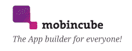
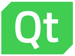
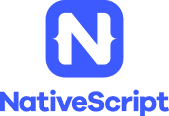
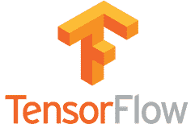

# 2020 年 26 种最佳移动应用开发工具

> 原文： [https://www.guru99.com/mobile-app-development-tools.html](https://www.guru99.com/mobile-app-development-tools.html)

有大量的移动应用程序开发工具可以创建您喜欢的应用程序。 这是热门移动应用工具的精选列表，其中包含关键功能和下载链接。

我们涵盖了以下类别的工具。

*   [推荐工具](#11)
*   [移动分析工具](#6)
*   [跨平台应用程序开发工具](#1)
*   [应用开发框架](#2)
*   [iPhone App 开发工具](#3)
*   [AR（增强现实）工具](#4)
*   [AI（人工智能）工具](#5)
*   [广告工具](#7)
*   [移动支付工具](#8)
*   [推送通知工具](#9)
*   [游戏引擎](#10)

## 推荐工具

### 1）[好友](https://bit.ly/3fE8yIT)

[Buddy](https://bit.ly/3fE8yIT) 允许基于变更集的无缝部署。 由于有各种专用的，预配置的操作和服务，因此应用程序部署自动化比以往任何时候都容易。 如果您正在寻找一种只需单击即可轻松构建，测试，签名和发布 Android 应用的工具，那么 Buddy 是正确的选择。

**功能：**

*   超过 100 项动作
*   直观干净的 UI / UX
*   专用的 Android 操作：React Native，Ionic，Flutter 等
*   AWS，Google，DigitalOcean，Azure，WordPress 集成
*   支持所有流行语言和任务管理器

* * *

### 2） [HeadSpin](https://bit.ly/2ShzJxQ)

[HeadSpin](https://bit.ly/2ShzJxQ) 为企业提供现实，可行的用户体验见解，以提高移动性能。 HeadSpin 通过提供从客户端到服务器的移动堆栈每一层的性能和用户体验问题的详细可见性，为您应对复杂的移动生态系统中的客户体验所面临的日益严峻的挑战。

**功能：**

*   全球 150 多个位置中的数千个真实设备（没有设备越狱，生根，没有虚拟机）
*   没有用于扩展代码库的 SDK。 全部通过 API 访问。
*   AI 引擎自动组织从最大到最小时间影响的性能问题
*   启动前后的可见性
*   提供云和本地设置
*   提供专用，共享或即用即付的访问权限
*   提供负载测试
*   设备上的正常运行时间 100％

* * *

## 移动分析工具

### 3）App Watch

[AppWatch](http://appwatch.io/) 是基于云的移动分析和安全产品。 它可以帮助用户保护其移动应用程序免遭黑客攻击。 它获得了用户的信任，并确保应用程序保持安全。

**功能：**

*   允许完整扫描移动应用
*   第三方库/ SDK 扫描
*   AppWatch 生成具有修改后的描述，徽标，评论等的自定义报告。
*   使用不同的技术再次验证每个识别出的安全问题
*   它还标识硬编码的敏感值
*   它有助于识别与之相关的所有可能的安全漏洞。
*   AppWatch 可以使用 Webview 扫描应用程序并识别安全问题

**下载链接：** [http://appwatch.io/](http://appwatch.io/)

* * *

## 跨平台应用开发工具

### 4）Xamarin：

[Xamarin](https://www.xamarin.com/) 是本机应用程序的首选移动应用程序开发工具。 它可以跨平台重用业务逻辑层和数据访问。 它被广泛用于为 iOS，Windows 和 Android 应用程序开发构建应用程序。

**Features:**

*   它是一个单声道框架，允许与移动设备的 API 通信
*   Xamarin 组件存储包括 UI 控件，跨平台库和第三方库
*   它倾向于产生较少的错误，从而缩短了产品上市时间
*   它允许应用程序建立索引和深层链接
*   特定于平台的功能允许使用仅在某些平台上可用的功能

**下载链接：** [https://www.xamarin.com/download](https://www.xamarin.com/download)

* * *

### 5）加速器：

[Appcelerator](http://www.appcelerator.com/) 允许开发人员使用更少的代码行来创建应用。 此应用程序开发工具支持 iOS，Android，Windows 和基于浏览器的 HTML5 应用程序。

**Features:**

*   它提高了移动应用程序的开发速度
*   更高的云容量限制
*   该工具允许为所有支持的操作系统构建移动应用程序
*   虚拟私有或本地部署
*   建立在开放标准之上，可以完全访问底层的移动操作系统
*   支持多区域全球部署

**下载链接：** [http://www.appcelerator.com/signup/](http://www.appcelerator.com/signup/)

* * *

### 6）PhoneGap：

[PhoneGap](http://phonegap.com/) 是可免费使用的移动应用程序开发框架的开放源代码。 它属于跨平台应用程序开发类别。 它可用于开发可在所有移动设备上运行的单个应用程序。

**Features:**

*   它可以在 JavaScript，HTML5 和 CSS3 上有效地工作
*   它可以与各种库集成以增强应用程序开发
*   它允许以更少的时间和精力开发各种移动应用程序
*   它通过插件体系结构帮助开发人员扩展应用程序的功能。
*   无需任何特殊技能即可构建应用程序的强大工具

**下载链接：** [https://phonegap.com/getstarted/](https://phonegap.com/getstarted/)

* * *

### 7）离子：

[Ionic](https://ionicframework.com/) 是 HTML5 移动应用开发框架。 它被广泛用于开发混合移动应用程序。 它是使用 CSS，HTML5 和 SASS 等网络技术构建移动应用程序的有用工具。

**Features:**

*   Ionic Framework 是一个 100％免费且开源的项目
*   为每个主要应用商店构建渐进式 Web 和本机移动应用
*   它提供了出色的工具和服务来创建高度互动的应用程序
*   它允许 Web 开发人员使用一个代码库为所有主要应用商店创建应用
*   它带有许多 CSS 组件和 JavaScript 组件，用于开发移动应用程序
*   Ionic 模仿本机应用程序 UI 指南并使用本机 SDK

**下载链接：** [https://ionicframework.com/getting-started/](https://ionicframework.com/getting-started/)

* * *

### 8）Mobincube：

[Mobincube](https://www.mobincube.com/) 是一个出色的 App 界面，因此用户可以开发任何类型的移动应用程序。 开发人员可以为商业，教育，娱乐，健康等领域创建应用程序。

**Features:**

*   创建移动商店并帮助促进销售
*   允许在应用程序中集成第三方解决方案
*   帮助开发高级功能
*   它允许更新在线内容
*   自定义应用程序中的每个小细节
*   允许与用户交流

**下载链接：** [https://www.mobincube.com/try-it.html](https://www.mobincube.com/try-it.html)

* * *

### 9）远程：

[LongRange](http://www.longrangemobile.com/) 是本机移动应用程序开发工具。 它由导航，选项卡，表单视图和命令等组件组成，并且需要安装 LongRange 服务。

**Features:**

*   它作为本机应用程序执行速度非常快，并且具有坚如磐石的可靠性
*   仅使用 RPG / CL 和 DDS 构建本机移动应用
*   它提供了应用程序的基础结构。
*   仅使用当前水平的编程专业知识进行开发
*   无需任何 JavaScript，HTML 或 CSS 知识即可进行开发
*   需要编写一次并部署到 Apple 和 Android 移动设备
*   利用 GPS，摄像头，音频，SMS 等移动设备功能
*   自动将应用程序更新推送到移动设备中
*   降低维护和扩展移动应用程序的成本

**下载链接：** [http://www.longrangemobile.com/](http://www.longrangemobile.com/)

* * *

### 10）Qt：

[Qt](https://www.qt.io/qt-for-application-development/) 跨平台 SDK。 它提供了具有成本效益的设计，开发和部署。 它使开发人员可以在所有设备上提供最佳的用户体验。

**Features:**

*   用于窗口和渲染的新启动器类
*   解析器和编译器优化已实现，
*   它提供对不透明私钥的支持
*   支持 IPv6 和双模网络
*   Buggy SSL 服务器的变通办法

**下载链接：** [https://www.qt.io/download/](https://www.qt.io/download/)

* * *

### 11）Alpha Anywhere：

[Alpha Anywhere](https://www.alphasoftware.com/mobile-app-development/) 是一款快速的移动应用开发和部署工具。 它用于构建跨平台的 Web 和移动业务应用程序。

**Features:**

*   构建跨平台移动应用的有效工具
*   企业级移动数据安全
*   资源管理的细粒度委派
*   直接从 Alpha Anywhere 开发环境发布
*   解决离线同步挑战
*   预构建的示例应用程序，开发人员可以为其移动应用程序修改或引用
*   全面的后端数据访问
*   复杂的数据集成和数据转换
*   具有 HMAC 和 SSL 支持的数据加密

**下载链接：** [https://www.alphasoftware.com/get-started-2018](https://www.alphasoftware.com/get-started-2018)

* * *

### 12）Sencha：

[Sencha Ext JS](https://www.sencha.com/products/extjs/) 是基于 MVC 的 JavaScript 框架。 此移动应用程序开发工具可为应用程序提供高水平的响应能力。 它有助于提高客户满意度。

**Features:**

*   开发人员可以使用 Sencha touch 软件开发套件以 HTML5 格式编码
*   可以在其他工具（例如 PhoneGap）的帮助下翻译其代码
*   这是开发本机应用程序的有用工具，无需浪费任何设置时间
*   WebKit 浏览器目前支持它，包括流行的 Apple iOS 和 Google Android 平台
*   合理的配置系统
*   允许缩放到各种分辨率，以最大程度地与不同设备兼容
*   广泛支持动画和增强的触摸事件

**下载链接：** [https://www.sencha.com/products/touch/download/](https://www.sencha.com/products/touch/download/)

* * *

## 应用开发框架：

### 13）KendoUI：

[Kendo UI](https://www.telerik.com/kendo-ui) 是用于现代客户端开发的端到端移动应用程序开发解决方案。 它通过提供高度模块化的应用程序开发解决方案来遵循现代 Web 标准。

**Features:**

*   它与 AngularJS 无缝协作
*   构建跨平台的 Web 应用程序。 可以针对台式机，平板电脑和手机上的用户屏幕尺寸进行自定义
*   对于任何 JavaScript 开发人员来说，这都是最简单的工具
*   允许 jQuery DataSource 组件，以便于本地和远程数据的轻松数据绑定

**下载链接：** [http://www.telerik.com/download](http://www.telerik.com/download)

* * *

### 14）移动角度 UI：

[Mobile Angular UI](http://mobileangularui.com/) 是一个移动应用程序开发框架。 它依靠诸如 overthrow.js 和 fastclick.js 之类的丰富库来提供更好的移动体验。

**Features:**

*   使用 Mobile Angular UI，可以设计一个响应式的移动用户界面。 它还允许将桌面 Web 应用程序转换为移动应用程序
*   允许创建很棒的移动组件
*   根据开发需求量身定制的 Bootstrap
*   拉伸和压缩浏览器窗口以查看移动和桌面版本
*   允许测试响应性和速度

**下载链接：** [http://mobileangularui.com/](http://mobileangularui.com/)

* * *

### 15）NativeScript：

[NativeScript](https://www.nativescript.org/) 是一个开源框架，用于使用 Angular，TypeScript 或 JavaScript 构建真正的本机移动应用程序。 它允许通过单个代码库为 iOS 和 Android 编写和部署本机移动应用程序

**Features:**

*   通过使用技能来开发本机移动应用程序来加速学习曲线
*   使用 JavaScript 构建真正的本机移动应用程序。 使用网络技能，例如 Angular 和 CSS
*   数百个 NativeScript 插件可用于支持本机移动应用程序
*   NativeScript 团队提供了三个完整的实际应用程序实现

**下载链接：** [http://docs.nativescript.org/](http://docs.nativescript.org/)

* * *

### 16）温泉 UI：

[Onsen UI](https://onsen.io/) 提供了用于创建基于 PhoneGap 的 HTML5 混合移动应用程序的 UI 框架和工具。 这是易于学习的强大工具，可用于创建移动应用。

**功能：**

*   这是开发混合和移动 Web 应用程序的最快方法
*   具有许多现成的组件和自动样式的原生外观
*   为移动设备优化性能
*   它提供了一个网格系统，可将您的元素放置在屏幕上

**下载链接：** [https://onsen.io/](https://onsen.io/)

* * *

### 17）FireBase：

[Firebase](https://firebase.google.com/) 是另一个移动应用程序开发平台。 它支持 Web，iOS，OS X 和 Android 客户端。 它可以大大减少开发时间，并避免混乱服务器和数据存储。

**Features:**

*   它提供云服务，因此不需要任何设置
*   数据存储为本地 JSON，因此用户可以看到他们存储的内容
*   数据是安全的，因为 Firebase 要求所有数据传输都使用 2048 位 SSL 加密。
*   由 Google Cloud Storage 支持的文件存储
*   将数据视为流以构建高度可扩展的应用程序
*   数据被反射并备份到多个安全位置，因此几乎没有数据丢失的机会
*   它与 Angular JS 之类的框架很好地集成在一起。 因此，它允许在很短的时间内创建一个应用程序

**下载链接：** [https://firebase.google.com/docs/storage/android/download-files](https://firebase.google.com/docs/storage/android/download-files)

* * *

## iPhone App 开发工具：

### 18）迅捷的：

[Swiftic](https://www.swiftic.com/) 是 iPhone 应用程序开发软件。 它具有易于浏览的界面，允许任何人创建应用程序。 它具有许多功能，这些功能使该应用程序既实用又易于使用。

**Features:**

*   为任何企业创建自定义应用和会员计划
*   在领先的商店上发布应用
*   保证应用带来真正的业务
*   向客户发送引人注目的推送通知，从而吸引他们
*   提高客户忠诚度
*   我们的成功团队将在这里为您提供指导
*   通过让客户致电或发送该应用的电子邮件来鼓励他们保持联系

**下载链接：** [https://www.swiftic.com/](https://www.swiftic.com/)

* * *

## AR（增强现实）工具：

### 19）VuForia：

[Vuforia](https://www.vuforia.com) 是增强现实软件开发套件。 它允许基于增强现实技术创建应用程序。 它使用计算机视觉技术来识别&轨迹图像和 3D 对象。

**Features:**

*   识别并跟踪更广泛的对象
*   它支持适用于 Android 和 iOS 设备的领先手机，平板电脑和数码眼镜
*   能够创建适用于所有主要设备的基本 AR 体验
*   Vuforia 提供一流的计算机视觉。 它可确保在不同环境中提供可靠可靠的体验
*   它可以轻松识别各种日常图像，物体和环境
*   VuMarks 允许自由定制设计，但仍充当 AR 目标
*   它支持视频播放
*   开发人员可以使用 Vuforia 移动视觉平台构建 3D 体验
*   创建应用可以查看和响应的虚拟按钮

**下载链接：** [https://www.vuforia.com](https://www.vuforia.com)

* * *

### 20）Easy AR：

[Easy AR](https://www.easyar.com/) 是面向移动应用程序开发人员的基于增强现实的应用程序。 它为应用程序开发提供跨平台支持。

**Features:**

*   适用于 iOS 的 Objective-C API
*   在 Android / iOS / Windows / Mac OS 上可用
*   透明视频播放
*   QR 码扫描
*   准备好 3D 引擎插件
*   无限的识别时间
*   多目标同时检测和跟踪
*   云识别支持
*   它允许 3D 对象跟踪
*   同时检测和跟踪

**下载链接：** [https://www.easyar.com/](https://www.easyar.com/)

* * *

## AI（人工智能）工具

### 21）TenserFlow：

[TensorFlow](https://www.tensorflow.org/mobile/) 在设计时考虑了移动和嵌入式平台。 它是一个用于人工智能的开源软件库。 其库使合并人工智能的特殊功能变得更加容易。

**Features:**

*   它是一个使用数据流图进行数值计算的开源软件库
*   灵活的体系结构允许使用单个 API 在台式机，服务器或移动设备中部署计算
*   它主要用于实践和研究中的深度学习

**下载链接：** [https://www.tensorflow.org/mobile/](https://www.tensorflow.org/mobile/)

* * *

### 22）IBM Watson：

IBM Cloud 上的 [Watson](https://www.ibm.com/watson/) 允许创建人工智能以集成世界上最强大的应用程序。 它允许在云中安全地存储和管理数据。

**Features:**

*   解释和分析所有类型的数据，包括非结构化文本，图像，音频和视频
*   通过了解用户的个性，语气和情感，可以进行个性化推荐
*   它利用机器学习来获得应用程序和系统的主题专业知识
*   允许跨移动设备和消息传递平台开发，测试和部署机器人。 在应用程序和用户之间创建无缝对话
*   快速构建认知搜索和内容分析引擎

**下载链接：** [https://www.ibm.com/watson/](https://www.ibm.com/watson/)

* * *

## 广告工具

### 23） [Unity Ads](https://bit.ly/2yKXw3C)

[Unity Ads](https://bit.ly/2yKXw3C) 允许发布者将视频广告整合到手机游戏中，从而增加玩家的参与度。 它还提供了全球奖励视频广告网络中最高的每用户平均收入（ARPU）。

**Features:**

*   简易设置
*   创造积极的玩家体验
*   在不中断游戏玩法的情况下推出奖励视频广告
*   向游戏玩家提供奖励视频广告，从而激励他们

**下载链接：** [https://unity3d.com/unity/features/ads](https://bit.ly/2yKXw3C)

* * *

## 移动支付工具

### 24）布伦特里：

[Braintree](https://www.braintreepayments.com) 是一款开源支付移动应用开发工具。 它支持 23 种语言。 它帮助各种规模的企业接受，处理和拆分付款，以帮助最大程度地获得商机。

**Features:**

*   它具有现代化和简化的 API
*   灵活的付款选择器
*   易于输入信用卡和借记卡的卡表
*   Apple Pay 和 Android Pay 支持
*   独立的付款图标，本地化，表单字段，可建立美观的结帐流程
*   它同时支持 iOS 和 Android 设备
*   支持银联

**下载链接：** [https://www.braintreepayments.com](https://www.braintreepayments.com)

* * *

### 25) Card.io:

[Cardio](https://www.card.io/) 是研究数据基础结构和目标的协作评估的完整形式。 它是用于数据管理策略开发的基准标记工具。

**Features:**

*   可选的手动输入允许用户通过提供用于手动输入信用卡的舔式界面来选择其信用卡类型。
*   它不存储信用卡信息的存储或传输。
*   它是免费的 SDK，适用于 Android 和 iOS
*   协同评估数据管理要求
*   在信息经理和服务提供商之间建立共识
*   确定改善数据管理提供和支持的目标

**下载链接：** [https://www.card.io/](https://www.card.io/)

* * *

## 推送通知工具

### 26）Urban AirShip：

[城市飞艇](https://www.urbanairship.com/)推送通知使开发人员可以传递相关的，个性化的即时消息。 这是增加用户参与度的有用工具。

**Features:**

*   发送到任何 URL 以改善 UX，增加转化
*   可以个性化以获得更好的结果
*   优化 Web 通知
*   无限推送通知
*   无限的应用内消息传递
*   允许深度链接
*   实时自动化
*   参与度报告
*   自助知识库，论坛访问

**下载链接：** [https://www.urbanairship.com/](https://www.urbanairship.com/)

* * *

### 27）推杆：

[推送器](https://pusher.com/)是推送通知工具。 它支持大多数流行的语言&框架。 它允许客户端将事件分发到同一频道上的所有其他事件，同时确保完全的安全性

**Features:**

*   灵活的发布/订阅消息
*   访问控制/认证
*   Webhooks 功能允许接收系统中用户的活动
*   在 Slack 中获取警报，将指标发送到 Datadog 中的仪表板等等

**下载链接：** [https://pusher.com/](https://pusher.com/)

* * *

## 游戏引擎

### 28）冠

[Corona](https://coronalabs.com/) 是一个跨平台的移动应用程序开发框架。 它用于为移动和台式设备创建应用和游戏。 该工具允许一次创建一个项目，然后将其发布到 Apple iPhone 和 iPad。

**Features:**

*   Corona 是完全免费的开源工具
*   允许在短时间内用 Corona 制作游戏
*   该平台基于 OpenGL 2.0，OpenAL 和其他行业标准构建
*   允许开发人员在构建并发布到 iOS，Android 和 Kindle 时共享其代码
*   它经过优化，可以利用硬件加速功能，从而在游戏和应用中产生强大的性能

**下载链接：** [https://coronalabs.com/](https://coronalabs.com/)

*   [下一个](/software-testing.html)