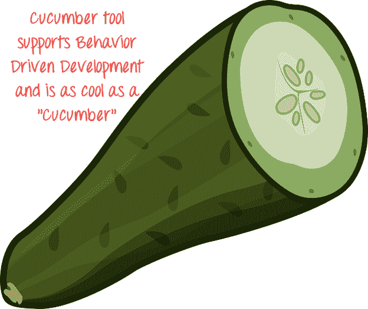

# 什么是黄瓜测试工具？ 框架介绍

> 原文： [https://www.guru99.com/introduction-to-cucumber.html](https://www.guru99.com/introduction-to-cucumber.html)

## 什么是黄瓜？

**Cucumber** 是一种支持行为驱动开发（BDD）的测试工具。 它提供了一种编写任何人都可以理解的测试的方法，而不论他们的技术知识如何。 在 BDD 中，用户（业务分析师，产品所有者）首先编写方案或验收测试，从客户的角度描述系统的行为，以便产品所有者在开发人员编写代码之前进行审核和批准。 黄瓜使用 Ruby 编程语言。



在此 Cucumber 框架教程中，您将学习：

*   [BDD 如何在黄瓜自动化中工作？](#1)
*   [黄瓜](#3)的优势
*   [黄瓜 vs 硒 vs ALM](#4)

## BDD 如何在黄瓜自动化中工作？

考虑您被分配在网上银行应用程序中创建资金转账模块。

有多种测试方法

1.  如果来源帐户中有足够的余额，则应进行资金转帐
2.  如果目的地 A / C 详细信息正确，则应进行资金转帐
3.  如果用户输入的交易密码/ rsa 代码/安全认证正确，则应进行资金转帐
4.  即使是银行假期也应进行转帐
5.  资金转移应在帐户持有人设定的未来某个日期进行

[测试场景](/test-scenario.html)变得更加复杂和复杂，因为我们考虑了其他功能，例如在 Y 天/月的间隔内转移金额 X，当总额达到 Z 时停止计划转移，依此类推

开发人员的一般趋势是在以后开发功能并编写测试代码。 如上述案例所示，[测试用例](/test-case.html)的开发非常复杂，开发人员将推迟[测试](/software-testing.html)直到发布，这时他将进行快速但无效的测试。

为了克服这个问题，设想了 BDD（行为驱动开发）。 它使开发人员的整个测试过程变得容易

在 BDD 中，无论编写什么内容，都必须进入 ***给定时间*** 步骤。 让我们考虑上面 BDD 中的相同示例

```
Given that a fund transfer module in net banking application has been developed
And I am accessing it with proper authentication
```

```
WhenI shall transfer with enough balance in my source account
Or I shall transfer on a Bank Holiday
Or I shall transfer on a future date
And destination a/c details are correct
And transaction password/RSA code/security authentication for the transaction is correct
And press or click send button
```

```
Then amount must be transferred
And the event will be logged in log file
```

写，读和理解不容易吗？ 它涵盖了资金转移模块的所有可能的测试用例，并且可以轻松修改以容纳更多的用例。 此外，它更像是为资金转移模块编写文档。

## 黄瓜的优势

1.  让无法阅读代码的业务利益相关者参与进来很有帮助
2.  黄瓜测试侧重于最终用户体验
3.  编写测试的样式可简化测试中的代码重用
4.  快速简便的设置和执行
5.  高效的测试工具

## 黄瓜 vs 硒 vs ALM

在本节中，我们将研究黄瓜，硒和 UFT 之间的区别。

| 

**黄瓜**

 | 

**HP ALM（QTP）**

 | 

**硒**

 |
| --- | --- | --- |
| 

*   免费

 | 

*   QTP 价格昂贵

 | 

*   这是免费的

 |
| 

*   这是一个行为驱动的开发工具

 | 

*   这是一个功能自动化工具

 | 

*   这是功能和性能（硒网格）测试工具

 |
| 

*   黄瓜中的插件工作更快

 | 

*   插件比黄瓜和硒

慢 | 

*   插件比黄瓜

慢 |
| 

*   Cucumber Framework 除了 Ruby 外还支持 Java，Scala，Groovy 等其他语言。

 | 

*   QTP 仅支持 VB 脚本

 | 

*   Selenium 支持 Java，.Net 和许多其他语言

 |
| 

*   编写自动化步骤是测试人员和开发人员的共同努力

 | 

*   在 [QTP](/quick-test-professional-qtp-tutorial.html) 中，仅测试人员编写自动化步骤

 | 

*   与 Cucumber Tool 一样，编写自动化步骤是测试人员和开发人员的共同努力

 |
| 

*   黄瓜仅支持网络环境

 | 

*   支持 Web，桌面和任何客户端服务器应用程序

 | 

*   仅支持网络环境

 |