# 如何下载&在 Windows 中安装 CUCUMBER

> 原文： [https://www.guru99.com/cucumber-installation.html](https://www.guru99.com/cucumber-installation.html)

黄瓜的安装可能很麻烦，但相对容易。

这是使黄瓜工作所需安装的组件的路线图

*   [安装 Ruby 和 DevKit](#1)
*   [安装黄瓜](#2)
*   [安装 IDE RubyMine](#3)
*   [安装 watir-webdriver](#4)
*   [第一个黄瓜脚本](#5)

## 安装 Ruby 和 DevKit

**Step1）**转到 [https://rubyinstaller.org/downloads/](https://rubyinstaller.org/downloads/)

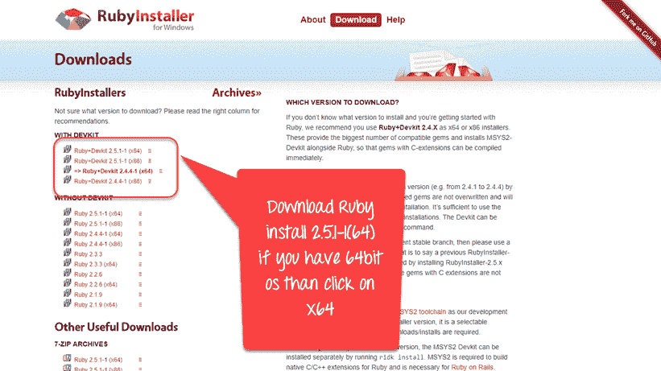

**步骤 2）**打开下载的文件。

1.  接受许可证
2.  点击下一步按钮


**步骤 3）**在下一个屏幕中。

1.  选择您的安装目录
2.  选择所有选项
3.  点击安装

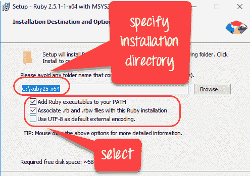

**步骤 4）**在以下屏幕中，单击“下一步”。

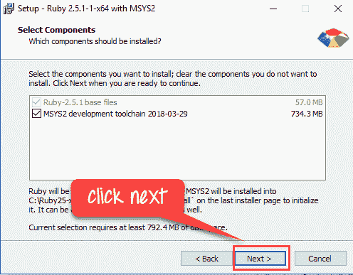

**步骤 5）**等待安装完成。


**步骤 6）**单击完成

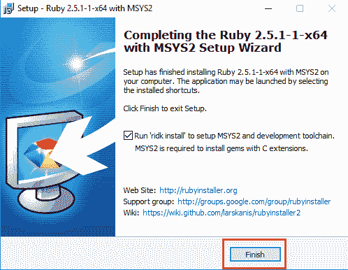

**步骤 7）**安装完成后，让我们运行 Ruby！

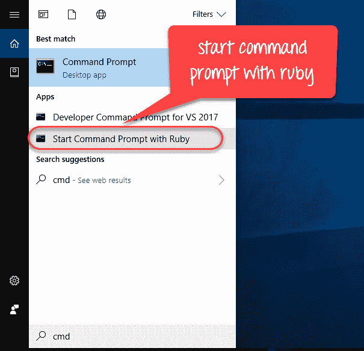

**步骤 8）**您将看到类似于 Windows cmd 的 Ruby Command 提示符。

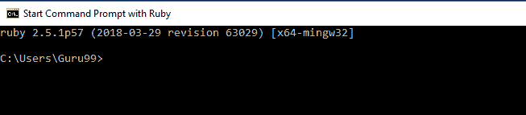

## 安装黄瓜

**步骤 1）**键入 Ruby cmd“宝石安装黄瓜”。 此命令将在命令行本身下载并安装 Cucumber

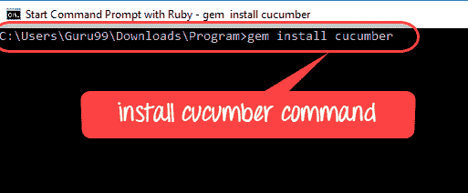

几秒钟后，开始执行黄瓜安装程序

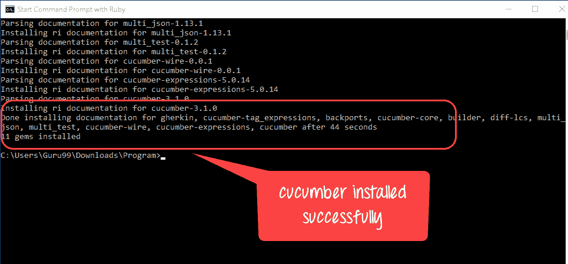

**步骤 2）**要验证黄瓜是否已成功安装，只需键入“ cucumber –version”

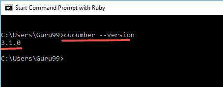

## 安装 IDE RubyMine

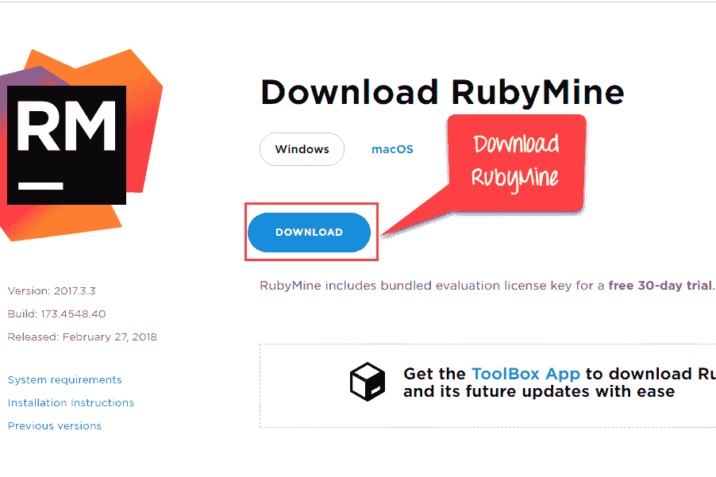

**步骤 1）**

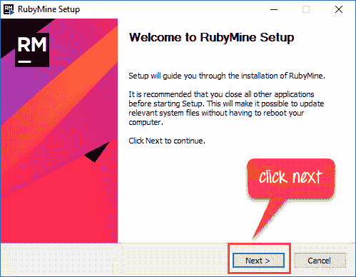

**步骤 2）**

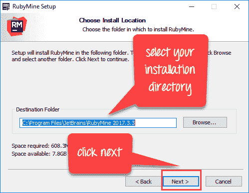

**步骤 3）**

[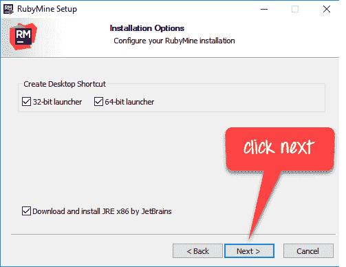 ](/images/1/062718_1013_Cucumberins22.png) 

**步骤 4）**

[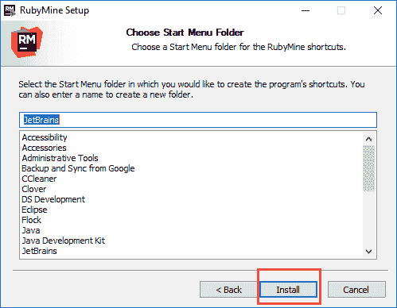 ](/images/1/062718_1013_Cucumberins23.png) 

**步骤 5）**

[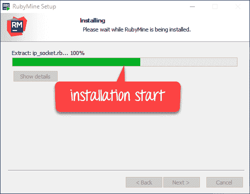 ](/images/1/062718_1013_Cucumberins24.png) 

**步骤 6）**

[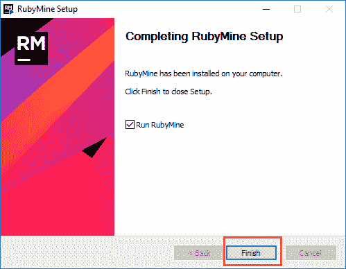 ](/images/1/062718_1013_Cucumberins25.png) 

**步骤 7）**

[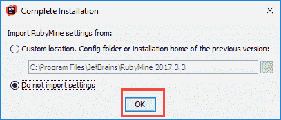 ](/images/1/062718_1013_Cucumberins26.png) 

**步骤 8）**

[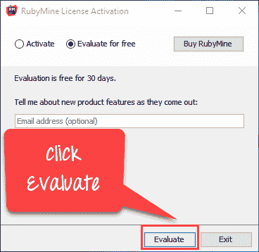 ](/images/1/062718_1013_Cucumberins27.png) 

**步骤 9）**

[ ](/images/1/062718_1013_Cucumberins28.png) 

**步骤 10）**

[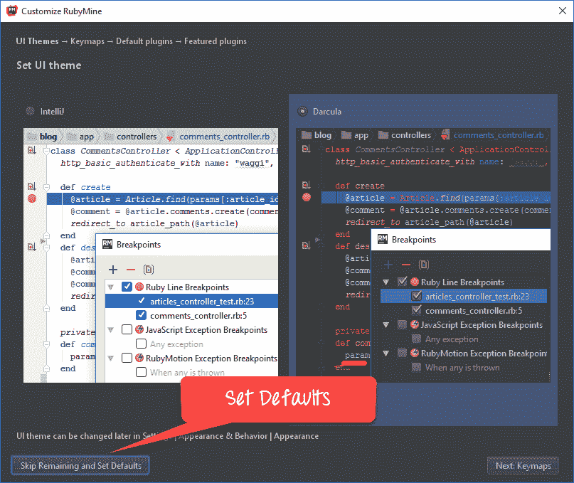 ](/images/1/062718_1013_Cucumberins29.png) 

**步骤 11）**

[ ](/images/1/062718_1013_Cucumberins30.png) 

**步骤 12）**

[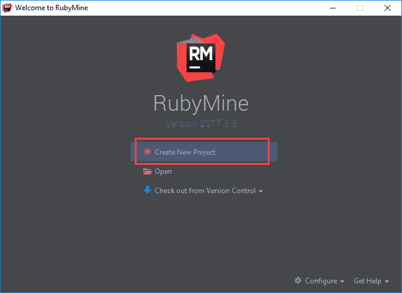 ](/images/1/062718_1013_Cucumberins31.png) 

## 安装 watir-webdriver

**步骤 1）**单击“使用 ruby 启动命令提示符”，然后安装命令“ gem install watir-webdriver”

[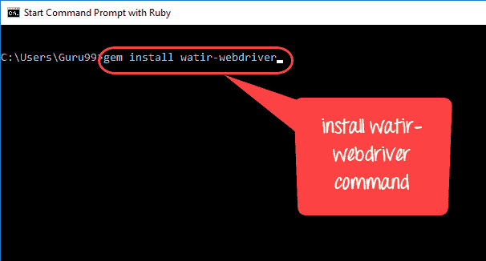 ](/images/1/062718_1013_Cucumberins32.png) 

**步骤 2）** watir-webdriver 安装成功

[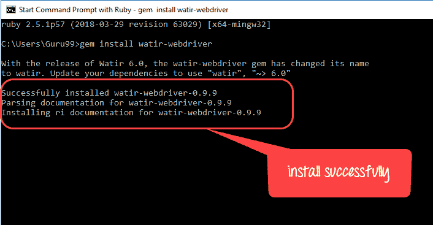 ](/images/1/062718_1013_Cucumberins33.png) 

## 第一个黄瓜脚本

**步骤 1）**通过 Windows 开始菜单打开 RubyMine Editor


您将看到如下的 Rubymine 仪表板

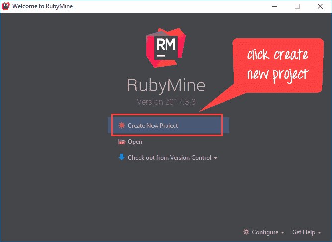

**步骤 2）**在 Rubymine 编辑器中创建一个新项目

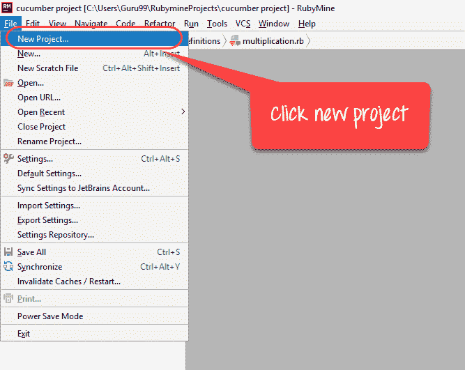

[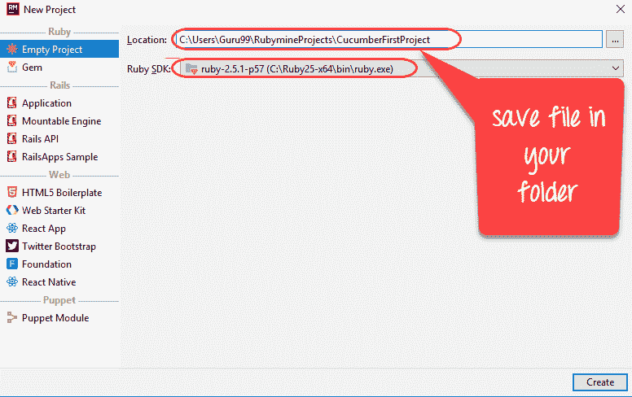 ](/images/1/062718_1013_Cucumberins37.png) 

**步骤 3）**创建文件目录

[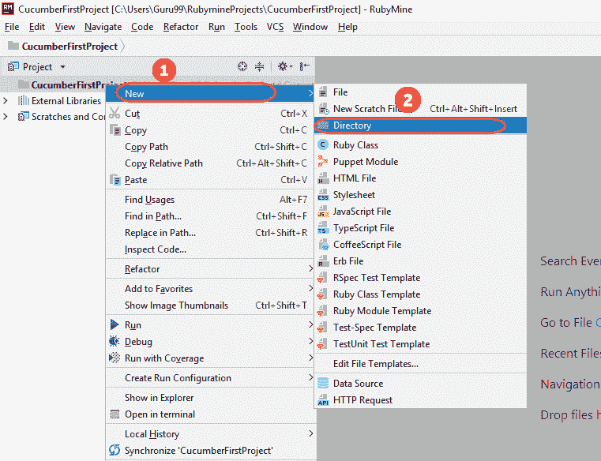 ](/images/1/062718_1013_Cucumberins38.png) 

[ ](/images/1/062718_1013_Cucumberins39.png) 

**步骤 4）**在名称为“ yourfilename.feature”的“ yourfolder / features /”中创建并保存文件

[ ](/images/1/062718_1013_Cucumberins40.png) 

[ ](/images/1/062718_1013_Cucumberins41.png) 

**步骤 5）**要执行我们的方案，请将以下命令保存在功能文件中

[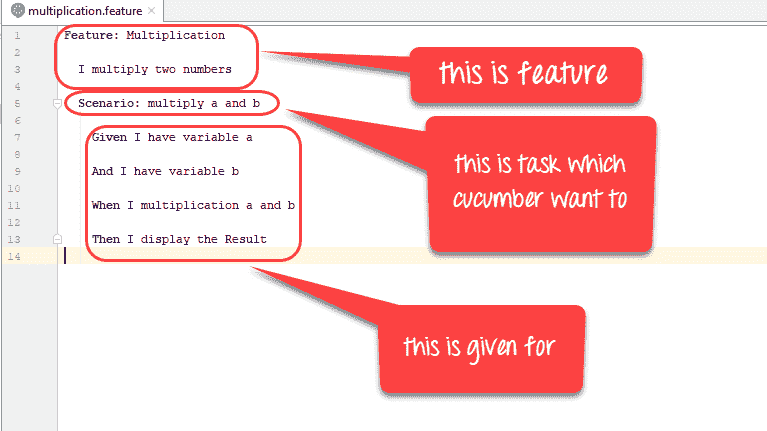 ](/images/1/062718_1013_Cucumberins42.png) 

**代码：**

```
Feature: Multiplication 
I multiply two numbers 
	Scenario: multiply a and b 
		Given I have variable a 
		And I have variable b 
		When I multiplication a and b 
		Then I display the Result

```

**步骤 6）**现在，运行我们的第一个功能文件。

单击“使用 ruby 启动命令提示符”

[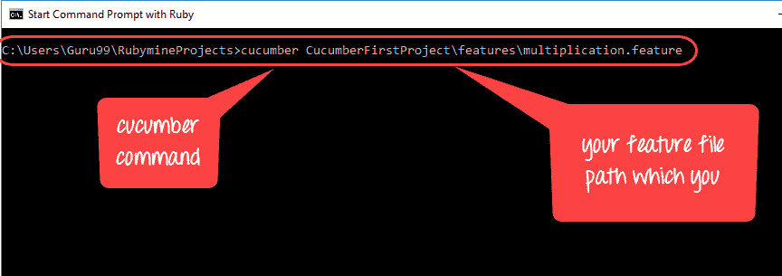 ](/images/1/062718_1013_Cucumberins43.png) 

看起来会像这样！

[ ](/images/1/062718_1013_Cucumberins44.png) 

**步骤 7）**让我们为功能文件创建步骤定义文件！

在 Rubymine 编辑器中创建一个新文件夹

[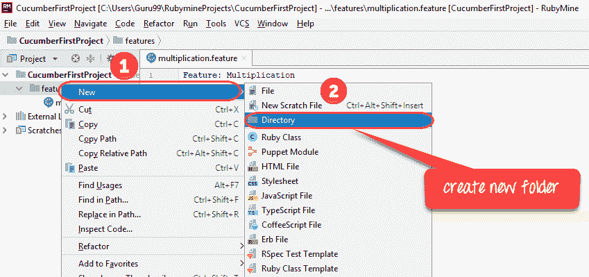 ](/images/1/062718_1013_Cucumberins45.png) 

[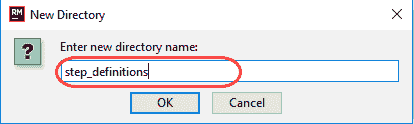 ](/images/1/062718_1013_Cucumberins46.png) 

**步骤 8）**将文件另存为“ test.step.rb”中的“ yourfolder / features / step_definititons”，如下所示

[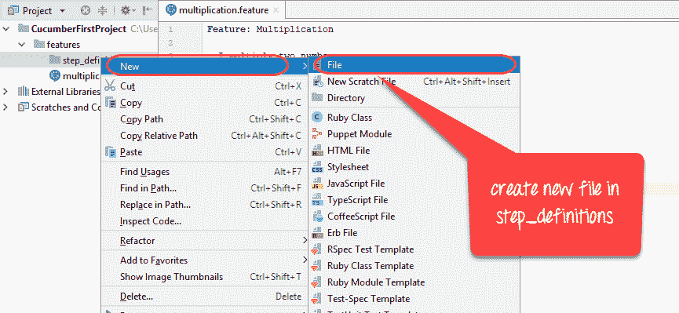 ](/images/1/062718_1013_Cucumberins47.png) 

[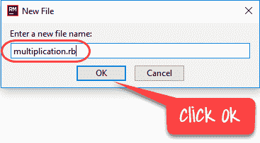 ](/images/1/062718_1013_Cucumberins48.png) 

**步骤 9）**将以下代码写入步骤文件

[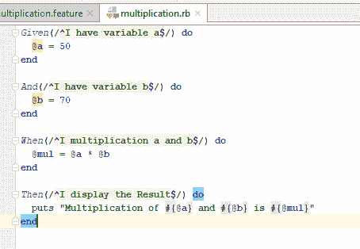 ](/images/1/062718_1013_Cucumberins49.png) 

**代码：**

```
Given(/^I have variable a$/) do
@a = 50
end

And(/^I have variable b$/) do
@b = 70
end

When(/^I multiplication a and b$/) do 
@mul = @a * @b
end

Then(/^I display the Result$/) do 
puts "Multiplication of #{@a} and #{@b} is #{@mul}"
end

```

**步骤 10）**现在，再次运行我们的功能文件：

[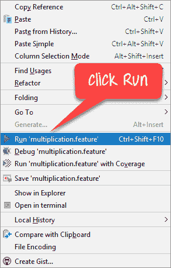 ](/images/1/062718_1013_Cucumberins50.png) 

结果为

[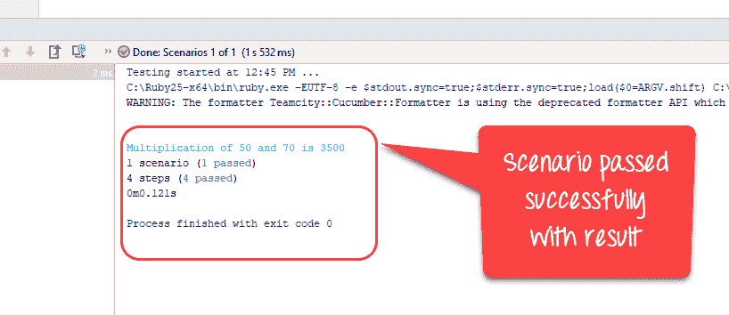 ](/images/1/062718_1013_Cucumberins51.png)