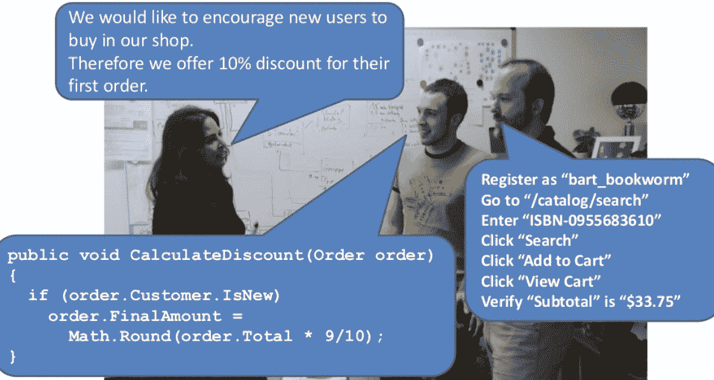
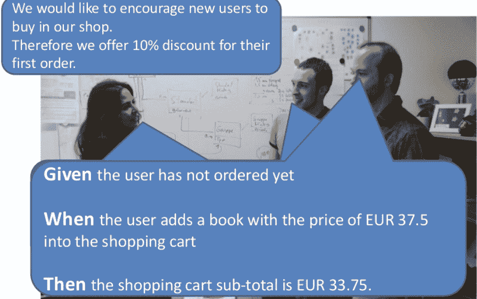
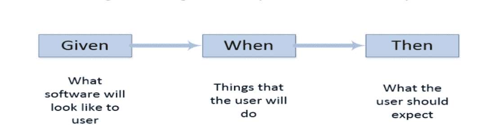

# 什么是小黄瓜？ 用黄瓜写小黄瓜测试

> 原文： [https://www.guru99.com/gherkin-test-cucumber.html](https://www.guru99.com/gherkin-test-cucumber.html)

## 什么是小黄瓜？

小黄瓜是黄瓜规格的格式。 它是一种领域特定的语言，可帮助您描述业务行为，而无需详细介绍实现。 此文本充当自动化测试的文档和框架。 Gherkin 基于 TreeTop 语法，它以 37 种以上的语言提供。 因此，您可以使用 37 种以上的口头语言来编写自己的小黄瓜。

该脚本有两个主要目的：

*   记录用户场景
*   编写自动化测试（BDD）

在这个 Gherkin 教程中，您将学习

*   [什么是小黄瓜？](#1)
*   [为什么选择小黄瓜？](#2)
*   [小黄瓜语法](#3)
*   [小黄瓜](#4)中使用的重要术语
*   [小黄瓜示例](#5)
*   [使用小黄瓜的最佳做法](#6)
*   [小黄瓜](#7)的优缺点

## 为什么是小黄瓜？

下图可以轻松解释对黄瓜的需求

**小黄瓜之前**



**小黄瓜之后**



## 小黄瓜语法

就像 YAML 和 Python 一样，Gherkin 是面向行的语言。 每行都称为 step，以关键字开头，并以 stop 结束终端。 制表符或空格用于缩进。

在此脚本中，可以在任何需要的地方添加注释，但注释应以＃号开头。 在删除 Ghrekin 的给定关键字，何时，然后等等之后，它读取每一行。

**典型的小黄瓜步骤如下：**

小黄瓜脚本：将因果关系的人类概念与输入/过程/输出的软件概念联系起来。

**小黄瓜语法：**

```
Feature: Title of the Scenario
Given [Preconditions or Initial Context]
When [Event or Trigger]
Then [Expected output]

```

一个 Gherkin 文档的扩展名是.feature，只是一个带有奇特扩展名的测试文件。 Cucumber 阅读 Gherkin 文档并执行测试以验证该软件的行为是否符合 Gherkin 黄瓜语法。

## 小黄瓜中使用的重要术语

*   特征
*   背景
*   情境
*   给定
*   什么时候
*   然后
*   和
*   但
*   方案大纲示例

命名约定用于功能名称。 但是，黄瓜中没有关于名称的固定规则。

**功能：**

该文件应具有扩展名.feature，并且每个功能文件应仅具有一个功能。 Feature 关键字与 Feature 一起使用：添加后，将写入功能的空格和名称。

**场景：**

每个功能文件可能具有多个方案，并且每个方案都以“方案”开头：后跟方案名称。

**背景：**

Background 关键字可帮助您向场景中添加一些上下文。 它可以包含场景的某些步骤，但是唯一的区别是它应该在每个场景之前运行。

**给出：**

Given 关键字的使用是在用户开始与系统交互之前将系统置于熟悉的状态。 但是，如果在“前提条件”步骤中给出，则可以省略在“给出”步骤中编写用户交互。

句法：

```
Given
```

```
Given - a test step that defines the 'context
Given I am on "/."
```

**时间：**

当步骤是定义用户执行的动作时。

Syntax:

```
When
```

```
A When - a test step that defines the 'action' performed
When I perform "Sign In."
```

**然后：**

“ then”关键字的使用是在 when 步骤中的操作后查看**结果**。 但是，您只能验证明显的更改。

句法：

```
 Then
```

```
Then - test step that defines the 'outcome.'
Then I should see "Welcome Tom."
```

**和&但是**

您可能在 when 或 Then 给出多个。

Syntax:

```
But
```

```
A But - additional test step which defines the 'action' 'outcome.'
But I should see "Welcome Tom."
```

```
And - additional test step that defines the 'action' performed
And I write  "EmailAddress" with "This email address is being protected from spambots. You need JavaScript enabled to view it.
	."
```

给定，何时，然后，和，但是是测试步骤。 您可以互换使用它们。 解释器不显示任何错误。 但是，他们在阅读时肯定不会发出任何“感觉”。



```
Given The login page is opening
When I input username, password and click the Login button 
Then I am on the Homepage

```

## 小黄瓜示例

```
Feature:  Login functionality of social networking site Facebook. 
Given:  I am a facebook user. 
When: I enter username as username. 
And I enter the password as the password 
Then I should be redirected to the home page of facebook 

```

上面提到的方案具有称为用户登录的功能。

所有粗体字均为小黄瓜关键字。

Gherkin 将分析步骤定义文件中写入的每个步骤。 因此，步骤在功能文件中给出，并且步骤定义文件应匹配。

**示例 2：**

```
Feature: User Authentication Background:
Given the user is already registered to the website Scenario:
Given the user is on the login page
When the user inputs the correct email address
And the user inputs the correct password
And the user clicks the Login button
Then the user should be authenticated
And the user should be redirected to their dashboard
And the user should be presented with a success message 

```

## 使用小黄瓜的最佳做法

*   每个方案应单独执行
*   每个功能都应该能够一起执行
*   步骤信息应独立显示
*   将方案与需求联系起来
*   全面跟踪需求文档中应包含哪些方案
*   创建模块化且易于理解的步骤
*   尝试结合所有常见情况

## 小黄瓜的优缺点

*   小黄瓜非常简单，非程序员也可以理解
*   程序员可以以此为基础来开始测试
*   它使用户故事更易于理解
*   小黄瓜脚本可以被企业主管和开发人员轻松理解
*   针对业务需求
*   功能说明的很大一部分写为用户案例
*   您无需成为专家即可了解小型 Gherkin 命令集
*   小黄瓜将验收测试直接链接到自动化测试
*   编写测试用例的样式更易于在其他测试中重用代码

**缺点**

*   它需要高水平的业务参与和协作
*   可能无法在所有情况下都能正常工作
*   写得不好的测试很容易增加测试维护成本

**摘要：**

*   小黄瓜是黄瓜规格的格式
*   就像 YAML 和 Python 一样，Gherkin 是面向行的语言
*   Gherkin Scripts 将因果关系的人类概念与输入/过程和输出的软件概念联系起来
*   特征，背景，方案，给定，何时，何时和但在小黄瓜中很重要
*   在小黄瓜中，每种情况应分别执行
*   Gherkin 的最大优点是足够简单，非程序员也可以理解
*   它可能无法在所有类型的方案中都很好地工作