# 创建您的第一个黄瓜脚本（2 个示例）

> 原文： [https://www.guru99.com/your-first-cucumber-script.html](https://www.guru99.com/your-first-cucumber-script.html)

在本教程中，我们将创建黄瓜脚本来测试两种情况

*   [黄瓜脚本 1：将 2 个数字相乘](#1)
*   [黄瓜脚本 2：输入或不输入电子邮件 ID 时验证输出](#2)

## 黄瓜脚本 1：两个数字相乘

**步骤 1）**通过 Windows 开始菜单打开 RubyMine Editor

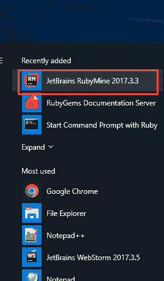

**步骤 2）**在 Rubymine 编辑器中，单击“创建新项目”

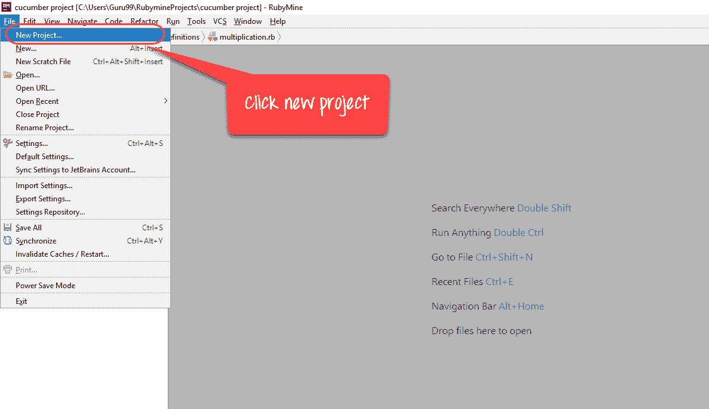

**步骤 3）**选择项目位置，然后单击“创建”。

[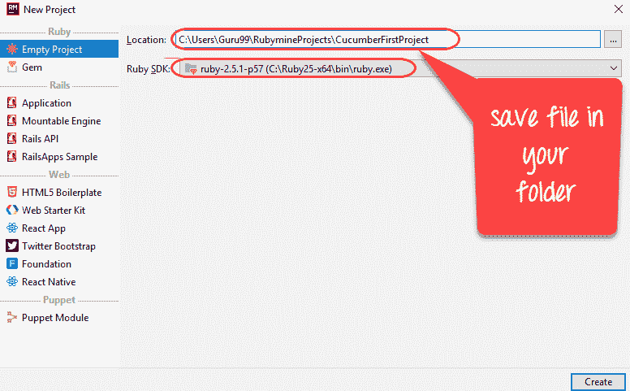 ](/images/1/062718_1022_FirstCucumb3.png) 

**步骤 4）**创建文件目录

[ ](/images/1/062718_1022_FirstCucumb4.png) 

**步骤 5）**将目录命名为**“功能”**

[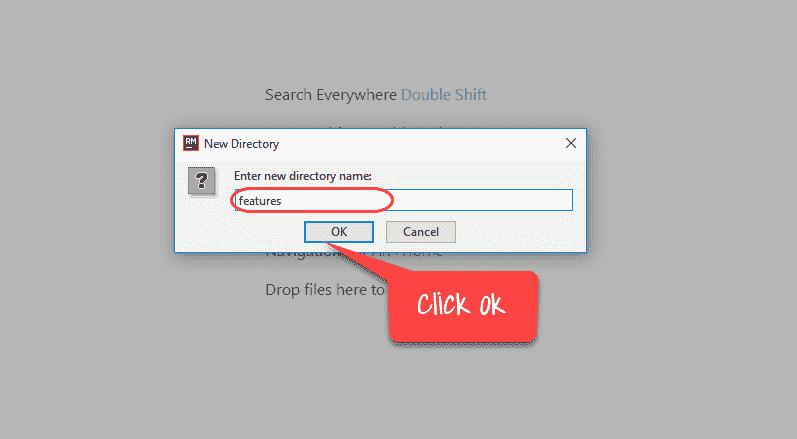 ](/images/1/062718_1022_FirstCucumb5.png) 

**步骤 6）**在名称为“ yourfilename.feature”的“ yourfolder / features /”中创建并保存文件

[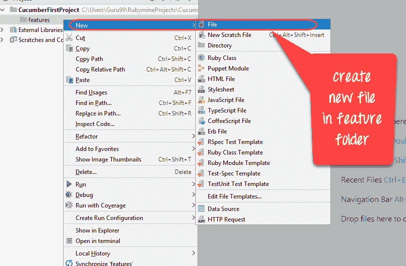 ](/images/1/062718_1022_FirstCucumb6.png) 

[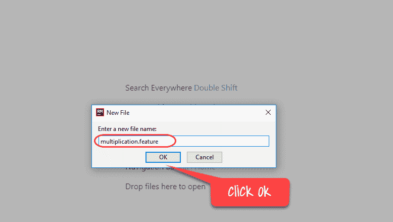 ](/images/1/062718_1022_FirstCucumb7.png) 

**步骤 7）**要执行我们的方案，请将以下程序保存在功能文件中

[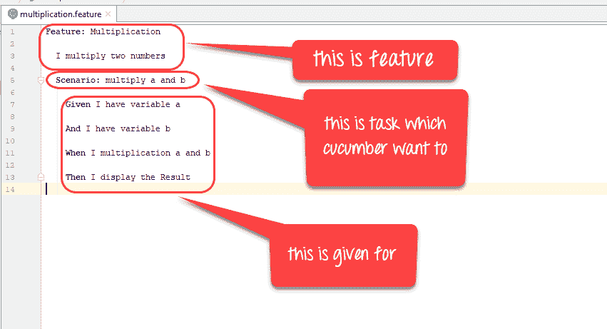 ](/images/1/062718_1022_FirstCucumb8.png) 

**代码：**

```
Feature: Multiplication 
  I multiply two numbers 
	Scenario: multiply a and b 
	  Given I have variable a 
	  And I have variable b 
      When I multiplication a and b 
      Then I display the Result

```

**步骤 8）**现在，让我们运行第一个功能文件！

单击“使用 Ruby 启动命令提示符”

[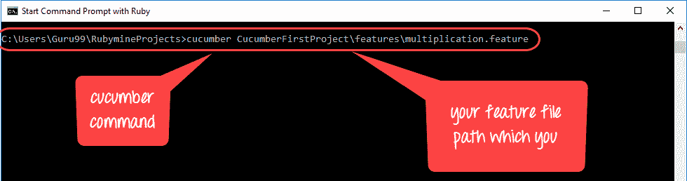 ](/images/1/062718_1022_FirstCucumb9.png) 

您得到的输出是

[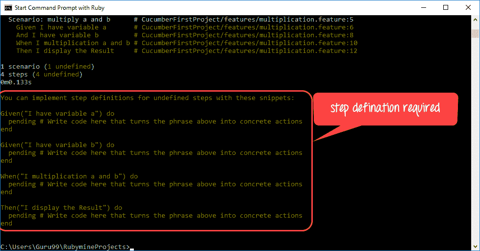 ](/images/1/062718_1022_FirstCucumb10.png) 

您看到此错误是因为您必须为功能文件编写步骤定义文件

**步骤 7）**让我们为功能文件创建步骤定义文件！

在 Rubymine 编辑器中创建一个名为“ step_definition”的新文件夹

[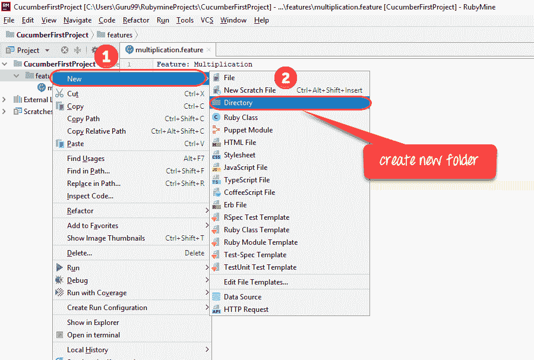 ](/images/1/062718_1022_FirstCucumb11.png) 

[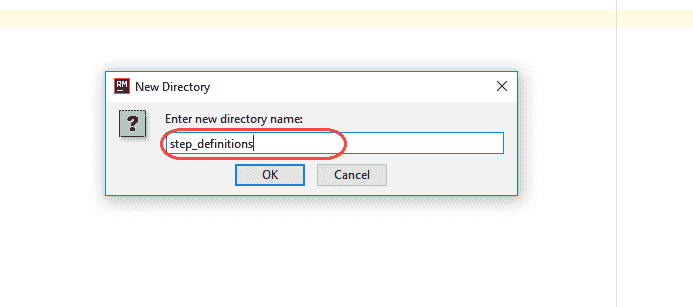 ](/images/1/062718_1022_FirstCucumb12.png) 

**步骤 8）**将文件另存为“ test.step.rb”中的“ yourfolder / features / step_defines”，如下所示

[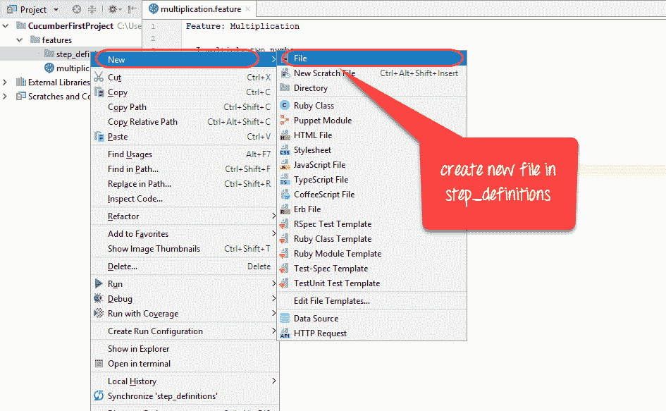 ](/images/1/062718_1022_FirstCucumb13.png) 

[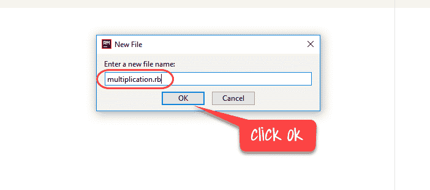 ](/images/1/062718_1022_FirstCucumb14.png) 

**步骤 9）**将以下代码写入步骤文件

[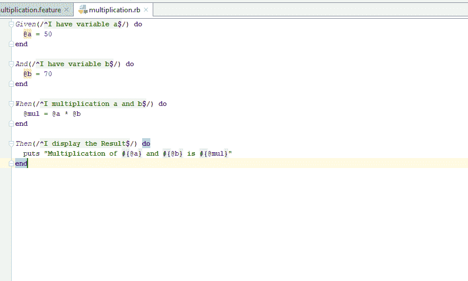 ](/images/1/062718_1022_FirstCucumb15.png) 

**代码：**

```
Given(/^I have variable a$/) do 
  @a = 50
end

And(/^I have variable b$/) do 
  @b = 70 
end

When(/^I multiplication a and b$/) do 
  @mul = @a * @b
end

Then(/^I display the Result$/) do 
  puts "Multiplication of #{@a} and #{@b} is #{@mul}"
end

```

**步骤 10）**现在，再次运行我们的功能文件：

[ ](/images/1/062718_1022_FirstCucumb16.png) 

结果为

[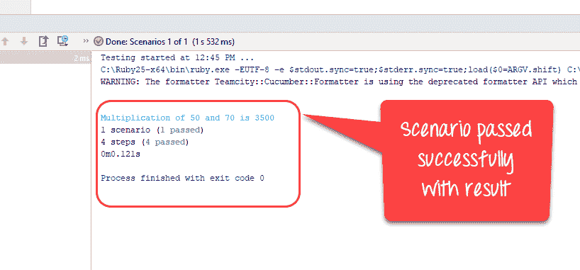 ](/images/1/062718_1022_FirstCucumb17.png) 

## 黄瓜脚本 2：输入或不输入电子邮件 ID 时验证输出

在此示例中，我们使用 Ruby

**测试方案**：未输入电子邮件 ID 时验证输出

测试步骤：

1.  开启浏览器
2.  转到 [http://demo.guru99.com/](http://demo.guru99.com/)
3.  **不是**输入电子邮件 ID
4.  点击提交

**测试场景**：输入电子邮件 ID 时验证输出

Test Steps:

1.  开启浏览器
2.  转到 [http://demo.guru99.com/](http://demo.guru99.com/)
3.  输入电子邮件地址
4.  点击提交

Code in Feature File

```
Feature: guru99 Demopage Login
To Login in Demopage we have to enter login details
Scenario: Register On Guru99 Demopage without email
Given I am on the Guru99 homepage
When enter blank details for Register
Then error email shown
Scenario: Register On Guru99 Demopage with valid email
Given I am on the Guru99 homepage
When enter details for Register
Then login details shown
```

步骤定义文件中的代码

```
require 'watir-webdriver'

require 'colorize'

browser = Watir::Browser.new

Given (/^I am on the Guru99 homepage$/)do

browser.goto "http://demo.guru99.com"

end

When (/^enter blank details for Register$/)do

browser.text_field(:name,"emailid").set(" ")

browser.button(:name,"btnLogin").click

end

Then (/^error email shown$/)do

puts " Email is Required".red

browser.close

end

When (/^enter details for Register$/)do

browser = Watir::Browser.new

browser.goto "http://demo.guru99.com"

browser.text_field(:name,"emailid").set("This email address is being protected from spambots. You need JavaScript enabled to view it.
	")

browser.button(:name,"btnLogin").click

end

Then (/^login details shown$/)do

puts " Sucessfully register"

browser.close

end

```

在命令提示符下运行代码，您将获得

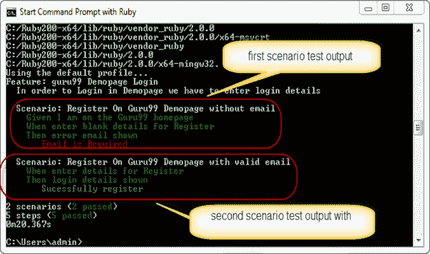