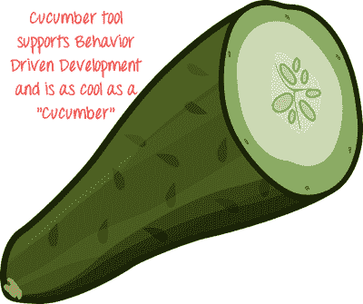

# 黄瓜面试的前 20 个问题&答案

> 原文： [https://www.guru99.com/cucumber-interview-questions.html](https://www.guru99.com/cucumber-interview-questions.html)

[下载 PDF](https://www.guru99.com/pdf/cucumber-interview-questions.pdf)

以下是针对新生和经验丰富的质量检查专业人员的常见黄瓜测试面试问题。

**1）什么是黄瓜？ 黄瓜的优点是什么？**

要运行以纯文本编写的功能测试，请使用 Cucumber 工具。 它是用 Ruby 编程语言编写的。

**黄瓜的优点是：**

*   您可以让无法编码的业务涉众参与
*   最终用户体验是当务之急
*   高代码重用

**2）执行 Cucumber 测试方案所需的两个文件是什么？**

执行 Cucumber 测试方案所需的两个文件是

*   特征
*   步骤定义

**3）解释在黄瓜中使用 Background 关键字吗？**

Background 关键字用于将多个给定语句分组为一个组。 在功能文件的每种情况下重复相同的给定语句集时，通常使用该关键字。

**4）以纯文本方式举一个行为驱动测试的例子？**

*   **功能：**访问 abc.com 中的 **XYZ** 页面
*   **方案：**访问 abc.com
*   **给出：**我在 abc.com 上
*   **时间：**我点击 XYZ 页面
*   **然后：**我应该看到 ABC 页面

**5）功能文件中的方案大纲是什么？**

**方案大纲为**，可以使用方案大纲对多个数据集执行相同的方案。 数据由以（I I）分隔的表格结构提供。

**6）在黄瓜**中解释术语“步骤定义”

步骤定义是功能文件中提到的功能的实际代码实现。

**7）举一个使用“给定”功能的步定义示例？**

例如，为了使访问者访问网站“ Yahoo”，我们使用给定的命令

鉴于（/ ^我在 www.yahoo.com $ /上）

Browser.goto“ http://www.yahoo.com”。

结束–这将访问 www.yahoo.com

**8）Jbehave 和 Cucumber 有什么区别？**

尽管 Cucumber 和 Jbehave 具有相同的目的，但是验收测试是完全不同的框架

*   Jbehave 和 Cucumber 基于 Ruby
*   Jbehave 基于故事，而 Cucumber 基于功能

**9）解释测试装置**

用于 Cucumber 和 rspec 的测试工具允许将设置上下文，与浏览器交互以及清理步骤定义文件之间的责任分开。

**10）何时使用 Rspec 和何时使用 Cucumber？**

*   Rspec 用于单元测试
*   黄瓜用于行为驱动的开发。 黄瓜可用于系统和集成测试

**11）在特征文件中表达场景的语言是什么？**

Gherkin 语言用于在功能文件和 ruby 文件中表示方案，其中包含针对方案步骤的不干扰自动化测试

**12）什么是正则表达式？**

正则表达式是描述一定数量文本的模式。 最基本的正则表达式由单个文字字符组成。

**13）什么是 BDD？**

BDD 或行为驱动开发是一种基于 TDD（测试驱动开发）的软件开发过程，该开发过程着重于软件测试单元的行为规范。

**14）运行 Cucumber Web 测试用例需要什么软件？**

*   Ruby 及其开发套件
*   黄瓜
*   像 ActiveState 这样的 IDE
*   Watir（模拟浏览器）
*   Ansicon 和 rspec（如果需要）

**15）黄瓜功能/支持文件包含哪些内容？**

功能/支持文件包含支持的 ruby 代码。 支持文件的加载要先于 step_definitions 中的加载，这对于环境配置很有用。

**16）什么是功能文件？**

功能文件以简单语言包含测试方案的高级描述。 它被称为小黄瓜，是一种普通的英语文本语言。 功能文件由以下组件组成：

*   功能：它描述了当前必须执行的测试脚本。
*   场景：这是特定测试案例的步骤和预期结果。
*   方案大纲：可以使用方案大纲对多组数据执行方案。
*   给定：它指定要执行的文本的上下文。
*   时间：指定必须执行的测试动作。
*   然后：测试的预期结果可以用“然后”表示

**17）什么是硒？**

Selenium 是一种自动化工具，是用于基于 Web 的应用程序功能测试的广泛使用的工具。 Selenium 支持不同的语言，如 ruby，java，python C＃等。

**18）为什么将黄瓜和硒一起使用？**

黄瓜和硒是两种流行的技术。 许多组织使用 Selenium 进行功能测试。 这些使用 Selenium 的组织希望将 Cucumber 与 Selenium 集成在一起，因为 Cucumber 可帮助您阅读和理解应用程序流程。

**19）黄瓜**的优势

这是使用黄瓜的一些突出优点。

*   让无法轻松阅读代码的业务利益相关者参与进来很有帮助
*   黄瓜测试可增强最终用户体验
*   编写测试的样式可简化测试中的代码重用
*   允许快速轻松地设置和执行

**20）什么是步骤定义？**

步骤定义将功能文件中的“测试用例步骤”映射为代码。 它执行被测应用程序上的步骤，并根据预期结果检查结果。 为了执行步骤定义，它必须与功能中的给定组件匹配。