# Web 服务测试：初学者教程

> 原文： [https://www.guru99.com/webservice-testing-beginner-guide.html](https://www.guru99.com/webservice-testing-beginner-guide.html)

### 什么是 WebService？

Web 服务是两种应用程序/机器通过其交换数据的机制或媒介，而不论其下划线架构和技术如何。

## 什么是 Web 服务测试？

**Web 服务测试**是一种可验证 Web 服务的软件测试。 Web 服务测试的目的是检查 API（应用程序接口）的功能，可靠性，性能和安全性。 Web Service 测试在某些情况下类似于单元测试。 您可以手动测试 Web 服务，也可以创建自己的自动化代码，或者使用 Postman 等现成的自动化工具。

### 为什么需要 WebService？

通常，开发软件应用程序以供人类使用，其中人将请求发送到软件服务，该软件服务进而以人类可读格式返回响应。

在现代技术时代，如果您要构建软件应用程序，则无需从头开始构建所有内容。 您可以将许多现成的服务插入应用程序中，然后就可以开始在应用程序中提供这些服务。

例如，您要显示不需要收集，处理和呈现应用程序中数据的天气预报信息。 您可以从已经在处理和发布此类数据方面建立良好的人员那里购买服务。

Web 服务使我们能够进行此类实现。

作为示例，请考虑以下 WebService

```
http://www.webservicex.net/stockquote.asmx?op=GetQuote
```

它给出了公司的股份价值。

让我们找到 Google 的股价（代码：GOOG）

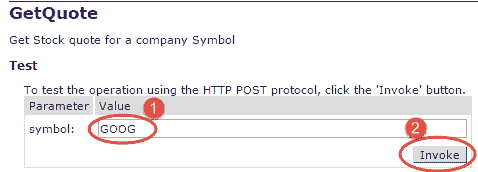

响应 XML 给出股票价格。

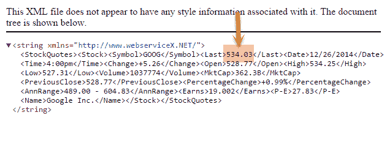

可以由软件应用程序使用 SOAP 或 HTTP 协议调用此 WebService。

## Web 服务协议

Web 服务可以以不同的方式实现，但是以下两种是流行的实现方法。

1.  SOAP（简单对象访问协议）
2.  REST（代表性状态转移架构）

## 肥皂

SOAP 是 W3C 标准定义的一种标准协议，用于发送和接收 Web 服务请求和响应。

SOAP 使用 **XML 格式发送和接收请求**，因此该数据是平台无关的数据。 SOAP 消息在 SOAP 信封内的提供程序应用程序和接收应用程序之间交换。

由于 SOAP 使用简单的 http 传输协议，因此其消息不会被防火墙阻止。

## 休息

REST 表示代表状态转移； 它是一种通常在 HTTP 上运行的体系结构。 REST 风格强调客户端和服务之间的交互，而操作数量有限则可以增强这种交互。 REST 是 SOAP（简单对象访问协议）的替代方法，在某些情况下，REST 使用简单 URL 代替了 XML。 与 SOAP 不同，RESTFUL 应用程序使用 HTTP 内置标头来携带元信息。

REST 使用各种代码来确定用户是否有权访问 API，例如代码 200 或 201 表示与响应主体成功交互，而代码 400 或 201 表示错误的请求或请求 URI 与系统中的 API 不匹配。 所有 API 请求参数和方法参数都可以通过 **POST** 或 **GET** 变量发送。

Rest API 支持 XML 和 JSON 格式。 通常，它是[移动](/mobile-testing.html)和网络应用程序的首选，因为它可以使应用程序运行更快，更流畅

## WSDL

WSDL（Web 服务描述语言）是一种基于 XML 的语言，将用于描述 Web 服务提供的服务。

WSDL 以 XML 格式描述了特定 Web 服务提供的所有操作。 它还定义了如何调用服务，即我们必须提供的输入值以及将为每种服务生成的响应的格式是什么。

## 如何测试 Web 服务？

要测试 Web 服务，您可以

1.  手动测试
2.  创建自己的自动化代码
3.  使用像 SoapUI 这样的现成的自动化工具。

WebService 测试涉及以下步骤-

1.  **了解 WSDL 文件**
2.  **确定特定 Web 服务提供的操作**
3.  **确定我们需要发送的 XML 请求格式**
4.  **确定响应 XML 格式**
5.  **使用工具或编写代码来发送请求并验证响应**

假设我们要测试一个提供货币换算功能的 WebService。 它将当前不同国家/地区之间的汇率转换成货币。 我们可以在应用程序中使用此服务，将值从一种货币转换为另一种货币。

现在让我们看看上面的步骤

## 步骤 1 至 4：了解 WSDL 并确定操作& XML 格式

可以在@（ [http://www.webservicex.net/CurrencyConvertor.asmx?wsdl](http://www.webservicex.net/CurrencyConvertor.asmx?wsdl) ）上看到货币转换器 WSDL 文件，该文件将提供有关它将支持的货币转换器 Web 服务方法的信息，该参数为 我们需要通过和参数的类型…等等

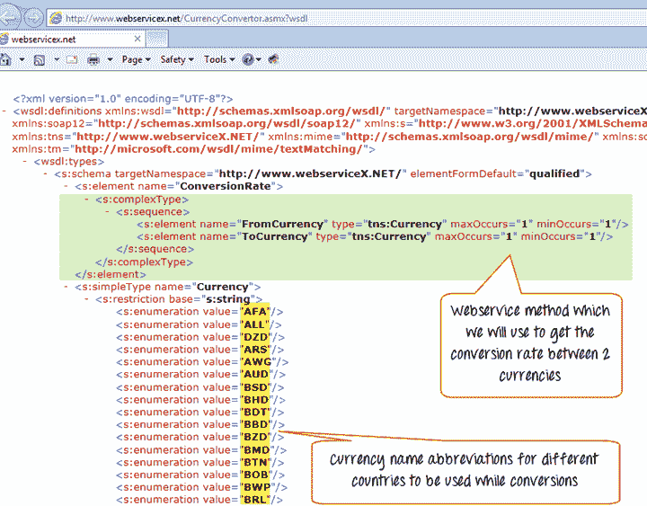 

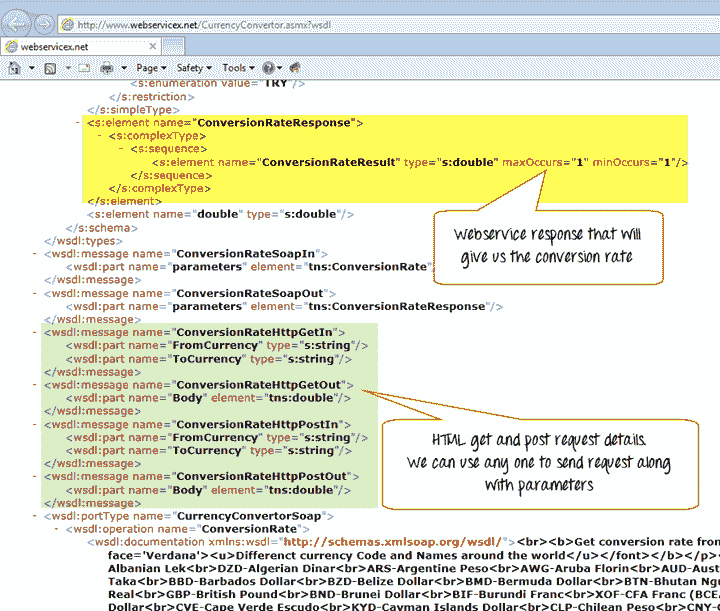

## 步骤 5：使用工具或编写代码来发送请求并验证响应

有许多工具可用于测试 Web 服务。 SoapUI 是流行的工具之一，它将帮助我们测试 Web 服务。 实际上，您可以使用任何编程语言，这些编程语言都可以通过 http 向 Web 服务提供商应用程序发送 XML 请求，并能够根据预期结果解析和验证响应 XML。 在我们的例子中，我们将测试 WebService

1.  使用 Java
2.  使用 SoapUI

### 第 1 部分）使用 Apache Axis2 API（Java）进行 Web 服务测试。

通常，Web 服务接受请求并以 XML 格式发送响应。

Apache Axis2 API 项目是 [Java](/java-tutorial.html) 实现 API，将用于为服务器端（服务提供者）和客户端（服务使用者）创建 Web 服务。

Axis2 能够发送 SOAP 消息并接收&处理 SOAP 消息。 我们可以使用 API​​编写一个小的 Java 程序来创建 Web 服务。 Axis2 将通过 Java 程序生成 WSDL，该 WSDL 将用于通信 Web 服务提供的服务。 我们可以使用相同的 Axis2 从 WSDL 文件生成 Java 类（存根），我们可以将其用作客户端程序来生成 Web 服务请求，将请求发送到服务端点并处理响应。

1.  基本上，我们将创建一个简单的 Java 程序，在其中实例化存根类。
2.  使用存根，我们将通过传递所有必需的信息来调用 request 方法。
3.  存根程序会将请求转换为 XML 请求格式，并向其发送服务端点，该端点将读取请求并处理请求并以 XML 格式发送响应。
4.  XML 响应将通过存根转换为 Java 类，并返回到实际程序。

让我们详细看一下上述步骤

步骤 a）下载 axis2 API @ [https://axis.apache.org/axis2/Java/core/download.cgi](https://axis.apache.org/axis2/java/core/download.cgi) &设置环境变量'AXIS2_HOME'

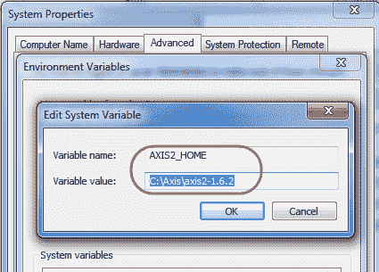

步骤 b）创建一个文件夹以保留所有生成的工件

例如：C：\ Axis \ Projects \ CurrencyConverter

步骤 c）打开命令提示符，然后导航到要生成工件的文件夹结构，然后运行以下命令以生成存根

％AXIS2_HOME％\ bin \ WSDL2Java -uri http://www.webservicex.net/CurrencyConvertor.asmx?wsdl -p org.apache.axis2.currencyconvertor -d adb –s

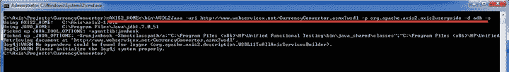

步骤 d）命令成功运行后，您将看到包含所需文件的文件夹。

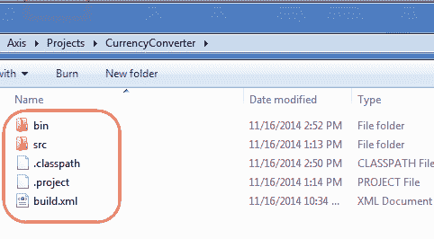

步骤 e）接下来，我们必须创建客户端程序，我们将使用生成的存根通过该客户端程序发送实际请求。 打开 Eclipse 并创建新的 Java 项目，然后选择我们在上面创建的文件夹。

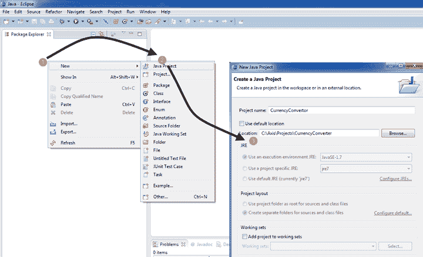

步骤 f）将所有与 axis2 相关的 jar 添加到项目构建路径，该路径将位于 axis2 软件文件夹的 lib 文件夹中

（例如：C：\ Axis \ axis2-1.6.2 \ lib）

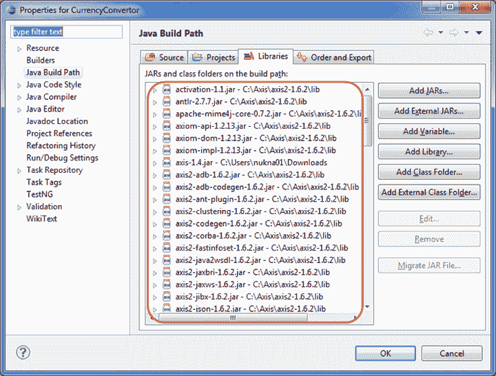

步骤 g）创建一个新的 Java 类（例如：Client.Java）并实例化存根对象。 使用存根对象，我们可以调用特定 WebService 的所有受支持的方法。

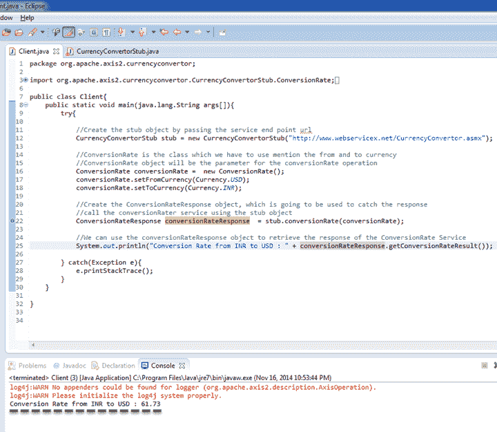 

```
Client.Java Program
package org.apache.axis2.currencyconvertor;
import org.apache.axis2.currencyconvertor.CurrencyConvertorStub.ConversionRate;
import org.apache.axis2.currencyconvertor.CurrencyConvertorStub.ConversionRateResponse;
import org.apache.axis2.currencyconvertor.CurrencyConvertorStub.Currency;

public class Client {
 public static void main(Java.lang.String args[]) {

  try {

       //Create the stub object by passing the service end point url
       CurrencyConvertorStub stub = new CurrencyConvertorStub("http://www.webservicex.net/CurrencyConvertor.asmx");
       //ConversionRate is the class which we have to use mention the from and to currency
       //ConversionRate object will be the parameter for the conversionRate operation
       ConversionRate conversionRate = new ConversionRate();
       conversionRate.setFromCurrency(Currency.USD);
       conversionRate.setToCurrency(Currency.INR);

       //Create the ConversionRateResponse object, which is going to be used to catch the response
       //call the conversionRate service using the stub object
       ConversionRateResponse conversionRateResponse = stub.conversionRate(conversionRate);

       //We can use the conversionRateResponse object to retrieve the response of the ConversionRate Service
       System.out.println("Conversion Rate from INR to USD : " + conversionRateResponse.getConversionRateResult());

       } catch (Exception e) {
       e.printStackTrace();
      }
    }
}

```

### 第 2 部分）使用 SoapUI 测试 WebService

在 SoapUI 中

1.  转到文件>新肥皂项目
2.  输入项目名称和 WSDL URI 位置
3.  点击确定

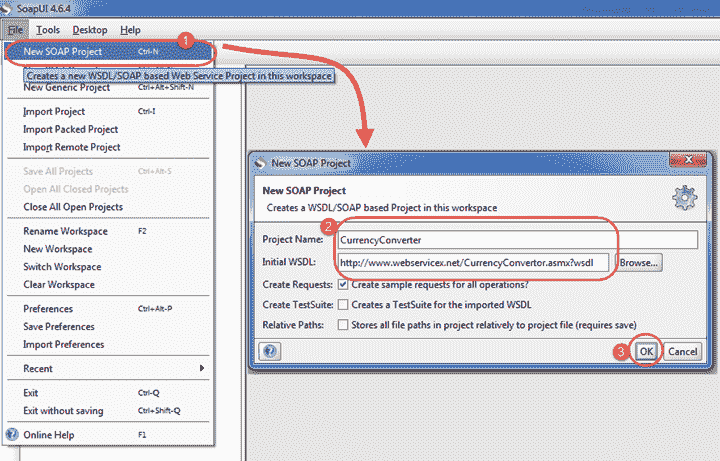

1.  展开第一个请求，然后双击“ Request1”。 它将以 XML 格式显示 SOAP 请求。
2.  输入从货币和到货币
3.  点击提交按钮
4.  响应 XML 将显示在右侧窗格中。

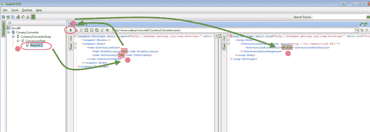

您可能会得出结论，SoapUI 之类的工具的使用加快了 WebService 测试的速度。 因此，SoapUi 将在后续教程中成为我们学习的重点。

## 摘要

*   软件应用程序使用 WebService 相互通信和交换数据
*   SOAP 和 REST 是创建 WebService 的 2 种流行协议
*   SOAP 支持基于 XML 的数据交换
*   REST 支持 XML，Json 或简单 URL 中的数据交换。
*   WSDL 是基于 XML 的语言，将用于描述 Web 服务提供的服务。 SOAP 是使用 WSDL 定义的。
*   要测试 WebService，您可以
    *   创建您自己的代码。 例如，使用 Java 的 Axis2 API
    *   使用 SoapUI 之类的 WebService 测试自动化工具
*   与使用 Axis2 API 创建自己的代码相比，SoapUI 之类的自动化工具将加快您的测试工作，并且将需要更少的编码工作

## 常问问题

WebService 和 WebAPI 有什么区别？

<colgroup><col style="width:319px"><col style="width:319px"></colgroup>
| **Web 服务** | **Web API** |
| 

*   由 W3C 定义，所有通信 & 数据交换均基于 XML

 | 

*   Web API 通信 & 数据交换可以是 XML，JSON 或纯数据

 |
| 

*   已定义标准– WSDL

 | 

*   未定义标准

 |
| 

*   您无法压缩数据，但可以压缩 HTML 请求

 | 

*   您可以压缩数据

 |
| 

*   示例：SOAP

 | 

*   示例：REST

 |

进一步了解 [Web API 测试](/api-testing.html)

Narender Reddy Nukala 先生的贡献使本教程成为可能