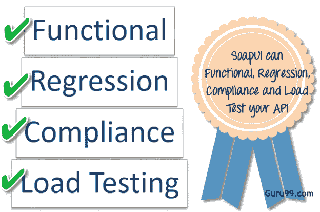
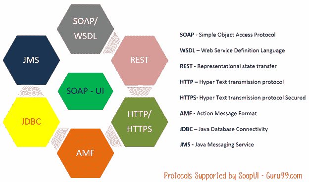

# 什么是 SoapUI？ SoapUI 测试简介

> 原文： [https://www.guru99.com/introduction-to-soapui.html](https://www.guru99.com/introduction-to-soapui.html)

## **什么是 SOAP UI？**

*   SOAP UI 是领先的开源跨平台 API [测试](/software-testing.html)工具
*   SOAPUI 允许测试人员在不同的 Web API 上执行自动化的功能，回归，合规性和负载测试。
*   SOAPUI 支持所有标准协议和技术以测试各种 API。
*   SOAPUI 接口很简单，使技术和非技术用户都可以无缝使用。

## 为什么要使用 SOAPUI？

SOAPUI 不仅是功能性的 [Api 测试](/api-testing.html)工具，还使我们能够执行非功能性测试，例如性能和安全性测试。

让我们讨论 SOAPUI 的 5 个重要功能

**1）功能测试**

*   功能强大的工具允许测试人员在 SoapUI 中编写功能性 API 测试
*   支持拖放功能，可加速脚本开发
*   支持测试的调试，并允许测试人员开发数据驱动的测试。
*   支持多种环境-易于在 QA，Dev 和 Prod 环境之间切换
*   允许高级脚本编写（测试人员可以根据情况开发其自定义代码）

**2）安全测试**

*   有能力执行一整套漏洞扫描。
*   防止通过 [SQL](/sql.html) 注入来保护数据库
*   扫描由文档太大导致的堆栈溢出
*   扫描跨站点脚本，通常在消息中公开服务参数时发生。
*   执行模糊扫描和边界扫描，以避免服务的不稳定行为。

**3）负载测试**

*   将负载测试分布在任意数量的 loadUI 代理中。
*   轻松模拟大容量和实际负载测试。
*   允许高级自定义报告捕获性能参数。
*   允许端到端系统性能监视

**4）支持的协议/技术：**

SoapUI 具有最全面的协议支持

**5）与其他自动化工具的 SOAP 集成：**

SoapUI 与流行工具很好地集成

*   Maven

    

    Apache **Maven** 是一个软件项目管理工具，可以从中央存储库管理项目的构建，报告和文档。 Maven 还可以使用简单的命令在 Maven Build 中执行 SOAPUI 测试。

*   HUDSON

    

    HUDSON 是基于 [Java](/java-tutorial.html) 的持续集成工具，并且与 CVS，Subversion，Git，Perforce，Clearcase 和 RTC 等工具集成。 SOAPUI 还与 HUDSON 集成在一起，这有助于我们针对开发人员的每次提交快速发现错误。

*   JUnit

    

    JUnit 是用 Java 内置的[单元测试](/unit-testing-guide.html)框架，它也可以控制来自 SOAPUI 的测试流程。

*   Apache - Ant

    [Apache](/apache.html) Ant，这是一个 Java 库，它是帮助构建软件的命令行工具。 使用 SOAP UI 的命令行，我们可以在 ANT 自动构建中执行测试。

## SOAP UI 与硒：

让我们比较一下 SoapUI 和 Selenium

<colgroup><col style="width:319px"><col style="width:319px"></colgroup>
| **SOAP UI** | **硒** |
| SOAP UI 不用于用户界面测试。 它仅用于 WebAPI 或 WebService 测试 | 硒用于用户界面测试。 |
| 测试 Web 浏览器和 Web 服务器之间发送和接收的数据的能力。 可以测试 REST / SOAP 等协议/技术。 | Selenium 无法测试协议，但是它们可以测试 UI 行为。 |
| 能够执行上述技术的功能，负载和[安全性测试](/what-is-security-testing.html)。 | 硒只能执行[功能测试](/functional-testing.html)。 [性能测试](/performance-testing.html)在某种程度上是因为我们可以跟踪有关性能的执行时间，但不能测试多用户和多租户。 [硒](/selenium-tutorial.html)当然不能用于安全测试。 |
| 它是 PROTOCOL 依赖的，而不是浏览器的。 | 硒取决于浏览器功能。 |

## SOAP UI 与 SOAP UI PRO

我们知道 SOAP UI 有两种，一种是 SOAP UI（开放源代码版本），另一种是 SOAP UI PRO。 让我们了解这两种口味之间的区别，我们还将讨论何时使用什么。

<colgroup><col style="width:319px"><col style="width:113px"><col style="width:151px"></colgroup>
| **功能** | **SOAP UI（开放源代码版本）** | **SOAP UI PRO** |
| **支持的技术** |
| SOAP / WSDL | ** ](/images/1-2015/1420889270_tick.png)**  | **[** |
| REST | **** | **** |
| JMS | **** | **** |
| AMF | **** | **** |
| JDBC | **** | **** |
| HTTP | **** | **** |
|   |
| **自动化** |
| 功能测试 | **** | **** |
| 负载测试 | **** | **** |
| 模拟服务 | **** | **** |
| 代码生成 | **** | **** |
| 命令行 | **** | **** |
| Maven | **** | **** |
| CI 和构建集成 | **** | **** |
| **常规功能** |
| 独立应用程序 | **** | **** |
| Groovy 代码模板 | ** ](/images/1-2015/1420889148_button_cancel.png)**  | **[** |
| 多环境支持 | **** | **** |
| 浮动许可证 | **** | **** |
|   |
| **功能测试功能** |
| WSDL 覆盖范围 | **** | **** |
| 请求/响应范围 | **** | **** |
| 消息断言 | **** | **** |
| 测试重构 | **** | **** |
| 运行多个测试 | **** | **** |
| 数据源驱动测试 | **** | **** |
| 脚本库 | **** | **** |
| 单位报告 | **** | **** |
| 手动测试步骤 | **** | **** |
| **安全测试功能** |
| 边界扫描 | **** | **** |
| 无效的类型 | **** | **** |
| SQL 注入 | **** | **** |
| XPath 注入 | **** | **** |
| XML 炸弹 | **** | **** |
| 模糊扫描 | **** | **** |
| 跨站点脚本 | **** | **** |
| 可配置的扫描 | **** | **** |
| 报表 | **** | **** |
| **负载测试功能** |
| 功能测试中的快速负载测试 | **** | **** |
| 可配置的负载策略 | **** | **** |
| 负载测试断言 | **** | **** |
| 实时统计信息 | **** | **** |
| 性能监控 | **** | **** |
| 统计信息导出 | **** | **** |
| 使用 Groovy 脚本进行设置/拆解 | **** | **** |
| loadUI 集成 | **** | **** |
| Reporting | **** | **** |
| **报告** |
| JUnit 报告 | **** | **** |
| 报告数据导出 | **** | **** |
| WSDL HTML 报告 | **** | **** |
| WSDL Coverage | **** | **** |
| TestSuite 覆盖范围 | **** | **** |
| TestCase 涵盖范围 | **** | **** |
| 断言范围 | **** | **** |
| 消息记录范围 | **** | **** |

## 什么时候使用 SoapUI PRO 版本？

*   **数据驱动：** PRO 版本，帮助我们使用外部数据源，例如文本文件，XML，Groovy，Excel，文件和数据库。 这有助于我们通过上述来源驱动的一系列输入来扩展我们的测试。
*   **测试范围：** PRO 版本允许测试人员获得统计报告，该报告显示经过良好测试的功能以及未经过全面测试的区域。 向下钻取报告甚至精确地指出未测试的内容和未确定的内容。
*   **测试调试：**然后，您可以对该断点运行测试并查看 SoapUI 属性的当前值。 测试调试界面简化了以下测试流程，变量，属性，请求，上下文等，从而使测试的创建和改进更加简化。
*   **多环境支持：**在开放源代码版本中，与 DEV，QA 和 Pre-PROD 等多种环境一起工作可能是一项艰巨的任务，因为测试人员需要更改端点才能以不同的方式执行 环境。 专业版可帮助我们在各种环境之间无缝切换。
*   **报告：** PRO 版本加载了许多选项，以自定义报告，这些报告可生成 Project，TestSuite，TestCase 或 LoadTest 级别的详细报告。 它还会生成各种格式的报告，例如 PDF，HTML，Word 或 Excel。
*   **安全测试：**两种 SOAP UI 版本均具有测试安全漏洞的功能，例如 XML 炸弹，SQL 注入，模糊测试，跨站点脚本。 但是，只有 SOAP UI PRO 才能使用安全测试生成器通过单击鼠标来执行漏洞扫描。
*   **SQL Builder:** For Non-Technical testers writing complex SQL Query can be cumbersome. The SOAP UI PRO's SQL Builder can help them in creating SQL Query using the SQL Builder's graphical interface. This feature helps us to accelerate the implementation of data-driven testing.
*   **支持**：作为许可协议的一部分，除了在线论坛支持之外，SOAP UI Pro 还具有独家支持。

我们将使用 SoapUI 的开源版本进行培训。

## SOAP UI –版本时间表

| 主要版本 | 发行说明 | 发布日期 |
| V1.0 | 初始发行 | 16-10-2005 |
| v1.5 | 负载测试版本 | 06-04-2006 |
| v1.6 | 工具发布 | 12-11-2006 |
| V1.7 | 专业版 | 10-04-2007 |
| v2.0 | 承保范围 | 12-12-2007 |
| v2.5 | REST 版本 | 18-11-2008 |
| v3.0 | 报告发布 | 09-07-2009 |
| v3.5 | 协议发布 | 01-03-2010 |
| v3.6 | LoadUI 发布 | 14-09-2010 |
| v4.0 | 安全发布 | 14-06-2011 |
| v4.5 | 大耳朵发布 | 28-03-2012 |
| v5.1 | 插入版本 | 05-09-2014 |
| v.5.2 | 主要新功能发布 | 02-07-2015 |
| v.5.3 | 捆绑的插件发布 | 05-12-2016 |