# 在 Windows 上进行 SOAPUI 下载，安装和&配置

> 原文： [https://www.guru99.com/soapui-installation-configuration.html](https://www.guru99.com/soapui-installation-configuration.html)

在本教程中，我们将演示下载，安装和配置 SOAP UI（开放源代码版本）的步骤。

以下是各种平台的软件和硬件要求。

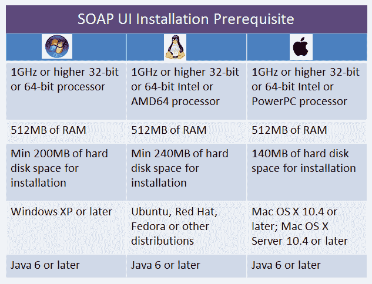

在本教程中，安装是在 Windows 环境中完成的。 对于其他操作系统，该过程保持相同。

这是安装过程的路线图

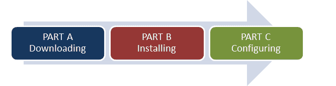

## A 部分：下载

*   导航至 [https://www.soapui.org/downloads/latest-release.html](https://www.soapui.org/downloads/latest-release.html)
*   向下滚动并根据您的操作系统选择下载器。 在本教程中，我们将在 64 位 Microsoft Windows 操作系统上安装 SOAP UI。

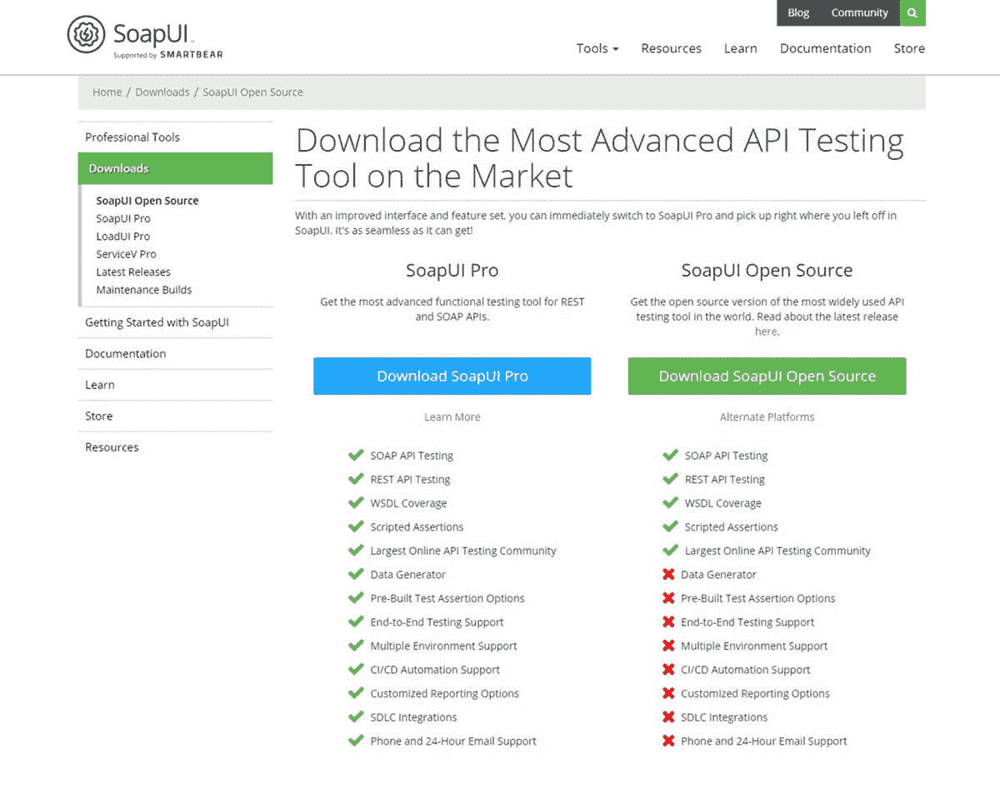

*   Upon clicking download, the user is automatically forwarded to [https://www.soapui.org/downloads/thank-you-for-downloading-soapui.html](https://www.soapui.org/downloads/thank-you-for-downloading-soapui.html) and the installer download starts automatically.

    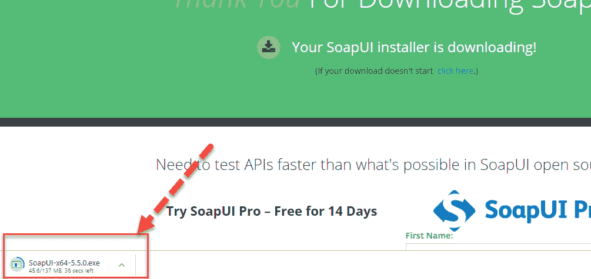

## B 部分：安装

**步骤 1：**下载后，如下所示以“管理员”身份执行文件

[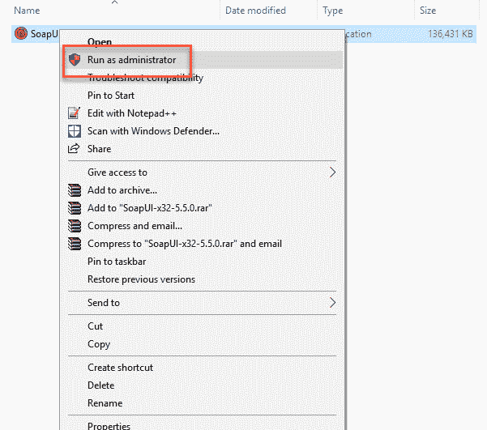 ](/images/1/090919_0452_SOAPUIDownl5.png) 

**步骤 2：**在设置向导中，单击“下一步”继续。

[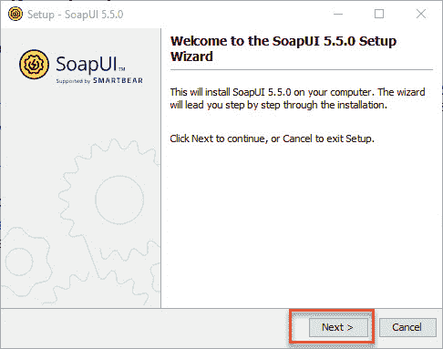 ](/images/1/090919_0452_SOAPUIDownl6.png) 

**步骤 3：**选择安装目录或将默认安装目录保持原样。

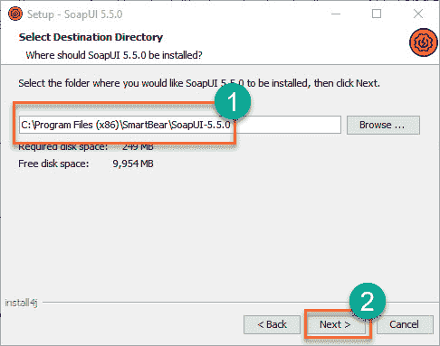

**步骤 4：**选择要安装的组件。

*   SOAP UI 默认情况下处于选中状态，并且不是用户可配置的。
*   源–启用，如果您想访问 SOAP-UI 的源代码。 我们尚未选择。
*   Hermes JS –如果应用程序需要 JMS 测试，则启用。
*   教程–如果要访问 SOAP-UI 教程，请启用。安装后。

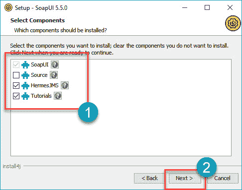

**步骤 5：**接受许可协议，然后单击“下一步”继续。

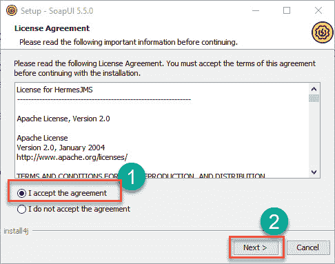

**步骤 6：**选择教程的文件夹位置，否则保留默认位置，然后单击“下一步”。

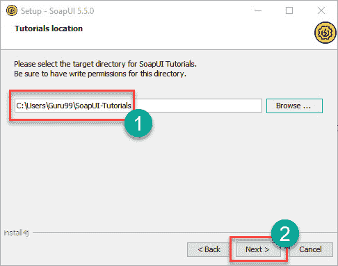

**步骤 7：**选择开始菜单文件夹位置，否则保留默认位置，然后单击“下一步”。

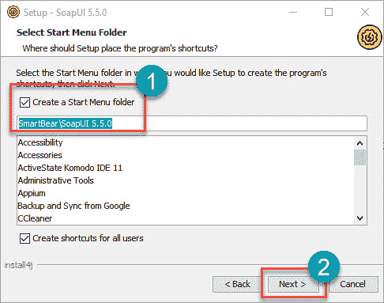

**步骤 8：**启用“创建桌面图标”复选框，然后单击“下一步”。

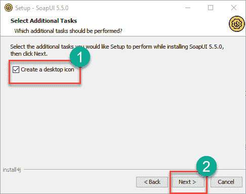

**步骤 9：**安装开始，完成后，向导显示以下状态。 点击“完成”。

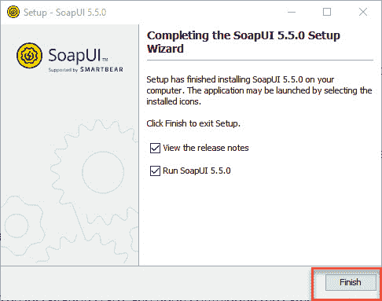

**步骤 10：**单击“完成”按钮后，将启动 SOAP UI。

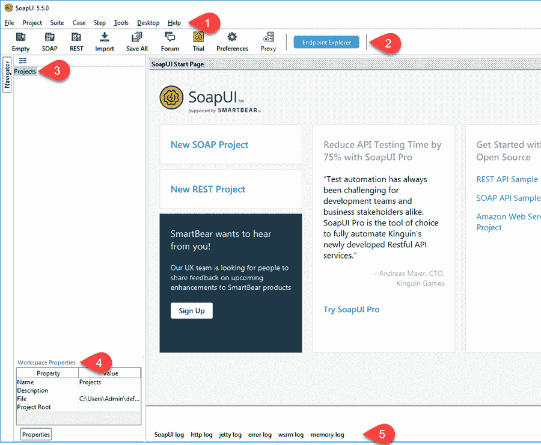

1.  菜单栏
2.  快捷工具栏
3.  项目导航区
4.  工作区属性
5.  日志区

## C 部分：配置

首先让我们了解 SOAP UI 中的项目结构。

*   SOAP UI 的第一步是创建一个工作区。 与工作空间关联的项目可以有多个。 用户可以创建多个工作空间。 在 SOAP UI Pro 版本中，我们可以无缝切换环境以将其映射到不同的端点。
*   对于每个项目，我们可以创建几个测试套件。
*   对于每个测试套件，可以附加几个测试用例。
*   对于每个测试用例，可以有几个与之关联的测试步骤。

下面是 SOAP-UI 中工作空间结构的图形表示。

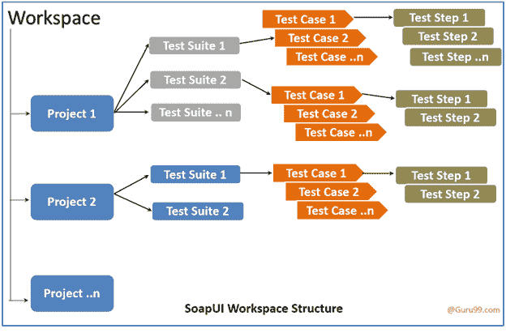

**步骤 1：**第一步是创建工作区。 创建一个工作区，如下所示。 从现在开始，我们将要创建的所有人工制品都包含在此工作空间中。

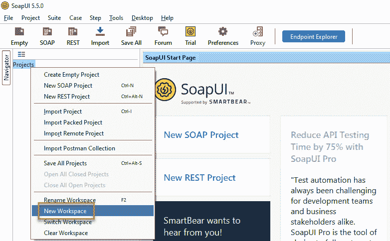

**步骤 2：**为工作区输入一个名称，然后单击“确定”。

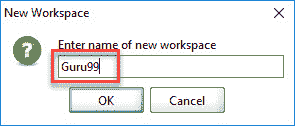

**步骤 3：**现在，用户必须选择必须保存此工作区的路径。

1.  选择必须保存工作空间的路径
2.  工作空间 XML 的名称，当用户将来要打开工作空间时必须找到它。
3.  点击“保存”。

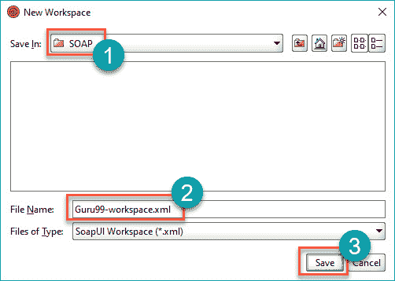

**步骤 4：**如下所示创建工作区。 我们还可以在“工作空间属性”选项卡下访问工作空间属性。

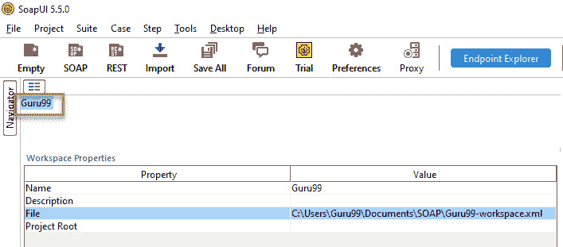

现在，我们已经在下载和安装后成功配置了 SOAP-UI，以便我们可以继续执行测试。

## 基本的 GUI 导航

**文件菜单：**

*   了解 SOAP-UI 中最常用的导航对于在实时项目上进行无缝导航非常重要。 首先让我们看一下文件菜单。

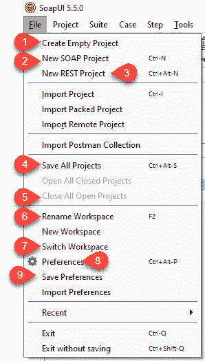

1.  “新 SOAP 项目”允许用户通过导入 SOAP 请求来创建项目。
2.  “新的 REST 项目”允许用户通过导入 REST 请求来创建项目。
3.  “导入项目”允许用户通过查找相应的 XML 来导入整个项目。
4.  “保存所有项目”允许用户单击保存所有打开的项目。
5.  “关闭所有打开的项目”关闭在该工作区中打开的所有项目。
6.  “重命名工作区”允许用户重命名先前创建的工作区。
7.  “切换工作区”允许用户在工作区之间切换。
8.  “首选项”允许用户自定义 SOAP UI。 我们将在下一节中处理它。
9.  “保存首选项”允许用户保存其自定义设置。 下次打开 SOAP UI 时，它将使用用户保存的首选项。

**文件> >首选项> > HTTP 设置：**

*   现在，让我们了解文件菜单中的“首选项”。 从“文件”菜单中单击“首选项”后，将打开以下对话框。
    *   我们将详细介绍最常用的“ HTTP 设置”。

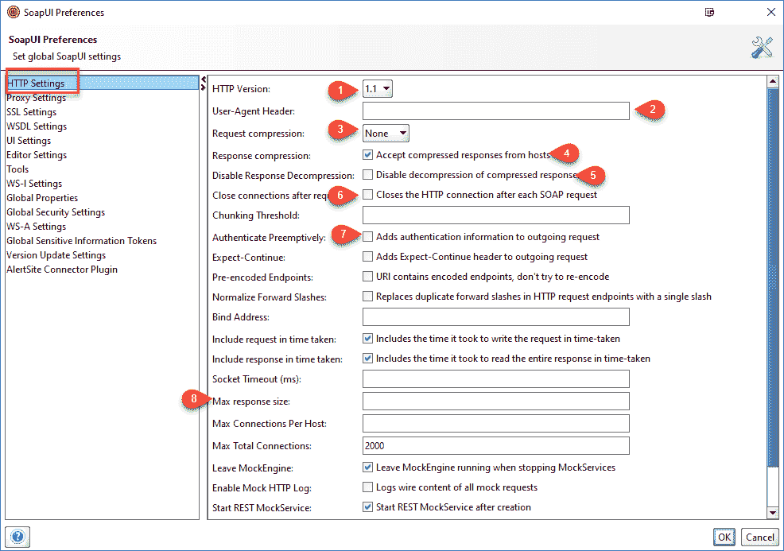

1.  表示用于请求和响应的 HTTP 版本。
2.  “用户代理标题”允许使用此选项预定义用户。 如果未定义，它将使用默认的 http 客户端标头。
3.  允许用户指定压缩方法。 它可以是 gzip 或 deflate 或 None。
4.  如果选中，则允许主机压缩响应。
5.  如果选中，则禁用压缩响应的解压缩。
6.  如果选中，则为每个 SOAP 请求关闭 HTTP 连接。
7.  如果选中，则允许用户为传出的请求指定身份验证信息。
8.  允许用户限制要从响应读取的最大字节数。 零对应于无限大小。

**文件> >首选项> > WSDL 设置：**

*   现在，我们将详细介绍最常用的“ WSDL 设置”。

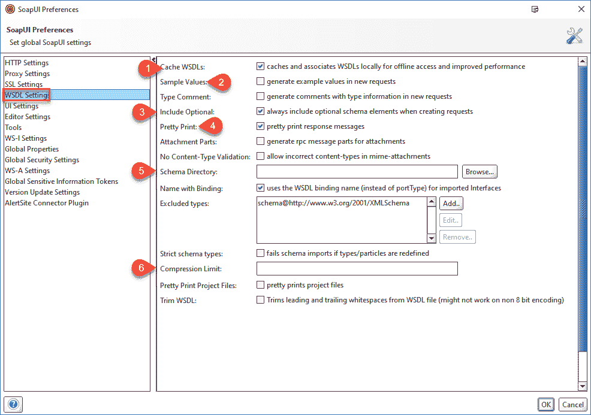

1.  缓存 WSDL 打开和关闭 WSDL 的缓存
2.  在请求中生成示例值
3.  允许用户始终在生成的请求中包括可选元素
4.  响应消息在响应编辑器中打印
5.  允许用户在验证 WSDL 请求时指定包含模式（.xsd）文件的目录。 更改此目录的内容后，SOAP UI 需要重新启动。
6.  为了节省空间，在 SoapUI 项目文件中要压缩的最小消息大小。

**文件> >首选项> > UI 设置：**

*   现在，我们将详细介绍最常用的“ UI 设置”。

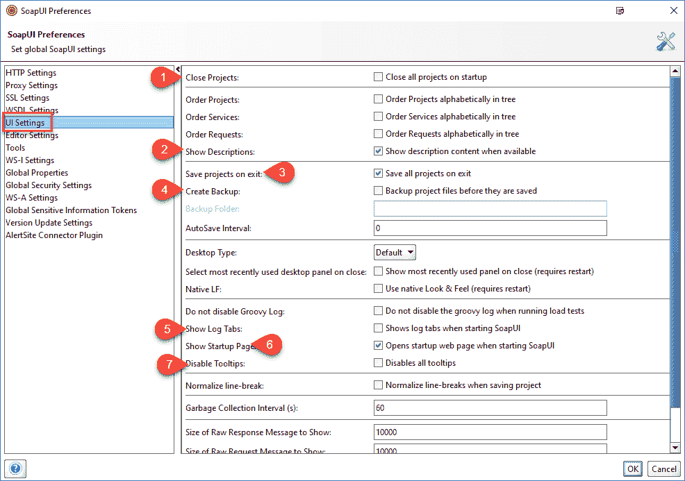

1.  在启动 SOAP UI 时关闭所有项目，以缩短启动时间并消耗更少的内存。
2.  在可用时显示说明。
3.  退出 SOAP UI 时自动保存所有项目。
4.  保存之前，SOAP UI 将创建项目的备份。 如果启用，则必须提到备份文件夹。
5.  启动 SOAP UI 时显示并展开日志选项卡。
6.  启动 SOAP UI 时显示“启动页面”对话框。
7.  禁用工具提示后，当用户在导航时将鼠标悬停在选项/按钮上时，将禁用工具提示。

救命：

*   让我们看一下重要的“帮助”菜单选项。

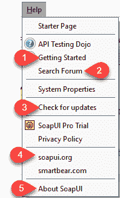

1.  显示在线帮助的主页，网址为 [www.soapui.org](https://www.soapui.org/)
2.  允许注册用户在论坛中发布问题并从社区获得在线帮助。
3.  检查最近的更新并安装（如果有）。
4.  允许用户导航到[的主页 www.soapui.org](https://www.soapui.org/)
5.  显示 SOAP UI 的内部版本信息。

即将发布的教程不仅使您了解如何创建测试套件，测试用例和测试步骤，而且还使您可以测试 SOAP 请求以及如何验证它们。