# SoapUI 中的断言：完整教程

> 原文： [https://www.guru99.com/assertions-soapui-complete-tutorial.html](https://www.guru99.com/assertions-soapui-complete-tutorial.html)

### 什么是断言？

断言是指肯定或陈述某事的行为。 也可以将其解释为检查点或验证点。

将请求发送到 Web 服务器后，就会收到响应。 我们需要验证响应是否包含我们期望的数据。 为了验证响应，我们需要使用断言。

### 断言类型

声明响应的方式多种多样。 但是，在验证响应时，我们将重点介绍常用的断言类型。 以下是 SoapUI 的开源版本中可用的那些。

1.  物业内容
2.  合规状态标准
3.  脚本
4.  生菜
5.  JMS
6.  安全

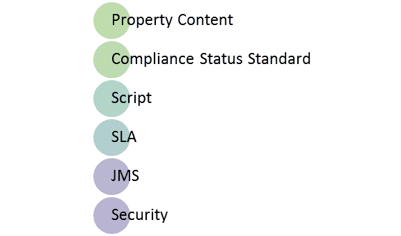

除了上面列出的以外，PRO 版本还具有内置的 JDBC 断言，通过该断言我们可以断言 Web 服务是否正确更新了数据库。

在本教程中，我们将学习

*   [包含断言](#1)
*   [不包含断言](#2)
*   [X 路径匹配声明。](#3)
*   [脚本声明](#5)
*   [X 查询匹配断言](#4)

## 包含断言

搜索指定字符串的存在。 它还支持正则表达式。

我们将继续上一个教程中的相同示例。

**步骤 1：**默认情况下，没有断言。

*   断言数显示在“断言”选项卡中。
*   要添加新的断言，请单击“添加新断言”按钮。

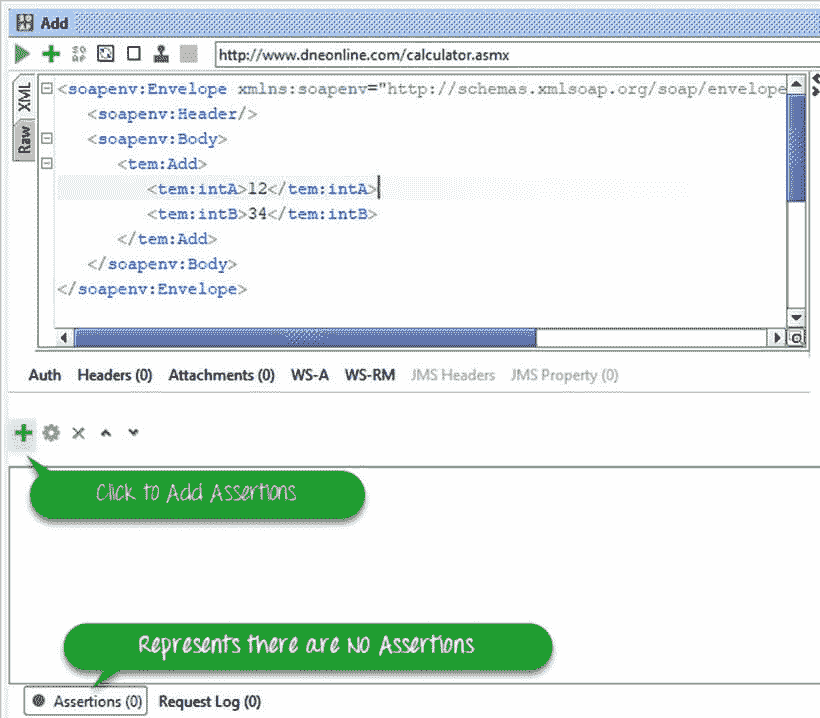

**步骤 2：**现在，

1.  选择断言类别。
2.  选择断言类型。
3.  点击“添加”

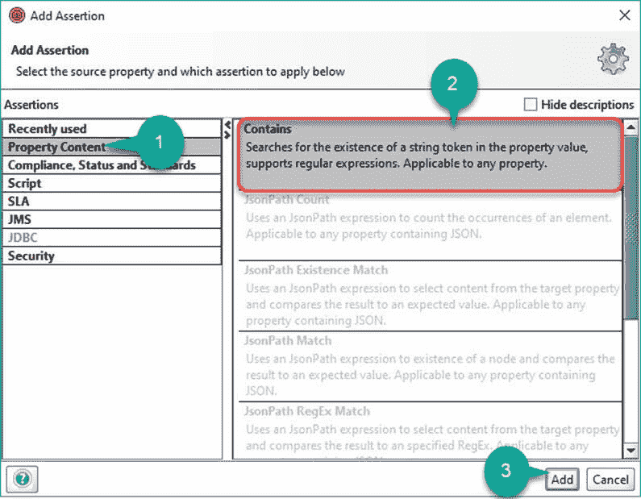

**步骤 3：**让我们验证响应中是否存在字符串“ 46”。 点击“确定”

注意：我们也可以忽略大小写并添加正则表达式。

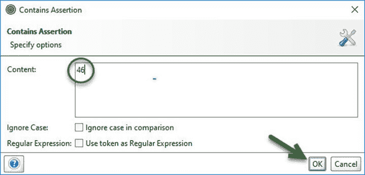

**步骤 4：**添加后，立即执行断言并显示 VALID 或 INVALID。

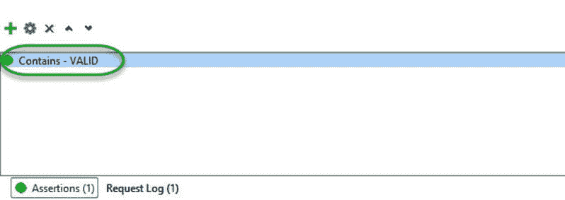

**步骤 5：**现在，我们将“包含声明”的内容更改为“ 47”，然后看看会发生什么。

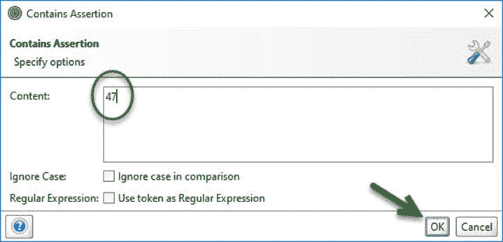

**步骤 6：**执行断言，并将结果扔给用户。 由于我们在响应中没有字符串“ 47”，因此断言失败。


## 不包含断言

搜索指定字符串的不存在。 它还支持正则表达式。

**步骤 1：**现在，点击“添加新的断言”按钮后，

1.  选择断言类别。
2.  选择断言类型–在这种情况下，“不包含”
3.  点击“添加”

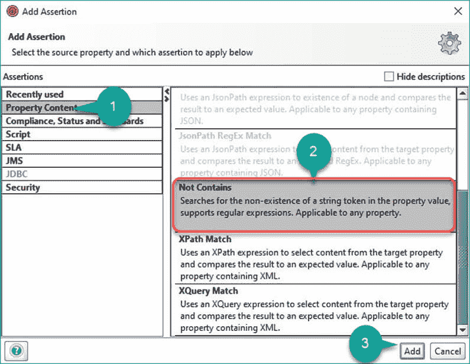

**步骤 2：**让我们验证响应中是否存在字符串'intA'。 输入字符串“ FromCurrency”，然后单击“确定”

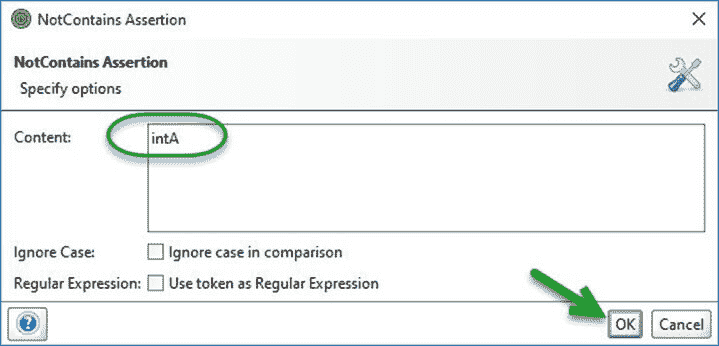

**步骤 3：**一旦添加了断言，它就会执行并显示结果。 到目前为止，我们已经添加了两个断言，因此两个断言都将被执行并显示结果。

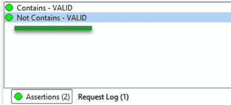

**步骤 4：**现在让我们更改“不包含断言”的内容，然后看看会发生什么。 我们将检查字符串“ AddResult”是否不存在。

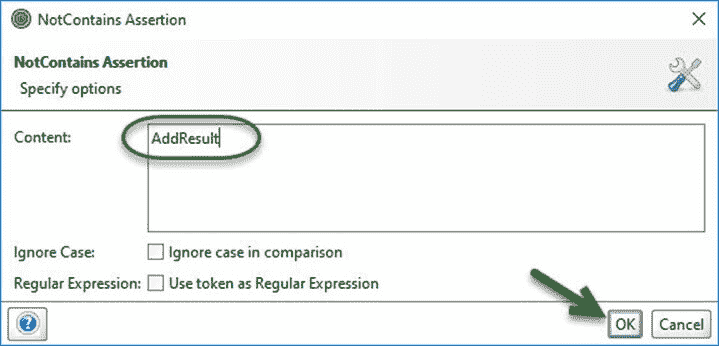

**步骤 5：**字符串'AddResult'实际上存在于响应中，因此'NOT Contains'断言将失败，如下所示。

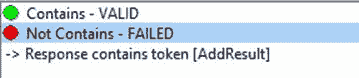

## XPATH 匹配声明

使用 [XPath](https://www.guru99.com/xpath-selenium.html) 表达式选择目标节点及其值。 XPath 是一种 XML 查询语言，用于从 XML 文档中选择节点。

**步骤 1：**现在，点击“添加新断言”按钮后，

1.  选择断言类别。
2.  选择断言类型–在这种情况下为“ XPath Match”
3.  点击“添加”

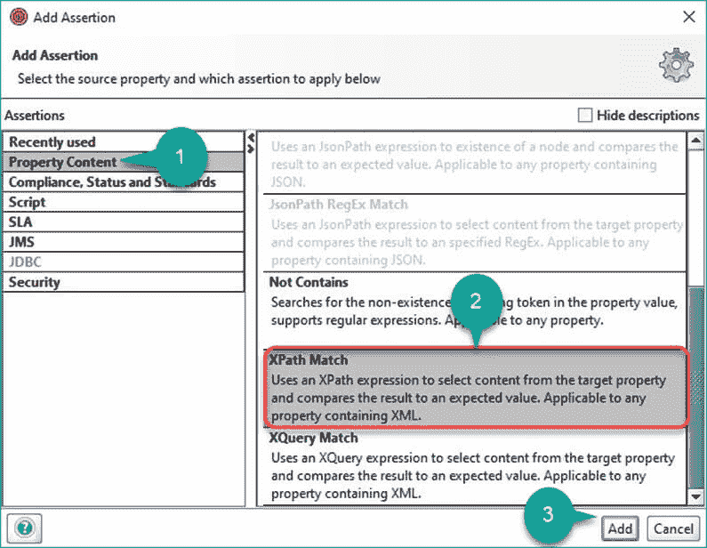

**步骤 2：**添加 XPath 窗口打开。

在添加 XPath 之前，我们需要声明 NameSpace。 XML 名称空间是由统一资源标识符（URI）引用标识的名称的集合，这些名称在 XML 文档中用作元素和属性名称。 SOAP UI XPath 断言中使用相同的内容。

对于声明 XML 命名空间，我们只需要单击“声明”按钮即可为我们完成工作，否则我们也可以自己手动声明一个命名空间。

声明名称空间后，我们需要使用创建的名称空间来引用 XPath。

单击“声明”按钮后，将弹出两个名称空间，因为我们有两个 URI。 其中一个是架构 URL，另一个是实际的 Web 服务 URL。 在引用 XPath 时，我们需要使用 Web 服务所在的实际名称空间，而不是架构名称空间。

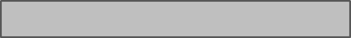

声明名称空间 soap ='http：//schemas.xmlsoap.org/soap/envelope/';

声明名称空间 ns1 ='http：//tempuri.org/';

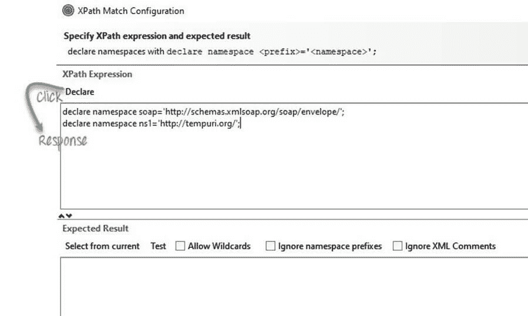

**步骤 3：**现在，我们需要输入需要验证的 XML 节点的 XPath。

// ns1：AddResult 为我们提供< AddResult > & < / AddResult >和 ns1 之间封闭的节点的值，该名称对应于指向'http：// tempuri'的声明名称空间。 组织/'

输入 XML 后，我们需要单击“从当前选择”，以便从当前响应中获取值以进行比较。

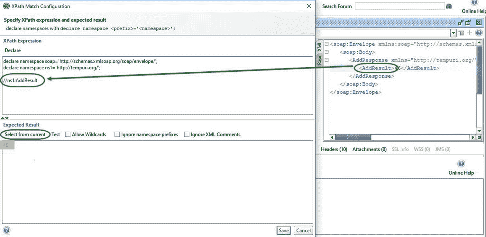

步骤 4：到目前为止，

1.  声明了名称空间后，我们进入了需要验证的 XML 节点的 XPath。
2.  我们需要单击“从当前选择”以将当前值作为期望值。
3.  当前值显示给用户，我们可以根据需要进行修改。
4.  点击“保存”。

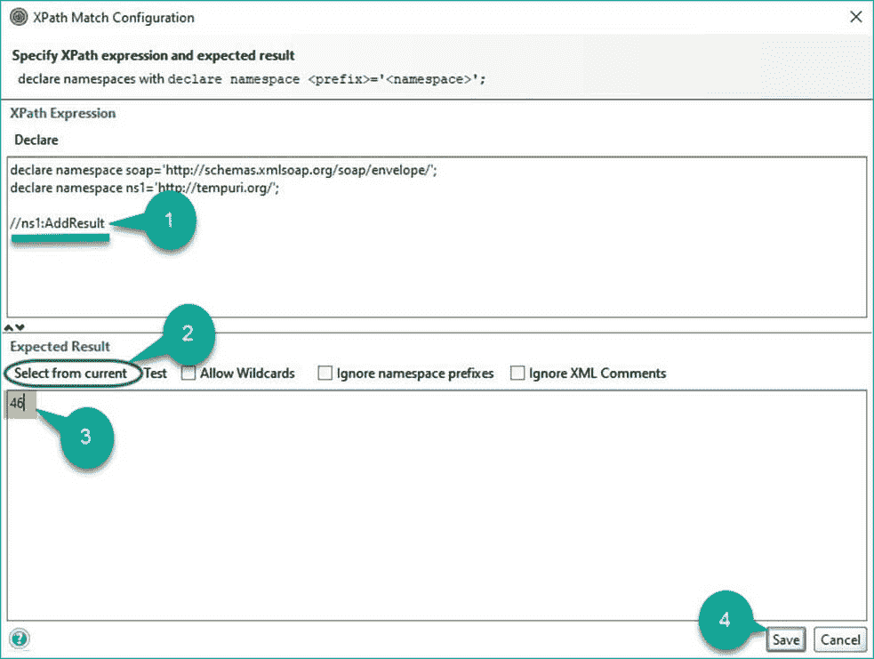

**步骤 5：**将显示添加的断言，如下所示。

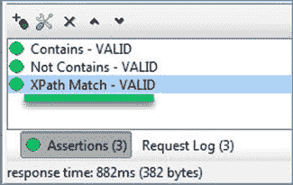

## 脚本断言

这种断言技术是使用最广泛的一种技术，因为它很难管理和维护数百个断言。

SOAP UI 使用 Groovy 脚本或 [JavaScript](https://www.guru99.com/interactive-javascript-tutorials.html) 来对断言进行脚本编写。 采用脚本技术来开发用于测试 SOAP 的框架。 脚本断言在以下情况下使用。

脚本允许用户分别使用设置和拆卸方法在执行 TestCase 之前和之后执行一些操作。 建立是在执行特定方法之前执行的过程（例如，对象创建和初始化），而拆卸是在执行特定方法之后执行的过程（例如：销毁对象并清理）。 此功能在其他断言类型中不可用，只能通过编码来完成。

它允许用户执行打开/关闭项目，初始化或清理项目相关设置以及使用环境变量的工作，这在脚本编写过程中非常有用。

它有助于我们声明动态响应内容。

脚本断言用于创建 SOAP UI 未预定义的用户定义的断言。

对于演示脚本断言，我们将使用计算器 WSDL，即我们先前创建的测试用例“添加”。

**步骤 1：**添加 groovy 脚本的步骤与其他断言的步骤相同，除了断言不是预定义的断言。 而是由用户定义的断言提供了比内置的更大的灵活性。

选择必须对其添加断言的“测试”步骤。

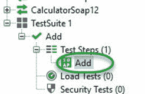

单击“添加声明”按钮，如下所示。

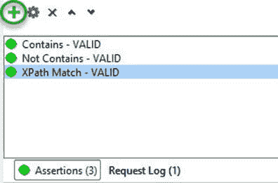

**步骤 2：**现在选择“断言”类别。

1.  在这种情况下，它是脚本。
2.  选择“脚本声明”，并且没有与之关联的子类型。
3.  点击“添加”。

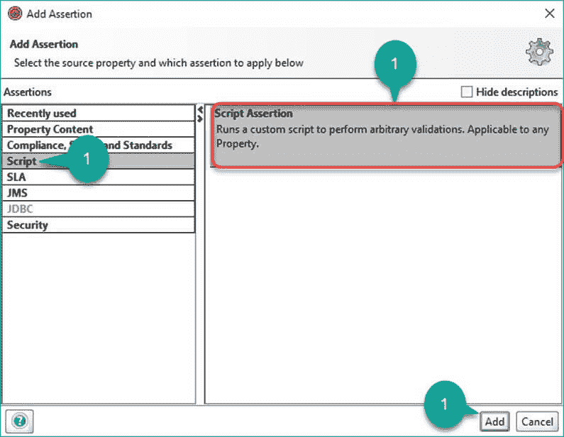

**步骤 2：**将打开“脚本对话框”，用户可以在其中编写用户定义的脚本来验证响应 XML。

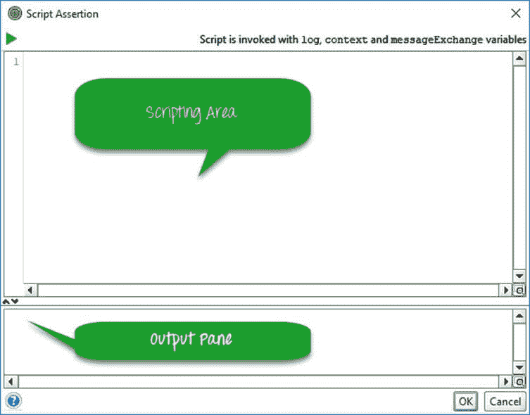

**第 3 步：**现在，让我们编写一个时髦的脚本来验证转换率。 下面附有脚本，其中嵌入了注释。 建议在尝试编写自己的脚本之前，先对 [Java](https://www.guru99.com/java-tutorial.html) 脚本或 Groovy 脚本有所了解。

```
//Define Groovy Utils and holder for validating the XML reponse content
def groovyUtils = new com.eviware.soapui.support.GroovyUtils(context)
def holder = groovyUtils.getXmlHolder(messageExchange.responseContent)

//Define the NameSpace
holder.namespaces["ns1"] = "http://tempuri.org/"

//Get the Value of the Node 'AddResult' and assign to a variable
def addResult = holder.getNodeValue("//ns1:AddResult")

//print the value of the result in the Output panel
log.info "The result value for integers is " + addResult

//Comparing the value to print 'Pass' or 'Fail'
if(addResult=="46")
{ log.info "Pass" }
else
{ log.info "fail"}

```

1.  单击“执行”按钮触发执行。
2.  脚本的输出显示在“输出”窗格中。 它同时打印了转换值和最终结果（通过或失败）
3.  显示“脚本声明已通过”的信息。 单击确定。

注意：只要脚本在语法上正确无误，最终的信息弹出窗口将始终显示消息“脚本声明已通过”。 它与脚本中的断言无关。

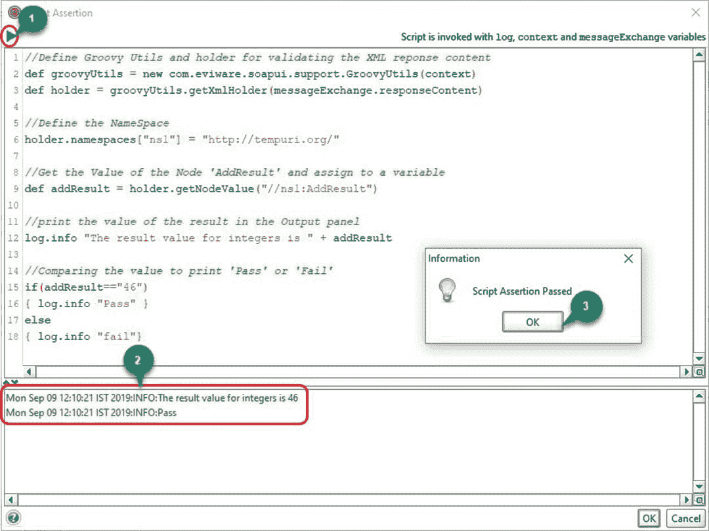

点击确定

**步骤 4：**现在，“断言”选项卡显示了我们为此测试套件添加的所有断言以及“状态”对每个断言的状态。

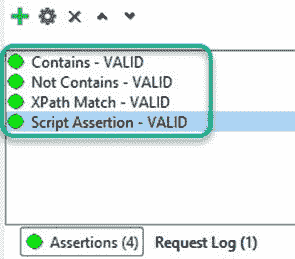

**步骤 5：**现在

1.  从导航器树中选择测试套件
2.  点击“运行”按钮
3.  结果将显示整个测试套件。

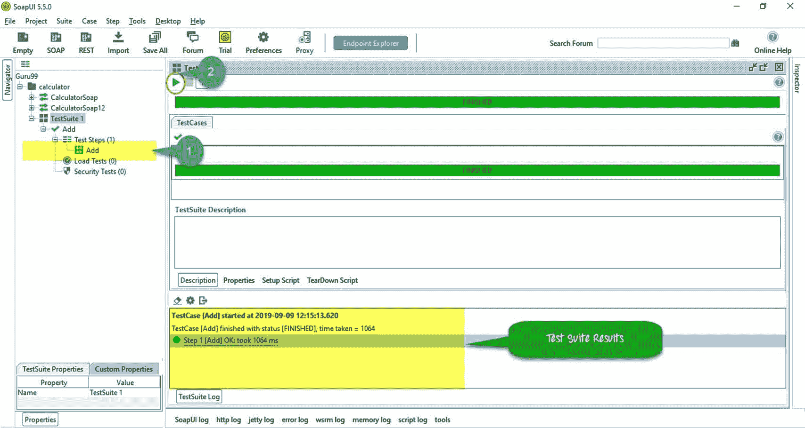

## Xquery 匹配声明

它使用 Xquery 表达式从 target 属性中选择内容。 为了更好地理解 XQuery，我们需要更大的响应 XML，让我们导入另一个 WSDL，如下所示： [http://www.webservicex.net/medicareSupplier.asmx?WSDL](http://www.webservicex.net/medicareSupplier.asmx?WSDL)

**步骤 1：**在现有项目上单击鼠标右键，然后选择“添加 WSDL”。

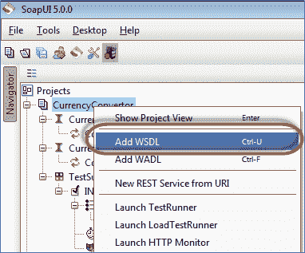

**步骤 2：**在现有项目上单击鼠标右键，然后选择“添加 WSDL”。 将其他选项保留为默认选项，然后单击“确定”按钮。

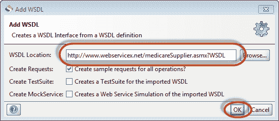

**步骤 3：**所有操作如下所示。

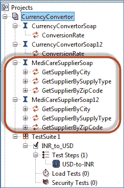

**步骤 4：**现在，让我们在为[测试](/software-testing.html)货币转换器创建的同一测试套件中添加[测试用例](/test-case.html)。

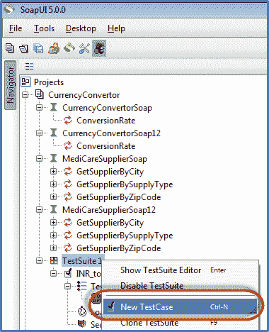

**步骤 5：**输入测试用例的名称，然后单击“确定”按钮

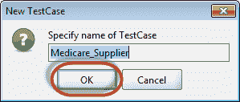

**步骤 6：**如下所示创建测试用例。

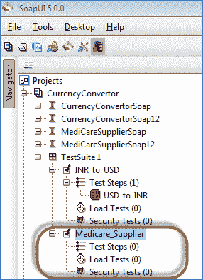

**步骤 7：**添加类型为“ Soap Test Request”的新测试步骤，如下所示。

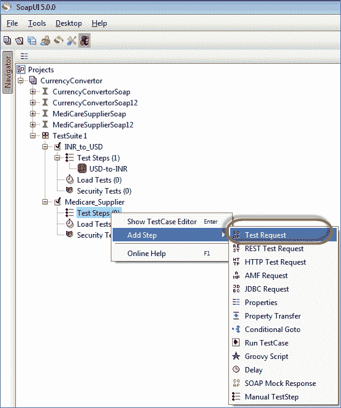

**步骤 8：**输入测试步骤的名称。 让我们说– Supplier_by_City 这将更有意义单击“确定”。

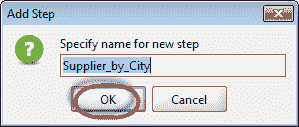

**步骤 9：**选择我们要验证的操作。 在这种情况下，它是“ MedicareSupplierSoap-> GetSupplierByCity”。 点击“确定”。

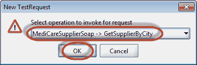

**步骤 10：**输入测试用例的名称，然后单击“确定”。

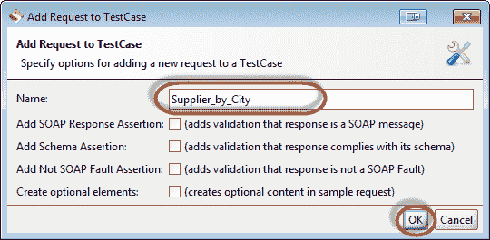

**步骤 11：**将显示请求 XML 大纲，如下所示。

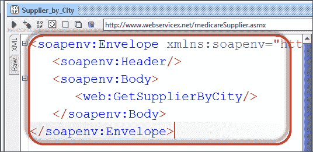

**步骤 12：**现在，让我们找到“纽约”市的所有供应商信息。

这样做，将以下行添加到您的代码。

< GetSupplierByCity xmlns =“ http://www.webservicex.net/” >

<城市>纽约< /城市>

< / GetSupplierByCity >

下列网址中的 WSDL- [http://www.webservicex.net/medicareSupplier.asmx?op=GetSupplierByCity](http://www.webservicex.net/medicareSupplier.asmx?op=GetSupplierByCity)

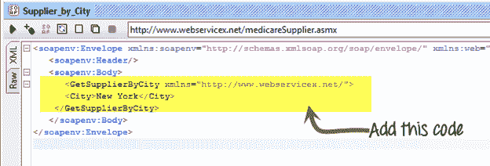

**步骤 13：**执行测试后，我们收到以下响应

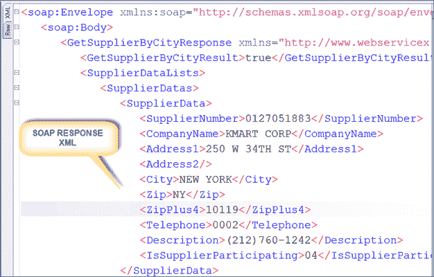

**步骤 14：**假设我们需要验证所有供应商编号。 我们无法使用 XPath 断言，因为我们需要拥有数百个 XPath 断言。 因此，在这种情况下不可避免地使用 XQuery。

XQuery 断言可以帮助我们验证一组本质上是重复的 XML 响应。

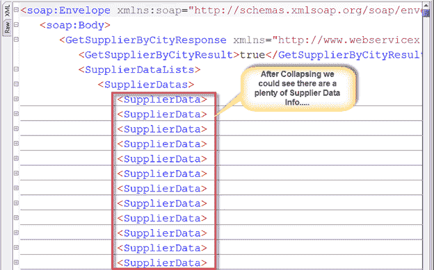

**步骤 15：**现在单击“添加断言”，

1.  在这种情况下，选择“断言类别”-属性内容。
2.  选择断言类型作为“ XQuery 断言”
3.  点击“添加”。

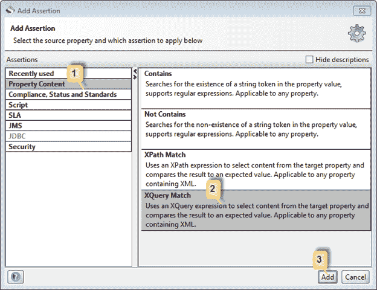

**步骤 16：**与 XPath 断言类似，我们需要声明名称空间。

1.  Click 'Declare' Button to automatically allow SOAP UI to declare the namespace. Upon clicking on declare button a 'POP up' with the message 'declare namespace from schema instead' will be displayed to the user. Click 'Yes' to proceed as shown below.

    **注意：**按下“声明按钮”后，您可能最终得到不同的 URL 作为名称空间声明，但是，实际的 Web 服务位置名称空间才是编码时要考虑的地方。

    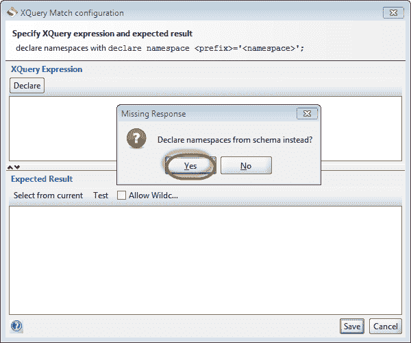

2.  为了检索所有供应商编号，我们需要编写一个 XPath 查询，并将其放置在< SupplierNumber >和< / SupplierNumber >标签中。
3.  单击“从当前选择”，将从当前响应中执行。
4.  单击“从当前选择”后，将列出所有供应商编号。
5.  点击“保存”。

```
// Namespace declaration
declare namespace soap='http://schemas.xmlsoap.org/soap/envelope/';
declare namespace ns1='http://www.webservicex.net/';
declare namespace x = '';

// Placing the result in Myresult Tags
 {
// Iterating through all the supplier number 
for $x in //ns1:GetSupplierByCityResponse/ns1:SupplierDataLists/ns1:SupplierDatas/ns1:SupplierData

//Return all the Supplier number within ‘SupplierNumber’ Tags.
return <suppliernumber>{data($x/ns1:SupplierNumber)}</suppliernumber>
} 

```

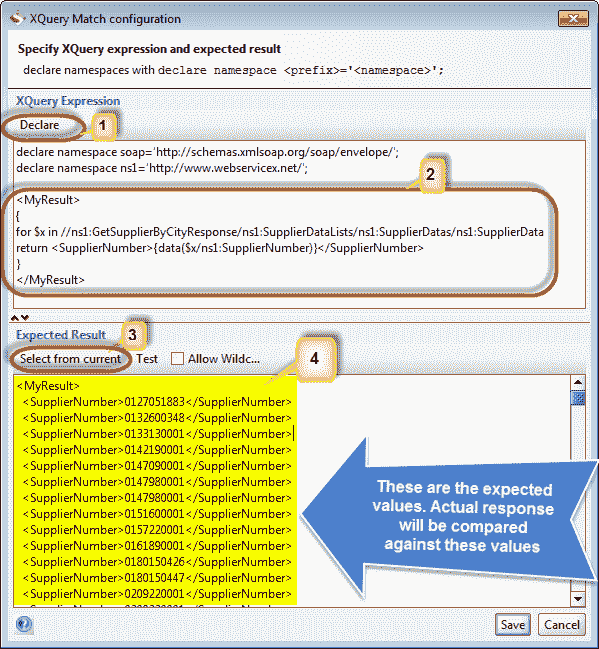

**步骤 17：**执行 XQuery 断言，并在“断言”面板中显示最终结果，如下所示。 现在，我们已经成功添加了 Xquery 断言，通过该断言我们已经验证了所有供应商编号信息。 每次将请求发送到 Web 服务器时，都会将其与实际值进行比较。

注意：不会显示实际值。 如果所有实际值均与期望值相同，则显示“ VALID”（有效），否则将显示“ Failed”（失败）。

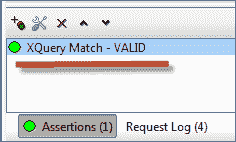

## 何时使用内置断言？

*   当响应短时，可以使用那些内置断言之一对其进行验证。
*   如果从 Web 服务器发送的响应本质上始终是静态的，我们也可以使用内置声明。 如果它是动态的，我们将无法使用内置断言来断言。
*   当不可避免地使用诸如超时断言和安全断言之类的内置断言时。
*   对于无需重复测试的一次性用法，内置断言非常有效。

## 断言选项

可以通过下面突出显示的控制面板来最好地控制创建的断言。


创建的断言允许测试人员从断言工具箱中配置以下内容。

<colgroup><col style="width:63px"><col style="width:527px"></colgroup>
| 选项 | 描述 |
|  | 选定的断言将顺序上移。 |
| 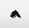 | 选定的断言将顺序向下移动。 |
|  | 删除选定的断言 |
|  | 重新配置/编辑选定的断言。 |

*   以下是 SOAP UI 的 PRO 版本独有的功能。 PRO 版本还可以帮助我们对断言进行分组，以便我们可以在创建的断言中再添加一层验证。

AND：所有断言均被评估为 VALID 断言，这将导致 PASSED 组条件。或：组中至少一个断言必须为 VALID 才能断言组 PASSED 条件。

*   专业版还允许[断言](https://www.soapui.org/docs/functional-testing/validating-messages/getting-started-with-assertions.html)的克隆：该选项使测试人员可以将断言复制到相同或不同项目中的不同测试步骤。
*   禁用/启用断言：此选项允许禁用或启用任何分组或未分组的断言。 如果断言被禁用，则其将变灰，并且在执行测试用例时，将不会执行禁用的断言。
*   取消组合断言：如果测试人员决定取消组合的断言，则可以将其取消组合。

## 各种断言类型中可用的方法的完整列表

<colgroup><col style="width:178px"><col style="width:464px"></colgroup>
| **声明机制** | **说明** |
| **内容** |
| 包含 | 搜索指定字符串的存在。 它还支持正则表达式。 |
| 不包含 | 搜索指定字符串的不存在。 它还支持正则表达式。 |
| XPath 匹配 | 使用 XPath 表达式选择目标节点及其值。 |
| XQuery 匹配 | 使用 Xquery 表达式从 target 属性中选择内容。 |
| **合规性，状态，标准** |
| HTTP 下载所有资源 | 下载后验证 HTML 文档，它对包含 HTML 的任何属性都适用。 |
| 无效的 HTTP 状态代码 | 验证 HTML 响应是否包含不在已定义代码列表中的状态代码。 |
| 不是 SOAP 错误 | 验证最后收到的消息是否不是 SOAP Fault。 很明显，它仅适用于 SOAP 测试步骤。 |
| 架构合规 | 验证最后收到的消息是否符合 WSDL 或 WADL 标准架构定义。 适用于 SOAP 和 REST 测试步骤。 |
| SOAP 故障 | 验证最后收到的消息是否为 SOAP 错误。 它是“ NOT SOAP”故障断言的反义词。 |
| SOAP 响应 | 验证最后收到的响应是否是有效的 SOAP 响应，并且仅对 SOAP 测试请求步骤有效。 |
| 有效的 HTTP 状态代码 | 验证 HTML 响应是否包含已定义代码列表中的状态代码。 与“无效的 HTTP 状态代码”声明相反。 |
| WS-寻址请求 | 验证最后收到的请求是否包含适当的 WS-Addressing 标头。 |
| WS 寻址响应 | 验证最后收到的响应是否包含适当的 WS-Addressing 标头。 |
| WS-安全状态 | 验证最后收到的消息是否包含有效的 WS-Security 标头，并且仅对 SOAP 请求有效。 |
| **脚本** |
| 脚本断言 | 允许用户执行自定义脚本以执行用户定义的验证。 |
| **SLA** |
| 响应 SLA | 验证最后收到的响应的响应时间是否在定义的限制内。 |
| **JMS** |
| JMS 状态 | 验证测试步骤的 JMS 请求是否已成功执行，并且对于具有 JMS 端点的测试步骤而言是否成立。 |
| JMS 超时 | 验证测试步骤的 JMS 响应是否花费的时间不超过指定的持续时间。 |
| **安全性** |
| 敏感信息公开 | 验证响应消息是否未公开有关目标系统的敏感信息。 我们可以将此断言用于 REST，SOAP 和 HTTP 测试步骤。 |

[下载包含以上断言的 SOAPUI 项目](https://drive.google.com/uc?export=download&id=1uOkouoiN8y_FZNGTQthE7X5yVTzxz2is)

### 常见错误和故障排除

使用正确的名称空间。 名称空间应该是 Web 服务所在的 URL。

如果在开发脚本断言时抛出错误，请使用'log.info'打印变量内容

如果没有所需的输出，请验证请求中是否传递了有效的输入。

例如，在货币转换器中，如果您将'intA'输入为非整数的'x'，则输出将引发错误代码为'SOAP-Client'，这意味着问题出在从 客户端。

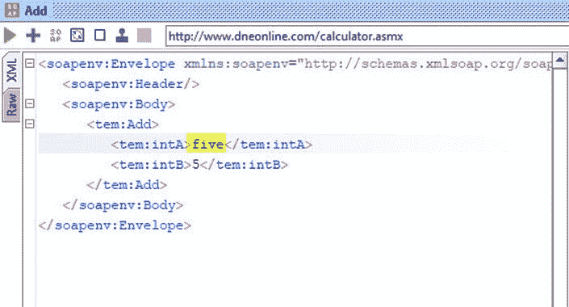


确保在使用 XPATH 和 XQuery 断言时使用正确的语法。 使用上述断言时，请勿使用 dot（。）代替冒号（:)。 语法是// namespace：Tagname 而不是//namespace.tagname。 这样，即使标签名称正确，您也可能会收到一条消息“当前响应中没有匹配项”。

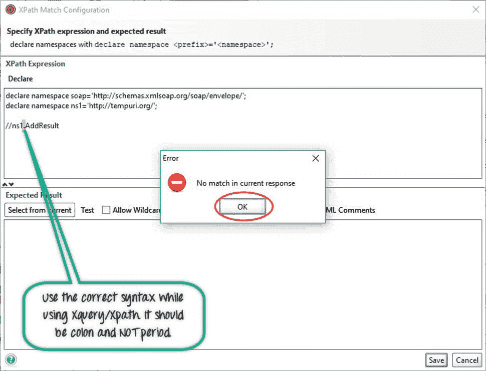