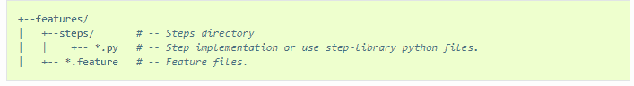
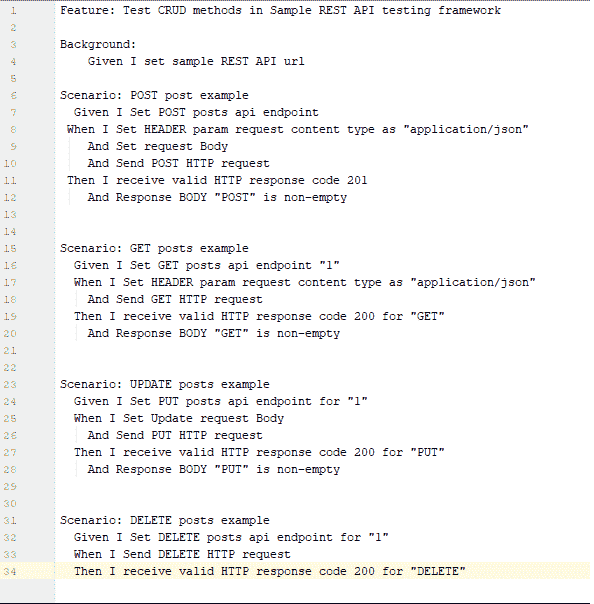
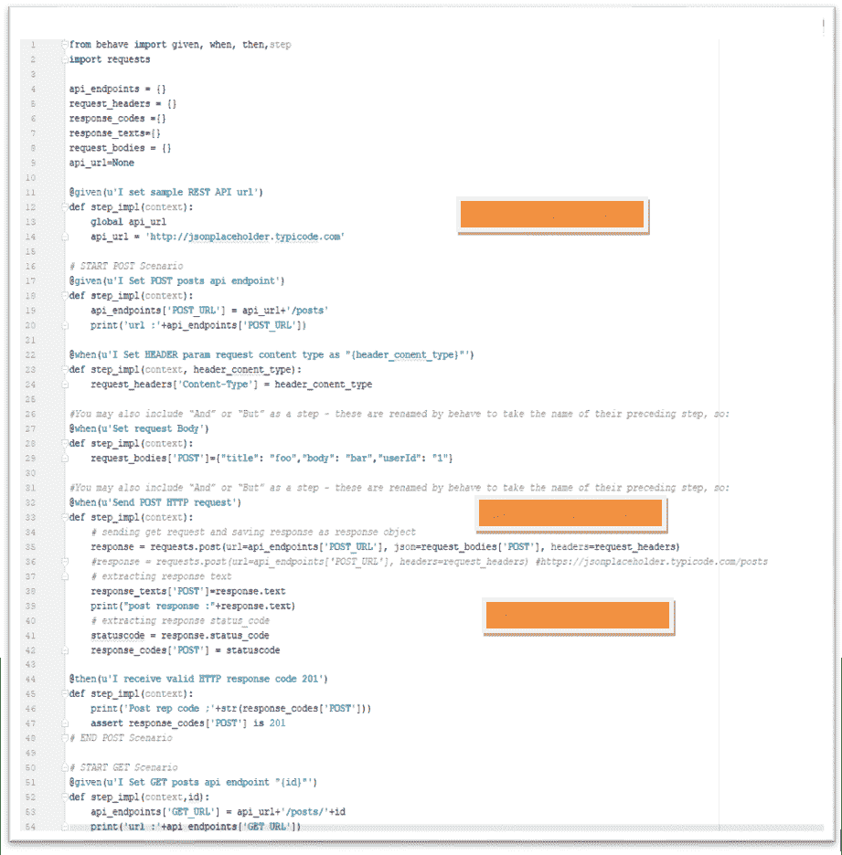
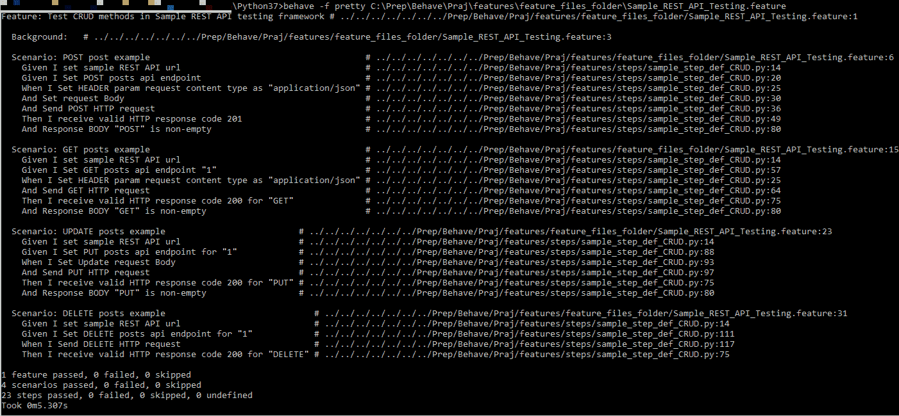
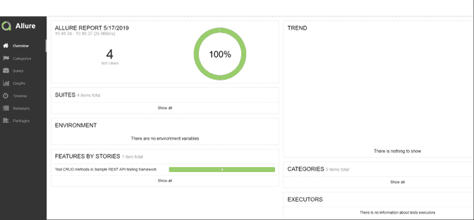
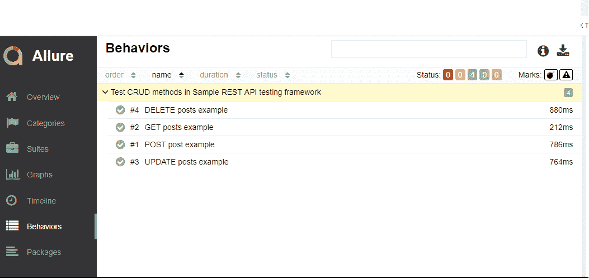

# 行为驱动开发（BDD）通过行为测试 REST API

> 原文： [https://www.guru99.com/bdd-testing-rest-api-behave.html](https://www.guru99.com/bdd-testing-rest-api-behave.html)

## 什么是 BDD 测试？

**BDD（行为驱动的开发）测试**是一种敏捷软件开发技术，是 TDD 的扩展，即测试驱动开发。 在 BDD 中，测试用例以自然语言编写，即使非程序员也可以阅读。

在本 BDD 教程中，我们将看到使用 Behave 和 Python 对 REST API 进行 BDD 测试

*   [BDD 测试如何工作？](#2)
*   [什么是 REST API 测试？](#3)
*   [行为是什么？](#4)
*   [在 Windows 上设置行为测试框架：](#5)
*   [POST 场景示例：](#6)
*   [步骤实施](#7)
*   [运行测试：](#8)
*   [报告](#9)

## BDD 测试如何工作？

考虑您被分配在网上银行应用程序中创建资金转账模块。

有多种测试方法

1.  如果来源帐户中有足够的余额，则应进行资金转帐
2.  如果目的地 A / C 详细信息正确，则应进行资金转帐
3.  如果用户输入的交易密码/ rsa 代码/安全认证正确，则应进行资金转帐
4.  即使是银行假期也应进行转帐
5.  资金转移应在帐户持有人设定的未来某个日期进行

[测试场景](/test-scenario.html)变得更加复杂和复杂，因为我们考虑了其他功能，例如在 Y 天/月的间隔内转移金额 X，当总额达到 Z 时停止计划转移，依此类推

开发人员的一般趋势是在以后开发功能并编写测试代码。 如上述案例所示，[测试用例](/test-case.html)的开发非常复杂，开发人员将推迟[测试](/software-testing.html)直到发布，这时他将进行快速但无效的测试。

为了克服此问题（行为驱动开发），设想了 BDD。 它使开发人员的整个测试过程变得容易

在 BDD 中，无论编写什么内容，都必须进入 ***给定时间*** 步骤。 让我们考虑上面 BDD 中的相同示例

```
Given that a fund transfer module in net banking application has been developed
And I am accessing it with proper authentication
```

```
WhenI shall transfer with enough balance in my source account
Or I shall transfer on a Bank Holiday
Or I shall transfer on a future date
And destination a/c details are correct
And transaction password/rsa code / security authentication for the transaction is correct
And press or click send button
```

```
Then amount must be transferred
And the event will be logged in log file
```

写，读和理解不容易吗？ 它涵盖了资金转移模块的所有可能的测试用例，并且可以轻松修改以容纳更多的用例。 此外，它更像是为资金转移模块编写文档。

## 什么是 REST API 测试？

如今，由于 REST 已成为构建 API 的一种流行样式，因此自动化 REST API 测试用例和 UI 测试用例变得同等重要。 因此，基本上，这些 REST API 测试涉及分别使用 POST，GET，PUT 和 DELETE 方法测试 CRUD（创建-读取-更新-删除）操作。

## 行为是什么？

行为是流行的 Python BDD 测试框架之一。

让我们看看行为如何发挥作用：

功能文件由您的业务分析师/赞助商/与其中包含您的行为方案的任何人一起编写。 它具有自然语言格式，用于描述特征或特征的一部分以及预期结果的代表性示例

这些场景步骤与用 Python 编写的步骤实现映射

并且可选地，有一些环境控制（在步骤，场景，功能或整个射击比赛之前和之后运行的代码）。

让我们开始使用 Behave 设置自动化测试框架：

## 在 Windows 上设置行为测试框架：

### 安装：

*   从 [https://www.python.org/](https://www.python.org/) 下载并安装 Python 3
*   在命令提示符处执行以下命令以安装行为
*   点安装行为
*   IDE：我使用了 PyCharm 社区版 [https://www.jetbrains.com/pycharm/download](https://www.jetbrains.com/pycharm/download/#section=windows)

### 项目设置：

*   创建一个新项目
*   创建以下目录结构：



### 功能文件：

因此，让我们构建功能文件 **Sample_REST_API_Testing.feature** ，该功能文件具有对“ posts”服务执行 CRUD 操作的功能。

在我们的示例中，我使用了 [http://jsonplaceholder.typicode.com/](http://jsonplaceholder.typicode.com) 发布了示例 REST 服务。

## POST 场景示例：

```
Scenario: POST post example ->Here we are considering creating new post item using 'posts' service
Given: I set post posts API endpoint ->This is prerequisite for the test which is setting URL of posts service
When: I set HEADER param request content type as "application/json."
And set request body
And send POST HTTP request ->This is actual test step of sending a post request
Then: Then I receive valid HTPP response code 201 
And Response body "POST" is non-empty-> This is verification of response body	

```

同样，您可以按以下方式编写其余方案：



**Sample_REST_API_Testing.feature**

```
Feature: Test CRUD methods in Sample REST API testing framework

Background:
	Given I set sample REST API url

Scenario: POST post example
  Given I Set POST posts api endpoint
 When I Set HEADER param request content type as "application/json." 
    And Set request Body
 And Send a POST HTTP request 
 Then I receive valid HTTP response code 201
    And Response BODY "POST" is non-empty. 

Scenario: GET posts example
  Given I Set GET posts api endpoint "1"
  When I Set HEADER param request content type as "application/json." 
	And Send GET HTTP request
  Then I receive valid HTTP response code 200 for "GET." 
	And Response BODY "GET" is non-empty

Scenario: UPDATE posts example
  Given I Set PUT posts api endpoint for "1"
  When I Set Update request Body
	And Send PUT HTTP request
  Then I receive valid HTTP response code 200 for "PUT." 
	And Response BODY "PUT" is non-empty

Scenario: DELETE posts example
  Given I Set DELETE posts api endpoint for "1"
  When I Send DELETE HTTP request
  Then I receive valid HTTP response code 200 for "DELETE." 

```

## 步骤执行

现在，对于上述场景中使用的功能步骤，您可以在“步骤”目录下的 Python 文件中编写实现。

行为框架通过与特征文件谓词匹配的修饰符来标识 Step 函数。 例如，特征文件场景中的给定谓词搜索具有修饰符“给定”的阶跃函数。 类似的匹配发生在时间和时间。 但是，在“但是”，“并且”的情况下，Step 函数采用与上一步相同的修饰符。 例如，如果给定给出“ And”，则匹配的步进函数装饰器为@given。

例如，当执行 POST 的步骤时，可以执行以下步骤：

```
@when (u'I Set HEADER param request content type as "{header_conent_type}"')
Mapping of When, here notice “application/json” is been passed from feature file for "{header_conent_type}” . This is called as parameterization

def step_impl (context, header_conent_type):
This is step implementation method signature

request_headers['Content-Type'] = header_conent_type
Step implementation code, here you will be setting content type for request header

```

同样，步骤 python 文件中其他步骤的实现如下所示：



**sample_step_implementation.py**

```
from behave import given, when, then, step
import requests

api_endpoints = {}
request_headers = {}
response_codes ={}
response_texts={}
request_bodies = {}
api_url=None

@given(u'I set sample REST API url')
def step_impl(context):
    global api_url
    api_url = 'http://jsonplaceholder.typicode.com'

# START POST Scenario
@given(u'I Set POST posts api endpoint')
def step_impl(context):
    api_endpoints['POST_URL'] = api_url+'/posts'
    print('url :'+api_endpoints['POST_URL'])

@when(u'I Set HEADER param request content type as "{header_conent_type}"')
def step_impl(context, header_conent_type):
    request_headers['Content-Type'] = header_conent_type

#You may also include "And" or "But" as a step - these are renamed by behave to take the name of their preceding step, so:
@when(u'Set request Body')
def step_impl(context):
    request_bodies['POST']={"title": "foo","body": "bar","userId": "1"}

#You may also include "And" or "But" as a step - these are renamed by behave to take the name of their preceding step, so:
@when(u'Send POST HTTP request')
def step_impl(context):
    # sending get request and saving response as response object
    response = requests.post(url=api_endpoints['POST_URL'], json=request_bodies['POST'], headers=request_headers)
    #response = requests.post(url=api_endpoints['POST_URL'], headers=request_headers) #https://jsonplaceholder.typicode.com/posts
    # extracting response text
    response_texts['POST']=response.text
    print("post response :"+response.text)
    # extracting response status_code
    statuscode = response.status_code
    response_codes['POST'] = statuscode

@then(u'I receive valid HTTP response code 201')
def step_impl(context):
    print('Post rep code ;'+str(response_codes['POST']))
    assert response_codes['POST'] is 201
# END POST Scenario

# START GET Scenario
@given(u'I Set GET posts api endpoint "{id}"')
def step_impl(context,id):
    api_endpoints['GET_URL'] = api_url+'/posts/'+id
    print('url :'+api_endpoints['GET_URL'])

#You may also include "And" or "But" as a step - these are renamed by behave to take the name of their preceding step, so:
@when(u'Send GET HTTP request')
def step_impl(context):
    # sending get request and saving response as response object
    response = requests.get(url=api_endpoints['GET_URL'], headers=request_headers) #https://jsonplaceholder.typicode.com/posts
    # extracting response text
    response_texts['GET']=response.text
    # extracting response status_code
    statuscode = response.status_code
    response_codes['GET'] = statuscode

@then(u'I receive valid HTTP response code 200 for "{request_name}"')
def step_impl(context,request_name):
    print('Get rep code for '+request_name+':'+ str(response_codes[request_name]))
    assert response_codes[request_name] is 200

@then(u'Response BODY "{request_name}" is non-empty')
def step_impl(context,request_name):
    print('request_name: '+request_name)
    print(response_texts)
    assert response_texts[request_name] is not None
# END GET Scenario

#START PUT/UPDATE
@given(u'I Set PUT posts api endpoint for "{id}"')
def step_impl(context,id):
    api_endpoints['PUT_URL'] = api_url + '/posts/'+id
    print('url :' + api_endpoints['PUT_URL'])

@when(u'I Set Update request Body')
def step_impl(context):
    request_bodies['PUT']={"title": "foo","body": "bar","userId": "1","id": "1"}

@when(u'Send PUT HTTP request')
def step_impl(context):
    # sending get request and saving response as response object  # response = requests.post(url=api_endpoints['POST_URL'], headers=request_headers) #https://jsonplaceholder.typicode.com/posts
    response = requests.put(url=api_endpoints['PUT_URL'], json=request_bodies['PUT'], headers=request_headers)
    # extracting response text
    response_texts['PUT'] = response.text
    print("update response :" + response.text)
    # extracting response status_code
    statuscode = response.status_code
    response_codes['PUT'] = statuscode
#END PUT/UPDATE

#START DELETE
@given(u'I Set DELETE posts api endpoint for "{id}"')
def step_impl(context,id):
    api_endpoints['DELETE_URL'] = api_url + '/posts/'+id
    print('url :' + api_endpoints['DELETE_URL'])

@when(u'I Send DELETE HTTP request')
def step_impl(context):
    # sending get request and saving response as response object
    response = requests.delete(url=api_endpoints['DELETE_URL'])
    # response = requests.post(url=api_endpoints['POST_URL'], headers=request_headers) #https://jsonplaceholder.typicode.com/posts
    # extracting response text
    response_texts['DELETE'] = response.text
    print("DELETE response :" + response.text)
    # extracting response status_code
    statuscode = response.status_code
    response_codes['DELETE'] = statuscode
#END DELETE

```

## 运行测试：

现在，我们完成了测试脚本开发部分，因此让我们运行测试：

在命令提示符处执行以下命令以运行我们的功能文件

C：\ Programs \ Python \ Python37 > **表现-f pretty** C：\ <您的项目路径> \ features \ feature_files_folder \ **Sample_REST_API_Testing.feature**

这将显示测试执行结果，如下所示：



**控制台上的报告显示**

让我们在这里再看一件很酷的事情。

由于用户始终希望以更易读，更易懂的格式查看测试结果，因此，在 Allure 的帮助下，以 HTML 格式生成报告。

## 报告

首先，您需要安装 Allure Behave 格式化程序[ [https://docs.qameta.io/allure/](https://docs.qameta.io/allure/) ]：

现在执行以下命令：

对于报告

> **表现-f json -o** <到您的报告文件夹的路径> **Sample_REST_API_Testing.feature**

<诱人文件夹路径> > **诱人服务** <到您的报告文件夹的路径>

这将以可呈现和信息性的格式生成您的测试结果报告，如下所示：



**HTML 格式的测试报告**



**测试报告显示单个方案结果**

## 摘要：

*   BDD 是行为驱动的开发。 它是敏捷软件开发的技术之一。
*   如今，REST 已成为构建 API 的一种流行样式，自动化 REST API 测试用例和 UI 测试用例也变得同样重要。
*   BDD 具有自然语言格式，用于描述特征或特征的一部分，并带有预期结果的代表性示例
*   行为框架通过与特征文件谓词匹配的装饰器来识别 Step 函数