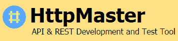

# 2020 年 19 种最佳 SoapUI 替代品

> 原文： [https://www.guru99.com/soapui-alternative.html](https://www.guru99.com/soapui-alternative.html)

SoapUI 是一种广泛流行的 API 测试工具。 它允许您测试 REST 和 SOAP 协议。 它促进了脚本的无缝集成和可重用性。 但是，使用 SoapUI 很难进行负载和工作流程测试。

这里列出了前 20 种 API 测试工具，这些工具足以替代 SoapUI。 该列表包含付费和开源工具，这些工具具有重要功能和最新的下载链接。

### 1） [API 要塞](https://bit.ly/2COeOLq)

[API Fortress](https://bit.ly/2COeOLq) 是 API 的连续测试平台。 它是一个平台，而不是工具，可以实现真正的协作和工作流程的灵活性。 专为测试人员和工程师打造，可跨部门工作，作为公司范围内的 API 连续测试解决方案。 部署在云中或本地以实现完整的数据所有权。

**功能：**

*   从有效负载或规范文件（例如 Swagger，OpenAPI 规范，IO 文档，RAML，WSDL 等）生成全面的功能测试。
*   对 CSV，API 和 JDBC 等数据库的数据驱动测试支持
*   与 CI / CD 平台无缝集成，包括 Jenkins，Bamboo，TravisCI，Microsoft TFS 等。
*   完整的仪表板和详细的测试报告
*   与 Slack，Pagerduty，JIRA，Splunk 和 Datadog 的现成集成
*   负载测试不仅可以进行压力测试，还可以验证负载下的功能
*   全面的模拟功能可加快新 API 的交付并节省资金

### 2）休息控制台

HTTP 客户端以及 Request 可视化工具和构造函数 API 测试工具。 它可以帮助开发人员构建，调试和测试 RESTful APIS。

**功能：**

*   通过原始输入构造 POST 或 PUT 主体
*   轻松查询参数创建
*   通过直观的 UI 添加自定义标题
*   键盘导航和快捷方式

**下载链接：** [https://github.com/ahmadnassri/restconsole](https://github.com/ahmadnassri/restconsole)

### 3）Tricentis

[Tricentis](https://www.tricentis.com/automated-software-testing-tool-trial/) 是强大的 Web 服务测试工具。 Tricentis Tosca 出色的 API 测试功能包括–

*   它支持各种各样的协议，包括 HTTP（JMS），AMQP，Rabbit MQ，TIBCO EMS，SOAP，REST，IBM MQ，NET TCP
*   它集成到敏捷和 DevOps 周期中
*   它使用基于模型的测试自动化，使脚本维护变得容易。
*   启用端到端测试，因为可以跨移动，跨浏览器，打包的应用程序等使用 API​​测试。

Tricentis 的 400 多家客户包括来自埃克森美孚，HBO，全食，丰田，安联，宝马，星巴克，德意志银行，利盟，Orange，A & E，Vantiv，沃达丰，Telstra 和瑞银（UBS）等 500 强品牌的全球品牌 。

**下载链接：** [https://www.tricentis.com/automated-software-testing-tool-trial/](https://www.tricentis.com/automated-software-testing-tool-trial/)

### 4）嬉皮-摇摇

Hippie-swagger 是用于测试 APIS 的工具。 它支持明确的断言语法，以扩展测试行为。 它还允许进行干净的打印报告。

**Features:**

*   每当草率的文档错误或丢失时，它将无法通过测试
*   可读且准确的断言消息
*   验证的参数，请求，响应，拍子等

**下载链接：** [https://github.com/CacheControl/hippie-swagger](https://github.com/CacheControl/hippie-swagger)

### 5）JMeter

JMeter 用于功能性 API 测试，其中包括测试 API 所需的功能。 它还具有有助于提高 API 测试性能的功能。

**Features:**

*   它可以用于静态和动态资源性能测试
*   它支持重放测试结果
*   它可以自动处理 CSV 文件。 这有助于测试团队为 API 测试生成唯一的参数值

**下载链接：** [http://jmeter.apache.org/](http://jmeter.apache.org/)

### 6）放心

这是一种用于测试 Java REST 服务的流行框架。

进一步了解[放心](http://rest-assured.io/)

### 7）空降

机载是用于测试 Rest API 的 API 自动化测试工具。

**Features:**

*   机载是一个编程框架，因此除了文本文件之外没有其他用户界面来创建代码
*   要使用机载，您只需要记住工具集中的一些关键方法以及一些 ruby 和 rspec 基础知识

**下载链接：** [https://github.com/brooklynDev/airborne](https://github.com/brooklynDev/airborne)

### 8）APIpray 检查器

养蜂场通过捕获请求和响应，可以在设计阶段监视 API。 它允许用户编写 API 蓝图，并允许用户查看它们的 Apiary 编辑器或 Apiary.jo。

**Features:**

*   对 API 文档的基于角色的访问控制。
*   它允许从 API 设计项目中添加和删除团队成员
*   API 蓝图管理仪表板

**下载链接：** [https://apiary.io/](https://apiary.io/)

### 9）Apigee

Apigee 是跨云 API 测试工具。 它允许用户测量和测试 API 性能，使用其他编辑器（例如 Swagger）支持和构建 API。 它提供所有 API 的安全性和治理策略。

**Features:**

*   允许设计监视，部署和扩展 API
*   根据开放 API 规范轻松创建 API 代理并将其部署在云中
*   通过跟踪 API 流量，错误率和响应时间来确定性能问题

**下载链接：** [http://apigee.com/](https://cloud.google.com/apigee/)

### 10）vREST

vREST 提供了一个在线解决方案，用于 REST / HTTP API / RESTful API 的自动化测试，模拟，自动记录和规范。

*   它提供了详尽的工具来快速验证您的 REST API
*   它提供了零缺陷的 Web 应用程序，并且在 API 测试中花费的精力更少
*   要验证您的 Web 应用程序，不需要熟练的资源，它可以为您的 API 规范生成文档
*   可以在 MREST 服务器功能的帮助下在 vREST 中创建 API 模拟。 用户可以使用模拟 HTTP 请求直接开始开发前端

[链接到 Vrest](http://vrest.io/)

### 11）Pyresttest

PyRestTest 是基于 Python 的 REST API 测试平台。 它支持 JSON 或 YAML 配置文件中的测试。 因此，不需要任何代码。

**Features:**

*   它具有最小的依赖性，因此可以轻松地在服务器上进行烟雾测试/健康检查部署
*   此 API 测试工具将在失败时返回退出代码
*   Pyresttest 允许生成/提取和验证构建测试场景的机制

**下载链接：** [https://github.com/svanoort/pyresttest](https://github.com/svanoort/pyresttest)

### 12）Ping API

Ping-API 是 API 测试，允许在 JavaScript 和 CoffeeScript 中编写测试脚本来测试您的 API。 它允许检查带有完整请求和响应数据的 HTTP API 调用。 对于任何失败，用户都会通过电子邮件，闲置邮件或 Hipchat 收到通知。

**Features:**

*   Ping- API 可在每分钟或每小时安排测试
*   支持编写脚本以设置请求标头，正文和 URL 参数。 它支持编写脚本来验证响应头和主体
*   验证 CRUD 流并登录到 Ping API

**下载链接：** [https://ping-api.com/](https://ping-api.com/)

### 13）邮递员

Postman 是 Google Chrome 浏览器的插件，可用于测试 API 服务。 它是测试 Web 服务的强大 HTTP 客户端。 对于手动或探索性测试，Postman 是测试 API 的不错选择。

*   使用 Postman，几乎可以提取所有现代 Web API 数据
*   您可以在 Postman 界面中编写布尔测试
*   您可以创建 REST 调用的集合，并将每个调用保存为集合的一部分，以备将来执行
*   与 CURL 不同，它不是基于命令行的工具，这使该工具免于将文本粘贴到命令行窗口中的麻烦
*   对于发送和接收 REST 信息，Postman 更可靠

[链接到邮递员](https://chrome.google.com/webstore/detail/postman/fhbjgbiflinjbdggehcddcbncdddomop?hl=en)

### 14）空手道 DSL

空手道是一个基于黄瓜库的新 API 测试框架。 空手道 DSL 允许测试人员使用特定于域的语言为 Web 服务编写有意义的测试。

**Features:**

*   它支持配置切换/分段，多线程并行执行
*   像任何标准 Java 项目一样，允许测试和生成报告
*   甚至可以为非程序员编写测试
*   空手道 API 测试工具允许在测试之间重复使用有效载荷数据和用户定义的功能。

**下载链接：** [https://github.com/intuit/karate](https://github.com/intuit/karate)

### 15）HttpMaster

它是一个 Web 开发工具，用于自动化 Web 应用程序测试，包括 API 测试，服务测试和网站测试。 它主要用作 Web API 测试工具，以自动测试 Web API 调用。

HttpMaster 是进行 API 测试的最佳选择

*   几种 http 方法（GET，POST，DELETE 等）
*   各种数据类型的动态参数可发出大量不同的 API 请求
*   各种验证类型和高级验证表达式

[下载 HttpMaster](http://www.httpmaster.net/)

### 16）肥皂声纳

SOAPSonar 是用于 SOAP，XML，基于 REST 的 Web 服务的 API 测试和诊断平台。 使用 Excel，MS SQL，Oracle 或任何 ODBC 数据库等外部源进行自动化测试。

**Features:**

*   识别 Web 服务漏洞，例如恶意软件威胁和 SQL 注入
*   具有成功规则框架和并发客户端负载测试的 Web 服务功能测试
*   本地 HP QC 集成，并支持与 Hudson，Ant 和 JUnit 集成

**下载链接：** [http://www.crosschecknet.com/](http://www.crosschecknet.com/)

### 17）惠普 QTP（UFT）

它提供了可扩展的框架，有助于执行和构建没有用户界面的无头系统的功能。 它有助于测试无头技术，例如数据库和 Web 服务，JMS 等。通过使用 API​​测试转换工具，您可以将 soapUI 测试转换为 UFT（QTP）API 测试。

[下载 QTP](http://www8.hp.com/in/en/software-solutions/unified-functional-automated-testing/)

*   [下一个](/selenium-tutorial.html)