# 如何在 Eclipse 中下载和安装 JUnit

> 原文： [https://www.guru99.com/download-installation-junit.html](https://www.guru99.com/download-installation-junit.html)

安装 Junit 是一个 6 部分的过程。 下面详细解释-

## 第 1 部分）安装 Java

JUnit 是一个[测试](/software-testing.html)框架，用于测试基于 Java 的应用程序。 因此，在安装 JUnit 之前，您需要在计算机中配置或验证 Java 开发工具包（JDK）。

单击此[教程](/install-java.html)下载并安装 Java

## 第 2 部分）下载 JUnit

**步骤 1）**访问 [http://junit.org/junit4/](http://junit.org/junit4/) ，然后点击下载并安装


**步骤 2）**单击 junit.jar

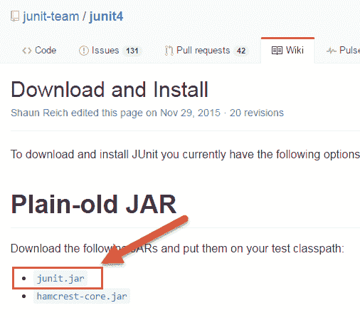

**步骤 3）**在中央存储库中，显示了可以下载的所有 Junit 版本。 通常，您将选择最新版本。 单击 jar 链接以下载 Junit 版本 4.12，如下所示

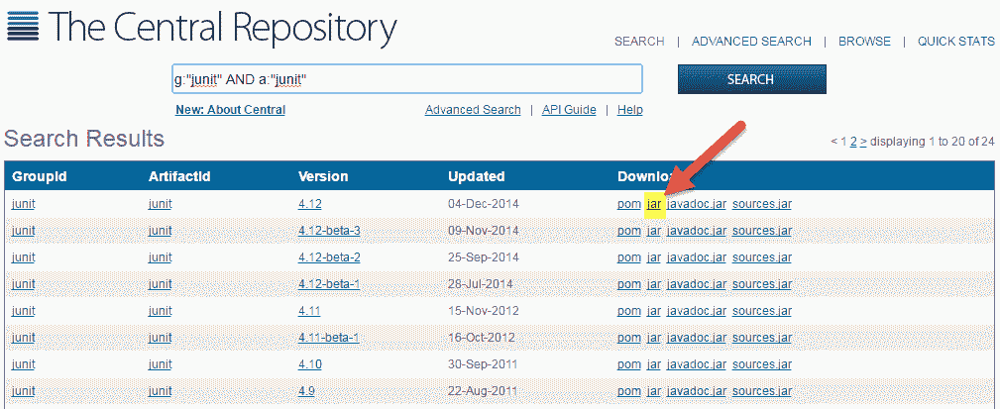

**步骤 4）**再次访问 [https://github.com/junit-team/junit4/wiki/下载并安装](https://github.com/junit-team/junit4/wiki/Download-and-Install)。 点击 hamcrest-core.jar

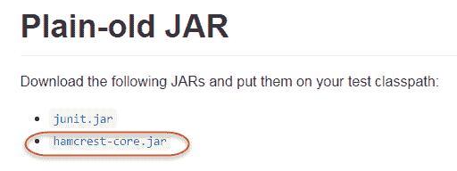

**步骤 5）**下载 Jar

[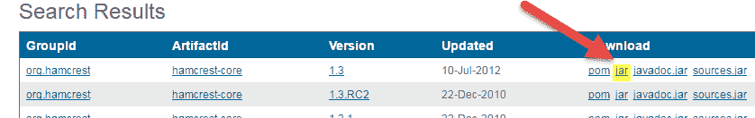 ](/images/junit/051716_0555_HowtoDownlo5.png) 

对于 JUnit 安装，您需要 JUnit jar，并且可以从 JUnit 官方网站 [http://www.junit.org](https://junit.org/junit5/) 下载所需的 JUnit jar 文件版本。

这是罐子列表：

*   JUnit.jar
*   hamcrest-core.jar

## 第 3 部分）JUnit 环境设置

**步骤 1）**您需要设置 **JUNIT_HOME** 环境变量，以指出放置 JUnit Jar 的基本位置。

例如，如果您已经在 c：驱动器中创建了一个 JUnit 文件夹并将 jar 放在其中，那么对于环境设置，您需要打开控制面板->高级->环境变量。

1.  在环境窗口下，单击“新建”按钮。

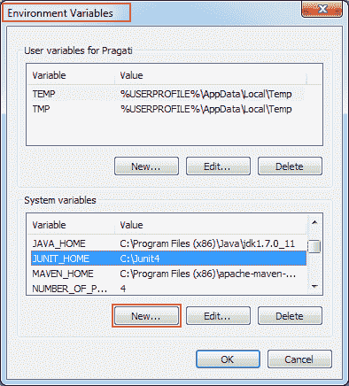

当您在环境变量中单击新按钮时，它将打开另一个窗口

**步骤 2）**将打开“新系统变量”窗口：

1.  提供变量名称为“ JUNIT_HOME”。
2.  提供 JUnit 值作为已复制 JUnit jar 文件的 JUnit 路径。
3.  单击确定。

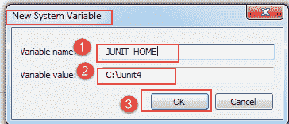

当您单击确定时，它将使用给定的名称和值创建一个新的系统变量。 您可以在环境变量窗口中进行验证，如步骤 1 所示。

**步骤 3）**创建 JUNIT_HOME 之后，创建另一个名为 CLASSPATH 的变量。 再次转到环境变量，然后执行以下步骤。

1.  Click on "new" button. When you click on new in environment variables, it will open another window.

    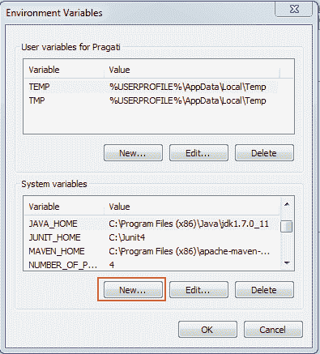

**步骤 4）**在此步骤中，将 JUNIT_HOME 指向放置在 JUnit 文件夹中的 [JUnit.jar](https://bit.ly/My9IXz) ，如下所示：

1.  变量名称：CLASSPATH
2.  变量值：％CLASSPATH％;％JUNIT_HOME％\ JUnit4.10.jar;。;
3.  单击确定按钮。

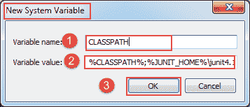

**步骤 5）**单击“确定”按钮后，可以验证是否可以在系统变量下看到名为“ CLASSPATH”的新环境变量。 见下文

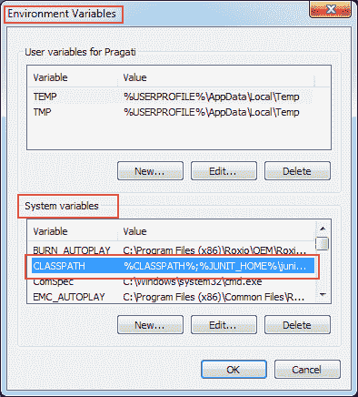

## 第 4 部分）在 Eclipse 中安装 JUnit jar 文件

**步骤 1）**右键点击项目：

1.  点击“构建路径”，然后点击
2.  单击“配置构建路径”。

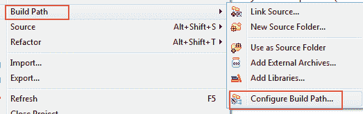

**步骤 2）**在此步骤中，

1.  转到 Java 构建路径窗口，如下图所示
2.  现在，单击“添加外部 JAR”按钮以使用 Eclipse 添加下载的 JUnit.jar 文件。

添加 JUnit.jar 文件后，单击“确定”按钮以关闭 Java 构建路径窗口。

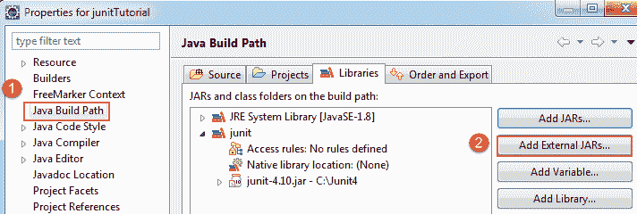

## 第 5 部分）验证 JUnit 所需的 jar 文件是否在我的构建路径中

为了在 Eclipse 中验证 JUnit jar 文件，您需要执行以下步骤：

1.  右键单击项目->构建路径
2.  单击“配置构建路径”。

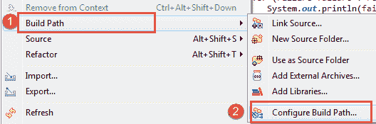

**步骤 2）** Java 构建路径窗口如下所示。

在该窗口中，转到“库”选项卡以查看所有 jar 文件。 在 jar 文件树视图中，您需要查找以 JUnit 开头的 jar 文件名。

扩展 JUnit 库后，您将看到如下所示的 Java 库：

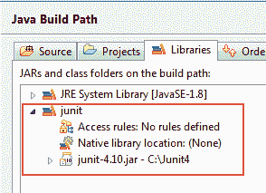

现在，您准备将 JUnit 与 eclipse 一起使用。

## 第 6 部分）验证 JUnit 设置

您可以创建一个简单的 JUnit 测试来验证 JUnit 设置。 参见下面的测试类：

**步骤 1）**创建一个名为 TestJUnit.java 的 Java 类，并提供一个简单的 assert 语句。

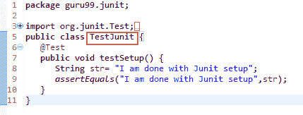

```
package guru99.junit;

import org.junit.Test;
import static org.junit.Assert.assertEquals;
public class TestJunit {
   @Test
   public void testSetup() {
      String str= "I am done with Junit setup";
      assertEquals("I am done with Junit setup",str);
   }
}

```

**步骤 2）**创建一个 Test Runner 类以执行上述测试。

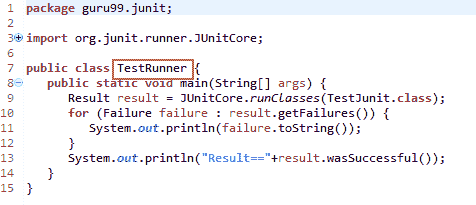

```
package guru99.junit;

import org.junit.runner.JUnitCore;
import org.junit.runner.Result;
import org.junit.runner.notification.Failure;

public class TestRunner {
   public static void main(String[] args) {
      Result result = JUnitCore.runClasses(TestJunit.class);
      for (Failure failure : result.getFailures()) {
         System.out.println(failure.toString());
      }
      System.out.println("Result=="+result.wasSuccessful());
   }
} 

```

**步骤 3）**要对执行测试，请执行以下步骤：

1.  右键单击 TestRunner.java，然后单击“运行方式”，如下所示
2.  单击“运行方式”后，将打开另一个窗口，单击“ 1 JUnit Test”，如下所示：

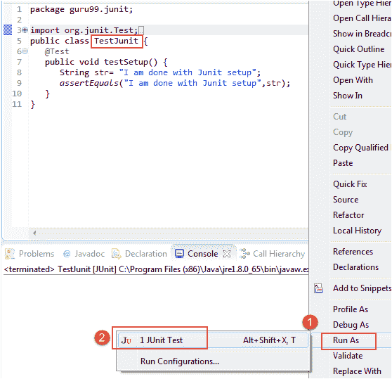

**步骤 4）**这是测试的输出或结果。 如果执行成功，它将在其前面显示一个绿色的复选标记。

[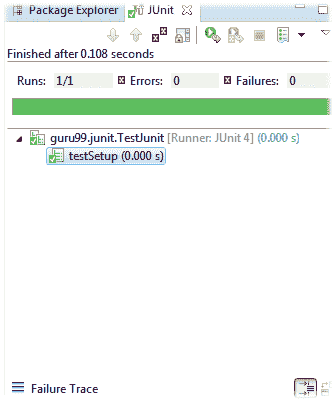 ](/images/junit/051716_0555_HowtoDownlo18.png) 

单击以下载上面的代码以进行测试。